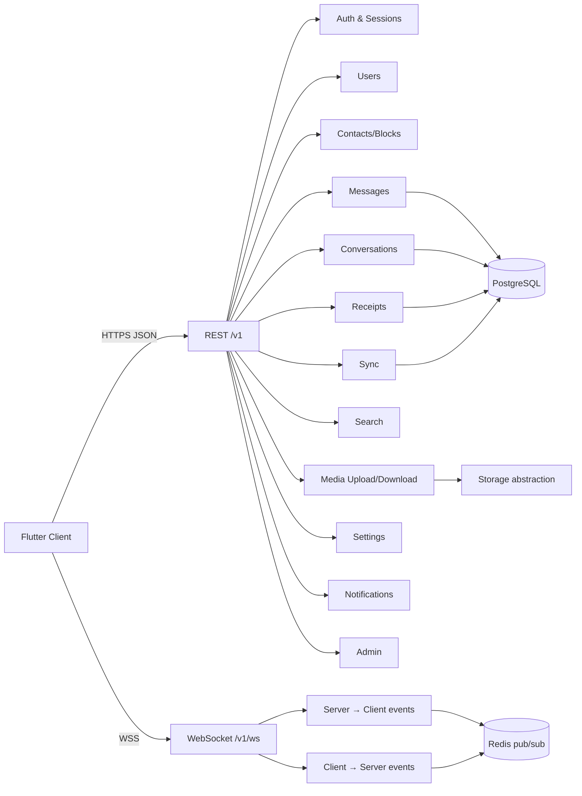
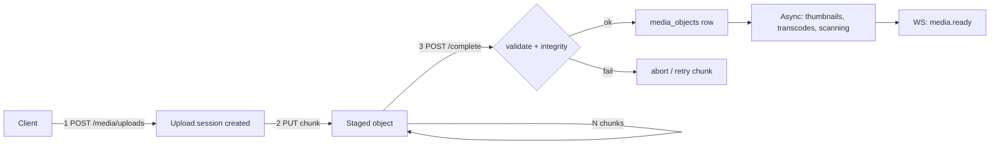
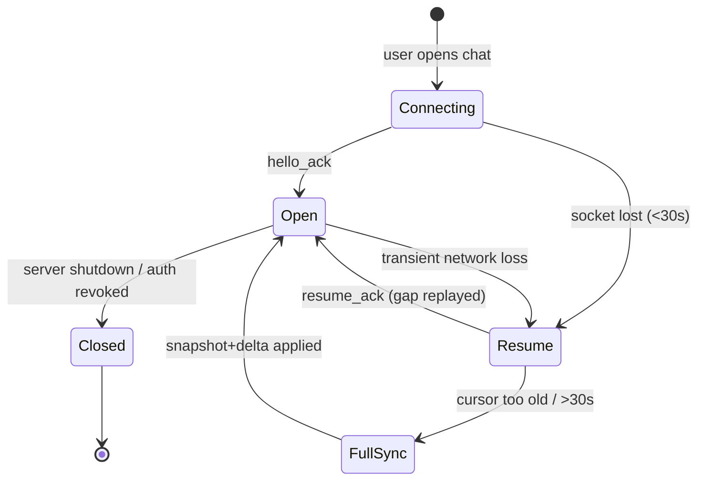

# Messaging Platform — API Specification

| | |
|---|---|
| **Document** | API Contract v1.0 |
| **Status** | Definitive contract for frontend & backend development |
| **Audience** | Flutter client engineers, Go backend engineers, QA, SRE |
| **Source of Truth (in order)** | Finalized UI/UX → `ARCHITECTURE.md` → `DATABASE.md` → **this document** |
| **Protocols** | HTTPS (REST/JSON) + WSS (WebSocket events) |
| **Scope** | Complete REST + WebSocket contract. No Go, SQL, or Flutter code. |

---

## Table of Contents

1. [Executive Summary](#1-executive-summary)
2. [Global Conventions](#2-global-conventions)
3. [API Surface Map](#3-api-surface-map)
4. [Authentication & Session APIs](#4-authentication--session-apis)
5. [User APIs](#5-user-apis)
6. [Contact & Blocking APIs](#6-contact--blocking-apis)
7. [Conversation APIs](#7-conversation-apis)
8. [Message APIs](#8-message-apis)
9. [Media APIs](#9-media-apis)
10. [Receipt APIs](#10-receipt-apis)
11. [Search APIs](#11-search-apis)
12. [Sync APIs](#12-sync-apis)
13. [Settings APIs](#13-settings-apis)
14. [Notification & Push APIs](#14-notification--push-apis)
15. [Admin APIs](#15-admin-apis)
16. [WebSocket Protocol Overview](#16-websocket-protocol-overview)
17. [WebSocket Client → Server Events](#17-websocket-client--server-events)
18. [WebSocket Server → Client Events](#18-websocket-server--client-events)
19. [Key Flows](#19-key-flows)
20. [Appendix A — Error Catalog](#appendix-a--error-catalog)
21. [Appendix B — Rate Limit Tiers](#appendix-b--rate-limit-tiers)
22. [Appendix C — Status Code Matrix](#appendix-c--status-code-matrix)

---

## 1. Executive Summary

This document is the **single contract** between the Flutter client (finalized Material 3 UI) and the Go backend defined in `ARCHITECTURE.md`, backed by the schema in `DATABASE.md`. It defines every REST endpoint and every WebSocket event the product needs — and nothing it does not.

Two transport surfaces, one intent:

- **REST (HTTPS/JSON)** — every *request-response* interaction: authentication, sessions, profiles, conversations, message history, media upload/download, receipts, search, sync, settings, notifications, admin.
- **WebSocket (WSS/JSON)** — every *real-time push and ephemeral signal*: message delivery, presence, typing, read/delivery receipt propagation, conversation lifecycle, connection heartbeat and resume.

### 1.1 Design decisions grounded in the source documents

| Decision | Source document justification |
|---|---|
| Message send/reply/edit/delete via **REST** with `Idempotency-Key`; realtime fan-out via **WS** | `ARCHITECTURE.md` §13: message persisted transactionally in PG; WS is a delivery channel, never the source of truth |
| Read/delivery receipts submitted via **REST cursor**, propagated via **WS** | `DATABASE.md` §5.2 + `ARCHITECTURE.md` §17: receipts are monotonic cursors (`last_read_seq`), idempotent by `GREATEST` |
| **Keyset/cursor pagination** on every list (messages, conversations, notifications, search) | `DATABASE.md` §14.1: `OFFSET` is O(n); cursor uses the composite PK seek |
| **Media uploads** are two-phase (create → upload chunks → complete) | `ARCHITECTURE.md` §18: staging on disk, async thumbnails, `MediaReady` event |
| **Sync** via snapshot + delta with a single global cursor | `DATABASE.md` §7: `change_log.global_seq` shared sequence; `sync_cursors` per session |
| **Signed URLs** for media download; never a public static path | `ARCHITECTURE.md` §18.4: per-requester, short-TTL, membership re-checked at serve |
| WS **resume** with last-acked seq + delta backfill, not full resync | `DATABASE.md` §7.2 + industry practice: stateless gateway with resume protocol |
| Errors follow **RFC 9457 (problem+json)**; `code` is the machine-switchable field | Research: RFC 9457 supersedes RFC 7807 (2023); clients branch on stable `code` |
| **Idempotency-Key** header on all unsafe writes (Stripe-style) | Research: retry-safe writes; cache only after execution begins |

### 1.2 Non-goals

- No GraphQL, no gRPC, no XML. JSON only.
- No versioned WS sub-protocol negotiation beyond v1 (`sec-websocket-protocol: chat.v1`).
- No client-generated pagination math — cursors are opaque.

---

## 2. Global Conventions

### 2.1 Base URLs & Versioning

- REST base: `https://api.socialmedia.example/v1`
- WS base: `wss://api.socialmedia.example/v1/ws`
- **Versioning:** path prefix `/v1`. Additive changes (new fields, new endpoints) are allowed within v1 without version bump. Breaking changes (field removal/rename, type change, auth scheme change) require `/v2` with a documented migration window. The WS protocol version is negotiated via the `sec-websocket-protocol` subprotocol `chat.v1` (§16).
- All endpoints are under Cloudflare; TLS 1.2+ enforced; HSTS required (`ARCHITECTURE.md` §30).

### 2.2 Identifier Serialization

- All IDs (user, conversation, message, media, session, upload, notification) are **64-bit snowflake integers** from the `idgen` module. They are serialized **as strings** in JSON (`"1000123456789"`) to avoid JavaScript `Number` precision loss for Flutter Web builds. The backend accepts both numeric and string forms on input and always returns strings.
- `sequence` values (per-conversation message order) are also strings.

### 2.3 Authentication & Headers

| Header | When | Value |
|---|---|---|
| `Authorization: Bearer <access_token>` | All authenticated endpoints | JWT (short-lived access token, `ARCHITECTURE.md` §10) |
| `X-Refresh-Token` | Refresh endpoints only | opaque refresh token (never in body/logs) |
| `Idempotency-Key` | All unsafe writes (POST/PUT/PATCH/DELETE) | client-generated UUID (≤255 chars) |
| `X-Device-Id` | All requests | stable per-device identifier (matches `user_sessions.device_id`) |
| `X-Request-Id` | All requests | optional client trace id; echoed in response |
| `Content-Type` | Requests with body | `application/json; charset=utf-8` |
| `Accept` | All | `application/json` |
| `Accept-Language` | Localized error messages | BCP-47, e.g. `en`, `ar` |

Response headers on every response:
- `X-Request-Id` (server-issued if absent)
- `X-RateLimit-Limit`, `X-RateLimit-Remaining`, `X-RateLimit-Reset` (Appendix B)
- `Retry-After` on `429`
- `Link` (RFC 8288) for `next`/`prev` pagination cursors on list endpoints (GitHub-style)

### 2.4 Response Envelope

Successful single-resource responses are the resource itself (no wrapper). List responses use a standard envelope:

```jsonc
{
  "data": [ ... ],
  "pagination": {
    "next_cursor": "opaque-cursor-string",
    "has_more": true,
    "limit": 50
  }
}
```

### 2.5 Error Envelope (RFC 9457)

All errors return `application/problem+json` with a stable, machine-readable `code`:

```jsonc
{
  "type": "https://api.socialmedia.example/errors/validation_error",
  "title": "Validation Error",
  "status": 422,
  "detail": "One or more fields failed validation.",
  "code": "VALIDATION_ERROR",
  "instance": "/v1/conversations/123/messages",
  "request_id": "req_abc123",
  "errors": [
    { "field": "content", "reason": "must_not_be_blank" }
  ]
}
```

- `code` is the ONLY field clients should switch on (never HTTP status, never `title`).
- `retryable` field appears on errors where an automatic retry is safe: `true` for `429`, `503`, and gateway timeouts; `false` otherwise.
- The full error catalog is Appendix A.

### 2.6 Pagination Strategy

- **Every** list endpoint uses cursor (keyset) pagination. No `page`/`offset` parameters.
- Query params: `limit` (1–100, default 50, server-clamped) and `cursor` (opaque string returned in the previous response; `next_cursor` in the `Link` header).
- The cursor encodes the last seen sort key (e.g., message `sequence`, `global_seq`, `created_at`+id) — never the item itself. Cursors are opaque to clients and expire server-side (TTL) to prevent unbounded history walks.
- Directional navigation: `after` (forward) for feeds; message history uses `before` (older). Both return `next_cursor`.
- **Rationale:** matches `DATABASE.md` §14.1 — keyset uses the composite PK seek, handles concurrent inserts without dupes/skips, and never degrades on deep pages.

### 2.7 Idempotency

- Unsafe writes **must** include `Idempotency-Key`. The server stores the key (hashed) with the response in Redis (`Idempotency-Key` TTL 24 h).
- Behavior (Stripe-style): if a request with the same key and keyed fields returns, replay the stored response; **validation failures are never cached** — caching begins only once execution starts.
- Keys are scoped per `(user_id, Idempotency-Key)`.
- **Message send** additionally uses `client_msg_id` (`DATABASE.md` §5.3) as the durable dedupe guard; the `Idempotency-Key` covers the HTTP layer, `client_msg_id` covers the DB layer — both together give exactly-once intent over retries.

### 2.8 Rate Limiting

- Identity-based (per `user_id`+`device_id`) with IP fallback for unauthenticated endpoints. Token-bucket, enforced at the Go gateway (`ARCHITECTURE.md` §26).
- Tiers in Appendix B. Every response carries `X-RateLimit-*`; `429` includes `Retry-After` and the problem+json `code=RATE_LIMITED`.
- WS frames are throttled separately (§16.8). Media uploads have concurrent-slot and byte budgets.

### 2.9 Time

- All timestamps are `RFC 3339` UTC, e.g. `"2026-08-06T14:23:01.500Z"`. Clients render in local time.
- Never round-trip a client timestamp as ordering authority — `sequence`/`global_seq` are the ordering keys.

### 2.10 Search & FTS Convention

- `q` parameter on search endpoints; server does substring + FTS matching via `pg_trgm` and `tsvector` (`DATABASE.md` §7.3). Searches are always scoped to the caller's conversations/memberships — never global.

---

## 3. API Surface Map



**Why two surfaces:** REST is transactional and authoritative (writes land durably in PG); WS is ephemeral fan-out and presence. A message is *always* created via REST (or the WS `message.send` which calls the same application service) so its durability is identical; WS merely pushes the committed result to subscribers. This preserves `ARCHITECTURE.md` §13's "log-dispatch" model and `DATABASE.md` §10's outbox-atomicity.

---
## 4. Authentication & Session APIs

> Serves the finalized sign-in / sign-up / device-management screens. Design follows `ARCHITECTURE.md` §10–§11 and `DATABASE.md` §4.1–§4.4.

### 4.1 `POST /v1/auth/register`

- **Purpose:** create a new account (sign-up screen). Bootstraps a primary identifier, verifies via OTP, creates the first session and token pair.
- **Method:** `POST` | **Auth:** none (rate-limited per IP/device) | **Idempotency-Key:** required
- **Request body:**

```jsonc
{
  "identifier_type": "phone",          // "phone" | "email"
  "identifier": "+15550123",           // E.164 or lowercased email
  "otp_code": "482913",
  "display_name": "Aya",
  "username": "aya.s",                 // optional, validated
  "password": null,                    // optional; passkey/OTP allowed instead
  "device": { "device_id": "d-abc", "platform": "android", "device_name": "Pixel 9", "app_version": "1.0.0" }
}
```

- **Validation rules:** identifier normalized (E.164 / lowercase email); `otp_code` 6-digit; `display_name` 1–64 chars; `username` 3–30 chars `[a-z0-9._]` and reserved-word check; password ≥ 8 chars if provided; duplicate identifier → `409 IDENTIFIER_TAKEN`.
- **Response `201`:**

```jsonc
{
  "user": { "id": "1001", "display_name": "Aya", "username": "aya.s", "avatar": null },
  "access_token": "eyJ...", "expires_in": 900, "token_type": "Bearer",
  "refresh_token": "rt_secret",
  "session": { "id": "7001", "device_id": "d-abc", "created_at": "2026-08-06T14:20:00Z" }
}
```

- **Status codes:** `201` created; `400` invalid input; `401` bad/invalid OTP; `409` identifier taken; `429` rate limited; `500` server.
- **Error responses:** `OTP_INVALID`, `OTP_EXPIRED`, `IDENTIFIER_TAKEN`, `USERNAME_TAKEN`, `VALIDATION_ERROR`, `RATE_LIMITED`.
- **Pagination:** n/a. **Idempotency:** one account per key; replay returns same user.
- **Rate limiting:** unauthenticated tier, strict (Appendix B).
- **Security:** OTP checked + consumed atomically; credentials hashed; access/refresh issued per `ARCHITECTURE.md` §10.2; audit `auth.register`.
- **Performance:** single insert + session insert in one transaction (`DATABASE.md` §10); target < 200 ms p95.
- **Architecture fit:** entrypoint to `auth` + `user` modules; emits `UserCreated`/`SessionCreated` events.

### 4.2 `POST /v1/auth/otp/send`

- **Purpose:** request an OTP for sign-in or registration (the "send code" screen).
- **Method:** `POST` | **Auth:** none | **Idempotency-Key:** required
- **Body:**

```jsonc
{ "identifier_type": "phone", "identifier": "+15550123", "purpose": "login" }   // purpose: "login" | "register" | "password_reset"
```

- **Validation:** identifier normalized; throttle per identifier (cooldown 30 s, max 5/hour).
- **Response `200`:** `{ "expires_in": 300, "resend_after": 30 }` (never echoes the code; OTP delivered via SMS/email provider).
- **Status codes:** `200`; `400`; `429`; `404` unknown identifier for `purpose=login`.
- **Security:** rate-limited per identifier + IP; OTP stored hashed with TTL in Redis (`ARCHITECTURE.md` §10.1); audit `auth.otp_sent`.
- **Architecture fit:** `auth` module; OTP TTL/verification state in Redis, not PG.

### 4.3 `POST /v1/auth/login`

- **Purpose:** authenticate an existing user (sign-in screen) via password, OTP, or passkey.
- **Method:** `POST` | **Auth:** none | **Idempotency-Key:** required
- **Body:**

```jsonc
{
  "identifier": "+15550123",
  "method": "password",            // "password" | "otp" | "passkey"
  "password": "••••",              // when method=password
  "otp_code": "482913",            // when method=otp
  "passkey_assertion": { },        // when method=passkey (WebAuthn response)
  "device": { "device_id": "d-abc", "platform": "ios", "device_name": "iPhone 15" }
}
```

- **Validation:** credential verified against `user_credentials`; failed attempts throttled with lockout backoff (5 fails → 5 min).
- **Response `200`:** same shape as 4.1 (`user`, `access_token`, `refresh_token`, `session`).
- **Status codes:** `200`; `400`; `401` bad credentials (`INVALID_CREDENTIALS`, `ACCOUNT_SUSPENDED`, `OTP_INVALID`); `409` device conflict (session exists for device → upsert/rotate); `429`.
- **Pagination:** n/a. **Idempotency:** per key.
- **Rate limiting:** login is the most attacked endpoint — strictest unauthenticated tier + per-identifier lockout.
- **Security:** constant-time compare; refresh-token rotation begins; audit `auth.login`; WS must reconnect after login.
- **Performance:** read of `user_credentials` + session upsert; < 150 ms p95 with Redis hot path.
- **Architecture fit:** `auth` module; returns session bound to the registry (`user_sessions`).

### 4.4 `POST /v1/auth/refresh`

- **Purpose:** rotate an expiring access token (long-lived sessions, reconnect after WS drop).
- **Method:** `POST` | **Auth:** `X-Refresh-Token` (never in body) | **Idempotency-Key:** not required (rotation is naturally unique)
- **Response `200`:** `{ "access_token": "…", "expires_in": 900, "refresh_token": "rt_new", "session_id": "7001" }`
- **Status codes:** `200`; `401` invalid/expired/revoked refresh token (`REFRESH_TOKEN_INVALID`); `410` token-family reused (theft detected → revoke all sessions); `429`.
- **Security:** refresh-token rotation with reuse detection (`ARCHITECTURE.md` §10.2); on reuse, all sessions for the user are revoked and the device forced to re-login; audit `auth.token_refresh`.
- **Performance:** hash lookup + rotation in one transaction.
- **Architecture fit:** `auth` + `session`; keeps access TTL short while sessions survive.

### 4.5 `POST /v1/auth/logout`

- **Purpose:** sign out of the *current* device (device-management screen / account menu).
- **Method:** `POST` | **Auth:** Bearer access token | **Idempotency-Key:** required
- **Response `204`.** Subsequent use of the access/refresh token → `401 SESSION_REVOKED`.
- **Side effects:** revokes the session row, blacklists access token `jti` in Redis, closes the WS connection bound to the session, clears push token, publishes `SessionRevoked` (other devices notified).
- **Security:** the session identity comes from the token, not a body field — a caller can only ever revoke their own session.

### 4.6 `POST /v1/auth/logout-all`

- **Purpose:** sign out of every device ("sign out everywhere").
- **Method:** `POST` | **Auth:** Bearer | **Idempotency-Key:** required
- **Response `204`.**
- **Side effects:** bumps the user's global token version (all outstanding access tokens invalid at gateways), revokes all sessions, closes all WS connections, clears push tokens.
- **Security:** requires re-auth; audit `auth.logout_all`.

### 4.7 `GET /v1/auth/sessions`

- **Purpose:** list the current user's active devices (device-management screen).
- **Auth:** Bearer. **Response `200`:**

```jsonc
{ "data": [
  { "id": "7001", "device_id": "d-abc", "device_name": "Pixel 9", "platform": "android",
    "app_version": "1.0.0", "last_active_at": "2026-08-06T14:20:00Z", "current": true },
  { "id": "7002", "device_id": "d-web", "device_name": "Desktop Web", "platform": "web", "last_active_at": "2026-08-05T09:00:00Z", "current": false }
]}
```

- **Status codes:** `200`; `401`. **Pagination:** not needed (bounded), but the envelope is reusable.

### 4.8 `DELETE /v1/auth/sessions/{session_id}`

- **Purpose:** revoke a specific device session (device-management screen).
- **Auth:** Bearer. **Response `204`.**
- **Authorization:** a user may only revoke their own sessions.
- **Status codes:** `204`; `403` not owner; `404` session not found.
- **Side effects:** same as 4.5 for that session.

### 4.9 `GET /v1/auth/jwks`

- **Purpose:** expose the JWKS for access-token signature verification (used by API/WS gateways and any trusted integrator).
- **Auth:** none. **Response `200`:** standard JWKS JSON (`{ "keys": [ { "kty": "OKP", "crv": "Ed25519", ... } ] }`).
- **Security:** read-only public keys; keys rotated per `ARCHITECTURE.md` §30. Cached by verifiers with standard `cache-control`.

### 4.10 `POST /v1/auth/passkey/begin` & `POST /v1/auth/passkey/finish`

- **Purpose:** WebAuthn registration/assertion ceremony for passkey login (`ARCHITECTURE.md` §10.3).
- **Auth:** `begin` (registration) requires Bearer; `begin` (login) none. `finish` continues the ceremony.
- **Body (begin):** `{ "user_id": "…", "operation": "register" | "login", "device": {…} }` → returns `{ "challenge": "…", "credential_id": "…", "rp": {…}, "user": {…} }`.
- **Body (finish):** `{ "assertion": { "id": "…", "rawId": "…", "response": {…}, "clientDataJSON": "…", "authenticatorData": "…", "signature": "…" } }`.
- **Response (finish):** login → same as 4.3; register → same as 4.1.
- **Status codes:** `200`; `400`; `401` assertion invalid; `409` credential already registered.
- **Security:** challenges single-use with TTL in Redis; public keys stored in `user_credentials.credential_data` (`DATABASE.md` §4.3).
- **Rate limiting:** per-user challenge issuance; strict.

---
## 5. User APIs

> Serves profile screens, avatar management, account deletion, and reporting. Schema per `DATABASE.md` §3 (`users`) and §11 (`reports`).

### 5.1 `GET /v1/users/me`

- **Purpose:** fetch the caller's own profile (used on app launch and profile screen).
- **Method:** `GET` | **Auth:** Bearer.
- **Response `200`:**

```jsonc
{
  "id": "1001", "display_name": "Aya", "username": "aya.s",
  "avatar": { "media_id": "8001", "url": "https://cdn…/a/xx?sig=…" },
  "bio": "Building things", "status_message": "Busy",
  "phone": "+15550123", "email": "aya@example.com",
  "flags": { "is_suspended": false, "is_verified": false },
  "stats": { "contacts_count": 42, "groups_count": 8 },
  "created_at": "2025-11-01T09:00:00Z"
}
```

- **Status codes:** `200`; `401`.
- **Notes:** `avatar` is a signed short-TTL URL (§9). Never returns the password hash or credential rows.

### 5.2 `PATCH /v1/users/me`

- **Purpose:** update the caller's profile (edit-profile screen).
- **Method:** `PATCH` | **Auth:** Bearer | **Idempotency-Key:** required.
- **Body (all optional, at least one required):**

```jsonc
{
  "display_name": "Aya Salim",
  "username": "aya_salim",
  "bio": "…",
  "status_message": "In a meeting",
  "language": "en",
  "theme": "system"                      // "light" | "dark" | "system"
}
```

- **Validation:** `display_name` 1–64; `username` 3–30 `[a-z0-9._]`, unique, reserved-words; `bio` ≤ 160; `status_message` ≤ 140.
- **Response `200`:** the updated profile (5.1 shape). `409 USERNAME_TAKEN` on conflict.
- **Status codes:** `200`; `400`; `401`; `409`; `422`.
- **Rate limiting:** standard authenticated tier.
- **Side effects:** emits `UserUpdated` event → presence/WS push `ProfileChanged` to contacts (§18).

### 5.3 `GET /v1/users/{user_id}`

- **Purpose:** fetch another user's public profile (profile screen from chat, contact, or search).
- **Method:** `GET` | **Auth:** Bearer.
- **Response `200`:**

```jsonc
{ "id": "1002", "display_name": "Sami", "username": "sami.k",
  "avatar": { "media_id": "8004", "url": "…" },
  "bio": "…", "status_message": "…", "is_contact": true, "mutual_contacts": 3 }
```

- **Privacy:** hides phone/email and any fields the target has marked private. Blocked users get a synthetic `404 USER_NOT_FOUND` (no existence leak).
- **Status codes:** `200`; `401`; `404`.
- **Rate limiting:** standard tier; anti-scrape limits per profile (Appendix B).

### 5.4 `POST /v1/users/me/avatar`

- **Purpose:** set the avatar from an already-uploaded media object (avatar-picker screen).
- **Method:** `POST` | **Auth:** Bearer | **Idempotency-Key:** required.
- **Body:** `{ "media_id": "8001", "crop": { "x": 0.1, "y": 0.1, "width": 0.8, "height": 0.8 } }`
- **Validation:** the media object must be owned by the caller and be an image ≤ 4 MB, square-cropped server-side to 256×256 (and 128×128/64×64 variants).
- **Response `200`:** `{ "avatar": { "media_id": "8001", "url": "…" } }`
- **Status codes:** `200`; `400`; `401`; `404` media not found/not owned.
- **Architecture fit:** media service generates variants; old avatar is eligible for GC.

### 5.5 `POST /v1/users/me/deactivate`

- **Purpose:** soft-delete / deactivate the account (account-deletion flow). Delayed hard-delete per retention policy.
- **Method:** `POST` | **Auth:** Bearer + re-confirmation token | **Idempotency-Key:** required.
- **Body:** `{ "password": "…" }` (or OTP) — re-auth required.
- **Response `200`:** `{ "deletion_scheduled_at": "2026-09-05T00:00:00Z" }` (30-day grace by default).
- **Side effects:** marks `deleted_at`, revokes all sessions, closes WS, schedules async purge (`ARCHITECTURE.md` §9.3); contacts see synthetic offline / removed.
- **Status codes:** `200`; `401`; `409` already scheduled.

### 5.6 `POST /v1/users/{user_id}/report`

- **Purpose:** report a user for abuse/harassment (overflow menu → report).
- **Method:** `POST` | **Auth:** Bearer | **Idempotency-Key:** required.
- **Body:**

```jsonc
{ "reason": "harassment",        // "spam"|"harassment"|"impersonation"|"nudity"|"other"
  "details": "…", "conversation_id": "2001", "message_ids": ["5001"] }
```

- **Response `202`** accepted (async review by admin/ML pipeline). One report per target per 24 h is enforced; duplicates return `200` with `already_reported`.
- **Status codes:** `200`; `202`; `400`; `401`; `404`.
- **Side effects:** inserts `reports` row (`DATABASE.md` §11), priority queued for admin.

---

## 6. Contact & Blocking APIs

> Serves the contacts list, address-book sync, and block management. Schema: `contacts` and `blocks` per `DATABASE.md` §6.

### 6.1 `GET /v1/contacts`

- **Purpose:** fetch the caller's contact list (contacts screen; also used by share-sheet).
- **Method:** `GET` | **Auth:** Bearer.
- **Query:** `limit`, `cursor` (keyset on `created_at`+`user_id`), `q` (optional name/username filter).
- **Response `200` (paginated envelope):**

```jsonc
{ "data": [
  { "user_id": "1002", "display_name": "Sami", "username": "sami.k",
    "avatar": { "media_id": "8004", "url": "…" },
    "added_at": "2026-01-10T10:00:00Z",
    "last_seen_at": "2026-08-06T12:00:00Z",
    "presence": { "status": "online", "custom_status": null } }
], "pagination": { "next_cursor": "…", "has_more": false, "limit": 50 } }
```

- **Status codes:** `200`; `401`.
- **Notes:** presence only included for mutual contacts.

### 6.2 `PUT /v1/contacts/{user_id}`

- **Purpose:** add a user as a contact (profile screen → add contact).
- **Method:** `PUT` | **Auth:** Bearer | **Idempotency-Key:** required.
- **Body:** `{ "alias": "Sami K" }` (optional local alias).
- **Response `200`:** the new contact row. `409 ALREADY_CONTACT` if present. Adding a user who has blocked the caller → `403 BLOCKED`.
- **Side effects:** on mutual contact → both get `ContactAdded` WS push and can see each other's presence.

### 6.3 `DELETE /v1/contacts/{user_id}`

- **Purpose:** remove a contact.
- **Method:** `DELETE` | **Auth:** Bearer.
- **Response `204`.** Also removes any mutual-contact presence visibility.

### 6.4 `PATCH /v1/contacts/{user_id}`

- **Purpose:** update the local alias.
- **Body:** `{ "alias": "…" }` (nullable to clear).
- **Response `200`:** updated row.

### 6.5 `POST /v1/contacts/sync`

- **Purpose:** address-book match on app first-run and on demand (the "find friends" flow).
- **Method:** `POST` | **Auth:** Bearer | **Idempotency-Key:** required.
- **Body:**

```jsonc
{
  "hashes": { "phone": ["+15550123"], "email": ["a@b.c"] },   // raw values; server hashes+blinds
  "resumable": "…"                                             // optional batch cursor for >10k entries
}
```

- **Response `200`:**

```jsonc
{ "matches": [
  { "hash": "+15550123", "user_id": "1009", "display_name": "Noor",
    "avatar": { "media_id": "…", "url": "…" }, "is_contact": false, "is_registered": true }
], "resumable": "…", "match_count": 1 }
```

- **Privacy:** hashes blinded server-side; only mutual-contact-consent matches return; server never stores the raw address book.
- **Status codes:** `200`; `400`; `401`; `422` batch too large.
- **Rate limiting:** heavy tier — one full sync per day per user (and `resumable` chunks at standard tier).

### 6.6 `GET /v1/blocks`

- **Purpose:** list blocked users (privacy settings screen).
- **Method:** `GET` | **Auth:** Bearer. **Response `200`:** paginated envelope of `{ user_id, display_name, blocked_at }`.
- **Status codes:** `200`; `401`.

### 6.7 `PUT /v1/blocks/{user_id}`

- **Purpose:** block a user.
- **Method:** `PUT` | **Auth:** Bearer | **Idempotency-Key:** required.
- **Response `200`:** `{ "user_id": "1002", "blocked_at": "…" }`. Blocking is immediate and mutual:
  - Hidden: messages stopped, presence hidden, both removed from each other's contact lists.
  - Existing group memberships: caller removed from groups owned by target; in shared groups, messages become hidden per policy.
- **Side effects:** emits `BlockAdded` → WS push; pending deliveries dropped.

### 6.8 `DELETE /v1/blocks/{user_id}`

- **Purpose:** unblock.
- **Response `204`.** Resumes normal delivery; does not auto-re-add contacts.

---
## 7. Conversation APIs

> Serves the chat list, chat creation, group management, invite links, and per-chat settings. Schema: `conversations`, `conversation_members`, `conversation_sequences`, `invites` per `DATABASE.md` §5.1, §5.2, §5.5.

### 7.1 `GET /v1/conversations`

- **Purpose:** the chat list (home screen). Returns every conversation the caller belongs to, most-recent-first with unread state.
- **Method:** `GET` | **Auth:** Bearer.
- **Query:** `limit` (default 50), `cursor` (keyset on `last_message_seq` desc / `updated_at`), `filter=all|pinned|archived|groups|direct` (default `all`), `unread_only=true|false`.
- **Response `200` (paginated):**

```jsonc
{ "data": [
  {
    "id": "2001", "type": "direct", "title": "Sami",
    "avatar": { "media_id": "8004", "url": "…" },
    "last_message": {
      "id": "5001", "seq": "412", "content": { "text": "On my way" },
      "sender_id": "1002", "created_at": "2026-08-06T14:20:00Z",
      "status": "delivered"
    },
    "last_message_seq": "412", "last_read_seq": "400",
    "unread_count": 12, "muted_until": null, "is_pinned": true, "is_archived": false,
    "membership": { "role": "member", "joined_at": "…" },
    "typing": ["1002"],
    "updated_at": "2026-08-06T14:20:01Z"
  }
], "pagination": { "next_cursor": "…", "has_more": true, "limit": 50 } }
```

- **Notes:** `unread_count` is derived server-side as `last_message_seq − last_read_seq` (per `DATABASE.md` §5.2) — never a stored column. `typing` is best-effort (Redis ephemeral). Archived conversations only appear with `filter=archived`.
- **Status codes:** `200`; `401`. **Rate limiting:** standard tier.

### 7.2 `POST /v1/conversations`

- **Purpose:** create a direct or group conversation (new-chat / new-group flow).
- **Method:** `POST` | **Auth:** Bearer | **Idempotency-Key:** required.
- **Body:**

```jsonc
{
  "type": "direct",                                  // "direct" | "group"
  "participant_ids": ["1002"],                       // direct: exactly 1 other; group: 2–500
  "title": "Weekend trip",                           // group only, optional
  "avatar_media_id": "8009",                         // group only, optional
  "draft_message": { "content": { "text": "Hey!" }, "client_msg_id": "cm-9" }  // optional first message
}
```

- **Response `201`:** the created conversation (7.1 item shape).
- **Behavior:**
  - **Direct:** if a direct conversation with the same counterpart already exists (either direction), returns the existing one (`200`) — no duplicates.
  - **Group:** creates `conversation` + `conversation_members` rows for all participants; creator is `owner`.
  - Snapshot-based sync: `change_log` rows are written so every participant's `sync` picks it up (§12).
- **Status codes:** `201`; `200` (existing direct); `400`; `401`; `403` blocked participant; `409` direct already exists (when client opts to conflict); `422`.
- **Side effects:** WS push `ConversationCreated`/`MembershipChanged` to all participants; Redis counter initialized for the conversation (`conversation_sequences`).
- **Rate limiting:** standard tier; capped conversation creations per user (anti-spam).

### 7.3 `GET /v1/conversations/{conversation_id}`

- **Purpose:** fetch one conversation's metadata + membership summary (chat screen header / group-info screen).
- **Method:** `GET` | **Auth:** Bearer.
- **Response `200`:**

```jsonc
{
  "id": "2001", "type": "group", "title": "Weekend trip",
  "avatar": { "media_id": "8009", "url": "…" },
  "owner_id": "1001", "created_at": "…", "last_message_seq": "520",
  "membership": { "role": "owner", "muted_until": null, "notifications_enabled": true },
  "settings": { "retention_days": null, "slow_mode_seconds": 0, "anyone_can_add": false, "history_visible": "all" },
  "member_count": 12,
  "member_preview": [ { "user_id": "1002", "display_name": "Sami" }, … ]   // first 8 for group avatar collage
}
```

- **Status codes:** `200`; `401`; `404` (or `403` for blocked/members-only visibility).

### 7.4 `PATCH /v1/conversations/{conversation_id}`

- **Purpose:** update group settings (group-info screen).
- **Method:** `PATCH` | **Auth:** Bearer | **Idempotency-Key:** required.
- **Body (all optional):**

```jsonc
{ "title": "…", "avatar_media_id": "8010",
  "settings": { "slow_mode_seconds": 30, "anyone_can_add": true, "history_visible": "from_join" } }
```

- **Authorization:** only `owner`/`admin` roles (per `conversation_members.role`).
- **Response `200`:** updated conversation. Emits `ConversationUpdated` WS push.
- **Status codes:** `200`; `400`; `401`; `403` insufficient role; `404`.

### 7.5 `GET /v1/conversations/{conversation_id}/members`

- **Purpose:** paginated member list with roles (group-info screen, member management).
- **Method:** `GET` | **Auth:** Bearer.
- **Query:** `limit`, `cursor`, `q` (name filter).
- **Response `200` (paginated):**

```jsonc
{ "data": [
  { "user_id": "1001", "display_name": "Aya", "avatar": {…}, "role": "owner",
    "joined_at": "…", "last_active_at": "…", "is_self": true }
], "pagination": { "next_cursor": "…", "has_more": true, "limit": 50 } }
```

- **Status codes:** `200`; `401`; `403`; `404`.

### 7.6 `POST /v1/conversations/{conversation_id}/members`

- **Purpose:** add members to a group (add-participants flow).
- **Method:** `POST` | **Auth:** Bearer | **Idempotency-Key:** required.
- **Body:** `{ "user_ids": ["1003", "1004"] }` (max 500 total members).
- **Response `200`:** `{ "added": ["1003"], "skipped": [{ "user_id": "1004", "reason": "blocked" }] }`
- **Authorization:** requires `admin`+ role unless `anyone_can_add`.
- **Status codes:** `200` (partial success documented), `400`, `403`, `404`.
- **Side effects:** `MembershipChanged` pushes to all members including new ones.

### 7.7 `DELETE /v1/conversations/{conversation_id}/members/{user_id}`

- **Purpose:** remove a member, or self-leave a group.
- **Method:** `DELETE` | **Auth:** Bearer | **Idempotency-Key:** required.
- **Body (optional):** `{ "reason": "left" }` for self-leave telemetry.
- **Response `204`.**
- **Authorization:** self-leave always allowed; removing others requires `admin`+ (only `owner` can remove an `admin`; `owner` cannot be removed).
- **Side effects:** `MembershipChanged` push; if the last member leaves, the conversation is tombstoned (kept for history, flagged `archived`).

### 7.8 `PATCH /v1/conversations/{conversation_id}/members/{user_id}`

- **Purpose:** change a member's role (`owner`/`admin`/`member`).
- **Method:** `PATCH` | **Auth:** Bearer | **Idempotency-Key:** required.
- **Body:** `{ "role": "admin" }`.
- **Response `200`:** updated membership. **Authorization:** only `owner` may grant/revoke `owner`.
- **Status codes:** `200`; `400`; `403`; `404`.

### 7.9 `PUT /v1/conversations/{conversation_id}/mute`

- **Purpose:** mute/unmute notifications (chat header bell icon).
- **Method:** `PUT` | **Auth:** Bearer | **Idempotency-Key:** required.
- **Body:** `{ "until": "2026-08-07T14:00:00Z" }` or `{ "until": null }` to unmute.
- **Response `200`:** `{ "muted_until": "…" | null }`.
- **Side effects:** suppresses push notifications and `NotificationCreated` for this conversation until `until`; unread count still accumulates.

### 7.10 `PUT /v1/conversations/{conversation_id}/pin`

- **Purpose:** pin/unpin to the top of the chat list.
- **Body:** `{ "pinned": true }`. **Response `200`:** `{ "is_pinned": true }`. Order is pin time desc.

### 7.11 `PUT /v1/conversations/{conversation_id}/archive`

- **Purpose:** archive/unarchive (chat list long-press → archive).
- **Body:** `{ "archived": true }`. **Response `200`:** `{ "is_archived": true }`. New incoming message auto-unarchives.

### 7.12 `PUT /v1/conversations/{conversation_id}/receipts` (mark read)

- **Purpose:** the authoritative "mark read up to sequence" write (chat screen; also mirrors WS `receipt.read`).
- **Method:** `PUT` | **Auth:** Bearer | **Idempotency-Key:** required.
- **Body:** `{ "last_read_seq": "412" }`.
- **Response `200`:** `{ "last_read_seq": "412" }`.
- **Semantics:** monotonic via `GREATEST(last_read_seq, :new)` — a lower value is a no-op, never a regression (`DATABASE.md` §5.2). Also moves `last_delivered_seq` forward when needed. Recomputes unread and fires `ReceiptRead` to senders.
- **Status codes:** `200`; `400`; `401`; `404`.

### 7.13 Invite links

- **`POST /v1/conversations/{conversation_id}/invites`** — create/rotate an invite link. **Body:** `{ "max_uses": 50, "expires_at": "…" }`. **Response `201`:** `{ "token": "abc…xyz", "url": "https://t.socialmedia.example/i/abc…", "max_uses": 50, "expires_at": "…" }`. Requires `admin`+. Existing invite for the conversation is rotated (old one revoked).
- **`GET /v1/invites/{token}`** — resolve invite metadata *before* joining. **Auth:** Bearer. **Response `200`:** `{ "conversation_id": "2001", "title": "Weekend trip", "avatar": {…}, "member_count": 12, "is_self_member": false, "expires_at": "…" }`. **Status codes:** `200`; `404` invalid/expired.
- **`POST /v1/invites/{token}/join`** — accept the invite. **Auth:** Bearer | **Idempotency-Key:** required. **Response `200`:** joined conversation (7.1 shape). Rejects if full, expired, banned, or the inviter blocked the caller. Decrements `max_uses`.
- **`DELETE /v1/invites/{token}`** — revoke. Requires `admin`+ of the owning conversation.
- **Security:** invite tokens are high-entropy random; stored hashed (`DATABASE.md` §5.5). Joining is idempotent per user.

---
## 8. Message APIs

> Serves message history, sending, editing, deleting, and reactions. This is the heart of the product. Schema: `messages` composite PK `(conversation_id, sequence)` per `DATABASE.md` §5.3.

### 8.1 `GET /v1/conversations/{conversation_id}/messages`

- **Purpose:** paginate message history (chat screen initial load + scroll-back). **Keyset-paginated** by `sequence`, never by time.
- **Method:** `GET` | **Auth:** Bearer.
- **Query:**
  - `before=<seq>` — fetch messages *older* than this sequence (default: newest page).
  - `limit` (1–100, default 50).
  - `after_global_seq=<n>` — poll for messages newer than a sync delta (§12.3); combined with `before` for incremental top-of-chat.
- **Response `200` (paginated):**

```jsonc
{ "data": [
  {
    "id": "5001", "conversation_id": "2001", "sequence": "412",
    "sender_id": "1002", "sender": { "display_name": "Sami", "avatar": {…} },
    "type": "text",                                  // "text"|"media"|"image"|"video"|"audio"|"file"|"system"|"deleted"
    "content": { "text": "On my way" },
    "media": [ { "media_id": "8002", "kind": "image", "url": "…", "thumb": "…", "size": 48213,
                 "width": 1280, "height": 720, "duration_ms": null, "mime_type": "image/jpeg" } ],
    "client_msg_id": "cm-9",
    "created_at": "2026-08-06T14:20:00Z",
    "edited_at": null,
    "status": "delivered",                            // "queued"|"sent"|"delivered"|"read" (sender view)
    "reply_to": { "id": "4980", "sender_id": "1001", "content": { "text": "…" } },
    "mentions": ["1003"],
    "reactions": [ { "emoji": "👍", "count": 3, "user_ids": ["1001"] } ],
    "read_by": [ { "user_id": "1003", "at": "…" } ]
  }
], "pagination": { "next_cursor": "…", "has_more": true, "limit": 50 } }
```

- **Ordering & dedupe:** strictly ascending `sequence` within the page; server returns only messages the caller may see (membership, block policy, `deleted` tombstones rendered client-side as *message deleted*).
- **Status codes:** `200`; `401`; `403` not a member / blocked; `404` conversation not found.
- **Rate limiting:** standard tier; heavy history scans are discouraged (use WS incremental + delta sync instead).

### 8.2 `POST /v1/conversations/{conversation_id}/messages`

- **Purpose:** send a message (the send box; also the durable path behind WS `message.send`).
- **Method:** `POST` | **Auth:** Bearer | **Idempotency-Key:** required.
- **Body:**

```jsonc
{
  "client_msg_id": "cm-9",                          // REQUIRED, globally-unique per sender (DB dedupe)
  "type": "text",
  "content": { "text": "On my way" },
  "media": [ { "media_id": "8002", "kind": "image", "width": 1280, "height": 720, "duration_ms": null } ],
  "reply_to_seq": "410",                            // optional; reference message by sequence
  "mentions": ["1003"],
  "send_delay_ms": 0                                // optional staged send (unsend window)
}
```

- **Validation:** exactly one of `content.text` (1–4000 chars) or `media[]` (≥1, ≤10 per message); `media_id` must reference an owned, completed, non-expired upload (§9.5); mentions must be conversation members.
- **Response `201`:**

```jsonc
{
  "id": "5001", "conversation_id": "2001", "sequence": "413", "client_msg_id": "cm-9",
  "status": "sent", "created_at": "2026-08-06T14:20:01Z",
  "content": { "text": "On my way" }, "media": [ … ]
}
```

- **Idempotency (critical):** the server dedupes on `(sender_id, client_msg_id)` via the partial unique index (`DATABASE.md` §5.3). On retry with the same key/`client_msg_id`, the **original** message is returned with `200` — the client must never render a duplicate. `Idempotency-Key` (HTTP) and `client_msg_id` (DB) together give exactly-once intent.
- **Semantics:** message is persisted in the same transaction that bumps `conversation_sequences` and appends to the `change_log` outbox (atomicity, `ARCHITECTURE.md` §13, `DATABASE.md` §10). The transaction is only committed after the WS `MessageCreated` fan-out is queued to Redis.
- **Status codes:** `201`; `200` (idempotent replay); `400` validation; `401`; `403` (blocked / read-only / removed from conversation); `404`; `413` payload too large; `429`.
- **Rate limiting:** standard tier + per-conversation burst cap (anti-spam, Appendix B).
- **Architecture fit:** writes to PG, queues `MessageCreated` to Redis pub/sub, updates conversation ordering + unread in the same transaction, triggers `notification` push for members with notifications on.

### 8.3 `GET /v1/messages/{message_id}`

- **Purpose:** fetch a single message by id (deep links, replies).
- **Auth:** Bearer. **Response `200`:** message shape (8.1). Access requires conversation membership + block policy.
- **Status codes:** `200`; `401`; `403`; `404`.

### 8.4 `PATCH /v1/messages/{message_id}`

- **Purpose:** edit a message within the edit window (long-press → edit).
- **Method:** `PATCH` | **Auth:** Bearer | **Idempotency-Key:** required.
- **Body:** `{ "content": { "text": "On my way!!" } }`.
- **Response `200`:** updated message with `edited_at` set.
- **Restrictions:** sender-only; edit window (default 24 h or configured; server-enforced); cannot change type/media.
- **Status codes:** `200`; `400`; `401`; `403` not sender / window expired; `404`.
- **Side effects:** `MessageEdited` WS push; edits are never destructive — history is append-only, and the edit is recorded via a new version kept in the audit path (`DATABASE.md` §5.4).

### 8.5 `DELETE /v1/messages/{message_id}`

- **Purpose:** delete a message.
- **Method:** `DELETE` | **Auth:** Bearer | **Idempotency-Key:** required.
- **Query/body:** `{ "mode": "all" }` — `"all"` (everyone, default) or `"self"` (only my device).
- **Response `200`:** `{ "deleted": "all", "message_id": "5001" }`.
- **Authorization:** sender may always delete; admins/owner may delete any message in the conversation (mode `all` only).
- **Semantics:** with `mode=all`, the message is tombstoned (`type=deleted`, content stripped) — the sequence slot is **never** re-used, so pagination and sync stay consistent (`DATABASE.md` §5.3). Media is quarantined for GC. Receipt/read state is untouched.
- **Side effects:** `MessageDeleted` WS push with the tombstone.
- **Status codes:** `200`; `400`; `401`; `403`; `404`.
- **Rate limiting:** standard tier.

### 8.6 `PUT /v1/messages/{message_id}/reactions/{emoji}`

- **Purpose:** add a reaction (double-tap / reaction tray).
- **Method:** `PUT` | **Auth:** Bearer | **Idempotency-Key:** required.
- **Path:** `emoji` is URL-encoded (e.g., `%F0%9F%91%8D`); max 20 distinct emoji per message, 1 reaction per (message,user,emoji) — toggling the same emoji again is a no-op `200`.
- **Response `200`:** `{ "message_id": "5001", "emoji": "👍", "count": 4 }`.
- **Status codes:** `200`; `400`; `401`; `403`; `404`.
- **Side effects:** `ReactionAdded` WS push.

### 8.7 `DELETE /v1/messages/{message_id}/reactions/{emoji}`

- **Purpose:** remove the caller's own reaction.
- **Response `200`:** `{ "message_id": "5001", "emoji": "👍", "count": 3 }`.
- **Side effects:** `ReactionRemoved` WS push.

### 8.8 `GET /v1/messages/{message_id}/reactions`

- **Purpose:** list reactors for a message's emoji (tap reaction chip → list).
- **Query:** `emoji` required. **Response `200`:** `{ "emoji": "👍", "reactors": [ { "user_id": "1001", "display_name": "Aya", "avatar": {…}, "at": "…" } ] }`.
- **Status codes:** `200`; `400`; `401`; `404`.

### 8.9 Bulk context (shortcut notes)

- **Thread replies** reuse message `reply_to_seq`; there is no separate thread API in v1 — the UI renders the reply chain from `reply_to` metadata. If the finalized UI requires true threads, that is a `v2` additive change (a `thread_root_seq` column) — **out of scope for v1**, per the finalized surface.

---
## 9. Media APIs

> Serves image/video/audio/file upload (two-phase, chunked, resumable) and signed download. Schema: `media_objects`, `uploads`, `conversation_media_index` per `DATABASE.md` §5.7, §5.8, §18.

**Upload model (two-phase):**



### 9.1 `POST /v1/media/uploads`

- **Purpose:** start an upload session (attach screen → file picked).
- **Method:** `POST` | **Auth:** Bearer | **Idempotency-Key:** required.
- **Body:**

```jsonc
{
  "kind": "image",                                  // "image"|"video"|"audio"|"file"
  "file_name": "IMG_2026.jpg",
  "mime_type": "image/jpeg",
  "size": 48213,
  "sha256": "…",                                    // client-computed; verified at complete
  "width": 1280, "height": 720, "duration_ms": null, // when applicable
  "chunk_size": 1048576                              // client-chosen, 256KB–8MB
}
```

- **Validation:** size ≤ kind limits (`image` 25 MB, `video` 200 MB, `audio` 50 MB, `file` 100 MB — `ARCHITECTURE.md` §18); MIME allow/deny lists; `sha256` hex 64.
- **Response `201`:**

```jsonc
{ "upload_id": "9001", "upload_url": "https://upload.socialmedia.example/v1/media/uploads/9001",
  "chunk_size": 1048576, "expires_at": "2026-08-06T15:20:00Z",
  "headers": { "x-upload-token": "ut_…" } }
```

- **Status codes:** `201`; `400`; `401`; `413`; `422`; `429`.
- **Rate limiting:** upload tier (concurrent-slot + bytes budget per user, Appendix B).

### 9.2 `PUT /v1/media/uploads/{upload_id}`

- **Purpose:** upload a chunk (or the whole small file).
- **Method:** `PUT` | **Auth:** `x-upload-token` (from §9.1, not the JWT) | **Idempotency:** chunk index is the key.
- **Headers:** `Content-Range: bytes 0-1048575/48213` (single-shot uses the full range), `Content-Type: application/octet-stream`.
- **Response `200`:** `{ "received": 1048576, "upload_id": "9001", "complete": false }`. If the previous chunk was fully persisted, the server tolerates a re-PUT and returns `200` (idempotent resume).
- **Status codes:** `200`; `400`; `401`; `409` range conflict; `410` session expired; `413`.
- **Chunk semantics:** chunks are written to the storage layer staging bucket keyed by `upload_id`; assembly happens at `complete`. Last-chunk detection via `Content-Range` total size.

### 9.3 `POST /v1/media/uploads/{upload_id}/complete`

- **Purpose:** finalize; verifies size + sha256, promotes to a `media_objects` row, schedules async processing.
- **Method:** `POST` | **Auth:** `x-upload-token` | **Idempotency-Key:** required.
- **Response `200`:**

```jsonc
{ "media_id": "8002", "kind": "image", "status": "processing",          // "processing"|"ready"|"failed"
  "upload_id": "9001", "created_at": "…" }
```

- **Semantics:** returns quickly; the client optimistically attaches `media_id` to a message and renders the local file until WS `media.ready` arrives (§18). On integrity failure → `422 UPLOAD_INTEGRITY` (sha mismatch) with retry/resume hints.
- **Status codes:** `200`; `400`; `401`; `404`; `410` expired; `422`; `503` processing backend down (retryable).
- **Side effects:** async job generates thumbnails and transcodes; on success emits WS `media.ready {media_id}`; scanning flag set before the object is shareable.

### 9.4 `DELETE /v1/media/uploads/{upload_id}`

- **Purpose:** abort/cancel an in-progress upload.
- **Response `204`.** Frees the slot and staging bytes.

### 9.5 `GET /v1/media/{media_id}`

- **Purpose:** fetch media metadata + fresh signed download URL (attachments in chat, gallery, profile images).
- **Method:** `GET` | **Auth:** Bearer.
- **Query:** `expiry=300` (1–3600 s, default 300).
- **Response `200`:**

```jsonc
{ "media_id": "8002", "kind": "image", "mime_type": "image/jpeg", "size": 48213,
  "width": 1280, "height": 720, "duration_ms": null,
  "status": "ready",
  "url": "https://cdn.socialmedia.example/o/…?X-Amz-…&sig=…",   // signed, expiring
  "thumbnails": {
    "small": { "url": "…?sig=…", "width": 128, "height": 128 },
    "large": { "url": "…?sig=…", "width": 512, "height": 512 } }
}
```

- **Semantics:** URL is **per-requester**, short-TTL, and re-issued on every call — never cached/embedded long-term. Serve-time re-checks membership + block policy + not-quarantined (`ARCHITECTURE.md` §18.4). The client should re-fetch when a URL expires (403 → fetch new URL → retry).
- **Status codes:** `200`; `401`; `403` not allowed; `404`; `410` expired object.
- **Rate limiting:** standard tier; URL issuance is the anti-scrape gate.

### 9.6 `GET /v1/media/{media_id}/download`

- **Purpose:** explicit download with a content-disposition attachment (media viewer → save).
- **Response `302`** → signed CDN URL with `Content-Disposition: attachment`.

### 9.7 `DELETE /v1/media/{media_id}`

- **Purpose:** delete media the caller owns (delete-from-library).
- **Response `204`.** Only the owner may delete; referencing messages are tombstoned (`media` list emptied) — sequence slots preserved.

### 9.8 Group media index

- **`GET /v1/conversations/{conversation_id}/media`** — paginated gallery of media in a conversation (`conversation_media_index`). **Query:** `limit`, `cursor`, `kind`. **Response `200`:** paginated envelope of media metadata (9.5 shape, without re-issued URLs for off-screen items). Member-only; blocked members excluded.

---
## 10. Receipt APIs

> Serves read/delivery receipts as **cursor**-based state, propagated live over WS. Schema: `conversation_members.last_read_seq`/`last_delivered_seq` per `DATABASE.md` §5.2. Receipts are debounced/coalesced server-side (`ARCHITECTURE.md` §17).

### 10.1 `PUT /v1/conversations/{conversation_id}/receipts` (mark read)

- **Purpose:** authoritative "mark read up to sequence" (see §7.12 — the same endpoint is shared by conversation + receipt modules).
- **Body:** `{ "last_read_seq": "412", "deliver_up_to_seq": "412" }`.
- **Response `200`:** `{ "last_read_seq": "412", "last_delivered_seq": "412" }`.
- **Semantics:** monotonic via `GREATEST`; a no-op is still `200` (idempotent). Writing `deliver_up_to_seq` is optional and advanced by the client only when it has *displayed* content.
- **Side effects:** fires `ReceiptRead` WS event to the *senders* of newly-read messages (only the delta since the last acked cursor is delivered, to bound fan-out). Unread counts recomputed for the reader.

### 10.2 `GET /v1/conversations/{conversation_id}/receipts`

- **Purpose:** fetch per-member receipt state (read-by UI in the chat header).
- **Method:** `GET` | **Auth:** Bearer.
- **Response `200`:**

```jsonc
{ "conversation_id": "2001", "last_message_seq": "520",
  "readers": [
    { "user_id": "1002", "display_name": "Sami", "last_read_seq": "520", "last_read_at": "…" },
    { "user_id": "1003", "display_name": "Noor", "last_read_seq": "510", "last_read_at": "…" }
  ] }
```

- **Status codes:** `200`; `401`; `403`; `404`.
- **Privacy:** readers are visible only to members; the sender sees "read" only after the reader has read *past the sender's message seq*.

### 10.3 `PUT /v1/conversations/{conversation_id}/delivered`

- **Purpose:** optional authoritative delivery ack (fallback when WS is down). Normal delivery receipts flow over WS (`receipt.delivered`, §17).
- **Body:** `{ "last_delivered_seq": "412" }`. **Response `200`:** `{ "last_delivered_seq": "412" }`. Monotonic, idempotent.

---

## 11. Search APIs

> Serves global and in-conversation search (search screen). Search is always **scoped** to the caller's memberships and honors block/delete tombstones. Schema: `search_index` + FTS per `DATABASE.md` §7.3. Results are async-backed (document store), not PG `LIKE` scans.

### 11.1 `GET /v1/search/messages`

- **Purpose:** full-text message search.
- **Method:** `GET` | **Auth:** Bearer.
- **Query:**

```
?q=weekend&conversation_id=2001          // optional; omit = all my conversations
 &sender_id=1002                          // optional
 &before=<seq>&after=<seq>                // optional time-window via seq
 &limit=20&cursor=…
```

- **Response `200` (paginated):**

```jsonc
{ "data": [
  { "id": "5001", "conversation_id": "2001", "sequence": "412", "sender_id": "1002",
    "content": { "text": "…weekend…" }, "created_at": "…",
    "conversation": { "id": "2001", "title": "Sami", "type": "direct" },
    "matched_text": "…highlight…" }
], "pagination": { "next_cursor": "…", "has_more": true, "limit": 20 } }
```

- **Search semantics:** server tokenizes and stems via `pg_trgm` + `tsvector`; ranking by recency + relevance; `q` must be ≥ 2 chars; matches against text content only (media is matched by caption/OCR when available).
- **Status codes:** `200`; `400` (`q` too short / bad cursor); `401`; `429`.
- **Rate limiting:** search tier (expensive) — Appendix B.

### 11.2 `GET /v1/search/people`

- **Purpose:** find users by display name / username (new-chat search bar).
- **Query:** `q` (≥ 2 chars), `limit`, `cursor`.
- **Response `200` (paginated):** entries as in §5.3 (`user_id`, `display_name`, `username`, `avatar`, `is_contact`). Blocked users and un-contactable accounts are excluded.
- **Status codes:** `200`; `400`; `401`; `429`. Anti-scrape caps apply.

### 11.3 `GET /v1/search/media`

- **Purpose:** search media within a conversation (conversation gallery search).
- **Query:** `conversation_id` required, `q` (optional, matched against caption/OCR), `kind` (optional), `limit`, `cursor`.
- **Response `200` (paginated):** media metadata as §9.8.

### 11.4 `POST /v1/search/reindex` *(optional in v1)*

- **Purpose:** client-triggered "report a problem with search" hint — not a user API in the finalized UI; **omitted from v1**. Server-side reindexing is automatic and out of client scope.

---

## 12. Sync APIs

> Serves the offline-first bootstrap and incremental delta model. Schema: `change_log` (outbox) and `sync_cursors` per `DATABASE.md` §7. This is how a new device gets a full state, and how an existing device converges after being offline.

### 12.1 `GET /v1/sync/snapshot`

- **Purpose:** bootstrap a device (first login or WS resume fallback): all conversations, memberships, contacts, settings, and a bounded recent message window.
- **Method:** `GET` | **Auth:** Bearer.
- **Query:** `message_limit=100` (1–500 recent messages across conversations), `since_global_seq=…` (resume: only changes after a known global cursor).
- **Response `200`:**

```jsonc
{
  "cursor": { "global_seq": "1048577", "timestamp": "…" },
  "user": { "id": "1001", … },
  "conversations": [ { …as §7.1… } ],
  "memberships": [ { "conversation_id": "2001", "role": "owner", "last_read_seq": "400", "muted_until": null } ],
  "messages": [ { …as §8.1… } ],                    // latest message_limit per conversation
  "contacts": [ … ], "blocks": [ … ],
  "settings": { …as §13… },
  "push_tokens": [ … ]
}
```

- **Semantics:** atomic-ish read (single consistent snapshot via one transaction read / `REPEATABLE READ`); idempotent; large responses are acceptable only on first sync — subsequent syncs use delta.
- **Status codes:** `200`; `401`; `413` (response too large → client must retry with smaller `message_limit`); `429`.
- **Rate limiting:** snapshot tier — 3 per session / 10 per day per device.

### 12.2 `GET /v1/sync/delta`

- **Purpose:** incremental changes since a cursor.
- **Method:** `GET` | **Auth:** Bearer.
- **Query:** `cursor=<global_seq>` (required), `limit` (1–2000 change_log rows, default 500), `types=` (optional filter, e.g. `message.created`).
- **Response `200`:**

```jsonc
{ "cursor": { "global_seq": "1049200" }, "has_more": true, "changes": [
  { "global_seq": "1048578", "type": "message.created", "conversation_id": "2001",
    "data": { …message… } },
  { "global_seq": "1048579", "type": "receipt.read", "conversation_id": "2001",
    "data": { "user_id": "1002", "last_read_seq": "412" } }
] }
```

- **Semantics:** paginated; `has_more:true` → follow `next_cursor` until empty. The `change_log` is the per-row source of truth (`DATABASE.md` §7.1). Messages already delivered by WS are deduped client-side by `id`/`sequence`.
- **Status codes:** `200`; `401`; `422` cursor expired/too-old (`SYNC_CURSOR_STALE` → client must snapshot).

### 12.3 `GET /v1/sync/cursor`

- **Purpose:** fetch the current global cursor (peek).
- **Response `200`:** `{ "global_seq": "1049200" }`.

### 12.4 `POST /v1/sync/cursor`

- **Purpose:** persist a per-session ack of the last processed `global_seq` (`sync_cursors`).
- **Body:** `{ "cursor": "1049200" }`. **Response `200`:** `{ "acknowledged": "1049200" }`.
- **Semantics:** idempotent; monotonic. This cursor is what makes WS resume + delta backfill cheap: a reconnecting client asks for delta after its last acked cursor, and only stragglers are re-sent. Client policy: ack only after applying (durability, at-least-once).

### 12.5 WS interplay

- The WS hello (`resume`) carries the client's last acked `global_seq`; the server reconciles gap with `sync.delta`-equivalent frames before `hello_ack`, guaranteeing the client never misses a message even if WS was down (§16.6).

---

## 13. Settings APIs

> Serves account preferences, notification prefs, privacy, and device management. Schema: `user_settings` per `DATABASE.md` §4.5 (JSONB bucket).

### 13.1 `GET /v1/settings`

- **Purpose:** fetch all settings (settings screen load).
- **Auth:** Bearer. **Response `200`:**

```jsonc
{
  "account": { "language": "en", "theme": "system", "phone": "+15550123", "email": "a@b.c" },
  "notifications": { "message_alerts": true, "group_alerts": true, "sound": true,
                     "vibration": true, "preview_text": true, "muted_all": false },
  "privacy": { "profile_visible": "contacts", "last_seen_visible": "everyone",
               "read_receipts": true, "typing_indicators": true,
               "online_visible": "contacts", "avatar_visible": "everyone" },
  "storage": { "auto_download": "wifi", "media_auto_expire_days": 90, "cache_limit_mb": 512 },
  "blocked_count": 3, "report_count": 2
}
```

- **Status codes:** `200`; `401`.

### 13.2 `PATCH /v1/settings`

- **Purpose:** partial update of any settings subtree.
- **Method:** `PATCH` | **Auth:** Bearer | **Idempotency-Key:** required.
- **Body:** `{ "notifications": { "preview_text": false }, "privacy": { "read_receipts": false } }`.
- **Response `200`:** merged settings (13.1 shape).
- **Validation:** enum values per field; mutually-exclusive constraints (e.g., disabling `read_receipts` implies the user stops emitting read receipts but still receives them — never both-off).
- **Status codes:** `200`; `400`; `401`; `422`.
- **Side effects:** privacy changes are applied at read-time immediately; a global `settings.updated` WS event syncs other devices.

### 13.3 Device & push preference shortcuts

- **`PUT /v1/devices/{device_id}`** — register/refresh a device's push token: `{ "push_token": "…", "push_provider": "fcm"|"apns", "voip_token": "…" }`. **Response `200`.** Idempotent per device.
- **`DELETE /v1/devices/{device_id}`** — unregister (called on logout and app uninstall).

---
## 14. Notification & Push APIs

> Serves the in-app notification tray (mentions, replies, group activity, system notices) and push-token lifecycle. Schema: `notifications` per `DATABASE.md` §5.9; push delivery per `ARCHITECTURE.md` §16 (`notification` module + FCM/APNs via the push provider service).

### 14.1 `GET /v1/notifications`

- **Purpose:** paginated notification tray (bell icon → notifications screen).
- **Method:** `GET` | **Auth:** Bearer.
- **Query:** `limit` (default 50), `cursor` (keyset on `created_at`+id desc), `unread_only=true|false`.
- **Response `200` (paginated):**

```jsonc
{ "data": [
  { "id": "6001", "kind": "mention" | "reply" | "group_activity" | "message" | "system" | "report_update",
    "actor": { "user_id": "1002", "display_name": "Sami", "avatar": {…} },
    "conversation_id": "2001", "message_id": "5001",
    "title": "Sami mentioned you", "body": "…@aya…",
    "is_read": false, "created_at": "…",
    "deep_link": "socialmedia://chat/2001?seq=412" }
], "pagination": { "next_cursor": "…", "has_more": false, "limit": 50 } }
```

- **Status codes:** `200`; `401`. **Rate limiting:** standard tier.

### 14.2 `POST /v1/notifications/{notification_id}/read`

- **Purpose:** mark one notification read (tray tap → open).
- **Response `200`:** `{ "id": "6001", "is_read": true }`.

### 14.3 `POST /v1/notifications/read-all`

- **Purpose:** "mark all as read".
- **Response `200`:** `{ "updated": 5 }`.

### 14.4 `PUT /v1/devices/{device_id}/push_token`

- **Purpose:** (see §13.3) — register/refresh push token after login or token rotation.
- **Body:** `{ "push_token": "…", "push_provider": "fcm", "voip_token": "…", "app_version": "1.0.0" }`.
- **Response `200`:** `{ "device_id": "d-abc", "push_token_registered": true }`.
- **Status codes:** `200`; `400` invalid provider/token; `401`; `422`.

### 14.5 Push trigger rules (derived, not a callable API)

These are the *server-side* rules that decide when a push or notification fires. Clients rely on them for UX consistency; they live in the `notification` module (`ARCHITECTURE.md` §16.2):

| Trigger | Condition | Push? | Tray notification? |
|---|---|---|---|
| New message, user online (WS) | none | no | yes (unless muted) |
| New message, user offline | none | yes (push) | yes |
| Mention `@user` | text contains mention | yes (priority) | yes |
| Reply to user's message | `reply_to` points to user's msg | yes | yes |
| Group invite | membership added | yes | yes |
| Report status change | admin action on user's report | no | yes |
| Security (login from new device) | new session | yes | yes |
| Any of the above, conversation muted | `muted_until > now` | **no** | no |

- Push payload (FCM/APNs, encrypted body optional): `{ "conversation_id", "message_id", "seq", "sender_name", "preview", "muted": false }`; silent push (`data` only) when `preview_text=false` to avoid leaking content on the lock screen (privacy setting §13.2).

### 14.6 Notification dedupe & coalescing

- Notifications are **coalesced** per conversation (tray shows "3 new messages from Weekend trip") to avoid spam. Push sends a single high-priority message with `seq` so the client can reconcile with WS/delta on open.
- This matches the debounced/coalesced receipt design (`ARCHITECTURE.md` §17) — bursts degrade to one notification.

---

## 15. Admin APIs

> Serves the admin console (moderation, user state, reports, metrics, feature flags). Strictly internal — access via a separate admin JWT issuer and IP allowlist. Schema: `reports`, `user_moderation` per `DATABASE.md` §11.

### 15.0 Admin auth & conventions

- Base: `/v1/admin/*`; **Auth:** `Authorization: Bearer <admin_jwt>` with `scope: admin` claims; 2FA required; audit-logged; per-admin rate limits.
- All admin endpoints are paginated by cursor like the rest of the API; request/response shapes mirror the public counterparts.

### 15.1 `GET /v1/admin/users`

- **Purpose:** find users by id / username / phone for moderation.
- **Query:** `q`, `state=active|suspended|banned|deleted`, `limit`, `cursor`.
- **Response `200` (paginated):** `{ "user_id", "display_name", "username", "state", "state_reason", "suspended_until", "report_count", "created_at", "last_active_at" }`.

### 15.2 `PATCH /v1/admin/users/{user_id}/state`

- **Purpose:** suspend / ban / reinstate a user.
- **Method:** `PATCH` | **Idempotency-Key:** required.
- **Body:** `{ "state": "suspended", "reason": "spam", "until": "2026-09-01T00:00:00Z" }`.
- **Response `200`.** **Side effects:** revokes all sessions, closes WS, blocks auth, suppresses pushes; audit event. `state=deleted` triggers the async purge pipeline.

### 15.3 `GET /v1/admin/reports`

- **Purpose:** report review queue.
- **Query:** `status=open|in_review|resolved|dismissed`, `priority`, `limit`, `cursor`.
- **Response `200` (paginated):** `{ "report_id", "target_user_id", "reporter_user_id", "reason", "status", "priority", "evidence": { "conversation_id", "message_ids" }, "created_at" }`.

### 15.4 `PATCH /v1/admin/reports/{report_id}`

- **Purpose:** triage a report.
- **Body:** `{ "status": "resolved", "action": "no_action"|"warning"|"suspend"|"ban"|"remove_content", "note": "…" }`.
- **Response `200`.** Actions cascade into §15.2 as appropriate; reporter receives `report_update` notification (§14).

### 15.5 `POST /v1/admin/media/{media_id}/quarantine`

- **Purpose:** hide/remove content flagged by scanning or review.
- **Body:** `{ "quarantine": true, "reason": "…" }`. **Response `200`.** Signed URLs immediately stop resolving; object queued for purge.

### 15.6 `GET /v1/admin/metrics`

- **Purpose:** operational dashboard (mau, mau-now, message rate, p95 latencies, error rates, queue depths, media storage bytes).
- **Response `200`:** time-series buckets + current counters. Read-only; drives the finalized admin/ops UI.

### 15.7 `POST /v1/admin/feature-flags` & `PATCH /v1/admin/feature-flags/{name}`

- **Purpose:** create/update a runtime feature flag with rollout percentage + per-user overrides.
- **Body:** `{ "name": "reactions_v2", "enabled": true, "rollout_percent": 50, "overrides": { "1001": true } }`.
- **Response `200`.** Flag state is served to clients via the WS hello/`hello_ack` and `GET /v1/settings` extras so flags change without app-store release.

---
## 16. WebSocket Protocol Overview

> The realtime surface. Serves presence, typing, live message delivery, receipt propagation, and connection resume. Transport is the stateless gateway described in `ARCHITECTURE.md` §20; fan-out uses Redis pub/sub; ordering/durability come from the message `sequence` and `global_seq` — never from socket arrival order.

### 16.1 Connection

- **URL:** `wss://api.socialmedia.example/v1/ws`
- **Subprotocol negotiation:** client sends `Sec-WebSocket-Protocol: chat.v1`. Server echoes `chat.v1` or closes with `401` on mismatch.
- **Handshake auth:** the WS handshake **must** authenticate before any payload — either via query `?access_token=…` (short-TTL only, never refresh token) or via the first frame `hello` carrying the access token. The server validates the JWT and binds the socket to `(user_id, session_id)`.
- **TLS only**, same base host as REST; load-balanced by the gateway with sticky routing only as a *hint* — resume makes sockets non-sticky safe.

### 16.2 Frame envelope

Every frame — client→server and server→client — is a single JSON object:

```jsonc
{
  "v": 1,
  "id": "f-42",              // client-generated, echoed in acks (C2S); server-generated (S2C)
  "type": "message.send",    // event name, see §17/§18
  "seq": null,               // server-assigned for S2C, monotonic per-socket; null for C2S
  "at": "2026-08-06T14:20:01Z",
  "data": { … }              // event payload
}
```

- **`id`**: C2S frames must set `id`; the server acknowledges with an `ack` frame carrying the same `id` (at-least-once, §16.5).
- **`seq`**: S2C frames carry a per-connection monotonic sequence. The client tracks the last *processed* `seq` and sends it on `resume`. This is what makes the gateway stateless (no per-user in-memory queue).

### 16.3 Lifecycle state machine



### 16.4 Client → Server event rules

- Every C2S event is **acknowledged** (`ack` frame). The client retries unacked sends with backoff (0.5 s → 30 s cap, jitter) for ephemeral signals; **durable writes are never only on WS** — the client sends them via REST (or the WS handler calls the same app service, but the REST path is the guaranteed one for critical writes).
- C2S frames are **processed at-least-once** by the server: a client that reconnects and re-sends a `message.send` must include the same `client_msg_id` so the dedupe guard collapses it (the app layer dedupes, not the socket).

### 16.5 Server → Client delivery guarantee

- **At-least-once** with **idempotent application** (dedupe by `message.id` + `global_seq`). The server publishes every committed change to the user's Redis channel; the gateway forwards each frame exactly once per live connection with a monotonic `seq`. If a frame is dropped, the client detects a `seq` gap on the next frame and issues `resume` with the last good `seq` to request a gap replay.
- The gateway does **not** buffer for offline clients (no per-user inbox in memory) — offline convergence is the job of `sync/delta` (§12).

### 16.6 Resume protocol

- Client sends `resume` with `{ "last_seq": 42, "last_global_seq": "1049200", "session_id": "7001" }`.
- Server replies `resume_ack` with `{ "from_seq": 42, "replay": [ frames 43..n ], "global_seq": "…" }` — replaying any frames the client missed **and** any `change_log` deltas the client hasn't acked (reconciling the gap between `last_global_seq` and head).
- If the gap is too large (buffer TTL exceeded, default 30 s) or the cursor is stale, the server replies `resume_rejected` and the client falls back to `GET /v1/sync/snapshot` + `sync/delta`.

### 16.7 Heartbeat & timeouts

- Client sends `ping` every 25 s; server replies `pong` (or piggybacks on the next frame). Server drops a socket after 2 missed pings (≈60 s idle). Client treats >90 s without any frame as dead and reconnects (exponential backoff 1 s → 60 s, jittered, respecting `Retry-After`-style hints in `server.shutdown`).
- `ping`/`pong` do **not** carry `id`; they are protocol frames, not business events.

### 16.8 WS throttling

- Ephemeral events are throttled per connection: typing indicators coalesced (max 1/2 s per target, per `ARCHITECTURE.md` §17), presence coalesced (1/s), receipt reads debounced (500 ms). Durable events (message.*) are not coalesced.
- A client exceeding the budget gets `error { code: RATE_LIMITED, retryable: true }` per frame; sustained abuse gets the socket closed with code `4501`.

### 16.9 Feature flags in hello

- `hello_ack` includes `{ "flags": { "reactions_v2": true, … } }` from the feature-flag store (§15.7) so the client adapts behavior without a release.

---

## 17. WebSocket Client → Server Events

> All C2S events below share the §16.2 envelope. Payloads are in `data`. **Durable** writes (marked ◎) are also available as REST and are the *guaranteed* path; the WS form is a convenience that calls the same application service with the same idempotency guard.

### 17.1 `hello` — authenticate & bootstrap (◎ always via REST-first on cold start)

- **data:** `{ "access_token": "…", "device_id": "d-abc", "session_id": "7001", "client_version": "1.0.0", "last_seq": null, "last_global_seq": null }`
- **Server →:** `hello_ack` (§18.1) or `error` (`AUTH_REQUIRED`, `TOKEN_EXPIRED`) then close `4401`.
- **Notes:** if `last_global_seq` is set, the server reconciles the gap before `hello_ack` (§16.6).

### 17.2 `resume` — reconnect (no re-auth)

- **data:** `{ "last_seq": 42, "last_global_seq": "1049200", "session_id": "7001" }`
- **Server →:** `resume_ack` / `resume_rejected` (§18.2).

### 17.3 `subscribe` / `unsubscribe`

- **data:** `{ "conversation_ids": ["2001"] }` / `{ "conversation_id": "2001" }`
- **Purpose:** join/leave a conversation's live fan-out topic. The client subscribes on chat open and on membership add; unsubscribes on chat close to stop delivery of that conversation's frames to a backgrounded socket.
- **Server →:** `ack` with `{ "subscribed": ["2001"] }`; membership re-verified server-side (a revoked member is silently unsubscribed).

### 17.4 `message.send` ◎

- **data:** identical to §8.2 body: `{ "client_msg_id", "type", "content", "media", "reply_to_seq", "mentions" }`.
- **Server →:** `ack { status:"sent", message:{…} }` (same as §8.2 `201`) and the fan-out `message.created` to all subscribers.
- **Idempotency:** dedupe on `(sender_id, client_msg_id)` — retry-safe (§8.2). **Fallback:** if the WS write fails or the client prefers the guaranteed path, use `POST /v1/conversations/{id}/messages`.

### 17.5 `message.edit` ◎

- **data:** `{ "message_id", "conversation_id", "content": { "text": "…" } }` → same rules as §8.4 (sender-only, window).

### 17.6 `message.delete` ◎

- **data:** `{ "message_id", "conversation_id", "mode": "all" }` → same rules as §8.5.

### 17.7 `reaction.add` / `reaction.remove` ◎

- **data:** `{ "message_id", "conversation_id", "emoji": "👍" }` → same as §8.6/§8.7.

### 17.8 `receipt.read` ◎

- **data:** `{ "conversation_id": "2001", "last_read_seq": "412" }`
- **Server →:** `ack` (no business payload) → persists via `GREATEST` (§10.1) → fires `receipt.read` to the senders of newly-read messages.
- **Coalescing:** the client may send at most one per 500 ms per conversation; the server debounces/coalesces (§16.8). A final read marker is flushed on chat close.

### 17.9 `receipt.delivered`

- **data:** `{ "conversation_id": "2001", "last_delivered_seq": "410" }` — advanced when content was *rendered*, not received. Same monotonic semantics.

### 17.10 `typing.start` / `typing.stop`

- **data:** `{ "conversation_id": "2001" }`
- **Server →:** `ack`; then `typing.indicator` fan-out to conversation subscribers (throttled/coalesced to max 1 per 2 s per sender — `ARCHITECTURE.md` §17). `typing.stop` is optional — indicators auto-expire after 5 s.
- **Privacy:** typing only broadcast when both parties have `typing_indicators` enabled (§13.2).

### 17.11 `presence.update`

- **data:** `{ "status": "online" | "offline" | "away" | "busy", "custom_status": "…", "expires_in": 600 }`
- **Server →:** `ack`; then `presence.changed` to mutual contacts (§18). Presence is best-effort; authoritative "last seen" derives from session activity, not client claims.

### 17.12 `ping` / `pong`

- **data:** `{ "ts": 1720000000000 }` — heartbeat (§16.7). No `ack`.

### 17.13 `ack` (client)

- Clients also send `ack` frames for **S2C durable events they've processed**: `{ "acks": [ { "seq": 44, "global_seq": "1049220" } ] }`. This is the application-level receipt that advances the client's `last_global_seq` (§16.6) and enables precise resume.

---
## 18. WebSocket Server → Client Events

> All S2C events carry a monotonic `seq` per connection and are delivered **at-least-once**. The client dedupes by `seq` (for socket continuity) and by `data.id`/`global_seq` (for application idempotency), and acks via §17.13. Events are grouped into fan-out topics: the user's personal channel and per-conversation channels the client has subscribed to.

### 18.1 `hello_ack`

- **data:** `{ "connection_id": "c-1", "session_id": "7001", "server_time": "…", "global_seq": "1049200", "flags": { … }, "last_seq": 0 }`
- Sent once after `hello`. Marks the socket Open.

### 18.2 `resume_ack` / `resume_rejected`

- **`resume_ack`:** `{ "connection_id": "c-1", "from_seq": 42, "replay": [ { …frames 43..n… } ], "global_seq": "1049300" }` — replay frames are delivered before any new frames.
- **`resume_rejected`:** `{ "reason": "cursor_too_old" | "buffer_expired" | "session_revoked" }` → client runs the snapshot+delta bootstrap (§12).

### 18.3 `ack`

- **data:** `{ "id": "f-42", "result": { "status": "ok", "message": {…} } }` or `{ "id": "f-42", "error": { "code": "…", "detail": "…" } }`.
- Echoes the C2S frame `id`. **The client treats an `ack` as the *at-least-once* confirmation** for ephemeral events; for durable events it is the point of no-retry.

### 18.4 `error`

- **data:** `{ "code": "…", "detail": "…", "retryable": true|false, "request_id": "…" }` — same `code` vocabulary as REST (Appendix A). Non-fatal errors keep the socket open; auth/session errors close it (see Appendix A codes ending in `_CLOSE`).

### 18.5 `message.created`

- **data:** the full message object (§8.1) + `"global_seq": "1048578"`.
- **Fan-out:** every subscriber of the conversation (all members, including the sender's other devices). Delivery receipt for the message is implied by the client's `ack` of this event (§17.13).
- **Client handling:** upsert into the local store by `(conversation_id, sequence)`, bump conversation ordering/unread, clear typing for the sender, animate in.

### 18.6 `message.edited`

- **data:** `{ "message": {…updated…}, "global_seq": "…" }` — replace local content; do **not** reorder.

### 18.7 `message.deleted`

- **data:** `{ "message_id", "conversation_id", "sequence", "mode": "all", "global_seq": "…" }` — tombstone locally (render *deleted*) for `mode=all`; for `mode=self` no fan-out happens at all.

### 18.8 `reaction.added` / `reaction.removed`

- **data:** `{ "message_id", "conversation_id", "emoji", "actor_id", "count", "global_seq": "…" }` — update the reaction chip.

### 18.9 `receipt.read`

- **data:** `{ "conversation_id": "2001", "user_id": "1002", "last_read_seq": "412", "at": "…" }`
- **Fan-out:** delivered to the **senders** of messages with `sequence ≤ last_read_seq` (not to the whole conversation), each receiving only the delta. Client flips message status to `read` and updates the read-by list.

### 18.10 `receipt.delivered`

- **data:** `{ "conversation_id": "2001", "user_id": "1002", "last_delivered_seq": "410" }` — flips `sent → delivered` for the sender.

### 18.11 `typing.indicator`

- **data:** `{ "conversation_id": "2001", "user_id": "1002", "status": "typing" | "stopped" }` — ephemeral; display with a 5 s timeout; never persisted.

### 18.12 `presence.changed`

- **data:** `{ "user_id": "1002", "presence": { "status": "online", "custom_status": "…" }, "last_seen_at": "…" }` — fan-out to mutual contacts only (privacy §13.2).

### 18.13 `conversation.created`

- **data:** the conversation object (§7.1) + `"membership": {…}` — for each member of a new group (direct chats are created by the creator's `conversation.created` to the other device).

### 18.14 `conversation.updated`

- **data:** `{ "conversation_id", "title", "avatar", "settings", "updated_at", "global_seq": "…" }` — partial-update semantics: only fields present changed.

### 18.15 `membership.changed`

- **data:** `{ "conversation_id", "user_id", "action": "added"|"removed"|"role_changed"|"left"|"joined", "role": "…", "global_seq": "…" }` — the client updates local membership, and on `removed`/`left` for self, exits the chat surface and unsubscribes.

### 18.16 `conversation.deleted`

- **data:** `{ "conversation_id", "global_seq": "…" }` — conversation is tombstoned; local state removed after retention.

### 18.17 `media.ready`

- **data:** `{ "media_id": "8002", "upload_id": "9001", "status": "ready" | "failed", "urls": { "full": "…", "thumb_small": "…" } }` — sent to the uploader's devices when async processing completes (§9.3). Client swaps optimistic placeholder for the real URL.

### 18.18 `notification.created`

- **data:** the notification object (§14.1) — delivered to all of the user's devices; the tray updates live. Push is a separate offline path (§14.5).

### 18.19 `session.revoked`

- **data:** `{ "session_id": "7002" }` — sent to the user's **other** devices when this session is revoked (logout elsewhere, admin action). If it matches this session, the socket is closed with code `4403`.

### 18.20 `settings.updated`

- **data:** `{ "settings": { …full settings… }, "changed": ["privacy.read_receipts"] }` — other devices converge (§13.2).

### 18.21 `server.shutdown`

- **data:** `{ "reason": "maintenance", "retry_after_ms": 15000, "next_server_time": "…" }` — graceful drain; client schedules reconnect after `retry_after_ms` with backoff.

### 18.22 `flag.updated`

- **data:** `{ "flags": { "reactions_v2": false } }` — runtime feature-flag changes (§15.7, §16.9).

### 18.23 Socket close codes (server-initiated)

| Code | Meaning | Client action |
|---|---|---|
| `4401` | auth/token invalid | re-auth + reconnect |
| `4403` | session revoked (this device) | force logout |
| `4501` | rate limit abuse | backoff 60 s, then reconnect |
| `4502` | invalid frame / protocol violation | reconnect |
| `1012` | server restart | backoff, respect `server.shutdown` |
| `1008` | policy violation | contact support |

---
## 19. Key Flows

> End-to-end walkthroughs tying REST + WS together. Each flow names the exact endpoints/events from §4–§18.

### 19.1 First launch & sign-up

1. `POST /v1/auth/otp/send` (register) → user enters code.
2. `POST /v1/auth/register` → returns `user`, `access_token`, `refresh_token`, `session`.
3. `PUT /v1/devices/{device_id}/push_token` → register FCM/APNs token.
4. `GET /v1/sync/snapshot` → bootstrap conversations/messages/settings.
5. Open WS: `hello { access_token, device_id, session_id }` → `hello_ack { global_seq }`.
6. `POST /v1/contacts/sync` → address-book match (find friends).
7. Submit `PATCH /v1/settings` for defaults; set avatar via `POST /v1/media/uploads` (§9) then `POST /v1/users/me/avatar`.

### 19.2 Send a text message (happy path, online)

1. WS open + `subscribe` to `conversation_id`.
2. `POST /v1/conversations/{id}/messages` with `client_msg_id` + `Idempotency-Key` → `201 { sequence, status:"sent" }`. Optimistic bubble from the client's own send box.
3. Server fan-out: every member (incl. sender's other devices) receives `message.created { global_seq }`.
4. Recipient online → client acks `(seq, global_seq)` → server sends `receipt.delivered`/`receipt.read` back to sender (§18.9–10) → sender's bubble flips to ✓✓.
5. Offline recipient → no socket; `notification` module sends push (§14.5); on next connect `sync/delta` closes the gap (§12.2).

**Retry ladder (client):** no `ack` within 5 s → retry REST with same `Idempotency-Key` (2 tries) → same `client_msg_id`; still failing → surface "not sent", keep in the local outbox (`ARCHITECTURE.md` §25) and retry on reconnect.

### 19.3 Send an image

1. `POST /v1/media/uploads` (kind=image, size, sha256) → `upload_id`, `upload_url`.
2. `PUT /v1/media/uploads/{id}` (chunks, `Content-Range`).
3. `POST /v1/media/uploads/{id}/complete` → `media_id`, `status:"processing"`.
4. `POST /v1/conversations/{id}/messages` attaching `media_id` → `201`.
5. `media.ready` on WS → swap placeholder for `url` (§18.17).
6. Recipients see `message.created` then resolve signed URLs via `GET /v1/media/{id}` (§9.5).

### 19.4 Download & view media

- `GET /v1/media/{media_id}` → signed `url` + thumbnails. On `403 URL_EXPIRED` → re-issue → retry. Thumbnails load `small`/`large`, full-res only on explicit view. Quarantined/blocked content returns `403` at the signed-URL serve check even if the metadata call succeeded earlier (§9.5).

### 19.5 Mark chat as read

1. User scrolls past `sequence=412`.
2. `PUT /v1/conversations/{id}/receipts { last_read_seq: "412" }` (debounced ≤1/500 ms) — or WS `receipt.read` with the same payload (§17.8).
3. Server `GREATEST`-merges; sends `receipt.read` to senders of messages ≤ 412; recomputes caller's unread; tray unread clears for that chat.

### 19.6 Presence & typing

- Presence: WS `presence.update` on foreground/background (`busy` when in a call). Server merges with session activity; pushes `presence.changed` to mutual contacts (§18.12). Last-seen derived server-side (never client-claimed) and gated by privacy settings.
- Typing: `typing.start` on each keystroke (coalesced ≤1/2 s), auto-expire 5 s, `typing.stop` on send/blur (§17.10 → §18.11).

### 19.7 Device revocation / security

- New device login → user's other devices get `notification.created` ("new sign-in") and `session.revoked` if the new device supersedes (device conflict → `409` in §4.3).
- Refresh-token reuse detection → all sessions revoked, `session.revoked` everywhere, forced re-login (§4.4).
- Admin suspension → sessions revoked, sockets closed `4403`, auth blocked (`ACCOUNT_SUSPENDED`).

### 19.8 Search then jump

- `GET /v1/search/messages?q=weekend` → result has `conversation_id` + `sequence`.
- Deep-link `socialmedia://chat/{id}?seq=412` → `GET /v1/conversations/{id}/messages?before=413&limit=50` for the surrounding page → `GET /v1/messages/{id}` to focus.

### 19.9 Group management

- Create: `POST /v1/conversations` (type=group) → `conversation.created` + `membership.changed` fan-out.
- Add: `POST …/members` → `membership.changed` to all (new members get `conversation.created`).
- Invite link: `POST …/invites` → share → `GET /v1/invites/{token}` preview → `POST /v1/invites/{token}/join` (§7.13).
- Leave: `DELETE …/members/{self}` → `membership.changed`; last member → tombstone.
- Admin role escalation: `PATCH …/members/{uid}` → `membership.changed`.

### 19.10 Offline convergence (the guarantee)

1. Socket dies; client stays on the chat screen.
2. Reconnect ≤30 s → `resume { last_seq, last_global_seq }` → `resume_ack` replays gap (§16.6). Nothing missed.
3. Reconnect >30 s or cursor stale → `resume_rejected` → `GET /v1/sync/delta?cursor=` loop until `has_more:false`, then re-`subscribe`.
4. Fresh device → `GET /v1/sync/snapshot` (§12.1).
5. **Invariant:** the client's visible state after convergence equals the server's committed state; duplicate events are impossible to mis-render because every object keys on `(conversation_id, sequence)`/`id` (`DATABASE.md` §5.3).

### 19.11 Report & moderation

- `POST /v1/users/{id}/report` → `reports` row → admin queue (`GET /v1/admin/reports`).
- Admin resolves (§15.4) → action cascades (§15.2/§15.5) → reporter gets `notification.created` (`report_update`).

### 19.12 Feature rollout

- Admin flips flag → `flag.updated` on live sockets → app reads flag for behavior; offline clients get it in next `hello_ack`/`GET /v1/settings` (§15.7).

---

## Appendix A — Error Catalog

> `code` is the only stable, switchable field. Appendix maps code → HTTP status → retryable → typical cause. Auth/session codes marked `(close)` terminate the WS connection.

| code | HTTP | retryable | Meaning |
|---|---|---|---|
| `VALIDATION_ERROR` | 422 | no | field-level errors in `errors[]` |
| `UNAUTHORIZED` | 401 | no | missing/expired access token |
| `TOKEN_EXPIRED` | 401 | yes | access token expired → refresh |
| `TOKEN_REVOKED` | 401 | no | session/logout revoked it |
| `REFRESH_TOKEN_INVALID` | 401 | no | bad/expired refresh token |
| `REFRESH_TOKEN_REUSE` | 410 | no | reuse detected → all sessions revoked |
| `SESSION_REVOKED` (close) | 401 | no | this session was revoked |
| `ACCOUNT_SUSPENDED` | 403 | no | user suspended/banned |
| `ACCOUNT_DELETED` | 403 | no | user deleted |
| `FORBIDDEN` | 403 | no | not allowed generally |
| `BLOCKED` | 403 | no | target blocked caller |
| `NOT_A_MEMBER` | 403 | no | not in conversation |
| `INSUFFICIENT_ROLE` | 403 | no | member role too low |
| `USER_NOT_FOUND` | 404 | no | user/entity not found (also used for blocked) |
| `CONVERSATION_NOT_FOUND` | 404 | no | conversation not found |
| `MESSAGE_NOT_FOUND` | 404 | no | message not found |
| `MEDIA_NOT_FOUND` | 404 | no | media not found |
| `INVITE_INVALID` | 404 | no | invite bad/expired/full/revoked |
| `IDENTIFIER_TAKEN` | 409 | no | phone/email already registered |
| `USERNAME_TAKEN` | 409 | no | username taken |
| `ALREADY_CONTACT` | 409 | no | already a contact |
| `DIRECT_EXISTS` | 409 | no | direct conversation exists |
| `MEDIA_ALREADY_COMPLETED` | 409 | no | upload already completed |
| `CONFLICT` | 409 | no | generic resource conflict |
| `UPLOAD_INTEGRITY` | 422 | yes | sha256/size mismatch → re-upload chunk |
| `UPLOAD_EXPIRED` | 410 | no | upload session TTL passed |
| `URL_EXPIRED` | 403 | yes | signed media URL expired → re-issue |
| `RATE_LIMITED` | 429 | yes | too many requests (see `Retry-After`) |
| `PAYLOAD_TOO_LARGE` | 413 | no | body/upload exceeds limits |
| `MEDIA_UNSAFE` | 422 | no | rejected by scanning (never served) |
| `SYNC_CURSOR_STALE` | 422 | no | delta cursor too old → snapshot |
| `OTP_INVALID` | 401 | yes | bad OTP |
| `OTP_EXPIRED` | 401 | no | OTP TTL passed → resend |
| `OTP_THROTTLED` | 429 | yes | resend cooldown active |
| `INVALID_CREDENTIALS` | 401 | no | wrong password/passkey |
| `ACCOUNT_LOCKED` | 423 | yes | login lockout active |
| `WRITE_WINDOW_CLOSED` | 403 | no | edit/delete window passed |
| `NOT_SENDER` | 403 | no | only sender can mutate |
| `QUOTA_EXCEEDED` | 429 | no | user quota (creations/uploads) hit |
| `INTERNAL_ERROR` | 500 | yes | server fault |
| `BAD_GATEWAY` | 502 | yes | upstream failed |
| `SERVICE_UNAVAILABLE` | 503 | yes | maintenance/overload (`Retry-After`) |
| `GATEWAY_TIMEOUT` | 504 | yes | upstream timed out |
| `MALFORMED_FRAME` | (ws) | no | WS frame failed schema validation |
| `WS_RATE_LIMITED` | (ws) | yes | WS event budget exceeded |
| `AUTH_REQUIRED` (close) | (ws) | no | hello missing/expired token |
| `POLICY_VIOLATION` (close) | (ws) | no | terms violation |

---

## Appendix B — Rate Limit Tiers

> Buckets per tier; limits per rolling window. Headers: `X-RateLimit-Limit/-Remaining/-Reset`.

| Tier | Window | Limit | Applies to |
|---|---|---|---|
| auth_anon | 1 min / 15 min | 20 / 100 | otp/send, register (per IP+device) |
| login | 1 min | 10 | login (per identifier, lockout after 5 fails) |
| standard | 1 min | 300 | most authenticated reads/writes (per user+device) |
| search | 1 min | 60 | search endpoints (expensive) |
| upload_slots | concurrent | 3 sessions | active uploads per user |
| upload_bytes | 15 min | 500 MB | upload traffic per user |
| contacts_sync | 24 h | 1 | full address-book sync (+resumable chunks) |
| snapshot | 24 h | 10 | sync/snapshot per device |
| create_caps | 1 min | 20 | conversation/message creations (anti-spam) |
| ws_typing | 2 s | 1 | typing frames per conversation |
| ws_presence | 1 s | 1 | presence frames per user |
| ws_read | 500 ms | 1 | receipt.read per conversation |
| admin | 1 min | 120 | admin endpoints (per admin, audited) |

---

## Appendix C — Status Code Matrix

| Status | Meaning in this API |
|---|---|
| `200` | success (GET, idempotent replay, some mutations) |
| `201` | resource created (register, message, conversation, upload, invite) |
| `202` | accepted async (report) |
| `204` | success, no body (delete, logout, mute-set via 200) |
| `302` | redirect to signed CDN URL (download) |
| `400` | malformed request / bad params |
| `401` | auth missing/invalid |
| `403` | authenticated but not permitted |
| `404` | not found (opaque for blocked targets) |
| `409` | resource conflict (dedupe/state) |
| `410` | gone / expired (upload, cursor, refresh reuse) |
| `413` | payload too large |
| `422` | valid JSON, invalid semantics (validation, integrity) |
| `423` | locked (login lockout) |
| `429` | rate limited (always `Retry-After`) |
| `5xx` | server error (all retryable unless stated) |

---

*End of API specification. Grounded in the finalized UI/UX, `ARCHITECTURE.md`, and `DATABASE.md`. No Go/SQL/Flutter code — contract only.*
