# Messaging Platform — System Architecture Document

| | |
|---|---|
| **Document** | Technical Architecture v1.0 |
| **Status** | Draft for engineering review |
| **Audience** | Backend, Frontend, SRE, DevOps, Security |
| **UI/UX Baseline** | Finalized Flutter / Material 3 design (source of truth) |
| **Technology Stack** | Flutter (latest stable, Material 3) · Go · PostgreSQL · Redis · WebSockets · Docker · Terraform · Cloudflare |
| **Media Storage** | Local filesystem (abstracted, cloud-migration-ready) |

---

## Table of Contents

1. [Executive Summary](#1-executive-summary)
2. [Design Principles](#2-design-principles)
3. [Scope, Assumptions & Non-Goals](#3-scope-assumptions--non-goals)
4. [Overall System Architecture](#4-overall-system-architecture)
5. [High-Level Component Diagram](#5-high-level-component-diagram)
6. [Backend Services & Modules](#6-backend-services--modules)
7. [Package Structure](#7-package-structure)
8. [Project Folder Structure](#8-project-folder-structure)
9. [Domain-Driven Module Boundaries](#9-domain-driven-module-boundaries)
10. [Authentication Architecture](#10-authentication-architecture)
11. [Session Management](#11-session-management)
12. [Authorization](#12-authorization)
13. [Real-Time Messaging Architecture](#13-real-time-messaging-architecture)
14. [WebSocket Connection Lifecycle](#14-websocket-connection-lifecycle)
15. [Presence System](#15-presence-system)
16. [Typing Indicators](#16-typing-indicators)
17. [Read & Delivery Receipts](#17-read--delivery-receipts)
18. [Media Upload Flow](#18-media-upload-flow)
19. [Local Media Storage Architecture](#19-local-media-storage-architecture)
20. [Recommended Media Directory Structure](#20-recommended-media-directory-structure)
21. [Media Metadata Management](#21-media-metadata-management)
22. [Notification Architecture](#22-notification-architecture)
23. [Search Architecture](#23-search-architecture)
24. [Caching Strategy](#24-caching-strategy)
25. [Background Jobs](#25-background-jobs)
26. [Rate Limiting](#26-rate-limiting)
27. [Error Handling Strategy](#27-error-handling-strategy)
28. [Logging Strategy](#28-logging-strategy)
29. [Monitoring Strategy](#29-monitoring-strategy)
30. [Security Architecture](#30-security-architecture)
31. [Scalability Strategy](#31-scalability-strategy)
32. [Performance Considerations](#32-performance-considerations)
33. [Offline Synchronization Strategy](#33-offline-synchronization-strategy)
34. [Multi-Device Synchronization](#34-multi-device-synchronization)
35. [Disaster Recovery Considerations](#35-disaster-recovery-considerations)
36. [Future Migration: Local FS → Cloud Object Storage](#36-future-migration-local-fs-to-cloud-object-storage)
37. [Future Microservice Migration Plan](#37-future-microservice-migration-plan)
38. [Appendix A — Cross-Cutting Concerns Matrix](#appendix-a)
39. [Appendix B — Glossary](#appendix-b)

---

## 1. Executive Summary

This document defines the target technical architecture for a large-scale production messaging platform. The client application is Flutter (latest stable) implementing the finalized Material 3 UI/UX — which is treated as the **source of truth** for user flows and screens. No UI/UX redesign is intended; all technical decisions below serve the already-finalized screens and interactions.

The backend is a single, modular Go service (monolith-first with clean boundaries) that can later be decomposed into microservices (see §37). PostgreSQL is the system of record; Redis provides caching, ephemeral real-time state, rate limiting, and background-job coordination; WebSockets carry real-time events to clients. Media is stored on local server filesystems behind a storage abstraction that supports future migration to S3-compatible object storage (see §36).

The architecture prioritizes: correctness of message delivery and ordering, horizontal scalability of the stateless API and WebSocket fan-out tiers, graceful offline/multi-device behavior, and operational clarity (observability, backups, DR).

---

## 2. Design Principles

1. **UI/UX is the contract.** Every user-facing flow (chat list, conversation, message composer, media viewer, settings, call screens, search, notifications) maps directly to a supported backend capability. The client never blocks on server-only flows.
2. **Monolith-first, DDD boundaries.** One Go binary containing domain modules with explicit internal interfaces; refactor seams are the future microservice boundaries.
3. **Eventual consistency where UX allows.** Delivery/receipt counters, presence, and read-state converge asynchronously; message *content and order* are strongly consistent.
4. **Everything is a durable event.** All message lifecycle state transitions (sent, delivered, read, deleted, edited) are persisted and replayable, enabling multi-device sync and audit.
5. **Stateless API tier, stateful gateway tier.** The HTTP/API tier scales horizontally with zero affinity; only the WebSocket gateway tier holds connection-local state (via Redis-backed presence).
6. **Fail-open for read paths, fail-safe for writes.** Caching never becomes a single point of correctness.
7. **Media is replaceable.** No business logic talks to the filesystem directly; all media access goes through the storage interface.
8. **Secure by default.** TLS everywhere, signed media URLs, per-resource authorization, minimal token lifetimes.
9. **Operate what you build.** Every component ships with logs, metrics, traces, and runbooks from day one.

---

## 3. Scope, Assumptions & Non-Goals

### Assumptions
- A standard messaging feature surface implied by the finalized UI/UX: 1:1 and group chats, message text and media, message status (sent/delivered/read), typing indicators, online presence, chat search, media sharing, profile & group settings, notifications, multi-device login.
- Backend is a fresh build on the fixed stack. No legacy data migration.
- Regional deployment (Cloudflare-managed DNS/CDN in front); single primary datacenter for now, DR planned for a second region.
- All infrastructure runs as containers via Docker; infrastructure-as-code via Terraform; edge via Cloudflare.

### Non-Goals (v1)
- No cloud object storage (deliberately deferred — see §36).
- No in-app voice/video call media plane (if call UI exists, signaling only; RTP/WebRTC media is out of scope for v1).
- No end-to-end encryption transport for message bodies in v1 (TLS in transit, encrypted at rest; E2EE is a roadmap item).
- No multi-region active-active data plane in v1.

---

## 4. Overall System Architecture

### 4.1 Architecture Style

The system uses a **modular monolith** core with **two stateless edge tiers** (REST/JSON API and WebSocket gateway), plus **asynchronous processing** through Redis-backed job queues. This shape keeps the deployment simple (one binary) while leaving clear extraction seams.

### 4.2 System Context Diagram

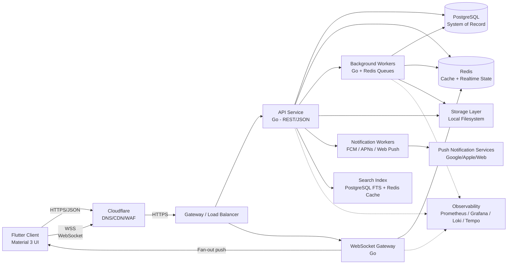

### 4.3 Deployment Topology

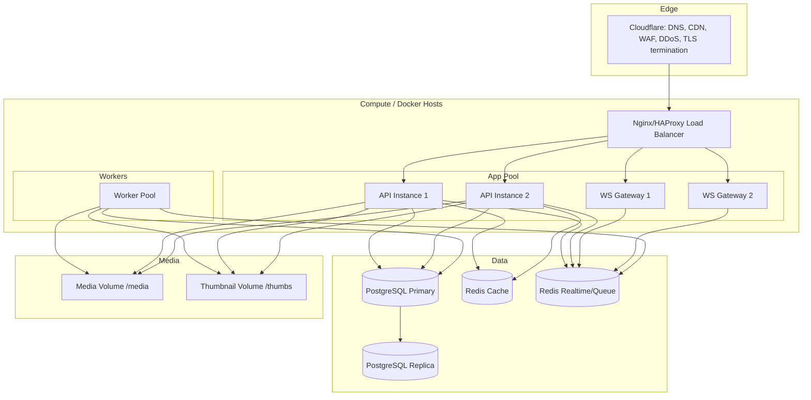

---

## 5. High-Level Component Diagram

```mermaid
flowchart LR
    subgraph Client
        APP[Flutter App]
        CORE[Client Core: REST client,<br/>WS client, local DB, uploader,<br/>push handler, sync engine]
        UI[Material 3 UI screens]
    end
    APP --> CORE
    CORE --> UI

    subgraph Edge
        GW[API Gateway / LB]
        WSG[WebSocket Gateway]
    end

    subgraph Backend
        subgraph API Layer
            ROUTES[HTTP Router / Middleware]
            AUTH[Auth Module]
            USERS[User Module]
            CHATS[Chat Module]
            MSG[Message Module]
            MEDIA[Media Module]
            SRCH[Search Module]
            NOTIF[Notification Module]
            PRES[Presence Module]
        end
        subgraph Realtime
            HUB[Connection Hub]
            DISP[Dispatch / Fan-out]
            TYP[Typing State]
            RCPT[Receipt Processor]
        end
        subgraph Workers
            THUMB[Thumbnail Worker]
            CLEANUP[Cleanup Worker]
            PUSH[Push Worker]
            SYNC[Sync/Backfill Worker]
            NOTIFW[Notification Worker]
        end
        subgraph Storage Abstraction
            STIFACE[Storage Interface]
            FS[Local FS Adapter]
            R2[S3/R2 Adapter (future)]
        end
    end

    subgraph Data Plane
        PG[(PostgreSQL)]
        REDIS[(Redis)]
        OBJ[(Media Store via adapter)]
    end

    CORE -->|REST/JSON| GW --> ROUTES
    CORE -->|WSS| WSG --> HUB
    ROUTES --> AUTH & USERS & CHATS & MSG & MEDIA & SRCH & NOTIF & PRES
    HUB --> DISP
    DISP --> RCPT & TYP & PRES
    AUTH & USERS & CHATS & MSG & MEDIA & SRCH --> PG
    AUTH & USERS & CHATS & MSG & PRES & TYP & RCPT & DISP --> REDIS
    MEDIA --> STIFACE --> FS & R2
    THUMB & CLEANUP & PUSH & NOTIFW --> REDIS
    THUMB & CLEANUP --> STIFACE
    PUSH & NOTIFW --> CORE
```

---

## 6. Backend Services & Modules

The backend is organized as one Go application with clearly separated **domain modules**. Each module below is a self-contained package with: **Responsibilities**, **Why it exists**, **How it communicates**, and **Data flow**.

### 6.1 `user` — Identity & Profiles

- **Responsibilities:** Account lifecycle (registration, email/phone verification, password/passkey handling), profile (display name, avatar reference, bio), privacy settings, contact/phone-number mapping, blocking, deletion.
- **Why it exists:** Identity is the foundation of every other module (auth, presence, chats, notifications) and must have a single owner.
- **How it communicates:** Exposes an internal service interface to other modules; publishes `UserCreated`, `UserUpdated`, `UserDeleted` domain events on the internal event bus; consumes auth events for account linking.
- **Data flow:** API handler → user service → repository (PostgreSQL) → cache-aside (Redis) for hot profile reads; events → event bus → notifier/search/sync listeners.

### 6.2 `auth` — Authentication & Sessions

- **Responsibilities:** Verify credentials (password, passkey, OTP, OAuth), issue and validate access/refresh tokens, manage device sessions, rotate secrets, logout/revocation, anonymous/device bootstrap.
- **Why it exists:** Token issuance and validation must be isolated so that all other modules trust a single issuer.
- **How it communicates:** Middleware calls auth service for token validation; auth publishes `SessionCreated`, `SessionRevoked`, `TokenRotated` events; interacts with Redis for session blacklists and PostgreSQL for session persistence.
- **Data flow:** Client login → auth service → credential store (PG) → issue JWT access token (short-lived) + opaque refresh token → session record → Redis blacklist/allowlist → response to client; subsequent requests validated via middleware.

### 6.3 `session` — Session Registry

- **Responsibilities:** Maintain the authoritative registry of all active device sessions per user (device ID, token family, last-seen, capabilities); enable per-session revocation and cross-device sign-out.
- **Why it exists:** Multi-device support (§34) requires a queryable, revocable session registry separate from token signing.
- **How it communicates:** Consumed by auth (issue/revoke), by notification workers (device push tokens), and by the WS gateway (session↔connection binding).
- **Data flow:** auth → session registry (PG + Redis hot view) → events to notification/gateway on revocation to force-close connections.

### 6.4 `chat` — Conversations

- **Responsibilities:** Manage 1:1 and group conversations: creation, membership, roles (owner/admin/member), group metadata and photo, mute/pin settings, read-state aggregation, conversation list (ordering by last activity).
- **Why it exists:** Conversations are a distinct aggregate from messages; their lifecycle (membership, settings, ordering) is owned here.
- **How it communicates:** CRUD via service interface; publishes `ConversationCreated`, `MemberAdded/Removed`, `SettingsChanged`, `ReadStateChanged` events to the realtime dispatcher; reads/writes PG; uses Redis for list hot reads and membership cache.
- **Data flow:** Client action → chat service → PG transaction (membership + settings) → publish event → dispatcher fan-out to connected members → Redis cache invalidation/refresh.

### 6.5 `message` — Messages & Content

- **Responsibilities:** Message creation, editing, deletion (delete-for-self/all), reactions, message state machine (queued→sent→delivered→read), per-conversation monotonically increasing sequence numbers, deduplication, content hashing.
- **Why it exists:** Message integrity, ordering, and lifecycle are the core product guarantee.
- **How it communicates:** Persists to PG; on success publishes `MessageCreated/Edited/Deleted`, `ReceiptUpdated` events to the realtime dispatcher and to the search indexer; uses Redis for per-conversation sequence counters and pending-receipt aggregation.
- **Data flow:** Client send → message service → assign sequence (Redis counter per chat) → transaction insert (PG) → publish event → dispatcher → WS fan-out to members → ack to sender (message id + sequence) → background receipt processing.

### 6.6 `realtime` — WebSocket Gateway & Dispatch

- **Responsibilities:** Accept authenticated WSS connections, bind connections to user sessions, subscribe to conversation channels, fan-out events, buffer for slow/disconnected clients, handle heartbeat/backpressure.
- **Why it exists:** Push-based delivery of messages, presence, typing, and receipts requires a dedicated connection-management tier.
- **How it communicates:** Consumes domain events from the event bus via Redis pub/sub; maintains presence and session binding in Redis; writes delivery/receipt acks back to the event bus; talks to no module directly (decoupled).
- **Data flow:** Event bus → dispatcher → resolve subscribers (Redis user→connection map) → WS frame per connection; client ack → receipt service → event bus.

### 6.7 `presence` — Online/Last-Seen Status

- **Responsibilities:** Track online/offline state, per-user last-seen, device-level online state, presence preferences (who can see status), broadcast of presence changes to authorized viewers.
- **Why it exists:** Presence is high-churn, ephemeral state that must not be persisted; it also drives UX on chat list and profiles.
- **How it communicates:** Reads connection heartbeats from the gateway (via Redis), publishes `PresenceChanged` events through the dispatcher; reads privacy settings from the user module.
- **Data flow:** WS heartbeat → gateway updates Redis `user:presence` → presence service diff → event → dispatcher → targeted fan-out to friends/conversation members.

### 6.8 `typing` — Typing Indicators

- **Responsibilities:** Track and throttle per-conversation typing state (per user), expire stale flags, deliver to the right recipients.
- **Why it exists:** Typing events are extremely high-frequency; a dedicated low-latency, ephemeral path keeps them out of the durable message pipeline.
- **How it communicates:** WS messages → typing service (Redis key with short TTL, throttled) → dispatcher → recipients. Never persisted.
- **Data flow:** Client typing → WS → gateway → Redis `typing:{chatId}` set → throttled event → dispatcher → recipients; TTL expiry auto-clears.

### 6.9 `receipt` — Delivery & Read Receipts

- **Responsibilities:** Track message delivery and read state per recipient, aggregate "read up to sequence" cursors, publish receipt updates, persist read-watermarks.
- **Why it exists:** Receipts are a separate concern (aggregate state, high update frequency) that must be computed, not re-derived from messages each time.
- **How it communicates:** Consumes client receipt events; writes aggregated watermarks to PG; publishes `ReceiptUpdated` events via dispatcher; uses Redis for fast aggregation before periodic persistence.
- **Data flow:** Client ack → receipt service → merge into Redis cursor → debounce → persist cursor (PG) → publish event → dispatcher → sender(s).

### 6.10 `media` — Media & Files

- **Responsibilities:** Orchestrate upload (multipart/tus), store via storage abstraction, generate thumbnails (async), serve authorized downloads via signed URLs, enforce quotas, run retention/cleanup.
- **Why it exists:** Media has different IO characteristics, lifecycle, and security model than message text.
- **How it communicates:** API handlers → media service → storage interface → adapter; thumbnail worker consumes jobs via Redis; publishes `MediaReady`, `ThumbnailReady`, `MediaDeleted` events.
- **Data flow:** Client upload → media service → storage adapter writes object → metadata record (PG) → queue thumbnail job → worker produces thumbnails → event → client receives media URL + metadata.

### 6.11 `notification` — Push & In-App Notifications

- **Responsibilities:** Fan out notifications (new message, mentions, calls, system) to push providers (FCM/APNs/Web Push) and to in-app notification center; respects per-conversation/per-user mute and quiet hours.
- **Why it exists:** Delivery of events to devices that are not currently connected to the WS gateway requires a provider-integration module.
- **How it communicates:** Consumes domain events from the event bus; resolves target devices from session registry; updates notification-center records in PG; uses Redis for dedup/throttle.
- **Data flow:** Event bus (new message) → notification service → filter by mute/preferences → resolve devices → push provider → device; outcome logged/metrics.

### 6.12 `search` — Chat & Message Search

- **Responsibilities:** Index messages (full text), chats, contacts, and media metadata; serve ranked results; support per-conversation filters.
- **Why it exists:** Search has different consistency and access-pattern requirements than OLTP message reads.
- **How it communicates:** Consumes message/user/chat events; updates PostgreSQL FTS index; serves queries from the search service; caches hot result sets in Redis.
- **Data flow:** Indexer (worker) ← events → PG FTS vectors → query → search service → ranked results → cache → client.

### 6.13 `quota` — Storage & Rate Quotas

- **Responsibilities:** Track per-user/per-conversation storage consumption, enforce quota on upload, compute quotas for media retention.
- **Why it exists:** Unbounded media storage is a cost and ops risk; quota must be enforced at write time.
- **How it communicates:** Consumed by media service on upload; persists counters in PG; fast-path checks in Redis.
- **Data flow:** Upload request → media service → quota service → allowed? → proceed / reject with quota error.

### 6.14 `billing` (optional, if product surface implies) 

- **Responsibilities:** If the UI shows storage-upgrade plans, this module handles plan/entitlement checks.
- **Why it exists:** Entitlements gate quota and premium features.
- **How it communicates:** Consumed by quota and media modules; published plan-change events.

### 6.15 `sync` — Device Synchronization & Backfill

- **Responsibilities:** Provide delta sync for conversations, messages, media metadata, and settings; serve snapshot + delta pulls; manage sync cursors per device.
- **Why it exists:** Multi-device and offline recovery require efficient, cursor-based state transfer.
- **How it communicates:** Reads PG and Redis; uses the message and chat services; publishes device-sync events.
- **Data flow:** Client sync request (cursor) → sync service → diff from cursor → paged response → client applies to local DB → next cursor.

### 6.16 `admin` — Operations Console

- **Responsibilities:** Internal tooling for user management, conversation moderation, content takedown, media quarantine, feature flags.
- **Why it exists:** Production operations require privileged, audited controls separate from the public API.
- **How it communicates:** Invokes domain services; writes audit log; separate authentication realm (SSO + mTLS in production).

### 6.17 Cross-Cutting Modules

- **`eventbus`:** In-process pub/sub bridging to Redis pub/sub; envelope definition; ordering guarantees per partition; dead-lettering.
- **`storage`:** The storage abstraction (interface + FS adapter + future S3/R2 adapter) — see §19.
- **`cache`:** Cache-aside helpers, invalidation protocol, key conventions.
- **`queue`:** Job enqueue/dequeue wrapper over Redis Streams; retries; DLQ.
- **`idgen`:** Globally unique, sortable IDs (Snowflake/ULID-style) generated server-side.
- **`observability`:** Logging, tracing, metrics helpers.
---

## 7. Package Structure

The Go codebase follows a **package-per-domain** layout within a single module. Internal packages are importable only by other internal packages, enforcing boundaries at compile time.

```mermaid
graph TD
    CMD[cmd/] --> API[api-server]
    CMD --> GW[ws-gateway]
    CMD --> WORK[workers]
    INT[internal/] --> D1[internal/user]
    INT --> D2[internal/auth]
    INT --> D3[internal/session]
    INT --> D4[internal/chat]
    INT --> D5[internal/message]
    INT --> D6[internal/realtime]
    INT --> D7[internal/presence]
    INT --> D8[internal/typing]
    INT --> D9[internal/receipt]
    INT --> D10[internal/media]
    INT --> D11[internal/notification]
    INT --> D12[internal/search]
    INT --> D13[internal/sync]
    INT --> D14[internal/quota]
    INT --> D15[internal/admin]
    XC[internal/platform] --> EB[eventbus]
    XC --> ST[storage]
    XC --> CA[cache]
    XC --> QU[queue]
    XC --> ID[idgen]
    XC --> OB[observability]
    P1[pkg/] --> PKT[public reusable helpers]
    SVC[services/] --> S1[user-svc]
    SVC --> S2[message-svc]
    SVC --> S3[media-svc]
```

### 7.1 Responsibilities of each top-level area

- **`cmd/`** — Thin executable entry points (`api-server`, `ws-gateway`, `workers`). Each only wires dependencies and starts the process. No business logic here.
- **`internal/`** — Domain modules. Each domain package contains its own sub-packages for `delivery` (handlers), `application` (services/use-cases), `domain` (entities, value objects, events), `infra` (repositories, adapters). No package may import another domain's `delivery` or `infra`; cross-domain calls go through exported service interfaces.
- **`internal/platform/`** — Technical infrastructure shared by all domains (event bus, storage abstraction, cache, queue, id generation, observability). Domains depend on platform; platform never depends on domains.
- **`pkg/`** — Truly generic, dependency-free helpers that could be extracted to an independent library (slices, time utilities, validation primitives).
- **`services/`** — Future extraction target: thin standalone service binaries (planned for §37). Empty in v1; the folder documents the intended seam.
- **`config/`** — Centralized configuration loading and validation (env/file, typed).
- **`migrations/`** — Versioned schema migration scripts (tooling-driven).
- **`test/`** — Cross-module integration and end-to-end tests.

### 7.2 Dependency Rules

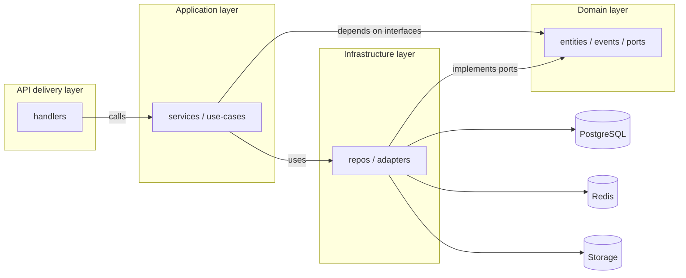

- **Dependency Inversion:** Domain defines ports (interfaces); infrastructure implements them; application wires.
- **No cyclic imports** — enforced via `go-cyclo` / CI lint.
- **Event-driven decoupling:** domains communicate through the `eventbus`, not through direct calls, for anything cross-domain and non-transactional.

---

## 8. Project Folder Structure

```
social-media/
├── architecture/                 # Architecture & design docs
│   ├── ARCHITECTURE.md           # This document
│   └── decisions/                # ADRs (Architecture Decision Records)
├── server/                       # Go backend (monolith)
│   ├── cmd/
│   │   ├── api-server/           # HTTP/JSON + file serving entrypoint
│   │   ├── ws-gateway/           # WebSocket gateway entrypoint
│   │   └── workers/              # Background workers entrypoint
│   ├── internal/
│   │   ├── user/
│   │   ├── auth/
│   │   ├── session/
│   │   ├── chat/
│   │   ├── message/
│   │   ├── realtime/
│   │   ├── presence/
│   │   ├── typing/
│   │   ├── receipt/
│   │   ├── media/
│   │   ├── notification/
│   │   ├── search/
│   │   ├── sync/
│   │   ├── quota/
│   │   ├── admin/
│   │   └── platform/
│   │       ├── eventbus/
│   │       ├── storage/          # storage abstraction + FS adapter
│   │       ├── cache/
│   │       ├── queue/
│   │       ├── idgen/
│   │       └── observability/
│   ├── pkg/                      # generic helpers
│   ├── config/
│   ├── migrations/               # SQL migrations (versioned)
│   ├── test/                     # integration/e2e tests
│   ├── go.mod
│   └── go.sum
├── client/                       # Flutter app
│   ├── lib/
│   │   ├── core/                 # networking, WS, local DB, DI, theming
│   │   ├── features/             # one folder per UI feature
│   │   │   ├── auth/
│   │   │   ├── chat_list/
│   │   │   ├── conversation/
│   │   │   ├── message_input/
│   │   │   ├── media_viewer/
│   │   │   ├── profile/
│   │   │   ├── group_settings/
│   │   │   ├── search/
│   │   │   └── notifications/
│   │   └── main.dart
│   ├── test/
│   ├── pubspec.yaml
│   └── analysis_options.yaml
├── infra/                        # Infrastructure as code
│   ├── terraform/
│   │   ├── cloudflare/           # DNS, WAF, CDN rules, tunnels/load balancers
│   │   ├── compute/              # Docker hosts / cluster provisioning
│   │   └── network/              # VPC/subnets/firewall
│   ├── docker/
│   │   ├── server.Dockerfile
│   │   ├── worker.Dockerfile
│   │   └── docker-compose.yml    # local dev environment
│   └── deploy/
│       ├── kubernetes/           # k8s manifests (post-monolith extraction)
│       └── scripts/
├── media/                        # Local media storage root (mounted volume)
│   ├── originals/
│   ├── thumbnails/
│   └── tmp/                      # upload staging
├── backups/                      # Backup scripts + verification
├── docs/                         # Runbooks, on-call guides
└── .github/
    ├── workflows/                # CI/CD
    └── dependabot.yml
```

---

## 9. Domain-Driven Module Boundaries

### 9.1 Bounded Contexts

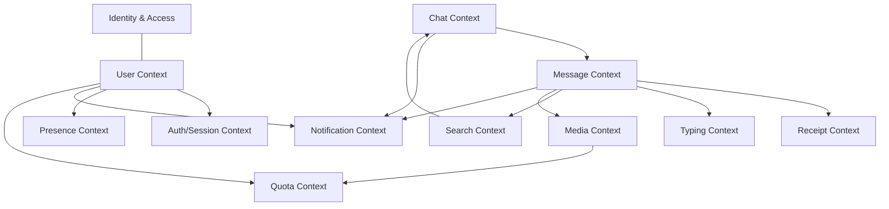

Each bounded context owns its aggregates and published events:

| Bounded Context | Core Aggregates | Owned Events (published) |
|---|---|---|
| **User** | User, Contact, Block | `UserCreated`, `UserUpdated`, `UserDeleted`, `ContactAdded` |
| **Auth/Session** | Credential, Session | `SessionCreated`, `SessionRevoked`, `TokenRotated`, `SessionExpired` |
| **Chat** | Conversation, Membership, Mute/Pin | `ConversationCreated`, `ConversationUpdated`, `MemberAdded`, `MemberRemoved`, `SettingsChanged` |
| **Message** | Message, Reaction, EditHistory | `MessageCreated`, `MessageEdited`, `MessageDeleted`, `ReactionAdded` |
| **Receipt** | ReadWatermark | `ReceiptUpdated` |
| **Typing** | (ephemeral, no aggregate) | `TypingStarted`, `TypingStopped` |
| **Presence** | PresenceState (ephemeral) | `PresenceChanged` |
| **Media** | MediaObject, Thumbnail | `MediaReady`, `ThumbnailReady`, `MediaDeleted` |
| **Notification** | NotificationPreference, NotificationRecord | `NotificationDelivered` |
| **Search** | SearchIndex (projection) | none (consumer) |
| **Quota** | StorageQuota | `QuotaExceeded`, `QuotaChanged` |

### 9.2 Command/Query Responsibility (logical, not physical)

- **Write path:** Commands go through application services → domain logic → repositories → PG transaction → publish events.
- **Read path (conversation list, chat metadata):** Served from Redis cache-aside backed by PG; cache is populated lazily on read and invalidated on events.
- **Realtime path:** Events → eventbus → dispatcher → WS push; no PG on the hot path for fan-out (except message persistence itself).

### 9.3 Transaction Boundaries

- **Strong consistency required:** message insert + sequence bump; conversation membership changes; session creation/revocation; media metadata insert; receipt watermark persistence.
- **Eventual consistency acceptable:** presence, typing, notification delivery status, search index, read-receipt fan-out visibility.

---
## 10. Authentication Architecture

### 10.1 Identity Model

The identity is a **phone number / email plus password or passkey**, with OTP verification as a fallback, plus optional third-party OAuth (Google/Apple) linking to the primary identity. Each user has one primary identity and zero-or-more linked identities. Anonymous/device-first bootstrap is supported: a device can register a temporary identity that later becomes a full account (important for the finalized sign-in/sign-up UI flows).

### 10.2 Token Architecture

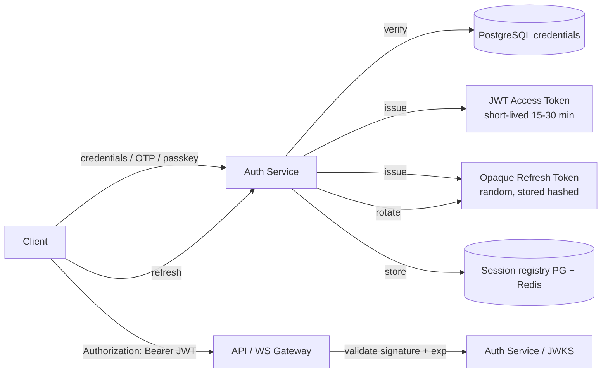

- **Access token:** JWT signed with Ed25519/RS256, carrying `userId`, `sessionId`, `deviceId`, scopes, issuer, audience, `jti`. Short TTL keeps revocation simple (the WS gateway validates once per connection, not per frame).
- **Refresh token:** Opaque, high-entropy random; stored only as a hash in PG alongside the session; rotated on every use (refresh-token-rotation with reuse detection). TTL ~30–90 days configurable, extended by sliding window on active use.
- **Revocation:** Revoking a session marks the token-family in PG and adds the `jti` to a Redis blacklist for the remainder of the access-token TTL; the WS gateway closes the connection bound to that session.

### 10.3 Authentication Flows

- **Sign-up:** phone/email → OTP verify → create user + primary session → immediate bootstrap of client local state → token pair issued.
- **Sign-in (existing):** phone/email + password OR passkey challenge OR OTP → session issued → device registered in session registry.
- **Passkey (WebAuthn):** challenge/response verified by auth service; credential-backed key stored per user; usable across devices.
- **Token refresh:** refresh → rotation → new pair; concurrent-use of an old refresh token triggers session revocation (theft detection).

### 10.4 CSRF & Origin Protection

- Access tokens are carried in the `Authorization` header (never cookies), which eliminates classic CSRF. Any cookie-based flows (e.g., admin console) enforce SameSite + Origin checks + CSRF tokens.
- The WS handshake authenticates via token in the query/subprotocol header; token is validated before the connection is upgraded.

---

## 11. Session Management

### 11.1 Session Registry

Every successful login creates a session record keyed by `(userId, sessionId)`:

- Device identifier (from client, validated), platform, app version, push token, last active time, IP/geo (for security review), token-family version, capabilities.
- **Storage:** PG is the source of truth; Redis holds a hot subset (`sessionId → {userId, deviceId, lastSeen, connId}`) for the WS gateway and presence lookups.

### 11.2 Session Lifecycle

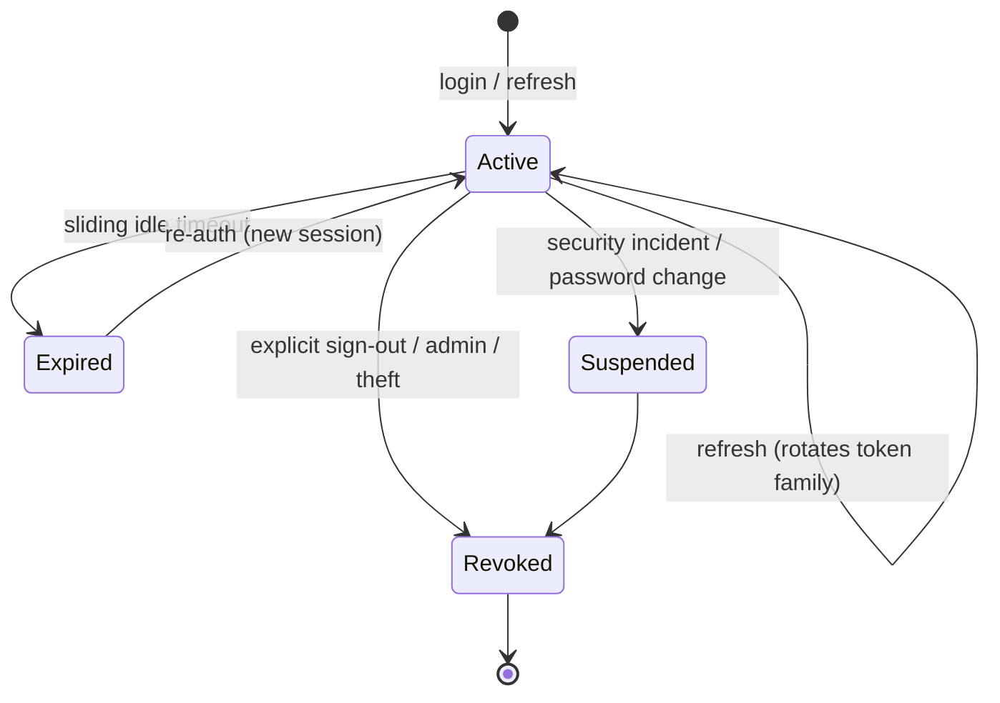

- **Sign-out:** revokes session, blacklists access token, closes WS connection, clears push token, publishes `SessionRevoked`.
- **Sign-out everywhere:** revokes all sessions for a user, bumps a global token version so all outstanding access tokens fail validation at the gateway.
- **Password change / security event:** suspends all other sessions; current session keeps working.

### 11.3 Session ↔ Connection Binding

The WS gateway stores `connId` against `sessionId` in Redis. When a session is revoked, the gateway is notified (Redis pub/sub on a `sessions:revoke:{sessionId}` channel) and force-closes the connection, which triggers re-login on the client. This binding also enables **admin kill-switch** for a user or device.

---

## 12. Authorization

### 12.1 Authorization Model

The system uses **resource-based authorization** evaluated at the resource module boundary, not only at authentication:

- **Conversation access:** A user may read/write a conversation only if they are an active member (checked via membership cache, refreshed on membership events).
- **Group roles:** Owner > Admin > Member. Admin actions (add/remove members, edit group info, promote/demote) require `admin` or `owner`; destructive actions (delete group, transfer ownership) require `owner`.
- **Message permissions:** Edit/delete-for-all requires message ownership or admin capability in the group; delete-for-self is always allowed.
- **Media permissions:** Download requires membership in the conversation where the media was shared; signed URLs embed the requester's identity and expiry.
- **Presence privacy:** last-seen visibility follows per-user privacy tiers (everyone → contacts → nobody).

### 12.2 Enforcement Points

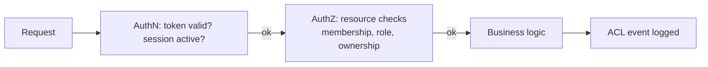

- **Transport layer:** authn only (is the caller who they claim to be).
- **Application layer:** authz (can this caller do this on this resource?) — enforced inside each domain service with a passed-in `Principal` and verified against the membership cache.
- **Data layer:** defense-in-depth row-level ownership checks (PostgreSQL RLS as a safety net for the most sensitive aggregates).

### 12.3 Authorization for Real-Time Events

The WS dispatcher authorizes **channel subscriptions** at subscribe time (only members may subscribe) and re-checks on membership-change events (a removed member's subscription is dropped). Individual event frames are trusted only because subscription was authorized; no per-frame authz is performed for performance.

---

## 13. Real-Time Messaging Architecture

### 13.1 Overview

Real-time delivery uses a **log-dispatch model**: domain events are published to the event bus, then the dispatcher routes them to the conversations' subscriber sets over WebSockets. Message content and ordering are persisted in PG (the source of truth); the WS channel is a delivery mechanism, never the source of truth.

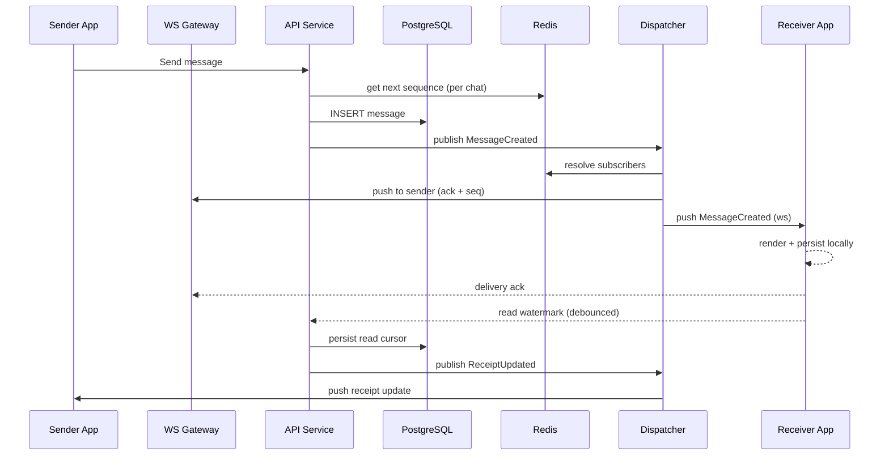

### 13.2 Ordering Guarantees

- **Per-conversation sequence numbers:** Each conversation has a monotonically increasing sequence counter (Redis, persisted periodically to PG). A message's `sequence` is assigned at insert time and is the canonical ordering key.
- **Single writer per sequence:** Sequence assignment is atomic; concurrent sends receive distinct, ordered sequences.
- **Delivery is ordered per connection:** The WS gateway enqueues frames per connection and flushes in order; the client applies message events in `sequence` order regardless of arrival timing (it reorders against its local watermark).
- **Exactly-once intent with idempotency:** Clients generate a client message id; the message service dedupes on it, so retries after network errors do not duplicate messages.

### 13.3 Backpressure & Slow Consumers

- Each connection has an outbound buffer (bounded). If a consumer cannot keep up, the gateway drops to "catch-up via sync" mode: the client is told to backfill from the sync endpoint rather than blocking the fan-out.
- Per-connection write deadlines; dead connections are cleaned up by heartbeat timeout.

### 13.4 Scaling Fan-Out

- Multiple WS gateway instances each handle a subset of connections; Redis pub/sub channels (`conv:{id}:events`) distribute events to all gateway instances, which then deliver to their local connections only.
- For large groups, the dispatcher batches the subscriber resolution and streams frames; fan-out work is bounded and can be sharded by conversation hash.

---

## 14. WebSocket Connection Lifecycle

### 14.1 Handshake & Upgrade

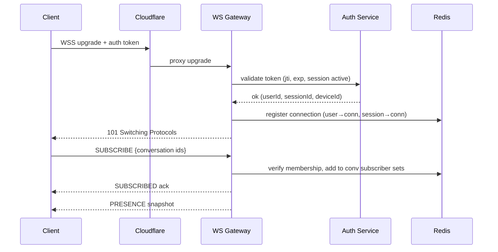

### 14.2 Lifecycle States

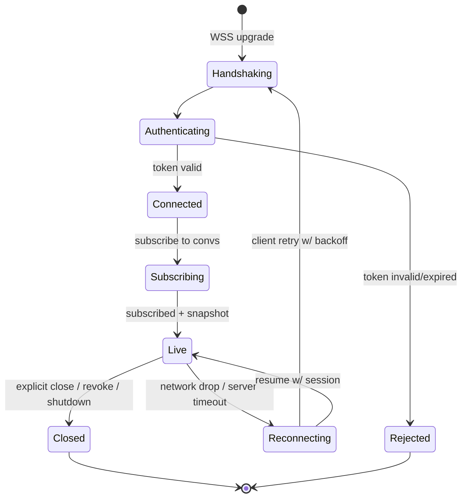

- **Reconnect/resume:** The client reconnects with its session token; the gateway performs delta sync (via sync module) so no frames are lost between last ack and reconnect.
- **Graceful shutdown:** Gateway drains: stops accepting upgrades, closes in-order with a `server:shutdown` frame, waits for acks with a deadline, then force-closes. Client automatically reconnects to a healthy instance.
- **Heartbeat:** Application-level ping/pong every N seconds; idle connections are pruned. Heartbeats also drive the presence module.

### 14.3 Connection Registry

Redis stores:
- `user:{userId}:conns` (set of connIds for the user)
- `conn:{connId}` (userId, sessionId, deviceId, connectedAt, instanceId, subscribed convs)
- `conv:{convId}:members` (active member user ids for fast subscribe checks)

This registry is the substrate for presence, receipts fan-out, and session revocation.

---

## 15. Presence System

### 15.1 What Presence Tracks

- **Online/offline:** a user is online if at least one active WS connection exists.
- **Last seen:** updated on state transitions and periodically; persisted in Redis with TTL and flushed to PG at interval (for "last seen hours/days ago" display).
- **Device granularity:** a user with multiple devices reports online if any device is connected; the UI's "Active now" is user-level.

### 15.2 Presence Propagation

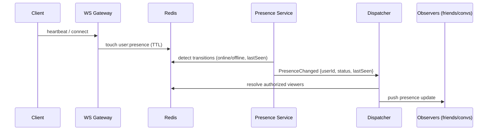

- **Authorized viewers:** resolved from contacts/friendships + conversation membership + user privacy settings (cached in Redis).
- **Batching:** presence updates are batched and coalesced per user to avoid event storms (e.g., app entering background on a phone should not fan out 20 rapid transitions).
- **No persistence in hot path:** presence is ephemeral (Redis TTL). On read, if the Redis key is absent, presence is computed as offline (or lastSeen from PG).

---

## 16. Typing Indicators

### 16.1 Design

- Client sends `typing.start` / `typing.stop` (or a single "typing with heartbeat" event) over the WS channel.
- The typing service stores per-conversation typing state in Redis (`typing:{convId}` → set of users, TTL ~10s).
- **Throttling:** per (user, conversation) Redis key with short TTL (e.g., 2–4s) suppresses redundant broadcasts; the indicator is never re-broadcast faster than the throttle allows.

### 16.2 Flow

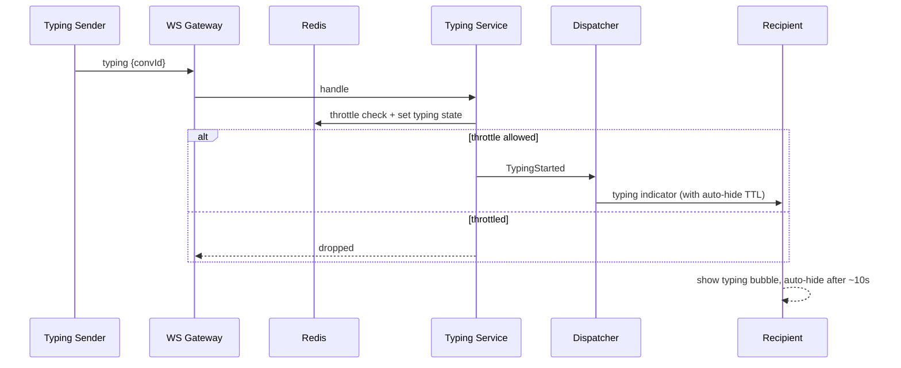

- **Expiry:** clients auto-hide after a max duration even without a `typing.stop` (protects against missed stop events). Redis TTL backs this server-side.
- **Deterministic recipients:** typing is delivered only to other members of the conversation, never persisted, and never replayed on reconnect (ephemeral by design — matches UI expectation that typing is transient).

---

## 17. Read & Delivery Receipts

### 17.1 Semantics

- **Sent (tick 1):** message durably persisted by the server; the sender receives the assigned `sequence`.
- **Delivered (tick 2):** at least one receiving device (or the server-to-device push acknowledgment) confirms delivery.
- **Read (tick 3, blue double-tick):** the recipient's client has opened the conversation past the message sequence and submitted a read watermark.

The finalized UI shows ticks and per-message "read by" states (n viewers); both derive from the same watermark data.

### 17.2 Data Model of Watermarks (conceptual)

Per `(conversation, member)` store a `readUpToSequence`. Reading is a **cursor**, not per-message rows — cheap to store and query. "Read by X" for a given message is `X.readUpToSequence >= message.sequence`.

### 17.3 Receipt Flow

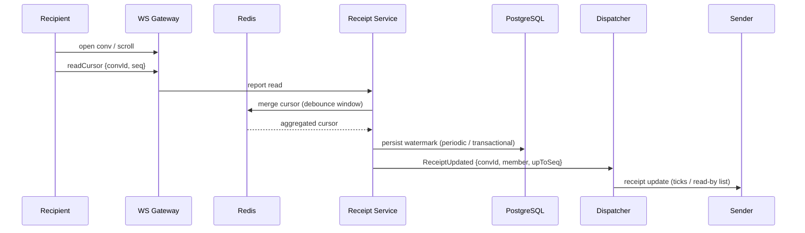

- **Delivery receipt** is generated automatically when the WS gateway has delivered the frame and the client ACKs (or when push confirms).
- **Debouncing:** read-state updates are debounced (e.g., 1–2s) and coalesced per conversation to bound write volume on PG.
- **Correctness:** because the watermark is monotonic per member, re-ordered or duplicate reports are harmless (max-merge).

---
## 18. Media Upload Flow

### 18.1 Overview

Media uploads are **orchestrated by the API service**, with a staging area on the local filesystem, background processing for thumbnails, and a final signed-URL download path. The client never writes to the final media path directly — everything funnels through the storage abstraction.

### 18.2 Upload Paths

- **Small media (photos, small videos, voice notes, documents):** direct multipart upload to the API service.
- **Large media (long videos):** chunked/resumable upload (tus-style) so that large files survive network drops without restarting; the server tracks chunks in Redis and assembles the file in staging.
- **Async finalize:** after the file is in staging, the media service validates content type, size, checksum, and quota; then it moves the file into the final object path and enqueues post-processing.

### 18.3 Media Upload Sequence

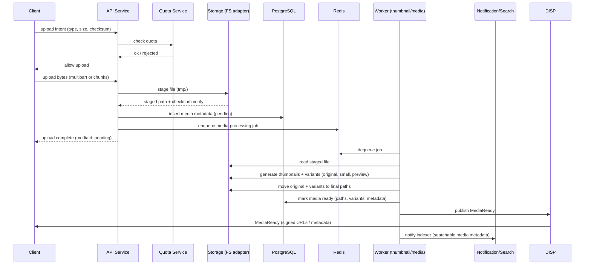

### 18.4 Download / Serving

- **Signed URLs:** the media service issues short-lived signed URLs embedding `mediaId`, expiry, and a per-user signature (server secret). URLs are validated by the media handler before streaming.
- **Authorization at serve time:** the handler verifies the signature *and* that the caller is still a member of the originating conversation (membership re-check). This prevents leaked URLs from being usable after expiry or membership removal.
- **Range requests:** video and voice playback use HTTP Range; the server streams from the local file with `Content-Length`/`Range` support.
- **Thumbnail variants:** the client requests a variant (`preview`, `small`, `full`) — variant URLs point to the thumbnails tree, generated at upload time.

### 18.5 Validation & Quotas

- Content-type sniffing (magic bytes) — never trust client headers.
- Size limits per type; format allowlist for images/videos/voice/documents.
- Per-user storage quota enforced at upload intent and re-checked at finalize; oversized requests are aborted early.
- Checksums (SHA-256) verified end-to-end to catch corrupted uploads.

---

## 19. Local Media Storage Architecture

### 19.1 Storage Abstraction (the key design decision)

All media code depends on a **storage interface** (in `internal/platform/storage`). Nothing outside that package touches filesystem paths. This makes the future migration to S3-compatible storage / Cloudflare R2 (see §36) a matter of adding a second adapter, not rewriting the media module.

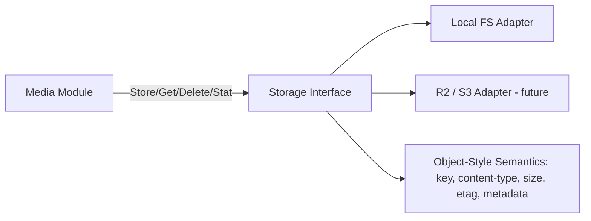

### 19.2 Interface Contract (object-style)

The abstraction models media as **objects with keys**, mirroring object storage semantics so the future adapter is a drop-in:

- `Put(key, stream, metadata)` → object key + checksum/etag
- `Get(key, range)` → stream + metadata
- `Delete(key)`
- `Exists(key)` / `Stat(key)`
- `Copy(keyFrom, keyTo)` (used by promote-from-staging)
- `SignURL(objectKey, ttl, requester)` → signed access descriptor
- `List(prefix, cursor)` (used by cleanup/audit tooling)

Object keys are **opaque to business logic**: media records in PG store the storage key; the storage layer owns path layout.

### 19.3 Filesystem Adapter Design

- The FS adapter maps object keys to paths under a configurable media root (e.g., `/media`), mounted as a dedicated volume.
- Directory hierarchy is **content-addressed by object id with fan-out** (see §20) to avoid inode pressure in large directories.
- The adapter uses atomic `rename` for promotes (staging → final) to guarantee no partially-visible objects.
- Metadata (content-type, original name, sizes, checksums) lives in PG; the filesystem stores only bytes (plus an optional sidecar JSON for crash recovery and filesystem-level audit).

### 19.4 Durability & Consistency

- Media object creation follows: stage → validate → atomic rename to final key → then PG metadata commit. If PG fails, the orphaned staged file is garbage-collected by the cleanup worker.
- The FS adapter fsyncs metadata on critical writes; the volume is backed up with the DB as a coordinated snapshot point (see §35).
- **Fingerprinting:** content hashing enables deduplication of identical uploads (common media forwarded across chats) — same content maps to one object, multiple media records reference it.

### 19.5 Quotas, Lifecycle & Cleanup

- Quota accounting lives in the quota module, keyed by owner (uploader) and by conversation (group storage).
- Lifecycle: media records carry state (`pending → ready → deleted`) and a retention date for content-based retention policies (e.g., transient media with auto-destruct, matching UI).
- The cleanup worker: (1) removes expired `pending` staged files, (2) hard-deletes `deleted` objects after grace period, (3) removes orphaned objects with no media record, (4) compacts thumbnails when the original is deleted.

---

## 20. Recommended Media Directory Structure

### 20.1 Layout

Media lives under a mountable media root. Two logical trees exist: **originals** and **thumbnails**, plus **tmp** for staging.

```
/media
├── tmp/                          # upload staging (short-lived)
│   ├── {sessionId}/
│   │   ├── {uploadId}.part       # resumable upload chunks / partials
│   │   └── {uploadId}.bin        # assembled, pre-validate
│   └── quarantine/               # failed validation, awaiting review
│
├── originals/                    # final uploaded objects
│   ├── images/
│   │   └── {yyyy}/{mm}/{nn}/{objectId}/data.bin
│   ├── videos/
│   │   └── {yyyy}/{mm}/{nn}/{objectId}/data.bin
│   ├── voice/
│   │   └── {yyyy}/{mm}/{nn}/{objectId}/data.bin
│   ├── documents/
│   │   └── {yyyy}/{mm}/{nn}/{objectId}/data.bin
│   └── avatars/
│       └── {userIdHash:x}/{userId}/data.bin
│
├── thumbnails/                   # derived variants
│   ├── images/
│   │   └── {yyyy}/{mm}/{nn}/{objectId}/
│   │       ├── preview.webp      # e.g. 512px wide
│   │       └── small.webp        # e.g. 96px (chat list / grid)
│   ├── videos/
│   │   └── {yyyy}/{mm}/{nn}/{objectId}/
│   │       └── poster.jpg        # video thumbnail frame
│   └── avatars/
│       └── {userIdHash:x}/{userId}/
│           └── preview.webp
│
└── _meta/                        # sidecar metadata (crash recovery, audit)
    └── {yyyy}/{mm}/{nn}/{objectId}.json
```

### 20.2 Rationale for the Layout

- **Date fan-out (`yyyy/mm/nn`)**: bounds the number of entries per directory — critical for local filesystems where listing/creating in a single directory with 100k+ files degrades badly. `nn` is a 2-digit (e.g., 0–31) or hex shard for extra fan-out if needed.
- **Object-id leaf directory**: every object gets its own leaf folder so related variants (original + thumbnails + sidecar) live together and a per-object delete is a recursive remove.
- **Content-type top level**: separates thumbnailing needs and retention policies per media type; lets you mount different volumes (fast NVMe for images vs. high-capacity for videos) if desired.
- **Avatar tree keyed by user hash**: user-facing references to avatar URLs are stable (`.../avatars/{shard}/{userId}/...`), overwritten in place on avatar change.
- **`_meta` sidecars**: enable crash-recovery reconciliation and allow the backup system to verify DB↔object consistency without hitting PG.

### 20.3 Object Key → Path Mapping

The storage adapter derives path from the object key deterministically. An object key looks like:

```
img/{yyyy}/{mm}/{nn}/{objectId}/data.bin
thumbs/img/{yyyy}/{mm}/{nn}/{objectId}/preview.webp
```

`objectId` is a server-generated Snowflake/ULID — globally unique, sortable, collision-free under distributed generation (this also makes keys cluster-friendly for a future object store).

### 20.4 Filesystem Tuning

- `xfs` or `ext4` with `noatime`; mount options optimized for large sequential writes (videos) and many small files (thumbnails).
- Keep `tmp` on the same volume as originals to make promote an atomic rename (no cross-device copy). If separated, promote becomes copy+delete (slower).
- Provision headroom ≥ 30% for thumbnail generation and video transcoding scratch space.

---

## 21. Media Metadata Management

### 21.1 Where Metadata Lives

- **System of record (PostgreSQL):** one media object row with fields for owner, conversation, media type, mime, original filename, byte size, checksums, dimensions/duration (where applicable), storage key(s) for original + variants, state, retention date, dedupe content hash, audit timestamps.
- **Redis (cache):** hot metadata for signed-URL issuance and recent-media reads.
- **Filesystem sidecar (`_meta/*.json`):** non-authoritative crash-recovery copy.

### 21.2 Metadata Lifecycle

1. **Pending:** row created at upload start (mediaId, owner, conv, type, size).
2. **Processing:** worker sets processing state while generating variants.
3. **Ready:** row finalized with variant keys and derived metadata; `MediaReady` event published.
4. **Deleted (soft):** marked deleted; object bytes retained through grace period.
5. **Purged:** object + row removed by cleanup worker; `MediaDeleted` event published.

### 21.3 Consistency Rules

- Row and object are committed in that order (row may reference a staged path only in `pending`).
- Delete order is reversed: purge object bytes only after row is marked deleted and grace period passed.
- Reconciliation job periodically cross-checks: DB rows with no object (broken references) and objects with no row (orphans) — both feed the cleanup worker.

---
## 22. Notification Architecture

### 22.1 Goals

Deliver a new message / mention / call / system event to the user's devices **even when the app is not connected** to the WS gateway, while respecting per-conversation and per-user notification preferences (mute, quiet hours, badge counts) exactly as configured in the finalized settings screens.

### 22.2 Components

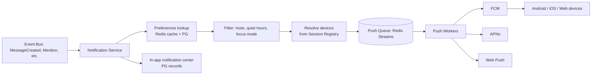

### 22.3 Flow

1. Domain event arrives (`MessageCreated`, `Mentioned`, `GroupCallStarted`, `UserOnline`…).
2. Notification service builds the notification context (sender display name, conversation title, message preview/snippet).
3. Preference filter applies: conversation mute until date, group-level mute, per-user quiet hours, focus mode, "only mentions", contact settings.
4. Devices resolved from the session registry (only sessions with a push token and not currently connected via WS — avoid double delivery).
5. Notification record persisted for the in-app notification center; badge counts incremented per user.
6. Push job enqueued with per-provider payload (FCM data message, APNs payload, Web push) and throttled/deduped (e.g., coalesce multiple messages into one "N new messages" summary).

### 22.4 Delivery Semantics

- **Primary: WS** (live). **Fallback: push** (not connected). If the device is online, no push is sent (saves cost and battery).
- **Content previews** respect per-user "show preview" setting; payloads are privacy-filtered before hitting third-party providers.
- **Delivery attempts:** worker retries with exponential backoff; terminal failures logged and counted.
- **Badge counts** are computed server-side (aggregate of unseen messages per conversation) so all devices converge to the same number.

---

## 23. Search Architecture

### 23.1 Scope

- **Message search:** full-text search within a conversation or across the user's conversations.
- **Conversation/contact search:** name-based lookup with prefixes.
- **Media search:** by type/date/filename.
- **Deep search UI implications:** results rendered with snippets, highlights, and "jump to" navigation.

### 23.2 Indexing Strategy

Search is built on **PostgreSQL full-text search (FTS)** in v1 — no separate search engine (keeps ops surface small; a dedicated engine can replace the indexer later without changing the query layer).

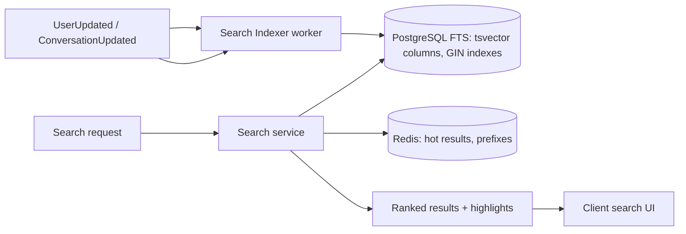

- **Indexer consumer** on the event bus updates `tsvector` vectors (message text, sender name, media filename/type) and rebuilds per-user search scoping.
- **Access control:** search queries are always scoped to conversations the user belongs to (membership check at query time) — no global search across non-member conversations.
- **Ranking:** relevance = text match + recency + conversation engagement; highlighted snippets generated server-side.
- **Consistency:** search index is eventually consistent (typically < 1s behind the write path) — acceptable for the search UX.

---

## 24. Caching Strategy

### 24.1 Cache Layers

| Layer | Store | TTL / Invalidation | Purpose |
|---|---|---|---|
| **Hot session/principal** | Redis | short TTL + event invalidation | token validation metadata, membership checks |
| **Conversation list** | Redis | event-driven invalidation | chat list ordering, unread counts |
| **Profile hot reads** | Redis | user-event invalidation | avatars, display names, presence privacy |
| **Media metadata** | Redis | short TTL | signed URL issuance |
| **Rate-limit counters** | Redis | fixed windows / token bucket | per-user/IP endpoints |
| **Search hot results** | Redis | short TTL | repeated queries, prefix autocomplete |
| **Typing / presence** | Redis | TTL-only (ephemeral) | realtime state, never persisted |

### 24.2 Pattern: Cache-Aside with Event-Driven Invalidation

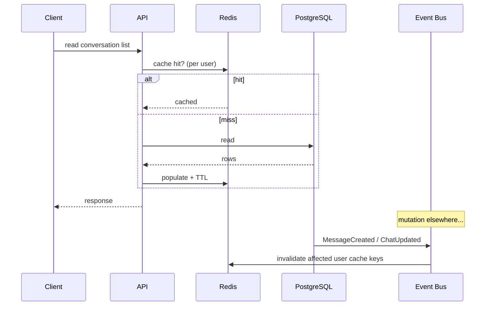

### 24.3 Rules

- **Never read-through on write paths.** Writes go to PG; cache is invalidated via events after commit (invalidate-then-populate, with a short grace TTL to absorb races).
- **Per-user keys** (e.g., `user:{id}:chatlist`) so invalidation targets only affected users.
- **No stale durability risk:** caches are always recomputable from PG; correctness never depends on Redis.
- **Redis topology:** one Redis for cache (eviction policy `allkeys-lru`) and one for realtime/queues (`noeviction` for streams/lists; TTL-based ephemeral keys). Separation prevents cache eviction storms from killing realtime state.
- **Pub/Sub for cross-instance invalidation:** every API instance subscribes to invalidation channels so its in-process caches and Redis caches stay coherent.

---

## 25. Background Jobs

### 25.1 Queue Infrastructure

- **Redis Streams** as the job backbone (consumer groups, per-worker acknowledgments, dead-letter stream). Lightweight, already in the stack, survives restarts via AOF.
- Jobs are **idempotent** (job id in the event envelope; workers dedupe).
- Retry with exponential backoff + jitter; max attempts; then **DLQ** for operator review and replay.

### 25.2 Job Catalog

| Job | Producer | Consumer | Notes |
|---|---|---|---|
| **media.process** | media service | media worker | thumbnails, variants, checksum verify |
| **media.cleanup** | scheduler | cleanup worker | staged files, deleted objects, orphans, retention |
| **receipt.persist** | receipt service | receipt worker | flush debounced read/delivery watermarks to PG |
| **push.send** | notification service | push worker | FCM/APNs/Web push fan-out, retries |
| **search.index** | search indexer consumer | index worker | FTS vector updates |
| **sync.backfill** | sync service | sync worker | large-history materialization for slow devices |
| **notification.aggregate** | scheduler | notif worker | badge recompute, digests |
| **audit.flush** | security module | audit worker | write-audit log to cold storage |
| **presence.flush** | presence service | presence worker | periodic lastSeen persistence |
| **backup.job** | scheduler | backup worker | coordinated PG + media snapshots (see §35) |

### 25.3 Scheduling & Priorities

- Cron-style scheduled jobs use a distributed scheduler (Redis-based lease so only one worker runs each at a time).
- Queues are **prioritized** (e.g., `critical` = receipt persistence, `high` = media process, `normal` = push, `low` = cleanup/index) with separate streams and consumer counts.

### 25.4 Operational Properties

- At-least-once delivery — workers must be idempotent.
- Consumer lag is a first-class metric (see §29).
- Manual replay tooling for DLQ inspection.

---

## 26. Rate Limiting

### 26.1 Strategy

Rate limiting is enforced in **layers**:

1. **Cloudflare edge:** per-IP / per-client token bucket for HTTP and WSS; WAF rules; bot management; DDoS protection. Stops floods before they reach origin.
2. **API gateway (Go):** per-user (identity-based) limits for auth endpoints, message send, media upload, search, sync. Redis-backed token buckets / fixed windows.
3. **Per-conversation limits:** to prevent chat spam (e.g., max messages per minute per conversation per user).
4. **Media-specific:** upload size and concurrent upload slots per user.
5. **WS frame rate:** per-connection message-frame rate (typing, presence) throttled at the gateway; abusive connections downgraded to sync-only mode.

### 26.2 Design Points

- **Identity-based over IP-based:** mobile clients share IPs behind NAT/CDN; limits key on `userId`+`deviceId` (with IP fallback for unauthenticated endpoints).
- **Graceful response:** 429 with `Retry-After`; clients back off and surface the standardized UI message (per finalized error states).
- **No cache poison:** rate-limit counters live in Redis with TTL; on Redis failure the limiter fails **open** for reads and applies conservative local limits for writes (never blocks the system behind a dead Redis).
- **Per-tier limits** configurable via feature-flag service so ops can react live.

---
## 27. Error Handling Strategy

### 27.1 Principles

- **Structured errors everywhere.** Every failure has: a machine-readable code, a user-facing message (localized by the client), an internal detail (safe, no secrets), and a correlation id.
- **Errors are data, not exceptions.** Domain errors (not-a-member, quota exceeded, message too long, token expired) are modeled as typed results from services, not panics.
- **Fail safe for writes, fail open for reads.** A message send that cannot persist must be rejected (no false "sent"); a presence/typing read may degrade silently.

### 27.2 Error Taxonomy (conceptual)

| Class | Examples | Client UX mapping |
|---|---|---|
| `Validation` | bad input, malformed media, file too big | inline field errors |
| `Auth` | token invalid/expired, session revoked | force re-login |
| `Authz` | not a member, no admin role | disabled actions / dialog |
| `Conflict` | duplicate send (idempotency), stale edit | silent dedupe or retry prompt |
| `Quota` | storage full, upload limit | quota screen / banner |
| `RateLimited` | too many requests | Retry-After countdown |
| `Server` | DB down, storage failure | offline banner + retry queue |
| `Dependency` | push provider down, index lag | degraded UX, silent retry |

### 27.3 Propagation

- **Internal:** services return typed domain errors; the HTTP layer maps them to the standard error envelope; the WS layer maps them to error frames with the same envelope.
- **Retry classification:** each error carries a `retryable` flag; clients and workers use it to decide automatic backoff vs. terminal failure.
- **Idempotency keys** (client message id, job id, upload id) prevent double-application on retries.
- **Downstream failures:** external calls (push providers, etc.) are always bounded by timeouts + circuit breakers; when a dependency is down, the system degrades (e.g., notifications delayed) without losing message correctness.

### 27.4 Crash & Recovery

- Panics recovered at the boundary (per-request recovery middleware), logged with stack, request id; connection-level panic in the WS gateway closes only that connection.
- Jobs that panic are retried per queue policy then dead-lettered.
- The client maintains an outbox; messages that fail to send are persisted locally and retried on connectivity restore (see §33).

---

## 28. Logging Strategy

### 28.1 Model

- **Structured JSON logs** (no free-form text) with a consistent envelope: `timestamp, level, service, instance, traceId, spanId, requestId, userId, deviceId, conversationId, event, msg, context`.
- **Correlation:** every request and every WS frame flows a `traceId` end-to-end (client-generated or server-generated); all downstream calls (PG, Redis, storage, providers) inherit it.
- **Levels:** debug (dev only), info (domain events, lifecycle), warn (degradations, slow paths), error (actionable failures), fatal (startup/shutdown only).
- **No PII in logs** — user content and message bodies are never logged; identifiers are redacted/obfuscated; sensitive fields (tokens) are stripped by a logging middleware.

### 28.2 Channels

| Channel | Content | Destination |
|---|---|---|
| **app** | domain events, request summaries, business logic | Loki (or managed) |
| **access** | authn/authz results, IP, UA, outcome | Loki, hot for security |
| **ws** | connect/disconnect, subscribe, frame counts, drop reasons | Loki |
| **worker** | job results, retries, DLQ events | Loki |
| **audit** | privileged/admin actions, moderation, data deletions | cold store (immutable) |

### 28.3 Tooling

- **Loki** for log aggregation (bounded retention: hot 7d, cold archive 30d+).
- **Structured querying** via log labels (`service`, `instance`, `level`, `traceId`).
- Ship logs via a lightweight agent per container; format is a contract enforced by linting in CI.

---

## 29. Monitoring Strategy

### 29.1 Pillars (RED/USE + custom)

- **R**ate, **E**rrors, **D**uration for every service endpoint, WS event type, and worker queue.
- **U**tilization, **S**aturation, **E**rrors for PG, Redis, storage volumes, network.
- **SLOs** defined for: message send P95, message delivery latency (send→delivered) P95, WS connect success rate, notification delivery success, API availability.

### 29.2 Key Metrics

- **API:** request rate, latency histogram (P50/P95/P99), error rate, 4xx/5xx, active users.
- **WS:** active connections, connect rate, disconnect reasons, subscribe rate, fan-out volume, per-connection buffer saturation, frame drop rate, resume success.
- **Messaging pipeline:** send→persist latency, send→delivered latency, sequence counter drift, receipt processing lag.
- **Data:** PG connections, slow queries, replication lag, WAL lag; Redis memory, evictions, pub/sub throughput, stream consumer lag (per queue).
- **Media:** upload throughput, thumbnail generation rate/latency, storage utilization per type, quota utilization, orphan rate.
- **Presence/typing:** event rate, coalescing effectiveness.
- **Push:** provider error rates, delivery attempts, badge recompute lag.

### 29.3 Observability Stack

```mermaid
flowchart LR
    S[Services & workers] -->|metrics| PR[Prometheus]
    S -->|traces| T[Tempo / OTLP collector]
    S -->|logs| L[Loki]
    PR --> G[Grafana dashboards + alerts]
    T --> G
    L --> G
    PR --> AL[Alertmanager → paging/on-call]
```

- **Tracing:** OpenTelemetry auto-instrumentation; traces for message send path, media upload path, and notification fan-out; span per service hop and dependency call.
- **Dashboards:** one per pillar (API, WS, pipeline, data, media, workers, infrastructure) + an executive "system health" board mirroring the SLOs.
- **Alerts:** page on SLO burn, error-spike, connection-loss cascade, DB/Redis saturation, replication lag, storage near-full, DLQ growth, backup failure. Alert fatigue controlled via SLO-burn-based alerting.
- **Health & readiness endpoints** per service; used by load balancers and orchestration (see §31).

---

## 30. Security Architecture

### 30.1 Threat Model Highlights

| Threat | Mitigation |
|---|---|
| Account takeover | Strong authn (passkeys), OTP, refresh-rotation + reuse detection, device review, anomaly-based session suspension |
| Token theft | Short access TTL, opaque refresh stored hashed, revocation everywhere, session bind to device |
| Unauthorized access to chats/media | Membership authz at API + realtime subscribe + signed media URLs + RLS safety net |
| Leaked media URLs | Signed, short-lived, per-requester, re-checked membership at serve time |
| Injection (SQL/NoSQL) | Parameterized queries; no string-built SQL; object keys validated against strict charset |
| XSS in client rendering | Flutter-safe rendering, HTML never injected, all server text treated as data |
| SSRF via media URLs | Storage adapter resolves only configured endpoints; URL fields validated |
| Spam/abuse | Rate limiting, per-conv limits, content moderation hooks, block/report flows |
| DDoS | Cloudflare edge: WAF, rate limiting, bot management, DDoS protection |
| Data at rest | Encrypted volumes (LUKS/managed), PG encryption at rest, backups encrypted |
| Secrets | Terraform-managed vault (e.g., SOPS/cloud secret manager); no secrets in repo |
| Supply chain | Locked dependencies, minimal base images, SBOM in CI, image scanning |

### 30.2 Defense in Depth Layers

```mermaid
flowchart TB
    L1[Client: local encryption, biometric lock, secure keychain]
    L2[Edge: Cloudflare WAF, TLS, DDoS, bot]
    L3[Transport: TLS 1.2+, HSTS, WSS, certificate pinning opt-in]
    L4[Application: authn + authz + rate limits + input validation]
    L5[Data: least-privilege DB roles, RLS, encryption at rest, backups]
```

### 30.3 Access Control & Secrets

- **Least privilege:** distinct DB roles for API vs. workers vs. migrations; media path served by a dedicated role with no write access to user tables.
- **Admin console:** separate authn (SSO), mTLS at network layer, every action audited.
- **Moderation:** content reports, takedown queues, media quarantine (`tmp/quarantine`), user suspend flows with audit.

### 30.4 Audit Trail

Immutable audit log for: authentication events, session lifecycle, authorization denials, admin/moderation actions, media deletions, data exports. Stored append-only, retained per compliance policy.

---
## 31. Scalability Strategy

### 31.1 Vertical → Horizontal Path

The system is designed to scale **horizontally** from day one where cheap (stateless API + WS gateway), and to scale vertically the stateful parts (PG, Redis, media volume) until the microservice split (§37) provides further decomposition.

```mermaid
flowchart TB
    subgraph Scale-out tiers (stateless)
        API1[API instances] 
        WS1[WS gateway instances]
        WK[Worker pool]
    end
    subgraph Scale-up tiers (stateful)
        PG[(PostgreSQL primary + replicas)]
        RD[(Redis cache / realtime / queues)]
        MED[(Media volumes - sharded by type/date)]
    end
```

### 31.2 Scaling Levers

| Tier | Lever | Notes |
|---|---|---|
| **API** | add instances behind LB | fully stateless; zero affinity |
| **WS gateway** | add instances, Redis pub/sub fans out | connections spread by LB session-affinity (sticky) or consistent hash |
| **Workers** | increase consumers per queue | queues partition by key (user/conv/type) |
| **PostgreSQL** | replicas for reads; partitioning for hot tables; connection pooling (PgBouncer) | writes stay on primary in v1; message table partition by time for retention/pruning |
| **Redis** | separate cache vs realtime; cluster-mode for realtime/queues when large | cache cluster scalable independently |
| **Media** | shard volumes by media type + date shard | object keys already date-fanned (§20) |

### 31.3 Sharding & Partitioning

- **Conversation fan-out:** group chats fan out per-message; for very large groups, delivery is batched and the sync backfill absorbs late joiners.
- **Message table partitioning** by conversation or time for fast retention pruning and bounded index growth.
- **Sequence counters:** per-conversation Redis counter with periodic PG persistence; a PG-based fallback if Redis is unavailable.
- **Geo/region:** Cloudflare routes by region; v1 single region, DR region planned (§35). Read replicas can be promoted in a disaster.

### 31.4 Auto-Scaling & Capacity

- Containerized deployment; scaling driven by metrics (CPU, memory, WS connection count, queue depth).
- Idle connections are cheap (goroutine-per-connection); memory per connection bounded by buffer caps.
- Terraform-managed; can scale pools via configured autoscaler; load tests calibrate thresholds.

---

## 32. Performance Considerations

### 32.1 Latency Budgets

| Operation | Budget (P95) | Techniques |
|---|---|---|
| Message send ack | < 200 ms | single PG insert + Redis sequence; async fan-out |
| Send → delivered (online peer) | < 1 s | WS push via Redis pub/sub; ordered per conn |
| Typing indicator | < 150 ms | Redis-only, ephemeral, throttled |
| Presence update | < 250 ms | Redis transitions, batched fan-out |
| Conversation list load | < 300 ms | Redis cache-aside + per-user projection |
| Media thumbnail display | < 500 ms (cached) | pre-generated variants, CDN edge caching |
| Search query | < 300 ms | FTS GIN indexes, scoped membership |

### 32.2 Key Techniques

- **Connection-per-goroutine** WS model; zero-copy frame writing; bounded buffers (see §13.3).
- **Prepared statements + connection pooling** on PG; batch inserts for fan-out/receipt writes.
- **Redis pipelines** for sequence bump + cache reads in one round trip.
- **Content addressing + dedupe** for media to save storage and upload bandwidth.
- **Thumbnail pre-generation at upload** so the UI never blocks on server-side image processing.
- **CDN (Cloudflare)** for static assets, avatars, and cached thumbnails/media with long-lived variant URLs.
- **Read replicas** for search and list queries; primary reserved for writes and strong reads.
- **Local-first client:** the client renders from its local DB immediately (optimistic UI per finalized flows) and reconciles with the server; perceived latency is near-zero.
- **Avoid N+1** in list views via batch member/avatar/profile hydration.

### 32.3 Anti-Patterns to Avoid

- No per-frame DB access on the WS hot path.
- No synchronous thumbnail generation in the upload request.
- No unbounded in-memory buffers per connection.
- No full-table scans for search or lists (indexes enforced in CI migrations review).

---

## 33. Offline Synchronization Strategy

### 33.1 Client-Side Architecture

The Flutter client maintains a **local SQLite database** as the offline cache and source of rendering truth. Server is the source of record; client is the source of display.

```mermaid
flowchart TB
    UI[UI reads from local DB]
    APP[App Layer]
    WQ[Write Outbox]
    NET[Network layer: REST + WS]
    LOC[(Local SQLite)]
    SYNC[Sync Engine: cursor-based delta]
    APP --> UI
    APP --> WQ
    WQ --> NET
    NET --> LOC
    LOC --> SYNC
    SYNC --> NET
```

### 33.2 Write Path (Offline-First)

- User sends a message while offline → message written to local DB with `pending` status and a client message id → rendered optimistically (matches UI bubble behavior).
- When connectivity returns, the outbox drains: each pending message is sent with its client id; the server dedupes by client id, so retries are idempotent.
- Failed sends surface the UI's retry/failure states; outbox is persisted across app restarts.
- Media uploads are similarly queued (pending upload → retry with resumable chunks).

### 33.3 Read Path (Delta Sync)

- The sync engine tracks a **cursor** (per-device high-watermark of message sequences + state versions).
- On reconnect (or app foreground), the client asks for the delta since its cursor; the server pages back changes (new messages, edits, deletions, receipts, membership changes, settings).
- Backfill: if the cursor is too old or missing (new device), a snapshot + paginated backfill is served; large histories stream in pages while the UI is usable.
- Conversations without unread changes are skipped (server computes a per-user "changed since" summary).

### 33.4 Conflict Handling

- **Edits:** last-writer-wins on edit bodies with server timestamps; edit history retained.
- **Reactions/read state:** commutative merges (idempotent add/remove).
- **Deletes:** delete-for-self is a local tombstone; delete-for-all is a server tombstone broadcast to members.
- **Membership/settings:** optimistic local apply, server-confirmed; on divergence, server state wins (client re-syncs).

### 33.5 Storage & Quota (client)

- Local DB pruning: keep full text/images for recent conversations, evict old media with placeholder download links; cache size is user-configurable (per settings UI).

---

## 34. Multi-Device Synchronization

### 34.1 Model

A user can be signed in on **multiple devices** (phone, tablet, desktop/web) simultaneously. Each device has its own **session** and its own **sync cursor**. The finalized UI's device-management screen ("Manage devices / sign out from device") maps directly to the session registry (§11).

```mermaid
flowchart TB
    U[User account]
    D1[Device A: phone - session S1]
    D2[Device B: desktop - session S2]
    D3[Device C: tablet - session S3]
    U --> D1 & D2 & D3
    S1 --> SYNC1[sync cursor C1]
    S2 --> SYNC2[sync cursor C2]
    S3 --> SYNC3[sync cursor C3]
```

### 34.2 Synchronization Rules

- **Server is the convergent source of truth** for all conversations, messages, receipts, settings. Every device computes its local view from the same event log and watermarks.
- **Read receipts are per-user, not per-device:** a conversation is "read" when *any* device reports the watermark (the last-read state is a user-level cursor, updated by the most-advanced device).
- **Delivered ticks are per-user as well** (any device receiving a message marks it delivered) — this matches standard multi-device messaging UX.
- **Settings sync:** notification preferences, profile, privacy, and chat settings are server-owned and propagate to all devices via events.
- **Device-specific:** push tokens, local cache pruning, and per-device notification mute toggle are device-scoped.

### 34.3 Push ↔ Multi-device

- Notifications are delivered to devices that are **not currently connected**; a device that is actively reading (online) does not get a redundant push (prevents double-badges).
- Badge counts are server-computed per user, so all devices converge.

### 34.4 Login on a New Device

1. User authenticates (passkey / OTP / QR-link pairing).
2. New session created in the registry; initial snapshot + backfill via its fresh cursor.
3. `SessionCreated` event → other devices receive "new device signed in" notification (matches security UX) → user can revoke it from device management.

---

## 35. Disaster Recovery Considerations

### 35.1 RPO / RTO Targets

| Asset | RPO | RTO |
|---|---|---|
| PostgreSQL (messages, accounts, chats) | ≤ 5 min (WAL shipping + periodic snapshots) | ≤ 1 h (failover/promote) |
| Media originals | ≤ 24 h (scheduled backups) | ≤ 4 h (restore + re-sync) |
| Redis (ephemeral realtime state) | Tolerated loss (recomputable) | minutes (rebuild) |
| Config / IaC | committed to Terraform state | instant re-apply |

### 35.2 Backup Strategy

- **PostgreSQL:** continuous WAL archiving + nightly base snapshots; PITR enabled. Backups stored encrypted, off-machine, tested monthly via restore drills.
- **Media:** incremental backups of originals and thumbnails (hardlinks/snapshots for dedupe); **DB↔media consistency check** in the reconciliation job (§21) ensures backups can restore a coherent pair.
- **Redis:** AOF with `everysec` for realtime/queue Redis; cache Redis is rebuildable (no backup needed).
- **Terraform state** stored in a remote backend (e.g., S3-compatible) with locking; all infra reproducible from code.

### 35.3 Recovery Scenarios

- **DB loss:** restore base + replay WAL to PITR; media untouched; reconciliation resolves any post-restore references.
- **Media volume loss:** restore from backups; media records flagged `restoring`; clients show placeholder until re-verified; uploads can be re-originated by users if needed.
- **Full region loss:** DR region with standby PG replica (streaming replication) + replicated media volume; Cloudflare DNS failover to DR; RTO target aligned to product requirements (v2 active-active deferred).
- **Redis outage:** cache Redis → reads fail to PG (fail-open); realtime/queue Redis → WS connections degrade to sync mode, pushes continue (no data loss, degraded latency); alerts page.

### 35.4 Runbooks

Each failure mode has a runbook: detection, severity, step-by-step recovery, verification, post-incident review. Exercises scheduled quarterly (restore drills, failover tests, Redis-outage drills).

---

## 36. Future Migration: Local FS → Cloud Object Storage

### 36.1 Why the Abstraction Pays Off

Because all media access already flows through the `storage` interface (§19) and all references are **storage keys** (opaque to business logic), migrating to S3-compatible storage or Cloudflare R2 requires **no changes to business modules** — only a new adapter and a data-migration job.

### 36.2 Migration Plan (phased)

```mermaid
flowchart LR
    P1[Phase 1: Add cloud adapter<br/>+ config flag] --> P2[Phase 2: Dual-write / copy<br/>existing objects]
    P2 --> P3[Phase 3: Cutover reads<br/>to cloud, keep local as fallback]
    P3 --> P4[Phase 4: Decommission local,<br/>purge, update backups/DR]
```

1. **Phase 1 — Adapter:** implement `Storage` against S3-compatible API (R2 compatible) with region/bucket config; feature-flag `storage.backend = local | cloud`.
2. **Phase 2 — Replicate:** a migration worker streams existing objects local → cloud (parallel, checksum-verified); media rows get `storageBackend` field; both backends available; new writes go to cloud.
3. **Phase 3 — Cutover reads:** media handler reads from cloud with local fallback on miss; thumbnails regenerated or copied; signed URLs now issued for the cloud backend; monitor error rates and latency.
4. **Phase 4 — Decommission:** after soak, archive local volumes; update cleanup, backups, DR, and quota accounting; remove local adapter code path behind flag.

### 36.3 Considerations

- **Object keys unchanged** (already date-fanned, globally unique, cluster-friendly) — same keys in cloud buckets; no re-keying of media rows.
- **Quotas, retention, and cleanup** logic operate on storage keys and are backend-agnostic.
- **Range requests & signing** map cleanly to object-store presigned URLs; thumbnail variants remain separate objects.
- **Cost controls:** lifecycle rules for cold tiering, cross-region replication for DR.
- **Rollback plan:** keep the local backend flag; instant rollback by flipping reads back if issues emerge.

---

## 37. Future Microservice Migration Plan

### 37.1 Trigger Conditions

Split the monolith only when one of these holds:
- Independent scaling is required for a hot domain (e.g., realtime gateway).
- Team ownership boundaries need isolation.
- Reliability isolation is needed (a failing domain must not take down others).

### 37.2 Seams Already Designed

The DDD boundaries (§9), the internal service interfaces (§6), the event bus, and the `services/` folder are the extraction seams. Each domain already exposes a **port interface** and communicates via events — a microservice is one port + event subscriptions packaged as a binary.

```mermaid
flowchart LR
    subgraph Phase A - Strangler
        MONO[Monolith - existing domains]
        MED[Media Service - extracted first<br/>own PG schema, storage, workers]
        NTF[Notification Service - extracted<br/>own provider integrations]
        BUS[Event Bus - backbone]
    end
    MONO <--> BUS
    MED <--> BUS
    NTF <--> BUS
    API[API Gateway - routing + authz]
    API --> MONO & MED & NTF
```

### 37.3 Migration Order (suggested)

1. **Media Service** — clearest independent lifecycle (storage, thumbnails, quota); already storage-abstracted.
2. **Notification Service** — external integrations, isolated scaling; consumes events only (no direct deps).
3. **Realtime Gateway** — scale independently with connections; keeps Redis pub/sub contract.
4. **Search Indexer/Service** — consume events; own index storage.
5. **Message / Chat / Receipt** — last (deepest coupling to transactional PG); split with per-service schemas, schema-per-service, and sync via events + outbox pattern.

### 37.4 Enabling Patterns (when splitting)

- **Transactional outbox:** domain writes + outbox event in one PG transaction; relay publishes to the bus — guarantees no lost events across service boundaries.
- **Saga/compensation:** cross-service operations (e.g., message + media reference) use compensating actions instead of distributed transactions.
- **API gateway** becomes the single public entry (authz, rate limit, routing), preserving the client contract unchanged.
- **Schema-per-service** with explicit ownership; no cross-service foreign keys (reference by id).
- **Per-service observability** (dashboards, SLOs, runbooks) created at extraction time.

### 37.5 Contract Stability

The **client-facing contract (REST + WS event model) is frozen at the API gateway** throughout the migration. Clients never know whether the system is a monolith or N services — enabling safe incremental extraction.

---

## Appendix A — Cross-Cutting Concerns Matrix

| Concern | Ownership | Primary Mechanism |
|---|---|---|
| Authn/Authz | `auth`, `session`, each domain | JWT + membership cache + signed media URLs |
| Real-time delivery | `realtime`, `presence`, `typing`, `receipt` | Redis pub/sub + WS |
| Consistency | PG transactions + event bus + idempotency | outbox-ready event model |
| Media lifecycle | `media`, `quota`, `storage`, workers | storage interface + jobs |
| Notifications | `notification` | push workers + preferences |
| Search | `search` | PG FTS + indexer |
| Resilience | platform (`eventbus`, `queue`, `cache`) | retries, DLQ, circuit breakers |
| Observability | platform (`observability`) | structured logs, metrics, traces |
| Security | cross-cutting | WAF → app → data defense in depth |
| Ops | infra (Terraform/Docker) + SRE | IaC, autoscaling, runbooks, DR |

---

## Appendix B — Glossary

| Term | Definition |
|---|---|
| **Watermark / cursor** | Per-user high-water mark of message sequence or state version used for sync and read state |
| **Fan-out** | Distributing an event to all interested subscribers (users/connections) |
| **Sequence** | Per-conversation monotonic order assigned to each message |
| **Storage key** | Opaque identifier of a media object, decoupled from physical location |
| **Variant** | Derived media representation (thumbnail/preview/poster) |
| **Outbox** | Local durable queue of client writes pending server confirmation |
| **DLQ** | Dead-letter queue for failed background jobs |
| **RLS** | PostgreSQL Row-Level Security |
| **FTS** | Full-Text Search |
| **RPO / RTO** | Recovery Point Objective / Recovery Time Objective |
| **PITR** | Point-In-Time Recovery |
| **strangler fig** | Incremental microservice extraction over a monolith |

---

*End of document. This architecture is the basis for backend implementation. The Flutter client's finalized Material 3 UI/UX is the source of truth for user flows; all server capabilities described here exist to serve exactly those flows.*
