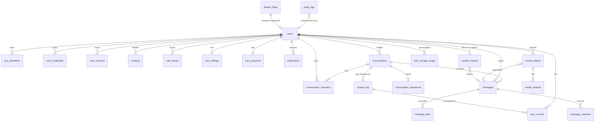
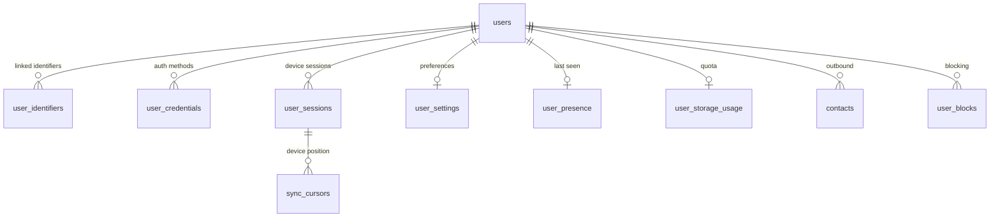
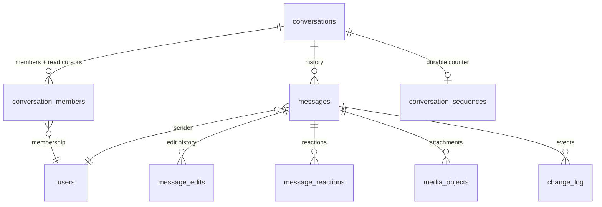
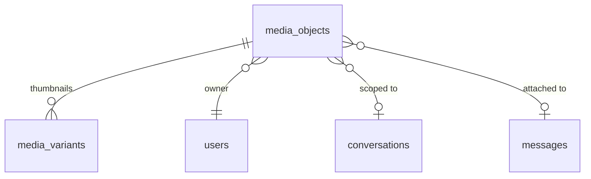
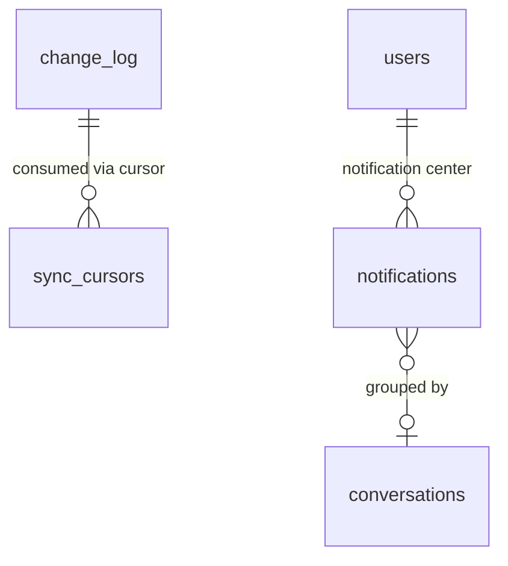

# Messaging Platform — PostgreSQL Database Architecture Blueprint

| | |
|---|---|
| **Document** | Database Architecture Blueprint v1.0 |
| **Status** | Draft for engineering review |
| **Audience** | Backend engineers, DBAs, SRE, DevOps |
| **Source of Truth (in order)** | Finalized Flutter/Material 3 UI/UX → `ARCHITECTURE.md` (system architecture) → this document |
| **Database** | PostgreSQL (single primary + replicas in v1; partition/shared-nothing path documented) |
| **Scope** | Complete logical/physical database design. No SQL, no code, no API specifications |

---

## Table of Contents

1. [Executive Summary](#1-executive-summary)
2. [Design Principles & Global Conventions](#2-design-principles--global-conventions)
3. [Global Entity Relationship Diagram](#3-global-entity-relationship-diagram)
4. [Entity Catalog — Identity & Access](#4-entity-catalog--identity--access)
5. [Entity Catalog — Conversations & Messaging](#5-entity-catalog--conversations--messaging)
6. [Entity Catalog — Media](#6-entity-catalog--media)
7. [Entity Catalog — Receipts, Sync & Search](#7-entity-catalog--receipts-sync--search)
8. [Entity Catalog — Notifications, Quota & Ops](#8-entity-catalog--notifications-quota--ops)
9. [Relationship Catalog](#9-relationship-catalog)
10. [Transaction Boundaries](#10-transaction-boundaries)
11. [Locking Strategy](#11-locking-strategy)
12. [Concurrency Considerations](#12-concurrency-considerations)
13. [Read vs Write Optimization](#13-read-vs-write-optimization)
14. [Query Optimization Recommendations](#14-query-optimization-recommendations)
15. [Expected Growth of Major Tables](#15-expected-growth-of-major-tables)
16. [Partitioning Recommendations](#16-partitioning-recommendations)
17. [Archiving Strategy](#17-archiving-strategy)
18. [Data Retention Policy](#18-data-retention-policy)
19. [Backup Considerations](#19-backup-considerations)
20. [Database Versioning & Migration Strategy](#20-database-versioning--migration-strategy)
21. [Disaster Recovery Considerations](#21-disaster-recovery-considerations)
22. [Future Migration Path for Horizontal Scaling](#22-future-migration-path-for-horizontal-scaling)
23. [Appendix A — ERD by Domain](#appendix-a)
24. [Appendix B — Key Decision Rationales](#appendix-b)

---

## 1. Executive Summary

This document specifies the PostgreSQL data model that underpins the finalized system architecture. Every table, index, constraint, and partitioning decision here exists to serve a screen or behavior in the finalized UI/UX through the modules defined in `ARCHITECTURE.md`.

The database is designed around **one dominant access pattern**: *"given a conversation, read a window of messages ordered by sequence, newest first, with keyset pagination."* Every other pattern (chat list, unread counts, read receipts, multi-device sync, search, media) is a projection or optimization of that core fact. This single insight drives the highest-impact decisions:

1. **Messages are keyed by `(conversation_id, sequence)`** — a composite primary key that clusters each conversation's rows together, mirroring the model used by Discord's message store (partition key = channel, clustering key = message id). It gives O(1)-ish, append-friendly per-conversation range scans and directly enables keyset pagination (research: `LIMIT/OFFSET` degrades to O(n) on deep pages; keyset cursors stay O(log n)).
2. **Read & delivery receipts are cursors, not rows.** Per `(conversation, member)` we store `last_read_seq` and `last_delivered_seq`. Industry practice (TRTC/Sendbird guidance) confirms this: a per-message × per-member receipt row would explode in large groups; a monotonic cursor is idempotent, tiny, and derives "read by N" trivially.
3. **Unread counts are derived, never stored.** `unread = conversation.last_sequence - member.last_read_seq`. Stored counters drift; derived counters cannot.
4. **A transactional outbox / change log** guarantees every durable domain event survives to the sync, notification, and search consumers even if Redis is down — this is the same pattern the architecture designates as the future microservice seam (§37.4), so it is built in from day one.
5. **IDs are 64-bit snowflake-style BIGINTs** generated by the `idgen` module (per `ARCHITECTURE.md`), giving global uniqueness without coordination, time-ordering, and future shard-friendliness. Message ordering uses per-conversation sequences from the Redis counter (persisted to PostgreSQL), as specified by the architecture.
6. **Partitioning starts when warranted** (~100–500M message rows) with `PARTITION BY HASH(conversation_id)` — the only partitioning strategy compatible with the composite PK and the conversation-scoped access pattern, and the natural precursor to horizontal sharding (§22).

The model is deliberately **simple enough for the first production release**: 20 tables, no exotic types beyond `jsonb` and `tsvector`, all correctness enforced at the constraint level.

---

## 2. Design Principles & Global Conventions

### 2.1 Principles

| # | Principle | Implication |
|---|---|---|
| 1 | **UI/UX is the contract** | Every table exists to serve a finalized screen; no orphan tables |
| 2 | **Correctness at the constraint level** | PK/UNIQUE/FK/CHECK do the work; the app can't write invalid state |
| 3 | **Conversation locality** | Message-family tables cluster by conversation; nothing scatters a conversation's rows |
| 4 | **Cursors, not counters** | Receipts and sync are monotonic cursors — idempotent, mergeable, drift-proof |
| 5 | **Derive before you store** | Compute unread/read-by from cursors; denormalize only when reads prove the cost |
| 6 | **Durable events** | Every user-visible state change writes an outbox row in the same transaction |
| 7 | **Writes on primary, reads on replicas** | Replicas serve search, sync, chat-list, reports; strong reads stay on primary |
| 8 | **Append-friendly** | Hot tables are insert-heavy; index design favors appends over random updates |
| 9 | **Operable** | Retention, archiving, and purge are scheduled jobs with defined RPO/RTO |

### 2.2 ID Generation Strategy

- **Entity IDs:** 64-bit signed `BIGINT`, snowflake-style (timestamp-bits ‖ worker-bits ‖ sequence-bits), produced by the `idgen` module. Uniquely: (a) globally unique without any central allocator (multiple API instances, later multiple shards, never collide), (b) time-ordered so PK appends are sequential (page-split friendly), (c) sortable by creation time, (d) compact (8 bytes) vs 16-byte UUID → smaller indexes, more index rows per page.
- **Message ordering keys:** per-conversation `sequence BIGINT` from the Redis counter (atomic `INCR` per conversation), persisted to `conversation_sequences` (see §4). The sequence is the canonical ordering key; the Redis counter is a cache of the persisted value.
- **Global sync order:** a single shared PostgreSQL sequence backs `messages.global_seq` and `change_log.global_seq`, so a device can maintain **one** monotonic cursor across all change types (see §7).
- **Never use `SERIAL`/`IDENTITY` as the application-facing PK for user-scale entities** — it leaks volume, is per-table, and breaks sharding. A DB sequence is used only for the global ordering cursors where strict monotonicity is required.

### 2.3 Timestamp Strategy

- All timestamps are `timestamptz` (UTC), never `timestamp`/`timestamp without time zone`, so the DB stores an instant, not a wall-clock ambiguity. Clients render in their local zone (Flutter/Material 3 `localizations`).
- `created_at` and `updated_at` exist on **every** table. `created_at` = `DEFAULT now()`; `updated_at` maintained by a single shared trigger function so it is never forgotten. Server time only — client clocks are never trusted for ordering.
- Realtime/ordering timestamps are informational; **sequence numbers are the ordering authority**, so clock skew between hosts can never corrupt message order.

### 2.4 Audit Fields

- Standard audit columns: `created_at`, `updated_at`, and — where mutation-by-user matters — `created_by` / `updated_by` (nullable FK to `users.id`).
- A `version BIGINT DEFAULT 1` optimistic-lock column on user-mutable rows (profiles, settings, conversation settings, media metadata) for compare-and-set semantics.
- Privileged/security events go to the append-only `audit_logs` table (§8), not as columns on domain rows.

### 2.5 Soft Delete Strategy

One consistent policy across the schema:

| Lifecycle stage | Mechanism |
|---|---|
| **Active** | normal row |
| **Soft-deleted** | `deleted_at timestamptz NULL`, plus a `state`/`status` column where the UI shows intermediate states (pending/ready/quarantined/deleted) |
| **Hard-purged** | background worker removes rows after the retention/grace window (§17, §18) |

- `messages`: `deleted_at` (delete-for-all) + `deleted_by`; delete-for-self is a client-side tombstone in v1 (per `ARCHITECTURE.md` §33.4), with `messages_hidden` reserved for server-side cross-device delete-for-self in a later release.
- `users`: `account_state` (active/suspended/deleted) + `deleted_at`; GDPR-style erase is a hard-purge worker (§18).
- All queries on user-facing data filter on soft-delete flags via **partial indexes** so the hot read paths never scan dead rows.

### 2.6 Constraint, Enum & Type Conventions

- Enums are enforced with **CHECK constraints** on a `text` column (not Postgres `ENUM` types): adding a value later is a cheap constraint drop/re-add instead of an `ALTER TYPE`, which would lock and rewrite. Values are documented in each table.
- `jsonb` is used where the architecture explicitly stores flexible payloads (message attachments envelope, media variants, notification payload, outbox event envelope, user settings). `jsonb` is indexable via GIN when we ever need to query inside it.
- Text search uses PostgreSQL FTS (`tsvector` + GIN) plus the `pg_trgm` extension for substring/prefix matching on usernames — consistent with `ARCHITECTURE.md` §23 (PostgreSQL FTS in v1).
- All FK columns are `BIGINT NOT NULL` unless semantically nullable; FK actions are `ON DELETE RESTRICT` (protect history) with application-level soft deletes, except child-of-child rows that are explicitly cascading (e.g., `media_variants` under `media_objects`).
- Identifier columns that are user-supplied or third-party-supplied (email, phone, username, invite tokens) carry `UNIQUE` constraints; emails/phones are stored normalized (lowercase email, E.164 phone) so uniqueness is exact.

### 2.7 Naming & Layout

- `snake_case`; tables plural; join tables named `<left>_<right>`; index names `idx_<table>_<columns>`.
- Single `public` schema in v1. Domains are not split into schemas yet — the DDD module boundaries in `ARCHITECTURE.md` are enforced at the Go package level; schema-per-domain arrives only with the microservice split (§22), where the transactional-outbox pattern (§10) keeps cross-schema consistency.

### 2.8 Extension Policy

Allowed extensions (v1): `pg_trgm` (username/display-name substring search), `pg_stat_statements` (query telemetry, `ARCHITECTURE.md` §29). Extensions `btree_gin`, `uuid-ossp` are not needed (we don't use UUID PKs). Any new extension requires DBA review and a documented ADR.

---

## 3. Global Entity Relationship Diagram



**Reading the diagram:** solid relationships are enforced FKs; the reader should treat every join as an answered access pattern. The three "hubs" are `users`, `conversations`, and `messages` — consistent with the architecture's `user`, `chat`, and `message` modules.

---

## 4. Entity Catalog — Identity & Access

> Conventions applied to every table below (and throughout): `created_at`/`updated_at` present; soft-delete via `deleted_at` where relevant; IDs snowflake `BIGINT`; enums via `CHECK`.

### 4.1 `users`

- **Purpose:** one row per account — the identity root aggregate of the `user` module.
- **Responsibilities:** stable account identity, profile data rendered in chat list, conversation headers, profile screens, and search; account state machine (active/suspended/deleted); account-level flags.
- **Relationships:** 1—N `user_identifiers`, `user_credentials`, `user_sessions`, `contacts` (outbound), `user_blocks`; 1—1 `user_settings`, `user_presence`, `user_storage_usage`; N—M with `conversations` through `conversation_members`; 1—N `messages`, `media_objects`, `notifications`.
- **Columns:**

| Column | Type | Constraints / Notes |
|---|---|---|
| `id` | BIGINT | **PK**; snowflake from `idgen` |
| `username` | text | `UNIQUE` partial (where `deleted_at IS NULL`); lowercase, immutable after creation |
| `display_name` | text | NOT NULL; shown in UI everywhere |
| `avatar_media_id` | BIGINT | nullable FK → `media_objects.id`; profile photo |
| `bio` | text | nullable; profile screen |
| `phone_number` | text | nullable; `UNIQUE`; normalized E.164 |
| `email` | text | nullable; `UNIQUE`; normalized lowercase |
| `account_state` | text | `CHECK IN ('active','suspended','deleted')`; `DEFAULT 'active'` |
| `primary_identifier` | text | `CHECK IN ('phone','email','username')`; default 'phone' |
| `created_at` | timestamptz | NOT NULL, `DEFAULT now()` |
| `updated_at` | timestamptz | NOT NULL, `DEFAULT now()` (trigger) |
| `deleted_at` | timestamptz | nullable; soft delete |

- **Indexes:** unique on `username` (partial), `phone_number`, `email`; supporting index on `id` (PK). Composite search index `(display_name, username)` via `pg_trgm` GIN (§7).
- **FTS requirements:** `pg_trgm` GIN over `display_name` + `username` for the "find contact / search people" screen; full-text ranking by prefix.
- **Soft delete:** `account_state='deleted'` + `deleted_at`; retention → hard-purge worker (§18).
- **Normalization decisions:** phone/email/username are separate unique columns (not one `identifiers` table) because the auth flows treat them as distinct, and the UI never shows a combined list; `user_identifiers` exists (4.2) only for *additional* identifiers a user links later (e.g., add an email after phone signup).
- **Denormalization decisions:** `display_name` lives here; avatars are FK references, not copies.
- **Partitioning:** none in v1 (≈1–2 rows per user; millions of rows are still one fast table). Sharding: by `users.id` hash when account data exceeds single-node capacity (§22).
- **Data retention:** accounts are never auto-deleted; suspended/deleted retained per legal policy, hard-erased via purge worker.
- **Backup:** covered by global strategy (§19).

### 4.2 `user_identifiers`

- **Purpose:** additional login/link identifiers beyond the primary (add-email, add-phone flows in the finalized auth UI).
- **Responsibilities:** verification state per identifier; prevent an identifier being reused across accounts.
- **Columns:**

| Column | Type | Constraints / Notes |
|---|---|---|
| `id` | BIGINT | **PK** |
| `user_id` | BIGINT | **FK** → `users.id`; NOT NULL |
| `type` | text | `CHECK IN ('phone','email')` |
| `value` | text | NOT NULL; normalized |
| `verified_at` | timestamptz | nullable |
| `created_at` / `updated_at` | timestamptz | standard |

- **Constraints:** `UNIQUE (type, value)` — an identifier can belong to exactly one account (prevents account takeover by identifier reuse). Composite FK `(user_id)` indexed.
- **Relationships:** N—1 `users`. **Why exists:** the UI lets users add identifiers after signup; keeping them separate from `users` avoids widening the hot account row and lets verification be tracked per identifier.
- **Retention:** follows user lifecycle; purged with the account.

### 4.3 `user_credentials`

- **Purpose:** authentication material per login method — password hash, passkey (WebAuthn), or OAuth credential. Serves the `auth` module's "verify credentials" path.
- **Responsibilities:** store only verifiable/derived material (never plaintext), support multiple methods per account, support method revocation.
- **Columns:**

| Column | Type | Constraints / Notes |
|---|---|---|
| `id` | BIGINT | **PK** |
| `user_id` | BIGINT | **FK** → `users.id`; NOT NULL |
| `method` | text | `CHECK IN ('password','passkey','oauth')` |
| `provider` | text | nullable; for `oauth` (google/apple) |
| `credential_data` | jsonb | NOT NULL; e.g., bcrypt hash for password, WebAuthn public key + counter for passkey |
| `revoked_at` | timestamptz | nullable; method disabled |
| `created_at` / `updated_at` | timestamptz | standard |

- **Constraints:** `UNIQUE (user_id, method, provider)` — one password, N passkeys (different credential ids), one per OAuth provider.
- **Relationships:** N—1 `users`. **Why exists:** separates auth material from profile data so security-sensitive columns are isolated, easier to restrict via row-level permissions, and never leaked in profile reads.
- **Retention:** `revoked_at` rows retained for security forensics; purged with account.

### 4.4 `user_sessions`

- **Purpose:** the session registry — one row per device session. Serves `session` module (multi-device, §34 of architecture), the WS gateway binding, and push delivery targeting.
- **Responsibilities:** token family tracking (refresh-token rotation), device identity, push token for notifications, last-seen-per-device, revocation state.
- **Columns:**

| Column | Type | Constraints / Notes |
|---|---|---|
| `id` | BIGINT | **PK**; session id |
| `user_id` | BIGINT | **FK** → `users.id`; NOT NULL |
| `device_id` | text | NOT NULL; client-generated per device |
| `device_name` | text | nullable; UI "Manage devices" screen |
| `platform` | text | nullable (`ios`/`android`/`web`) |
| `app_version` | text | nullable |
| `push_token` | text | nullable; provider FCM/APNs/Web |
| `refresh_token_family` | BIGINT | NOT NULL `DEFAULT 0`; increments on rotation; old family invalidates |
| `ip_address` | inet | nullable; audit |
| `user_agent` | text | nullable |
| `last_active_at` | timestamptz | NOT NULL `DEFAULT now()` |
| `state` | text | `CHECK IN ('active','revoked','expired','suspended')`; `DEFAULT 'active'` |
| `created_at` / `updated_at` | timestamptz | standard |

- **Indexes:** `UNIQUE (user_id, device_id)` — one active session slot per device; index `(user_id, state)` for device management; index `(push_token)` for notification targeting.
- **Constraints:** `CHECK (state <> 'active' OR last_active_at IS NOT NULL)`.
- **Relationships:** N—1 `users`. **Why exists:** multi-device sign-in and per-device revocation (architecture §11) require a queryable registry that outlives any Redis cache.
- **Normalization:** device info is here, not on `users`, because a user has many devices.
- **Retention:** revoked/expired rows archived after 90 days; push tokens pruned on provider `Unregistered` callbacks.

### 4.5 `user_settings`

- **Purpose:** 1:1 account preferences — privacy tiers (who sees presence), global notification defaults, quiet hours, "show preview", theme/font (client-side but synced), blocked-by-identity policies.
- **Columns:**

| Column | Type | Constraints / Notes |
|---|---|---|
| `user_id` | BIGINT | **PK** + **FK** → `users.id` |
| `last_seen_privacy` | text | `CHECK IN ('everyone','contacts','nobody')`; `DEFAULT 'everyone'` |
| `read_receipts_enabled` | boolean | `DEFAULT true` |
| `typing_indicator_enabled` | boolean | `DEFAULT true` |
| `notifications_enabled` | boolean | `DEFAULT true` |
| `quiet_hours_start` / `quiet_hours_end` | time | nullable (UTC) |
| `show_message_preview` | boolean | `DEFAULT true` |
| `locale` | text | nullable; Material 3 localization |
| `version` | BIGINT | NOT NULL `DEFAULT 1`; optimistic locking |
| `created_at` / `updated_at` | timestamptz | standard |

- **Why exists:** the profile/settings screen persists these values and they gate realtime/notification behavior server-side.
- **Relationships:** 1—1 `users`. **Concurrency:** updated via `version` compare-and-set; conflicts resolved by "server wins" policy.
- **Partitioning/sharding:** co-located with `users` shard (§22).

### 4.6 `user_presence`

- **Purpose:** the durable last-seen snapshot for the presence module (`ARCHITECTURE.md` §15). Redis owns the *live* online/offline state and typing; this table persists the periodic flush ("last seen 5 minutes ago / yesterday") so presence survives Redis restarts and is available to read replicas.
- **Responsibilities:** persist last-online/offline transitions, last-seen timestamp, coarse presence state for privacy-filtered reads.
- **Columns:**

| Column | Type | Constraints / Notes |
|---|---|---|
| `user_id` | BIGINT | **PK** + **FK** → `users.id` |
| `state` | text | `CHECK IN ('online','offline','away')`; `DEFAULT 'offline'` |
| `last_seen_at` | timestamptz | NOT NULL `DEFAULT now()` |
| `last_online_at` | timestamptz | nullable |
| `updated_at` | timestamptz | standard |

- **Indexes:** PK only. **Why a separate narrow table:** presence writes are high-frequency and must never contend with `users` profile reads (HOT-page isolation, §9.1); every write is an idempotent upsert (`ON CONFLICT ... DO UPDATE`) so concurrent flushes from multiple WS gateways can never lose a state.
- **Normalization:** presence state is 1—1 with a user; separated from `users` purely for write-path isolation. **Partitioning/sharding:** co-located with `users` shard.

### 4.7 `contacts`

- **Purpose:** the user's contact list — join table for the users↔users many-to-many social graph. Serves the "Contacts" screen, chat-start, and presence/notification targeting.
- **Columns:**

| Column | Type | Constraints / Notes |
|---|---|---|
| `user_id` | BIGINT | **PK part** + **FK** → `users.id` (owner) |
| `contact_user_id` | BIGINT | **PK part** + **FK** → `users.id` (the contact) |
| `display_name_override` | text | nullable; UI shows contact's name or override |
| `created_at` | timestamptz | standard |

- **Constraints:** `CHECK (user_id <> contact_user_id)` — no self-contact.
- **Indexes:** composite PK `(user_id, contact_user_id)`; secondary index `(contact_user_id)` for reverse lookups ("who has me as a contact?").
- **Why exists:** N—M between users; the finalized UI builds chat from contacts. **Normalization:** this is a pure associative entity (3NF); no denormalization needed because contact reads are PK-point lookups.
- **Note:** the raw phone-number address book lives outside the DB (client-side import + hash-matching service) to keep contact sync cheap; only matched `users` become rows here.

### 4.8 `user_blocks`

- **Purpose:** blocking relationships — a blocked user cannot message, call, or appear in presence/notification targets.
- **Columns:**

| Column | Type | Constraints / Notes |
|---|---|---|
| `blocker_user_id` | BIGINT | **PK part** + **FK** → `users.id` |
| `blocked_user_id` | BIGINT | **PK part** + **FK** → `users.id` |
| `created_at` | timestamptz | standard |

- **Indexes:** composite PK; index `(blocked_user_id)` for enforcement checks.
- **Why exists:** authorization filter used by message send, notification, and presence paths. Kept separate from `contacts` so blocking is orthogonal to the contact graph.

---
## 5. Entity Catalog — Conversations & Messaging

### 5.1 `conversations`

- **Purpose:** the aggregate root of the `chat` module — one row per 1:1 or group conversation. Serves chat list, conversation header, group settings, and read-state aggregation.
- **Responsibilities:** conversation identity and type, group metadata (title, photo, description), last-activity ordering (chat list), system-level settings, retention policy hook.
- **Columns:**

| Column | Type | Constraints / Notes |
|---|---|---|
| `id` | BIGINT | **PK**; snowflake |
| `type` | text | `CHECK IN ('direct','group')`; direct = 1:1, group = multi-party |
| `title` | text | nullable for direct (derived from counterpart), set for groups |
| `photo_media_id` | BIGINT | nullable FK → `media_objects.id`; group photo / DM cover |
| `description` | text | nullable; group settings screen |
| `created_by` | BIGINT | **FK** → `users.id`; NOT NULL |
| `last_message_at` | timestamptz | nullable; chat-list ordering key |
| `last_message_seq` | BIGINT | nullable; last message sequence, used for unread derivation |
| `last_message_snippet` | text | nullable; truncated preview (≤80 chars) for chat list |
| `last_sender_id` | BIGINT | nullable FK → `users.id`; chat list preview authorship |
| `settings` | jsonb | nullable; group-only extras (e.g., slow-mode, member-approval flags) |
| `retention_days` | int | nullable; group-level auto-delete override (telegram-style) |
| `created_at` / `updated_at` | timestamptz | standard |
| `deleted_at` | timestamptz | nullable; conversation soft delete |

- **Indexes:** PK `(id)`; `UNIQUE` partial where relevant for 1:1 dedup is *not* used (1:1 uniqueness is enforced in `conversation_members`); index `(last_message_at)` is a supporting index for the chat list feed (`ORDER BY last_message_at DESC`).
- **Check constraints:** `CHECK (type='direct' OR title IS NOT NULL)` — direct chats derive titles; `CHECK (last_message_at IS NULL OR last_message_seq IS NOT NULL)`.
- **Normalization:** conversation attributes are owned here; per-user attributes (mute, pin, archive) live in `conversation_members` (5.3). **Denormalization:** `last_message_at`/`last_message_seq`/`last_message_snippet`/`last_sender_id` are deliberately denormalized to serve the chat list with a single indexed query per user — this is the same tradeoff the industry's chat-list patterns call out (one extra write per message for a one-index chat-list read). They are updated in the same transaction that inserts the message (§10), so they never drift.
- **Partitioning:** none (row count scales with conversations, not messages — millions of rows are fine unpartitioned).
- **Soft delete:** `deleted_at`; a deleted group leaves `conversation_members` rows with `left_at` for audit.
- **Retention:** conversation rows live indefinitely unless deleted or a group `retention_days` expires.

### 5.2 `conversation_members`

- **Purpose:** the join table for users↔conversations and **the home of read/delivery receipts cursors, per-user conversation state, and group roles**. This is one of the two most important tables in the system (the other is `messages`).
- **Responsibilities:** membership & role, per-user read cursor, per-user delivered cursor, per-user settings (mute/pin/archive), group invite state, leave/archive lifecycle.
- **Columns:**

| Column | Type | Constraints / Notes |
|---|---|---|
| `conversation_id` | BIGINT | **PK part** + **FK** → `conversations.id` |
| `user_id` | BIGINT | **PK part** + **FK** → `users.id` |
| `role` | text | `CHECK IN ('owner','admin','member')`; `DEFAULT 'member'` |
| `last_read_seq` | BIGINT | NOT NULL `DEFAULT 0`; read watermark (monotonic cursor) |
| `last_delivered_seq` | BIGINT | NOT NULL `DEFAULT 0`; delivery watermark |
| `last_read_at` | timestamptz | nullable |
| `muted_until` | timestamptz | nullable; per-conversation mute override |
| `pinned_at` | timestamptz | nullable; pinned conversation in chat list |
| `archived_at` | timestamptz | nullable; archived chat state |
| `joined_at` | timestamptz | NOT NULL `DEFAULT now()` |
| `left_at` | timestamptz | nullable; left/removed membership |
| `invite_state` | text | `CHECK IN ('accepted','invited','requested','none')`; `DEFAULT 'accepted'` |

- **Indexes:** composite PK `(conversation_id, user_id)` — supports "list members", "read-by", and per-conversation cursor updates; **composite index `(user_id, conversation_id)`** — supports "my conversations" and chat-list; partial index `(user_id, pinned_at) WHERE pinned_at IS NOT NULL` for pinned sort; partial index `(conversation_id, last_read_seq)` for "who has read up to X" in group read-receipt UI.
- **Constraints:** `CHECK (last_read_seq >= 0)`, `CHECK (last_delivered_seq >= last_read_seq OR last_read_seq = 0)`, `CHECK (archived_at IS NULL OR pinned_at IS NULL)` (archive and pin are mutually exclusive in the UI).
- **Why a cursor here instead of receipt rows:** industry practice (TRTC/Sendbird/Ably guidance) is explicit: per-message × per-member receipt rows explode to N×M rows in groups; a per-member monotonic cursor is idempotent (max-merge), tiny, and derives "read by N", "delivered to N", and unread counts. This matches `ARCHITECTURE.md` §17 ("read up to sequence ... cursor, not per-message rows").
- **Denormalization:** none — every column here is per-user per-conversation state; there is no redundant copy.
- **Partitioning:** none in v1 (≈ members × conversations; large but bounded); when `conversation_members` exceeds ~200M rows, partition by `HASH(conversation_id)` aligned with `messages` (§16).
- **Soft delete / lifecycle:** a removed member sets `left_at` (soft); row is retained for audit and rejoin history.

### 5.3 `messages`

- **Purpose:** the system of record for all message content — text, media references, system events. The single hottest and largest table.
- **Responsibilities:** durable message storage, per-conversation ordering, attachments envelope, reply threading, edit state, delete state, global sync ordering.
- **Columns:**

| Column | Type | Constraints / Notes |
|---|---|---|
| `conversation_id` | BIGINT | **PK part** + **FK** → `conversations.id` |
| `sequence` | BIGINT | **PK part**; per-conversation monotonic (Redis counter, persisted) |
| `id` | BIGINT | **UNIQUE**; snowflake — used by `message_edits`, `message_reactions`, `media_objects`, outbox refs |
| `client_msg_id` | text | nullable; client-generated idempotency key (dedupe guard for retries) |
| `sender_id` | BIGINT | **FK** → `users.id`; NULL for system events |
| `type` | text | `CHECK IN ('text','media','system','reply','forwarded')` |
| `content` | text | nullable; text body (empty for media-only) |
| `attachment_envelope` | jsonb | nullable; list of `media_object_id` refs + captions (UI renders media grid) |
| `reply_to_id` | BIGINT | nullable; FK → `messages.id` (self-referencing across conversation) |
| `forwarded_from_id` | BIGINT | nullable; FK → `messages.id` |
| `edit_count` | int | NOT NULL `DEFAULT 0` |
| `edited_at` | timestamptz | nullable |
| `deleted_at` | timestamptz | nullable; delete-for-all tombstone |
| `deleted_by` | BIGINT | nullable; FK → `users.id` |
| `global_seq` | BIGINT | NOT NULL `DEFAULT nextval(...)`; **UNIQUE** global ordering for multi-device sync |
| `content_tsv` | tsvector | generated for FTS (§7); nullable |
| `created_at` | timestamptz | NOT NULL `DEFAULT now()` |

- **Primary key rationale:** `(conversation_id, sequence)` is a composite PK — it *clusters* each conversation's rows, exactly mirroring Discord's message-store design (partition key = channel, clustering key = message id). Every message read is `WHERE conversation_id = ? AND sequence < ? ORDER BY sequence DESC LIMIT N` (keyset pagination), which is an index range scan on the PK, not a sort. New rows append at the tail of each conversation's index range — insert-friendly, no page churn across conversations.
- **Indexes:** PK `(conversation_id, sequence)`; `UNIQUE (id)`; `UNIQUE (global_seq)`; **partial `UNIQUE (client_msg_id) WHERE client_msg_id IS NOT NULL`** — the exactly-once send guard: a retried send hits `ON CONFLICT DO NOTHING` and returns the existing message (`ARCHITECTURE.md` §13.2). Composite `(conversation_id, sender_id, sequence)` for "messages by a user in a conversation" (search/moderation). Partial `(deleted_at) WHERE deleted_at IS NOT NULL` for purge jobs. GIN on `content_tsv` (§7).
- **Check constraints:** `CHECK (sequence > 0)`, `CHECK (type <> 'text' OR content IS NOT NULL)`, `CHECK (deleted_at IS NULL OR deleted_by IS NOT NULL)`.
- **Relationships:** N—1 `conversations`, N—1 `users`; 1—N `message_edits`, `message_reactions`; 1—N `media_objects` (via envelope refs and `media_objects.message_id`); optional self-FK for replies/forwards.
- **Normalization:** message body is 3NF. **Denormalization:** none for read paths (sequence does the ordering); the *conversation* row's `last_message_*` columns (§5.1) are the intentional denormalization.
- **Partitioning:** **primary partition candidate** — `PARTITION BY HASH(conversation_id)` (16–32 partitions), keyed so a conversation's entire history sits in one partition (§16). This is the single most important scaling decision in the schema.
- **FTS requirements:** `content_tsv` generated column (from `content`) + GIN index (partial: `WHERE deleted_at IS NULL`) for message search (§7).
- **Soft delete:** delete-for-all → `deleted_at` + `deleted_by` (tombstone; content retained for audit until purge). Delete-for-self → client-local in v1.
- **Retention:** messages are kept indefinitely by default; group `retention_days` and content-based retention purge via worker (§18). Archive cold after ~18 months (§17).

### 5.4 `conversation_sequences`

- **Purpose:** durable persistence of the per-conversation sequence counter that the architecture runs in Redis (`ARCHITECTURE.md` §13.2). The Redis counter is the hot path; this table is the recovery ground truth.
- **Columns:**

| Column | Type | Constraints / Notes |
|---|---|---|
| `conversation_id` | BIGINT | **PK** + **FK** → `conversations.id` |
| `last_sequence` | BIGINT | NOT NULL `DEFAULT 0`; last issued sequence |
| `updated_at` | timestamptz | NOT NULL `DEFAULT now()` |

- **Why exists:** after a Redis restart/failover, sequence assignment must continue without gaps or reuse. The receipt worker flushes the Redis counter to this row periodically (debounced); on Redis loss the sequence resumes from `last_sequence`. The `messages` PK `(conversation_id, sequence)` makes gaps harmless, but reuse would corrupt ordering — so this table guarantees monotonicity.
- **Concurrency:** single row per conversation; updates are `SET last_sequence = GREATEST(last_sequence, :next)` (idempotent max-merge), so concurrent flush/insert cannot regress.
- **Indexes:** PK only. **Partitioning:** none (1 row per conversation).

### 5.5 `message_edits`

- **Purpose:** edit history for the "edited" badge and audit of message edits.
- **Columns:**

| Column | Type | Constraints / Notes |
|---|---|---|
| `id` | BIGINT | **PK** |
| `message_id` | BIGINT | **FK** → `messages.id`; NOT NULL |
| `edited_by` | BIGINT | **FK** → `users.id`; NOT NULL |
| `old_content` | text | NOT NULL |
| `edited_at` | timestamptz | NOT NULL `DEFAULT now()` |

- **Indexes:** `(message_id, edited_at DESC)` for "show last edit / badge"; `(edited_at)` for retention purge.
- **Why exists:** the UI shows "edited"; auditing who changed what and keeping the prior body supports compliance and revert.
- **Denormalization:** `messages.edit_count`/`edited_at` are counters derived from this table, updated transactionally — a bounded, deliberate denormalization to avoid `COUNT(*)` on every message render.

### 5.6 `message_reactions`

- **Purpose:** reactions (emoji) per message per user — renders the reaction bar in the finalized conversation UI.
- **Columns:**

| Column | Type | Constraints / Notes |
|---|---|---|
| `id` | BIGINT | **PK** |
| `message_id` | BIGINT | **FK** → `messages.id`; NOT NULL |
| `user_id` | BIGINT | **FK** → `users.id`; NOT NULL |
| `emoji` | text | NOT NULL; codepoint string |
| `created_at` | timestamptz | `DEFAULT now()` |

- **Constraints:** `UNIQUE (message_id, user_id, emoji)` — a user reacts once per emoji; a second tap removes (app issues delete, or upsert semantics).
- **Indexes:** `(message_id, emoji)` for "aggregate reactions per message" (counts per emoji, rendered in UI); `(message_id, user_id)` for the user's own reaction state.
- **Why exists:** N—M users↔messages via emoji; reaction count is derived by `GROUP BY message_id, emoji` — never stored (counts drift; derived is correct).
- **Partitioning:** if it grows large, partition by `HASH(message_id)` or align with `messages` — reactions are read together with the message window.

### 5.7 `messages_hidden` (reserved / v1.1)

- **Purpose (future):** server-side delete-for-self so multi-device sync keeps hidden state consistent across devices (v1 relies on client-local tombstones per `ARCHITECTURE.md` §33.4).
- **Design sketch:** PK `(message_id, user_id)`; rows mean "hidden for this user only". Not created in v1; noted here so the migration is additive-only and the eventual table is a pure insert.

---
## 6. Entity Catalog — Media

### 6.1 `media_objects`

- **Purpose:** metadata registry for every media object stored through the storage abstraction (`ARCHITECTURE.md` §19–§21). The filesystem/object store holds bytes; this table holds *everything else* — this split is what makes the local→S3/R2 migration (§36 of architecture) a pure adapter change.
- **Responsibilities:** storage key(s), content fingerprinting/dedup, state machine (pending→ready→deleted), ownership and conversation scoping (for access control), quota accounting input, thumbnail variant metadata.
- **Columns:**

| Column | Type | Constraints / Notes |
|---|---|---|
| `id` | BIGINT | **PK**; snowflake `objectId` from `ARCHITECTURE.md` §20 |
| `owner_user_id` | BIGINT | **FK** → `users.id`; uploader (quota accounting) |
| `conversation_id` | BIGINT | nullable **FK** → `conversations.id`; access-control scope (members only) |
| `message_id` | BIGINT | nullable **FK** → `messages.id`; message attachment linkage |
| `kind` | text | `CHECK IN ('image','video','voice','document','sticker','avatar','group_photo')` |
| `mime_type` | text | NOT NULL |
| `size_bytes` | BIGINT | NOT NULL `CHECK (size_bytes >= 0)` |
| `storage_key` | text | NOT NULL; opaque key resolved by storage adapter (filesystem path today, object key tomorrow) |
| `content_hash` | text | NOT NULL; SHA-256 — dedupe fingerprint |
| `sha256` | text | NOT NULL; integrity checksum |
| `width` / `height` | int | nullable; image/video |
| `duration_ms` | int | nullable; video/voice |
| `state` | text | `CHECK IN ('pending','ready','quarantined','deleted')`; `DEFAULT 'pending'` |
| `retention_at` | timestamptz | nullable; auto-destruct / retention expiry |
| `variants` | jsonb | nullable; `{preview:key, small:key, poster:key}` → `media_variants` denormalized snapshot |
| `version` | BIGINT | NOT NULL `DEFAULT 1`; optimistic lock for state transitions |
| `created_at` / `updated_at` | timestamptz | standard |
| `deleted_at` | timestamptz | nullable |

- **Indexes:** PK; `UNIQUE (content_hash) WHERE state = 'ready'` — partial unique enables content dedup: uploading the same bytes (forwarded media) with `ON CONFLICT DO NOTHING` returns the existing row, so identical content is stored once (`ARCHITECTURE.md` §19.4); `(conversation_id, id)` for media grid/attachments queries; `(owner_user_id, created_at)` for quota & "my media"; partial `(state, created_at)` for the processing worker; `(retention_at)` for expiry purge; `(storage_key)` unique for reverse mapping during storage migration.
- **Check constraints:** `CHECK (size_bytes >= 0)`, `CHECK (deleted_at IS NULL OR state = 'deleted')`.
- **Relationships:** N—1 `users` (owner); N—1 `conversations` (scope); N—1 `messages` (attachment); 1—N `media_variants`.
- **Normalization:** object metadata is fully normalized; variant keys are also normalized into `media_variants` (6.2) with a `variants` jsonb *denormalized copy* to serve signed-URL issuance without a join.
- **Partitioning:** none in v1 (media metadata is small relative to message count); if it grows, partition by `HASH(conversation_id)` for the group-photo/media-grid pattern.
- **Soft delete:** state→deleted + `deleted_at`; bytes purged by cleanup worker after grace window (§17/§18). Storage quota flows from `size_bytes` of non-deleted rows (§8.3).

### 6.2 `media_variants`

- **Purpose:** one row per derived thumbnail/variant (preview, small, poster) — generated by the thumbnail worker.
- **Columns:**

| Column | Type | Constraints / Notes |
|---|---|---|
| `id` | BIGINT | **PK** |
| `media_id` | BIGINT | **FK** → `media_objects.id`; NOT NULL |
| `variant_type` | text | `CHECK IN ('preview','small','poster')` |
| `storage_key` | text | NOT NULL |
| `size_bytes` | BIGINT | NOT NULL |
| `width` / `height` | int | nullable |
| `created_at` | timestamptz | standard |

- **Constraints:** `UNIQUE (media_id, variant_type)` — one variant of each kind per object.
- **Why exists:** the UI needs thumbnail sizes at render time; separate rows keep `media_objects` lean and let cleanup iterate variants independently. **Denormalization:** the `variants` jsonb on `media_objects` is a bounded copy for the hot URL path.

---

## 7. Entity Catalog — Receipts, Sync & Search

> Design principle honored here: **receipts and sync are cursors.** Read/delivery cursors live on `conversation_members` (§5.2). This section adds the durable event log that powers multi-device sync, offline reconciliation, notifications, and search.

### 7.1 `change_log` (transactional outbox / sync feed)

- **Purpose:** the single durable, ordered log of every user-visible domain change. Writes to this table happen **in the same transaction** as the domain write (outbox pattern, `ARCHITECTURE.md` §37.4). Consumers (sync engine, notification worker, search indexer, analytics) read it in global order and publish to Redis as the realtime dispatcher requires.
- **Responsibilities:** exactly-once-ish durable event capture, global ordering cursor, decoupling of writes from consumers, replay/backfill source, the future microservice seam.
- **Columns:**

| Column | Type | Constraints / Notes |
|---|---|---|
| `global_seq` | BIGINT | **PK**; `nextval` from the shared sequence (§2.2) |
| `event_type` | text | `CHECK IN ('message.created','message.edited','message.deleted','message.reaction','receipt.read','receipt.delivered','conversation.created','conversation.membership','conversation.settings','user.updated','media.ready')` |
| `conversation_id` | BIGINT | nullable **FK** → `conversations.id` |
| `entity_id` | BIGINT | nullable; target entity id (message.id, conversation.id, user.id, media.id) |
| `actor_user_id` | BIGINT | nullable **FK** → `users.id`; who caused the event |
| `affected_user_ids` | BIGINT[] | nullable; who must see this event (fan-out target list for sync/realtime) — denormalized for efficiency |
| `payload` | jsonb | NOT NULL; full event envelope (rendered data for sync without re-query) |
| `created_at` | timestamptz | NOT NULL `DEFAULT now()` |

- **Indexes:** PK `(global_seq)` (already ordered — tail reads are append scans); `(entity_id, event_type)` for per-entity history/replay; `(conversation_id, global_seq)` for per-conversation sync; GIN `(affected_user_ids)` for "what changed for this user" scans. The **keyset sync read** is `WHERE global_seq > :cursor ORDER BY global_seq LIMIT n` — index-only, tail-append friendly.
- **Why exists:** without it, multi-device sync (§34 of architecture) and offline backfill (§33) would need ad-hoc joins across many tables. With it, a device's cursor is a single `BIGINT`; "everything new for me" is one ordered scan joined against `affected_user_ids` (or conversation membership).
- **Normalization vs denormalization:** the `payload` jsonb is a *deliberate denormalization* — the event is self-contained so sync never re-queries domain tables per event; `affected_user_ids` is a *bounded denormalization* to avoid scanning membership per event. Both are bounded in size and pruned (§18).
- **Partitioning:** partition by `RANGE (created_at)` (monthly) — this log is append-only, time-pruned, and old partitions are archived wholesale (§17).
- **Retention:** hot 30 days; cold archive 18 months; analytics retains as needed.

### 7.2 `sync_cursors`

- **Purpose:** per-device sync position — where each session left off in `change_log`.
- **Columns:**

| Column | Type | Constraints / Notes |
|---|---|---|
| `session_id` | BIGINT | **PK** + **FK** → `user_sessions.id` |
| `user_id` | BIGINT | **FK** → `users.id`; NOT NULL (denormalized for shard affinity) |
| `last_global_seq` | BIGINT | NOT NULL `DEFAULT 0` |
| `updated_at` | timestamptz | standard |

- **Indexes:** PK `(session_id)`; `(user_id, updated_at)` for "devices that fell behind → catch-up".
- **Why exists:** each device tracks its own cursor so it can delta-sync after offline/reconnect (§34); cursor is monotonic, so `MAX`-merge is the only write.
- **Concurrency:** idempotent `SET last_global_seq = GREATEST(...)`.
- **Partitioning:** none (1 row per session).

### 7.3 Search Indexing (projection, not a separate table)

- **Messages FTS:** `messages.content_tsv` (generated `tsvector` column) + partial GIN index `WHERE deleted_at IS NULL`. Queries are **scoped** to the user's conversations via a join to `conversation_members` (membership filter) — never global search, matching `ARCHITECTURE.md` §23.3.
- **People search:** `pg_trgm` GIN indexes on `users(display_name)` and `users(username)` for substring/prefix matching.
- **Media search:** searchable via `media_objects` columns (kind, owner, conversation, created_at) filtered to the user's conversations.
- **Why not a separate search table in v1:** `ARCHITECTURE.md` §23.2 commits to PostgreSQL FTS in v1; the `change_log` event stream is the future feeder to a dedicated engine (Elasticsearch/OpenSearch/Meilisearch) without schema change on the write side.

---

## 8. Entity Catalog — Notifications, Quota & Ops

### 8.1 `notifications`

- **Purpose:** the in-app notification center and the durable record behind push fan-out (`ARCHITECTURE.md` §22). One row per delivered notification per user.
- **Columns:**

| Column | Type | Constraints / Notes |
|---|---|---|
| `id` | BIGINT | **PK** |
| `user_id` | BIGINT | **FK** → `users.id`; NOT NULL |
| `type` | text | `CHECK IN ('message','mention','group','system','call','security')` |
| `title` | text | nullable |
| `body` | text | nullable; preview (respects `show_message_preview`) |
| `payload` | jsonb | NOT NULL; deep-link context (conversation_id, message_seq) |
| `conversation_id` | BIGINT | nullable FK → `conversations.id`; grouping key for "N new messages in X" |
| `read_at` | timestamptz | nullable; in-app read state |
| `channel` | text | `CHECK IN ('push','in_app','both')`; delivery route used |
| `delivery_state` | text | `CHECK IN ('pending','sent','delivered','failed')`; `DEFAULT 'pending'` |
| `created_at` | timestamptz | standard |

- **Indexes:** `(user_id, read_at)` partial `WHERE read_at IS NULL` for the unread-badge query; `(user_id, created_at DESC)` for the notification list screen; `(conversation_id, user_id, created_at)` for grouping ("3 new messages in Chat A").
- **Why exists:** badges, notification list, and push dedup all need a durable record; badge counts are derived as `COUNT(*) WHERE read_at IS NULL`, never stored.
- **Partitioning:** by `RANGE (created_at)` monthly; old notifications pruned after 90 days (§18).

### 8.2 `content_reports`

- **Purpose:** moderation/report flow (`ARCHITECTURE.md` §30.3) — users report messages or users; moderation queue consumes this.
- **Columns:**

| Column | Type | Constraints / Notes |
|---|---|---|
| `id` | BIGINT | **PK** |
| `reporter_user_id` | BIGINT | **FK** → `users.id`; NOT NULL |
| `target_user_id` | BIGINT | **FK** → `users.id`; nullable |
| `message_id` | BIGINT | **FK** → `messages.id`; nullable |
| `reason` | text | NOT NULL |
| `status` | text | `CHECK IN ('open','reviewing','resolved','dismissed')`; `DEFAULT 'open'` |
| `moderator_user_id` | BIGINT | nullable FK → `users.id` |
| `created_at` / `updated_at` | timestamptz | standard |

- **Indexes:** `(status, created_at)` for the moderation queue; `(target_user_id)` for repeat-offender analytics.
- **Why exists:** abuse management is a hard requirement for a public messaging platform.

### 8.3 `user_storage_usage`

- **Purpose:** quota accounting (`ARCHITECTURE.md` §6.13, §19.5) — a fast, denormalized running total so quota checks on upload are O(1).
- **Columns:**

| Column | Type | Constraints / Notes |
|---|---|---|
| `user_id` | BIGINT | **PK** + **FK** → `users.id` |
| `bytes_used` | BIGINT | NOT NULL `DEFAULT 0` |
| `quota_bytes` | BIGINT | NOT NULL; plan-based entitlement |
| `updated_at` | timestamptz | standard |

- **Indexes:** PK. **Why exists:** computing `SUM(size_bytes)` per upload would scan `media_objects`; a maintained total makes the quota gate cheap. **Denormalization:** this is a deliberately maintained counter; it is recomputed nightly from `media_objects` as a reconciliation guard.
- **Concurrency:** `UPDATE ... SET bytes_used = bytes_used + :delta WHERE user_id = :id` (atomic increment); overflow guarded by `CHECK`.

### 8.4 `feature_flags`

- **Purpose:** runtime feature gating (`ARCHITECTURE.md` §16/§31; ops). Not user-facing data; used by API and workers.
- **Columns:**

| Column | Type | Constraints / Notes |
|---|---|---|
| `name` | text | **PK** |
| `enabled` | boolean | NOT NULL `DEFAULT false` |
| `rollout_percent` | int | `CHECK (rollout_percent BETWEEN 0 AND 100)`; `DEFAULT 0` |
| `conditions` | jsonb | nullable; audience rules (user_id ranges, regions, app versions) |
| `updated_at` | timestamptz | standard |

- **Why exists:** the architecture uses feature flags for rate-limit tiers, migrations, and rollout; a DB row (cached in Redis) is the source of truth.

### 8.5 `audit_logs`

- **Purpose:** immutable security/operations audit trail (`ARCHITECTURE.md` §30.4).
- **Columns:**

| Column | Type | Constraints / Notes |
|---|---|---|
| `id` | BIGINT | **PK** |
| `actor_user_id` | BIGINT | nullable FK → `users.id`; or system |
| `action` | text | NOT NULL; e.g., `auth.login`, `session.revoke`, `moderation.takedown`, `media.purge` |
| `resource_type` | text | NOT NULL |
| `resource_id` | BIGINT | nullable |
| `ip_address` | inet | nullable |
| `details` | jsonb | NOT NULL |
| `created_at` | timestamptz | `DEFAULT now()` |

- **Indexes:** `(created_at, action)`; `(actor_user_id, created_at)`; `(resource_type, resource_id)`.
- **Why exists:** compliance + incident forensics. **Retention:** append-only, cold-stored (S3-compatible), immutable; never purged in place.

---
## 9. Relationship Catalog

> Every relationship below is an answered access pattern from the finalized UI/UX. For each: cardinality, why it exists, and the FK/PK that makes it work.

### 9.1 One-to-One (1—1)

| Relationship | Table carrying FK/PK | Why it exists | Enforcement |
|---|---|---|---|
| `users` ↔ `user_settings` | `user_settings.user_id` = PK | profile/settings screen is exactly one row per account; prevents settings from being duplicated or lost | PK = FK |
| `users` ↔ `user_presence` (below) | `user_presence.user_id` = PK | last-seen snapshot is one value per user | PK = FK |
| `users` ↔ `user_storage_usage` | `user_storage_usage.user_id` = PK | quota is one running total per account | PK = FK |
| `conversations` ↔ `conversation_sequences` | `conversation_sequences.conversation_id` = PK | one durable sequence counter per conversation | PK = FK |

**Why 1—1 at all:** the second row exists to keep a **hot write path** (presence, quota increments, settings) off the wider `users` row, preventing HOT-page contention and index bloat on the account table. This is a classic PostgreSQL optimization: isolate high-churn columns into narrow rows.

### 9.2 One-to-Many (1—N)

| Relationship | FK | Why it exists |
|---|---|---|
| `users` → `user_identifiers` | `user_identifiers.user_id` | a user can link multiple phone/email identifiers |
| `users` → `user_credentials` | `user_credentials.user_id` | a user has multiple auth methods (password + passkey + oauth) |
| `users` → `user_sessions` | `user_sessions.user_id` | multi-device sign-in; the device-management screen lists them |
| `users` → `messages` (sent) | `messages.sender_id` | message authorship |
| `users` → `media_objects` | `media_objects.owner_user_id` | upload ownership + quota |
| `users` → `notifications` | `notifications.user_id` | per-user notification center |
| `conversations` → `messages` | `messages.conversation_id` | **the core 1—N**: a conversation contains an unbounded message history |
| `conversations` → `conversation_members` | `conversation_members.conversation_id` | a conversation has many members |
| `messages` → `message_edits` | `message_edits.message_id` | edit history |
| `messages` → `message_reactions` | `message_reactions.message_id` | many reactions per message |
| `messages` → `media_objects` (attachment) | `media_objects.message_id` | a message can attach many media objects |
| `media_objects` → `media_variants` | `media_variants.media_id` | thumbnail variants belong to an object |
| `conversations` → `change_log` | `change_log.conversation_id` | event history per conversation |
| `users` → `change_log` (actor) | `change_log.actor_user_id` | who caused each event |

**Why 1—N for messages:** message history is the definition of a conversation; the composite PK (conversation_id, sequence) makes this relationship the *physical clustering order* of the table, so the most common query ("get messages for conversation X") never joins or sorts.

### 9.3 Many-to-Many (N—M)

| Relationship | Join table | Why it exists | Enforcement |
|---|---|---|---|
| `users` ↔ `conversations` | `conversation_members` | a user is in many conversations; a conversation has many users; **membership is itself the richest entity** (roles, cursors, mute/pin/archive) so it is a first-class table, not a thin join | PK `(conversation_id, user_id)` + reverse index `(user_id, conversation_id)` |
| `users` ↔ `users` (contacts) | `contacts` | contact graph is a self-referential N—M | PK `(user_id, contact_user_id)` + `CHECK (user_id <> contact_user_id)` |
| `users` ↔ `users` (blocked) | `user_blocks` | blocking graph is a self-referential N—M, deliberately *separate* from contacts | PK `(blocker_user_id, blocked_user_id)` |
| `users` ↔ `messages` (reactions) | `message_reactions` | many users react to many messages | `UNIQUE (message_id, user_id, emoji)` |

**Why `conversation_members` carries the N—M:** in most messaging schemas the membership join is a thin pair of FKs. Here it must also hold per-user cursors and state, so the join table becomes the central "read receipt + chat-list state" table. This is a deliberate, well-known design (per-member read cursor is the industry-standard receipt model). Both directions of the N—M are indexed because both queries exist: "members of conversation" and "conversations of user".

---

## 10. Transaction Boundaries

> Guideline: **one logical user action = one transaction = one conversation-scoped lock footprint.** Transactions are short, never hold a lock across a network call, and never wrap I/O to the media store.

| Operation | Transaction contents | Tables locked/touched | Notes |
|---|---|---|---|
| **Send message** | assign `sequence` (from Redis counter; on miss, `conversation_sequences`), INSERT `messages`, UPDATE `conversations` (last_message_*), INSERT `change_log` | `messages`, `conversations`, `change_log` | Single transaction; message visible to readers only after commit. The outbox row commits atomically with the message → consumers never see an event without its data. |
| **Read receipt** | `UPDATE conversation_members SET last_read_seq = GREATEST(last_read_seq, :seq) ...`; INSERT `change_log` (receipt.read) | `conversation_members`, `change_log` | Cursor max-merge is idempotent; concurrent receipts from two devices cannot regress. |
| **Create group** | INSERT `conversations`; INSERT `conversation_members` ×N; INSERT `conversation_sequences`; INSERT `change_log` | all four | Membership rows must appear atomically with the conversation; the sequence row is initialized to 0. |
| **Add/remove member** | INSERT/UPDATE `conversation_members`; UPDATE `conversations` if title-required; INSERT `change_log` | as listed | Membership changes are moderate frequency; transactional so a half-added member can never receive events. |
| **Media finalize** | UPDATE `media_objects` (state=ready, variants); INSERT `media_variants`; INSERT `change_log` (media.ready) | `media_objects`, `media_variants`, `change_log` | Metadata + outbox commit together; bytes are already on disk. |
| **Auth/session create** | INSERT `user_sessions`; INSERT `audit_logs` | `user_sessions`, `audit_logs` | Session must be durable before tokens are issued to the client. |
| **Storage quota delta** | `UPDATE user_storage_usage SET bytes_used = bytes_used + :delta` | `user_storage_usage` | Atomic increment; no SELECT-then-INSERT race. |

**Rules:**
- **No nested transactions** — one tx per request/operation, per the Go transaction manager.
- **No DB work inside the WebSocket fan-out** — dispatch happens *after* commit via the `change_log` → Redis pub/sub path; the realtime layer never holds a DB transaction.
- **Idempotency keys** (`messages.client_msg_id`, job ids) are part of the transaction boundary: the UNIQUE constraint means a retried send becomes a no-op `ON CONFLICT DO NOTHING`, so retries never duplicate a message (§12).
- **Outbox consistency:** because `change_log` rows commit with their domain rows, there is no distributed-transaction problem in v1 and the future microservice split inherits correctness for free.

---

## 11. Locking Strategy

- **Default isolation:** `READ COMMITTED` — correct for 99% of operations and lowest contention. No `SERIALIZABLE` anywhere (would destroy write throughput).
- **Row locks, not table locks.** Every update targets the PK/cursor row(s) of a single conversation/member; there are no `SELECT ... FOR UPDATE` scans, no `LOCK TABLE`.
- **Optimistic concurrency via `version` column** for user-editable rows (`user_settings`, `media_objects` state transitions, conversation `settings`): `UPDATE ... SET version = version + 1 WHERE id = ? AND version = :expected`. On conflict, the app refetches and applies "server wins" or surfaces a conflict — no long-held locks on profile settings.
- **No `FOR UPDATE` on the message send path.** The sequence is assigned by the Redis counter (atomic `INCR`); the PostgreSQL unique composite PK `(conversation_id, sequence)` is the *final* guard — a duplicate-sequence insert violates the PK and the app retries with the next sequence. This avoids serializing all senders of a conversation on one row lock.
- **Advisory lock for membership mutations** of the same conversation when a group operation spans multiple members (e.g., "add 50 members"): `pg_advisory_xact_lock(conversation_id)` ensures the multi-row membership insert is serialized against a concurrent removal, preventing the intermediate "partial membership" visibility within the transaction. Released automatically at commit (transaction-scoped).
- **Lock duration budget:** every transaction must complete in < 50 ms of lock-hold time; enforced by `lock_timeout` and query timeouts at the connection pool, monitored per `ARCHITECTURE.md` §29.
- **Avoided anti-patterns:** no `SELECT ... FOR SHARE` on message windows; no trigger-based cascade locks; no foreign-key cascade deletes on hot parents (deletes are soft + worker-purged, so no cascade storms).

---

## 12. Concurrency Considerations

| Concern | Design answer |
|---|---|
| Two devices send in the same conversation | Both fetch sequences from Redis `INCR`; distinct sequences; composite PK prevents collision; both insert fine |
| Two devices send the *same* message (retry) | `client_msg_id` partial UNIQUE + `ON CONFLICT DO NOTHING` → dedup, exactly-once intent |
| Concurrent read receipts from 2 devices | `GREATEST()` max-merge; cursor can only advance, never regress |
| Same user opens conversation on phone + tablet | Cursor is per *user* (`conversation_members`), so read state converges across devices (§34 of architecture); `sync_cursors` are per device for the *feed*, not for read state |
| Concurrent profile edits | `version` optimistic lock; last-writer-wins with retry |
| Concurrent media state transitions (worker vs user delete) | `version` compare-and-set; one wins, loser refetches |
| Two API instances assign sequence for one conversation | Redis `INCR` is atomic across instances; `conversation_sequences` is a max-merge fallback |
| Worker batches (search/notify) racing with new writes | Workers consume `change_log` by `global_seq > cursor`; a new write always has a higher seq, so batches are naturally ordered — at-least-once, processed in order |
| High-frequency `user_presence` updates | Isolated narrow row; updates are `ON CONFLICT ... DO UPDATE` (upsert) — no select-then-insert race, single-row write per heartbeat flush |
| Quota increments vs. nightly recompute | Increments are atomic; recompute is `UPDATE ... FROM (SELECT user_id, SUM(size_bytes) ...)` applied as a reconciliation, which can only converge |

**MVCC note:** PostgreSQL's MVCC gives readers lock-free reads; writers of *different* rows never block each other. Our design maximizes this by keeping hot writes to narrow, well-indexed rows (receipt cursors, sequences, presence, quota) rather than wide rows touched by many concurrent users.

---
## 13. Read vs Write Optimization

### 13.1 Workload Profile (drives every choice)

- **Reads are heavy.** Chat list, message windows, unread counts, read receipts, presence, search — thousands of reads per user session.
- **Writes are moderate but hot and append-heavy** — message inserts, receipt cursor updates, presence flushes; small, frequent, same-row updates.
- Effective DB read:write ratio is ~50:1 to 100:1 (most realtime "reads" are served from Redis; PostgreSQL sees authoritative reads).

### 13.2 Read Optimization

| Pattern | Optimization |
|---|---|
| Message window | Composite PK `(conversation_id, sequence)` = clustered range scan; keyset pagination; index-only reads for `(conversation_id, sequence, id, created_at)` |
| Chat list | `conversations.last_message_at` indexed; join through `conversation_members (user_id, conversation_id)` → "my conversations ordered by activity" in one index |
| Unread count | Derived: `conversations.last_message_seq - conversation_members.last_read_seq`; no stored counter, no `COUNT(*)` |
| Read-by list (group) | `conversation_members (conversation_id, last_read_seq)` — count members with `last_read_seq >= :seq` |
| Sync | `change_log` ordered by PK `global_seq`; tail append scans; index-only for cursor reads |
| Search | Partial GIN `messages(content_tsv) WHERE deleted_at IS NULL` + membership join; `pg_trgm` for people |
| Replica offload | Chat list, search, notifications, analytics and sync reads route to read replicas (§19) |

### 13.3 Write Optimization

| Pattern | Optimization |
|---|---|
| Message insert | Append-only composite PK; single-row insert + 1 `conversations` UPDATE + 1 `change_log` INSERT; no FK cascade; only the shared `updated_at` trigger |
| Sequence assignment | Offloaded to Redis `INCR` (never a DB lock / `FOR UPDATE`); `conversation_sequences` is a debounced max-merge, not a per-message write |
| Receipt updates | Single-row `UPDATE ... GREATEST()` per conversation-member; debounced by the receipt worker (`ARCHITECTURE.md` §17.3) |
| Presence | Upsert on narrow `user_presence` row, debounced flush |
| Quota | Atomic `bytes_used = bytes_used + delta` |
| Batch jobs | Search index + notifications consume `change_log` in bulk (set-based), never row-at-a-time |
| WAL discipline | `synchronous_commit` tuned per §19; autovacuum tuned per table (§13.5) |

### 13.4 Fillfactor & Bloat Control

- `messages`: `FILLFACTOR 80` — rows are mostly immutable appends; slack absorbs concurrent tail inserts and edits, reducing page splits and keeping clustered order tight.
- Hot-update tables (`conversation_members`, `user_presence`, `user_storage_usage`): benefit from PostgreSQL HOT updates when updated columns have no index on them. `last_read_seq` is *not* independently indexed (the PK covers it), so cursor updates use HOT; keep secondary indexes on those tables minimal.
- `conversations`: small; `FILLFACTOR 70` because `last_message_*` updates are HOT-friendly and frequent.
- **Autovacuum:** aggressive threshold on `messages` and `change_log`; monitored via `pg_stat_user_tables`.

### 13.5 Write Amplification Control

- The composite PK needs no separate clustered index; `UNIQUE (id)` and `UNIQUE (global_seq)` on `messages` are the only extra secondary-index writes per message — the achievable minimum.
- No triggers on hot tables (except the shared `updated_at`); no cascading FKs on `messages`.
- Group fan-out writes **one** `change_log` row with `affected_user_ids` array, not N per-user rows — write amplification is bounded regardless of group size.

---

## 14. Query Optimization Recommendations

### 14.1 Keyset Pagination (mandatory for message windows)

- Never use `OFFSET` for message history. The message window is always:
  `WHERE conversation_id = :c AND sequence < :last_seen_sequence ORDER BY sequence DESC LIMIT :page_size`
- Rationale (research-verified): `LIMIT/OFFSET` degrades to O(n) on deep pages — the DB scans and discards all skipped rows. Keyset uses the composite PK index to *seek* to the cursor and read exactly the page → O(log n + page), and handles concurrent inserts correctly (no skipped/duplicated rows between pages).
- The client receives `last_seen_sequence` as the next-page cursor.

### 14.2 Covering Indexes for the Chat List

- The chat-list read wants `(conversation_id, last_message_at, last_message_seq, last_message_snippet)` without heap access. v1: keep last-activity on `conversations` and cover it with a composite index joined through `conversation_members`. Revisit only if profiling shows chat-list latency exceeds the §32.1 budget of `ARCHITECTURE.md`.

### 14.3 Read-Consistency Split

- **Strong reads** (message send ack, receipts for the sender's own message, membership auth) → primary.
- **Weak reads** (chat list, search, notifications, sync catch-up, analytics) → replica with staleness ≤ 1 s. Sync is cursor-based and tolerates lag; the client reconciles.

### 14.4 Index Maintenance Hygiene

- Run `EXPLAIN ANALYZE` on all hot paths in CI to catch planner regressions.
- Use `pg_stat_statements` (allowed extension, §2.8) to find top-latency queries weekly; correlate against the query budget in `ARCHITECTURE.md` §32.1.
- Drop unused indexes monthly (`pg_stat_user_indexes.idx_scan`); every index on a write-heavy table costs writes.

### 14.5 Join Discipline

- The only hot-path joins are `conversation_members → conversations` (chat list) and `messages → conversation_members` (search scoping). Everything else is a PK-point lookup.
- Multi-device sync avoids joins entirely by reading self-contained `change_log.payload`.

---

## 15. Expected Growth of Major Tables

Assumptions (from `ARCHITECTURE.md` traffic model + messaging-industry norms): 10M MAU, ~30 messages/day/active user avg, ~8% media messages, groups avg 8 members.

| Table | Rows @ 1M MAU/yr | Rows @ 10M MAU/yr | Est. rate | First scale action |
|---|---|---|---|---|
| `messages` | ~2.1B | ~21B | ~1.2–1.8B rows/month at 10M MAU | Partition by `HASH(conversation_id)` at ~100–500M rows (§16) |
| `conversations` | ~40M | ~400M | ~2–4M/week | None in v1; shard by `conversations.id` hash in v2 |
| `conversation_members` | ~120M | ~1.2B | ~6–12M/week | Partition by `HASH(conversation_id)` aligned with messages |
| `change_log` | ~2.5B | ~25B | similar to messages | Range-partition by month; archive old (§17) |
| `media_objects` | ~170M | ~1.7B | ~140M/month | None in v1; shard by `owner_user_id` hash in v2 |
| `user_sessions` | ~5M | ~50M | 1–2 rows/user + churn | Prune revoked after 90 days |
| `notifications` | ~3B | ~30B | high churn | Range-partition by month; prune after 90 days |
| `message_reactions` | ~2.5B | ~25B | high | Align partition with messages |

**Note on volume:** these numbers are why partitioning (§16) and archiving (§17) are pre-designed rather than deferred — a 21B-row/year table cannot be retrofitted casually. The composite PK keeps per-conversation queries sub-millisecond regardless of total size; partitioning is about **maintenance** (vacuum, index bloat, archival) and **future sharding**, not the hot read path.

---
## 16. Partitioning Recommendations

### 16.1 When to Start

- Begin planning at **100M rows**, implement at **100–500M rows** (or when vacuum/maintenance time exceeds budget). The composite PK makes reads scale regardless; partitioning solves *maintenance*.
- `change_log` and `notifications` should be **range-partitioned from day one** (cheap monthly partitions, prune-by-drop) — they are append-only with short retention.

### 16.2 `messages` — `PARTITION BY HASH(conversation_id)` (primary recommendation)

```mermaid
flowchart LR
    M[messages partitioned<br/>by HASH(conversation_id)] --> P0[messages_p0]
    M --> P1[messages_p1]
    M --> P2[messages_p2]
    M --> P3[messages_p3]
    M --> Pn["... messages_p31<br/>(16-32 partitions)"]
```

- **Why hash, not range:** the composite PK *is* `(conversation_id, sequence)`. A range partition on `created_at` would force the PK to include `created_at` (breaking the conversation-clustered ordering) and would scatter a conversation's history across every month's partition — destroying the O(1) conversation scan. Hash by conversation keeps an entire conversation in one partition: perfect partition pruning on the hot query, bounded index sizes, and each partition is a future shard candidate (§22).
- **Partition count:** 16–32 (power of two). Rows are distributed by `conversation_id`; hot conversations land in one partition regardless (they are hot already); count grows by doubling.
- **Per-partition indexes:** each partition gets its own composite-PK index and GIN search index — message scans and search parallelize across partitions naturally.
- **Administration:** `CREATE TABLE messages_pX PARTITION OF messages FOR VALUES WITH (MODULUS N, REMAINDER X)`. Autovacuum/ANALYZE run per partition; adding partitions is metadata-only in PG 11+ (no lock on the parent).

### 16.3 `conversation_members`, `message_reactions`, `media_objects` (aligned)

- Partition with the **same `HASH(conversation_id)` (or `HASH(message_id)`)** scheme so a conversation's members/reactions/media metadata land in the same partition as its messages — the exact property v2 sharding needs (§22).

### 16.4 `change_log` & `notifications` — `PARTITION BY RANGE (created_at)` monthly

- Append-only and time-pruned: create next month's partition proactively; **detach → archive → drop** partitions past retention. This is the textbook benefit of range partitioning (research: detaching a partition removes bulk data quickly).

### 16.5 Partitioning Caveats

- FK constraints *to* a partitioned table must reference the partition key. `media_objects.message_id → messages.id` is not partition-key-aligned, so in v1 attachment integrity is enforced at the application layer + the `message_id` UNIQUE index (documented tradeoff; alternative is a `(conversation_id, sequence)` composite FK).
- `change_log.affected_user_ids` GIN and `messages.content_tsv` GIN are per-partition; global ordering is preserved by the shared `global_seq` sequence.
- Read replicas carry partitions automatically (physical replication copies all partitions).

---

## 17. Archiving Strategy

### 17.1 What Gets Archived

| Data | Trigger | Target | Tooling |
|---|---|---|---|
| `messages` | age > 18 months OR conversation `retention_days` | cold object store (S3-compatible / R2), partitioned snapshots | Archive worker: copy per conversation, then batched `DELETE` |
| `change_log` | partition > 30 days hot / 18 mo cold | object store (parquet/JSON) | Partition detach → archive → drop |
| `notifications` | age > 90 days | purge (not archived) | Partition drop |
| `conversation_members` | `left_at` > 24 months | cold archive | Worker |
| `user_sessions` | revoked/expired > 90 days | cold archive | Worker |
| `audit_logs` | append-only, continuous | immutable object store | Streaming export |

### 17.2 Archive Mechanics

- **Append-only tables (`change_log`, `notifications`):** archive by **detaching** the monthly partition, copying to cold storage, then dropping or keeping as detached tables — zero impact on the live table.
- **`messages`:** archived **by conversation** through the hash partition: for each partition, the worker selects conversations older than the threshold, copies rows to the cold store (compressed), then bulk-deletes in `LIMIT` batches respecting the composite PK, throttled to avoid vacuum spikes. `deleted_at` rows are purged first (no double-archiving of tombstones).
- **Restore path:** cold rows are re-loadable on demand ("load older messages", data-export) by streaming into a read-only restore table; cursors are sequence-based, so sync/unread math is unaffected.

### 17.3 Archive Consistency

- Copies verified by checksum; the worker writes a manifest per batch; restoration tested quarterly (part of DR drills, §21).
- Because receipts/unread derive from cursors, archiving old messages can never change current unread state — a strong argument for the cursor model.

---

## 18. Data Retention Policy

| Data class | Retention | Purge mechanism |
|---|---|---|
| Active messages | indefinite by default; conversation `retention_days` override | purge worker for expired group content |
| Deleted (delete-for-all) messages | 90 days for audit, then hard-purge | purge worker + `deleted_at` partial index |
| Delete-for-self | client-local v1; server rows retained | n/a until `messages_hidden` (v1.1) |
| Quarantined media | 30 days, then purge | `media_objects(state='quarantined')` worker |
| Deleted media objects | 30-day grace after `deleted_at`, then byte+row purge | cleanup worker |
| Sessions (revoked/expired) | 90 days, then archive/purge | worker |
| Notifications | 90 days | partition drop |
| Change log | hot 30d / cold 18mo / analytics per policy | partition detach |
| Contacts / blocks | until removed or account deleted | user action |
| Suspended users | per legal/compliance policy | policy + purge worker |
| GDPR erasure | on request | full cascade hard-purge (documented, tested, reviewed) |
## 19. Backup Considerations

### 19.1 Strategy Overview

Aligned with `ARCHITECTURE.md` §35 (RPO ≤ 5 min, RTO ≤ 1 h):

| Layer | Mechanism | Cadence | Target |
|---|---|---|---|
| **Continuous WAL** | streaming replication + WAL archiving (`pg_basebackup` + `archive_mode=on`) | continuous | object store / DR node |
| **Base backup** | `pg_basebackup` of primary | nightly | object store |
| **Point-in-time recovery** | WAL replay to arbitrary timestamp | on demand | restore drill monthly |
| **Schema** | migration snapshots (versioned) | every release | repo + object store |
| **Coordination with media** | DB backup + media volume snapshot at the same checkpoint | nightly | consistency for §36/DR restore |

### 19.2 Rules

- **Backup verification:** every restore is *tested* (restore to a scratch instance, run integrity queries: FK checks, sequence monotonicity, cursor ≥ 0), not just produced. RPO/RTO targets are measured, not assumed.
- **Encryption:** backups encrypted at rest (volume/object encryption) and in transit (TLS). Keys managed via the secrets toolchain (`ARCHITECTURE.md` §30).
- **Replica as backup source:** base backups can be taken from a replica to avoid load on the primary; WAL archiving continues from the primary.
- **`synchronous_commit` tuning:** for a subset of non-critical writes (presence flushes, `change_log` where eventual delivery is acceptable), `synchronous_commit = off` / `remote_write` trades a small RPO risk for latency; message inserts and session creation keep `on` (critical durability).
- **Media-consistency:** restore drills verify DB references ↔ `media_objects.storage_key` ↔ filesystem objects reconcile (§21 of architecture's reconciliation job) so a restored DB never points at missing bytes.

---

## 20. Database Versioning & Migration Strategy

### 20.1 Versioning

- **PostgreSQL version policy:** pin to a current supported major (e.g., 17) for the v1 lifetime; upgrade majors via logical/`pg_upgrade` with a documented playbook, at most one major per year, gated behind the DR/QA environment.
- **Schema versioning:** every schema change is a versioned, forward-only migration in `server/migrations/` (`ARCHITECTURE.md` §8), applied by the migration tooling at deploy time. The current version is recorded in a `schema_migrations` table.
- **Extension versions:** extensions are also versioned and pinned with the schema.

### 20.2 Migration Strategy (zero-downtime, expand–contract)

| Phase | Action | Safety |
|---|---|---|
| **Expand** | Add nullable column / new table / new index (`CREATE INDEX CONCURRENTLY`) — additive only | Never blocks reads/writes |
| **Backfill** | Populate new columns in batches (background worker, keyset cursors) | Bounded, throttled |
| **Dual-write** | Write to old and new representation; reconcile | Detect divergence early |
| **Contract** | Drop old column/table/index in a later release | After soak, post-deploy |

Key rules:
- **`CREATE INDEX CONCURRENTLY` always** for tables with traffic; never a blocking `CREATE INDEX` on a hot table.
- **`ADD COLUMN` with `NOT NULL DEFAULT` is safe** in modern PostgreSQL (fast default, PG 11+); `ADD COLUMN NOT NULL` without default is a table rewrite — avoid.
- **No `ALTER COLUMN TYPE`** without a documented table-rewrite plan and a maintenance window (or via the expand–contract with a new column + copy).
- Renames use the new-column path (create, dual-write, drop old), never in-place rename on hot tables.
- Migrations run through CI: `EXPLAIN` smoke tests + a gold-file of indexes/constraints change is reviewed, and every migration has a rollback note.

### 20.3 Migration Sequencing With Partitions

- Partition additions (`CREATE TABLE ... PARTITION OF`) are metadata-only and safe to run proactively for the next month.
- Index changes on partitioned tables apply per-partition; add indexes before data lands in new partitions.

---

## 21. Disaster Recovery Considerations

### 21.1 Targets & Topology

| Scenario | RPO | RTO | Mechanism |
|---|---|---|---|
| Primary node loss | ≤ 5 min | ≤ 1 h | Promote streaming replica (`pg_ctl promote` / orchestrator); WAL replay |
| Region loss | ≤ 5 min | ≤ 4 h | DR region: standby + replicated media volume + Cloudflare DNS failover |
| Data corruption / logical error | ≤ 5 min (PITR) | ≤ 1 h | Restore base + replay WAL to pre-corruption point |
| Redis loss | n/a (recomputable) | minutes | `conversation_sequences`, cursors, and receipts are already persisted; realtime rebuilds state |

### 21.2 DR Design

- **Streaming replica** (synchronous where the SLO demands, async otherwise) in a separate availability zone; a second async replica or standby in the DR region.
- **Read replicas double as DR candidates** — promoted with `pg_rewind` on failback to the old primary.
- **Failover playbook** is automated (health checks + promote + repoint app connections via the pooler), tested quarterly in the QA environment.
- **Restore-from-backup path** is exercised monthly (PITR drill); corruption drills ensure `synchronous_commit` tuning never silently violates RPO for critical data.
- **Backup ↔ media coherency** (§19) means a region restore yields a consistent DB + media pair, and the reconciliation job re-validates object references post-restore.

---

## 22. Future Migration Path for Horizontal Scaling

### 22.1 Why Today's Design Is Shard-Ready

The v1 schema was deliberately shaped so that sharding is a *mechanical* change, not a redesign:

1. **Globally unique snowflake IDs** (`idgen`) — no per-shard ID namespaces, no collision risk, no re-keying.
2. **Conversation-locality** — every table in the message family clusters by `conversation_id`; the hash partitions (§16) map 1:1 onto shard keys.
3. **No cross-conversation FK chains** — `media_objects.message_id` and receipts are app-enforced (no cross-shard FK joins to maintain).
4. **Per-user/per-device cursors** — `sync_cursors`, receipts, and `change_log` are cursor-based, so a shard split changes nothing about sync semantics.
5. **Derived, not stored** — unread/read-by remain derivable inside any shard from local cursors.

### 22.2 Migration Path (phased)


1. **Phase 0 (v1):** single primary + replicas, hash partitions in place (§16).
2. **Phase 1 — partition-to-shard mapping:** deploy partition groups to separate PostgreSQL nodes (one node hosts partitions `p0..p7`, another `p8..p15`, …) using logical replication or `fdw`; the app's data-access layer becomes shard-aware *via the conversation hash* — the same function that routes partitions. This is the classic "partition = shard" transition; because a conversation is entirely within one partition, no cross-shard transaction is ever needed for message reads/writes.
3. **Phase 2 — users & identity sharding:** shard `users`/`user_sessions`/`user_settings`/`user_presence` by `HASH(users.id)`; these tables have no cross-user FK joins at runtime (contacts/blocks are per-owner lookups), so they split cleanly.
4. **Phase 3 — `change_log` decoupling:** when the global `global_seq` becomes a bottleneck, switch sync to **per-user feeds** — each user's cursor tracks a per-user sequence (or a shard-local sequence); the `affected_user_ids` fan-out already models this. This is a cursor-semantics change only, not a schema change.
5. **Phase 4 — specialized engines (optional):** ship search to a dedicated engine fed by the same `change_log` (no write-side change); move media metadata next to the object store if latency demands.

### 22.3 Tools to Revisit

- **Citus** (Postgres extension) if we prefer managed distributed Postgres over manual partition-to-node mapping — the hash-on-conversation design maps directly to Citus distribution columns.
- **pg_partman** for automated partition lifecycle management if operational burden grows.
- Logical replication for online data redistribution between shards.

### 22.4 What We Deliberately Do NOT Do

- No application-level double-write (we use the outbox/`change_log` so the DB is the single source of truth).
- No cross-shard `JOIN`s in the access patterns — enforced by the locality design, so v2 never needs distributed transactions.
- No `SERIAL`-based ids that would collide across shards.

---

## Appendix A — ERD by Domain

### A.1 Identity & Access



### A.2 Conversations & Messages



### A.3 Media Lifecycle



### A.4 Sync & Notifications



---

## Appendix B — Key Decision Rationales

| # | Decision | Why (problem it solves) |
|---|---|---|
| 1 | Composite PK `(conversation_id, sequence)` | The single hottest query (message window) becomes a clustered range scan with keyset pagination; no sort/join; matches Discord-style message stores |
| 2 | Receipts = cursors on `conversation_members` | Avoids N×M receipt-row explosion in groups; idempotent max-merge; derives read-by/unread/read receipts trivially |
| 3 | Unread counts derived, not stored | Stored counters drift under multi-device + deletes; derivation from cursors is always correct |
| 4 | Snowflake `BIGINT` IDs from `idgen` | Globally unique without coordination; time-sortable; compact; shard-safe; no central sequence bottleneck |
| 5 | `change_log` transactional outbox | Durable, ordered event stream = multi-device sync, offline backfill, notifications, search feed, and the future microservice seam — all from one append-only table |
| 6 | Per-conversation sequence persisted to `conversation_sequences` | Redis counter is hot path; the DB row is the recovery ground truth after Redis loss |
| 7 | `PARTITION BY HASH(conversation_id)` for messages | The only partitioning scheme compatible with the composite PK; keeps conversations together; doubles as the shard key |
| 8 | Media metadata in `media_objects`, bytes in storage | Decouples DB from storage backend → local FS → S3/R2 migration is an adapter swap, per architecture §19/§36 |
| 9 | Hot narrow rows (presence, quota, sequences) separated from wide rows | Prevents HOT-page contention and index bloat on `users`/`conversations` |
| 10 | CHECK constraints over `ENUM` types | Adding a value later is a cheap constraint change, not a blocking `ALTER TYPE` rewrite |
| 11 | `messages.client_msg_id` partial UNIQUE | Exactly-once send intent: retries become `ON CONFLICT DO NOTHING`, no duplicate messages |
| 12 | Derived read-by via `(conversation_id, last_read_seq)` index | "Read by N viewers" in group receipts without per-message rows |

---

*End of document. This blueprint is the definitive database source for implementation. It serves the finalized UI/UX through the system architecture in `ARCHITECTURE.md`; any change to either document upstream must be reconciled here.*
