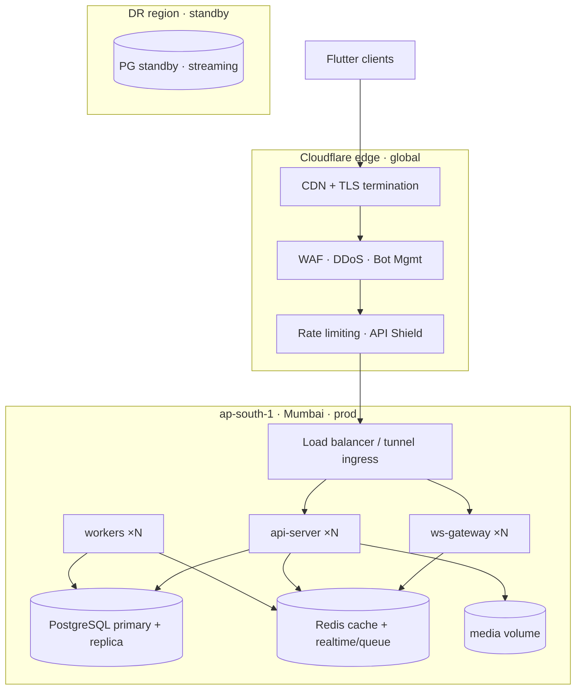
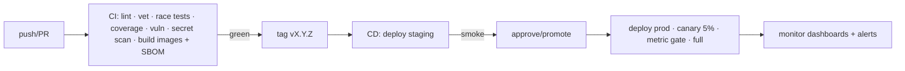
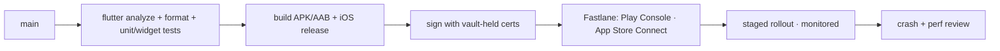

# Messaging Platform — DevOps & Infrastructure Handbook

| | |
|---|---|
| **Document** | DevOps & Infrastructure Handbook v1.0 |
| **Audience** | DevOps/SRE engineers, backend + Flutter engineers, on-call |
| **Status** | **Official operations standard.** Follow it exactly. |
| **Source of Truth** | `ARCHITECTURE.md` §29–§36 (monitoring, security, scalability, DR) → this handbook. Do not redesign. |
| **Stack (fixed)** | Go · Flutter · PostgreSQL · Redis · Docker · Terraform · Cloudflare |
| **Launch** | India first (single region) → global scale later |
| **Scope** | Backend services **and** the Flutter mobile app (build, sign, distribute, monitor). No code. |

> This handbook is *operations*, not architecture. It restates no product or architecture decisions; it tells every engineer and every AI agent **how to operate, deploy, and keep alive** the platform defined in the source-of-truth documents.

---

## Table of Contents

1. [Operating Model](#1-operating-model)
2. [Environment Layout & Deployment Topology](#2-environment-layout--deployment-topology)
3. [Development Environment](#3-development-environment)
4. [Local Development Workflow](#4-local-development-workflow)
5. [Docker Strategy](#5-docker-strategy)
6. [Environment Configuration](#6-environment-configuration)
7. [Secrets Management](#7-secrets-management)
8. [CI/CD Pipeline](#8-cicd-pipeline)
9. [Git Workflow](#9-git-workflow)
10. [Monitoring](#10-monitoring)
11. [Logging](#11-logging)
12. [Alerting](#12-alerting)
13. [Backup Strategy](#13-backup-strategy)
14. [Disaster Recovery](#14-disaster-recovery)
15. [Server Deployment Strategy](#15-server-deployment-strategy)
16. [Reverse Proxy](#16-reverse-proxy)
17. [SSL/TLS](#17-ssltls)
18. [Cloudflare Integration](#18-cloudflare-integration)
19. [Storage Backups](#19-storage-backups)
20. [PostgreSQL Backups](#20-postgresql-backups)
21. [Redis Persistence](#21-redis-persistence)
22. [Security Hardening](#22-security-hardening)
23. [Scalability Roadmap](#23-scalability-roadmap)
24. [Production Checklist](#24-production-checklist)
25. [Cost Optimization](#25-cost-optimization)
26. [Maintenance Procedures](#26-maintenance-procedures)
27. [Flutter App Release Pipeline](#27-flutter-app-release-pipeline)
28. [Appendix A — Dashboard & Alert Canon](#appendix-a--dashboard--alert-canon)
29. [Appendix B — Runbook Index](#appendix-b--runbook-index)

---

## 1. Operating Model

- **One team owns the platform end-to-end** (backend, client ops, infra). No handoff gaps between "code", "deploy", and "watch".
- **Everything is code**: Terraform for infra, Dockerfiles + compose for packaging, GitHub Actions for CI/CD. Any manual server step that isn't an emergency is a bug in this handbook.
- **Reproducibility is the contract**: the same Terraform + image + config that runs staging runs prod. Environment drift is a deployment incident.
- **SLOs (from `ARCHITECTURE.md` §29.1) are the operating contract**: message send P95, send→delivered P95, WS connect success, notification delivery success, API availability. Every dashboards, alert, and capacity decision maps to one of these.
- **India-first reality**: single region (e.g., `ap-south-1` Mumbai) for the stateful tier, Cloudflare edge for latency/DDoS at the perimeter. Global scaling is a *planned path* (§23), not a redesign.

---

## 2. Environment Layout & Deployment Topology

**Environments:** `dev` (local, one host), `staging` (real topology, synthetic data, run of production image tag), `prod` (Mumbai region), `dr` (warm standby region, promoted on disaster). Promotion order is strict (`ENGINEERING.md` §12).

---

## 3. Development Environment

- **The developer's machine runs the full stack via `infra/docker/docker-compose.yml`** — PostgreSQL, Redis, storage volume, api-server, ws-gateway, workers, and the monitoring stack (Prometheus + Grafana + Loki) as one command. One-command `make dev-up` / `make dev-down`.
- **Flutter** runs on an emulator/device against the compose stack at `localhost`; the app's `--dart-define` points at local endpoints (`FLUTTER.md` §16).
- **Parity**: the compose file uses the *same image tags* and *same config shape* as staging. If a bug only reproduces in Docker, it's an environment gap — file it as an ops bug.
- **No shared dev servers**: each engineer gets isolated local state (separate compose volumes). No "dev database on the team server".
- **A `make`/taskfile contract** is the entry point: `make dev-up`, `make test`, `make migrate`, `make lint`, `make build`, `make ci`. Never a bespoke script per engineer.

---

## 4. Local Development Workflow

1. `git pull` trunk → `make dev-up` (fresh compose stack).
2. Run migrations: `make migrate` (applies `server/migrations/` against the local PG).
3. Run the backend: `make dev-api` (or the compose-managed api-server with reload).
4. Run Flutter: `flutter run --dart-define=ENV=dev` against `localhost`.
5. Code → tests (unit fast, integration tagged) → push → PR (§9).
6. On any schema change: update `DATABASE.md` **and** `migrations/` in the same PR, and `make migrate` locally to prove it applies.

**Golden rule:** if it doesn't run from `make dev-up` on a clean checkout, it's broken — CI will reject it, and so should review.

---

## 5. Docker Strategy

- **Immutable, minimal images**: distroless-style runtime images (no shell, no package manager in the runtime image) for Go services; multi-stage builds (build in `golang:1.2x`, copy static binary). Smaller images = smaller attack surface + faster pulls.
- **Images are built once, promoted everywhere** (`ENGINEERING.md` §12, §42): CI builds `:sha` images; staging and prod deploy the exact same digest. No rebuild-at-promotion, ever.
- **Non-root runtime**: services run as an unprivileged user; `read-only` root filesystem where feasible; tmpfs for scratch. Drop all capabilities (`--cap-drop=ALL`).
- **Health probes**: images must expose `/healthz` (liveness) and `/readyz` (readiness — DB/Redis/backplane reachable). Orchestrator/LB uses them.
- **Graceful shutdown**: SIGTERM → drain (in-flight requests, WS frames), WS `1012` close, exit. Handled in-process (`ENGINEERING.md` §42).
- **Local dev images are allowed to be heavier** (debug tooling, hot reload) — dev images ≠ prod images by design, but the *code* must be identical.
- **SBOM + scanning**: every image is scanned (e.g., Trivy) in CI; an SBOM is produced and attached to the release. Supply-chain policy: pinned base images, `go.sum`, dependabot.
- **Orchestration**: v1 runs on Docker hosts (Compose/Swarm or VM-based) with Terraform-provisioned instances; Kubernetes is a *documented later step* (`ARCHITECTURE.md` §8 `infra/deploy/kubernetes`), not a v1 requirement. Keep images orchestration-agnostic so the later migration is boring.

---

## 6. Environment Configuration

- **12-factor**: config via environment variables, injected at runtime, never baked into images or committed (`ENGINEERING.md` §11–§12).
- **Namespaced vars**: `APP_*` (Go), `CF_*` (Cloudflare), `PG_*`, `REDIS_*`, plus Flutter `--dart-define` build-time config (`FLUTTER.md` §16).
- **Config is validated at startup** — a bad var fails fast with a clear error, never boots a misconfigured server.
- **Per-environment bundles**: `APP_ENV=dev|staging|prod` selects behavior; code paths never diverge per environment — only *values* do.
- **`.env.example` committed; `.env.*` gitignored.** Anything secret lives in the vault (§7).
- **Feature flags are runtime-tunable config** (`API.md` §15.7, admin flag store) — the one thing that can change without a deploy. Everything else requires a release.

---

## 7. Secrets Management

- **Single source of truth**: a managed vault (HashiCorp Vault or the cloud secret manager) for all secrets — DB passwords, JWT signing keys, refresh-token hash pepper, push provider keys (FCM/APNs), Cloudflare tokens, backup encryption keys.
- **No secrets in** source, Docker images, `.env`, Terraform state, CI logs, or application logs. A gitleaks scan is a CI merge-blocker.
- **Runtime injection**: secrets are read by the app at startup through the config layer (`ENGINEERING.md` §31); images are secret-free and therefore safely promotable.
- **Least privilege**: per-service, per-environment credentials. DB roles: API, workers, migrations, media are distinct (`ARCHITECTURE.md` §30.3). Never share the migration role with the app role.
- **Rotation is rehearsed, not an incident**: runbooks exist for rotating DB passwords, JWT signing keys (JWKS multi-key: new key added first, old key retired after token TTL), push tokens, and vault access. Rotation drills are scheduled.
- **Vault access is audited**; break-glass access is time-boxed and logged.

---

## 8. CI/CD Pipeline

One pipeline, three stages, strict promotion (mirrors `ENGINEERING.md` §42).

- **CI (every PR)**: `go vet`, `golangci-lint`, unit + integration (`-race`), coverage gates, `govulncheck`, `gitleaks`, `trivy` image scan, Flutter `analyze` + `format` + widget/unit tests, `flutter build` smoke for debug artifacts. All green = mergeable.
- **CD (on tag)**: build once, push to registry, deploy staging, run smoke suite (health + one send/receive flow + WS connect). Then a promote gate to prod.
- **Prod deploy**: rolling/canary with metric-based auto-rollback (p95, error rate, WS connect failures, outbox lag). Unhealthy canary → automatic rollback, no pager required.
- **Migrations**: run *before* the app rollout, additive-first (`DATABASE.md`), with a migration runbook and rollback path. Never deploy code that requires a not-yet-applied migration.
- **Flutter app build** is part of CD but on a separate release cadence (§27): `flutter build apk --release` / `flutter build ios --release` → signed → distributed via Fastlane → store.
- **Environments gate**: staging must pass before prod; prod deploys are the only writes to prod state.

---

## 9. Git Workflow

- **Trunk-based**: `main` is the only long-lived branch; feature branches ≤ ~2 days; PR + 1 approval (2 for auth/realtime/platform) + all CI gates (§38 of `ENGINEERING.md`).
- **Branch naming**: `feature/MSG-142-read-receipts`, `fix/`, `chore/`, `hotfix/`. No direct pushes to `main`.
- **Release by tag**: `git tag vX.Y.Z` on `main` → CD (§8). Hotfixes are new tags off `main`, cherry-picked.
- **SemVer**: `vX.Y.Z` from `ENGINEERING.md` §41. Breaking API/schema changes bump X and require the API/DB docs updated in the same PR.
- **Commit hygiene**: atomic commits, imperative subjects, `conventional commits` for changelog generation (`feat:`, `fix:`, `perf:`, `ci:`, `docs:`).
- **AI agents follow the same contract**: PRs with tests + docs, CI green, small diff (§39 of `ENGINEERING.md`).

---

## 10. Monitoring

Follows `ARCHITECTURE.md` §29. Stack is fixed: **Prometheus + Grafana + Tempo (traces) + Loki (logs)**.

- **Metrics — RED/USE**: rate, errors, duration for every API endpoint, WS event type, and worker queue; utilization/saturation for PG, Redis, storage, network. Plus the messaging-specific metrics in §29.2 (send→persist latency, send→delivered, receipt lag, WS connection count, fan-out volume, push delivery, DLQ growth).
- **SLO tracking**: burn-rate-based SLO dashboards (the "system health" board) for the five SLOs (§1). A SLO breach is the highest-severity alert.
- **Dashboards (one per pillar)**: API, WS, pipeline, data (PG/Redis), media, workers, infrastructure, plus the executive SLO board.
- **Health/readiness**: `/healthz`, `/readyz` wired to LB + alerting (readiness fails = instance not serving).
- **Mobile app monitoring**: crash reporting (e.g., Sentry) with session sampling; app-level metrics (startup time, sync success rate, WS reconnect rate, offline queue depth) reported to analytics — the client is a monitored surface, not a black box.
- **Golden signals for capacity**: connections per WS instance, PG connection utilization, Redis memory/evictions, storage utilization %, queue lag. These feed autoscaling + capacity (§23).

---

## 11. Logging

- **Structured JSON logs** to stdout via `log/slog` (`ENGINEERING.md` §13), shipped by the runtime to **Loki** (centralized, searchable). No log files inside containers.
- **Correlation**: `request_id` threaded from Cloudflare (`CF-RAY`) through the app; OpenTelemetry `trace_id` joins logs ↔ traces ↔ metrics.
- **Channels**: access, domain, worker, WS, audit (§24 / security handbook). Audit logs go to a dedicated append-only sink with its own retention.
- **Log hygiene**: no secrets, no PII beyond need, no raw tokens/OTPs (redaction helper is mandatory). "Assume logs leak" is the operating assumption.
- **Retention**: operational logs 30 days hot / 12 months cold; audit logs per compliance (longer, append-only, access-controlled).
- **Mobile**: client logs are local + on-demand export for support; error/event sampling to crash analytics (`FLUTTER.md` §13). Never log message content.

---

## 12. Alerting

Alerting is **SLO-burn based** to control fatigue (`ARCHITECTURE.md` §29.3) plus a small set of direct pages.

- **Page (on-call)**: SLO burn > threshold, error-spike (5xx rate), WS connect-loss cascade, PG/Redis saturation or down, replication lag > target, storage near-full, DLQ growth, backup failure, migration failure. **Alert, not notify**: every page has a runbook (Appendix B).
- **Warn (dashboard/notify)**: p95 drift, slow-query growth, queue lag, cache hit-rate drop, quota near-limit, canary metric drift.
- **On-call**: primary + secondary rotation; alert routing by service ownership. A page that needs no action twice is a rule to fix.
- **Alert rules live in code** (Prometheus alerting rules / Terraform) and are reviewed with the feature that adds the metric — a feature without an alert is incomplete.
- **India-hours reality**: the India launch means on-call must cover IST peak hours; SRE follows the sun as regions are added.

---

## 13. Backup Strategy

Targets from `ARCHITECTURE.md` §35.1:

| Asset | RPO | RTO | Method |
|---|---|---|---|
| PostgreSQL | ≤ 5 min | ≤ 1 h | WAL archiving + nightly base; PITR |
| Media originals | ≤ 24 h | ≤ 4 h | scheduled incremental backups + DB↔media reconciliation |
| Redis (realtime/queue) | tolerated loss | minutes | AOF `everysec`; cache Redis rebuildable — no backup |
| Terraform state | — | instant | remote backend + locking |
| Flutter build artifacts / signing keys | — | n/a | signed artifacts + signing certs in vault |

- **Backups are encrypted, off-machine, and tested**: a restore drill runs monthly and is a *scheduled ticket*, not optional (§14).
- **Backup failures page.** A silent backup failure is a data-loss incident waiting to happen.
- **DB↔media coherence**: the reconciliation job (`ARCHITECTURE.md` §21) ensures a restored pair is consistent; restore is validated, not assumed.

---

## 14. Disaster Recovery

Runbooks exist for every scenario in `ARCHITECTURE.md` §35.3 and are **exercised quarterly** (restore drills, failover tests, Redis-outage drills). The handbook's contract:

- **DB loss**: restore base + replay WAL to PITR (≤5 min RPO, ≤1 h RTO). Media untouched; reconciliation re-syncs references.
- **Media volume loss**: restore from backup; media rows flagged `restoring`; clients show placeholders; users can re-originate uploads.
- **Redis outage**: cache Redis → reads fail open to PG (availability preserved); realtime/queue Redis → WS degrades to sync mode, pushes continue, no data loss, latency degrades; alert pages.
- **Full region loss**: DR region with standby PG replica (streaming replication) + replicated media volume; Cloudflare DNS/failover flips traffic; RTO per product. (v2 active-active is deferred — single active region in v1.)
- **Every runbook has**: detection, severity, owner, step-by-step recovery, verification, post-incident review. Measured RTO/RPO from drills are recorded (this is how we know the targets are real, not aspirational).
- **DR for Flutter**: nothing to restore — the app is stateless client-side; reinstall/logout recovers via `sync/snapshot` (`API.md` §12). This is the payoff of offline-first.

---

## 15. Server Deployment Strategy

- **Compute**: Terraform-provisioned instances (Docker hosts) in the India region; stateless tiers autoscale on metric (§23); stateful tiers scale up vertically with a documented capacity plan.
- **Deploy = rolling replace**: new image → new instances → health-gated → LB cutover → old instances drained. Canary percentage before full. Automatic rollback on metric breach (§8).
- **Zero-downtime**: readiness gates + graceful drain make deploys seamless; WS resume (`API.md` §16.6) absorbs socket reconnects.
- **Migrations before app**: run migrations first, additively; roll back forward (fix), not backward (unless schema disaster, which has its own runbook).
- **Patch policy**: security patches to base images/OS within 7 days; critical CVEs sooner. Image rebuilding is cheap because everything is code.
- **Immutable servers**: never `ssh` to patch a running host; change code/Terraform and replace. Config drift is prevented, not fought.

---

## 16. Reverse Proxy

- **Two tiers**: Cloudflare at the edge (TLS termination, WAF, DDoS, bot, caching, `CF-Connecting-IP`/`CF-IPCountry`) **+** an origin reverse proxy (e.g., Caddy/Nginx/Traefik, or Cloudflare Tunnel) in front of Go services.
- **Why the origin proxy exists**: header hygiene (`X-Forwarded-*`, `CF-*`), WS upgrade support, request size/body limits, gzip/brotli (for API JSON), and a second TLS termination for defense-in-depth. 
- **Config is code** (Terraform + config files), reviewed, tested in staging.
- **WS must be proxied**: the origin proxy and Cloudflare both require WebSocket support enabled (proxied DNS records, not grey-cloud DNS-only, for the WS hostname).
- **Origin lockdown**: the origin accepts traffic only from Cloudflare IP ranges (or via Tunnel — preferred, since the origin then has no public IP at all). Never expose the origin IP to the public internet — a DDoS that bypasses Cloudflare is the classic failure (§18).

---

## 17. SSL/TLS

- **Termination at the edge**: Cloudflare manages public certs (Universal → Advanced). Origin uses its own certs: with Cloudflare in **Full (Strict)** mode, the origin presents a real CA cert so the edge verifies origin identity.
- **TLS 1.2+ minimum; prefer TLS 1.3.** Disable old protocols/ciphers at both edge and origin.
- **HSTS** enabled at the edge (`Strict-Transport-Security`, includeSubDomains) — the app and API are HTTPS-only. `API.md` §2.1 already mandates TLS + HSTS.
- **wss:// for WebSocket** — same TLS policy as REST.
- **Client pinning** (`FLUTTER.md` §23) is opt-in/config-driven, with a rotation mechanism so a pinned-cert expiry isn't an outage.
- **Certificate lifecycle is automated** (Cloudflare/ACME); expiry alerts exist and are tested. A cert-expiry alert is a page.

---

## 18. Cloudflare Integration

- **DNS**: all hostnames proxied (`orange cloud`) except where a service must bypass edge (never for the API/WS origins). Records managed in Terraform (`infra/terraform/cloudflare/`).
- **Security stack at the edge** (research-confirmed 2026 practice): managed WAF rulesets (OWASP top-10 + managed rules) in **log-then-block** during roll-in, custom rules for sensitive endpoints (login/OTP/admin), **Bot Management** (score-based, challenge/block on credential-stuffing and scraping), **rate limiting** at the edge for auth and search paths (defense-in-depth with app-level rate limits in `API.md` Appendix B), **DDoS protection** always on.
- **API Shield / mTLS** for admin endpoints (or at minimum: admin is IP-allowlisted + SSO at the edge).
- **Turnstile** (managed challenge) for the sign-up/OTP flow — human verification without privacy-hostile CAPTCHAs (and feeds bot scores).
- **Cache**: only cache truly cacheable static/GET responses (media thumbnails, some metadata); **never cache user data or WS**. Respect the app's auth headers.
- **WebSockets**: ensure WS proxying enabled + proxied DNS; consider regional/edge behavior for WS stability.
- **Observability**: Cloudflare Analytics/Logpush feed Loki/SIEM for edge-level security visibility; `CF-Ray` correlates edge ↔ app.
- **India launch**: Cloudflare's Mumbai edge is the first-hop PoP; later regions add local PoPs automatically — latency comes down without re-architecture.

---

## 19. Storage Backups

- **Media volume** (`media/originals`, `media/thumbnails`, `media/tmp`): nightly incremental + periodic full; snapshot-based (or hardlink dedupe) for efficiency.
- **Backup + restore is through the `storage` interface** (`ARCHITECTURE.md` §19) so the future S3/R2 migration (§36) changes backup tooling, not business logic.
- **Encryption at rest for backups**; backup keys in vault, separate from data keys.
- **Retention**: align with the product's retention policy (`API.md` §13); quarantined media backed up separately and purged per policy.
- **Reconciliation**: the DB↔media consistency job is part of the backup pipeline — a backup that can't restore coherently isn't a backup (§13).

---

## 20. PostgreSQL Backups

- **Continuous WAL archiving + nightly base backups + PITR** (per `ARCHITECTURE.md` §35.2, `DATABASE.md`). This is the ≤5 min RPO mechanism.
- **Backup tooling runs as a separate role/container** with only backup privileges; backups stream to object storage (or a separate disk), encrypted, off-machine.
- **Verification is non-negotiable**: monthly restore drill restores a base + replays WAL to a chosen timestamp and validates schema + data counts + a business flow (a send + read-receipt round trip). Timed restore = measured RTO.
- **Replication lag monitoring** on the standby; lag > threshold pages (§12).
- **Migrations are reversible/additive-first** so backup+restore and migration paths never conflict.
- **Point-in-time window** is retained per compliance (e.g., 30 days); WAL retention is monitored (disk vs retention).

---

## 21. Redis Persistence

- **Two Redis roles, two persistence policies** (`ARCHITECTURE.md` §6.17, §35.2):
  - **Cache Redis** (cache-aside, idempotency cache, rate-limit state): rebuildable from PG — **no backup needed**; persistence off or minimal. Loss = cache miss, correctness unaffected.
  - **Realtime/queue Redis** (per-conversation sequences, presence/typing, job queues, pub/sub): **AOF with `everysec`** — bounded loss tolerated, sequences re-persisted from `conversation_sequences` (PG) on recovery.
- **Never treat Redis as the only copy** of anything (`ENGINEERING.md` §22): business data lives in PG; Redis holds ephemeral/hot state. Sequence persistence to PG is the documented exception and its recovery path is rehearsed.
- **High availability**: primary + replica per role (Sentinel or managed); failover is a rehearsed runbook. Queue consumers use `FOR UPDATE SKIP LOCKED`-style leases (or Redis Streams consumer groups) so failover doesn't double-process (§19 of `ENGINEERING.md`).
- **Memory discipline**: `maxmemory` + eviction policy per role (cache: `allkeys-lru`; realtime/queue: `noeviction` to avoid silent job loss), memory alerts.

---

## 22. Security Hardening

Infrastructure hardening for the stack (application security lives in the Security & Cryptography Handbook):

- **Network**: VPC/subnets, security groups/firewalls default-deny; only 443/8443/WSS ingress from Cloudflare ranges; admin plane on a separate network + SSO + mTLS.
- **Hosts**: hardened base images, non-root services, `--cap-drop=ALL`, read-only FS, patched weekly.
- **Database**: no public exposure; strong auth; least-privilege roles (`ARCHITECTURE.md` §30.3); `pg_hba` restricted to app network; TLS client connections; encryption at rest on volumes.
- **Redis**: not exposed publicly; `requirepass` + ACLs; bound to internal network; TLS where supported.
- **Media**: served only via signed short-lived URLs (`API.md` §9.5); quarantine path for unsafe content; media role has no write to user tables.
- **Containers/images**: distroless runtime, SBOM, `trivy` scan, pin versions (dependabot), no secrets in images.
- **Terraform**: remote state with locking + encryption; state contains no secrets; plan diffs reviewed (a `terraform plan` is part of infra PR review); least-privilege CI role for `apply`.
- **Cloudflare**: locked-down WAF/log-then-block roll-in, bot mgmt, API Shield for admin, Turnstile on sign-up, origin lockdown/Tunnel (§16, §18).
- **Flutter app**: signing keys in vault + CI (never on laptops), keystore/`.jks` never committed, play/app store tamper protections, app-attestation/Play Integrity as device-trust signal (`FLUTTER.md` §23).
- **Regular scans**: image, dependency, IaC (e.g., `tfsec`/`checkov`), secret scan — all in CI. Quarterly external pen test + annual red team (per the security handbook).

---

## 23. Scalability Roadmap

**India launch → global, without redesign** (`ARCHITECTURE.md` §31, §37).

**Phase 1 — India launch (v1):**
- Single region (Mumbai), stateless tiers horizontally scaled; stateful tiers vertical + replicas.
- Cloudflare edge for latency/DDoS/caching; PgBouncer for PG connection pooling; Redis split into cache vs realtime/queue roles.

**Phase 2 — India scale-out (traffic growth):**
- Autoscaling stateless tiers on CPU + WS connection count + queue depth (§31.4).
- PG: read replicas for history/search reads; partition hot tables (messages by time, `change_log` by time) for retention pruning + bounded indexes; writes stay on primary in v1.
- Redis: cluster-mode for realtime/queue when node saturates (keys already per-user/per-conv → shard-friendly).
- Media: shard volumes by type/date (keys already date-fanned, `ARCHITECTURE.md` §20); move toward S3-compatible/R2 object storage via the `storage` interface (§36) — the designed migration path.

**Phase 3 — Global:**
- Add regions; Cloudflare routes by region; each region gets its own stateless tier + regional state tier.
- Cross-region replication for PG (standby promotion) + media replication; DNS failover tested.
- Active-active is deferred to v2 — v1 is active single region + warm DR, per `ARCHITECTURE.md` §35.
- Microservice split (§37) only when triggers are met (team velocity, independent scaling) — the seams are already drawn.

**Capacity discipline**: capacity math in, not after (`ENGINEERING.md` §44): connection budget, QPS × p95 × instances, Redis bandwidth, PG IOPS. Load-test in staging with representative data before every capacity milestone; autoscaler thresholds calibrated by load test, not guesses.

---

## 24. Production Checklist

Pre-prod gate (all must pass; this is the launch checklist):

**Infra & security**
- [ ] Terraform state remote + locked; plan approved; no secrets in state
- [ ] Origin locked to Cloudflare (or Tunnel); no public origin IP
- [ ] WAF log-then-block complete → block; bot mgmt + Turnstile active; edge rate limits active
- [ ] TLS 1.2+/1.3, Full (Strict), HSTS; cert automation + expiry alerts
- [ ] WS proxying + `wss://` verified end-to-end
- [ ] DB/Redis not public; least-privilege roles; encryption at rest; TLS client conns
- [ ] Images distroless, non-root, scanned, SBOM; secrets in vault only
- [ ] Gitleaks/vuln/IaC scans green in CI

**Reliability**
- [ ] Backups running (PG WAL + base, media) **and a restore drill executed and recorded**
- [ ] PG replica + failover rehearsed; Redis failover rehearsed; DR region standby warm
- [ ] Dashboards + SLO burn alerts live; on-call rotation staffed; runbooks reviewed
- [ ] Migrations applied in staging then prod, additive-first, rollback path documented
- [ ] Canary + auto-rollback verified with a forced-bad-release drill
- [ ] Load test passed against SLO budgets (send P95, WS connect rate)

**Flutter release**
- [ ] Signing certs/keystore in vault; CI signs; Fastlane release pipeline green
- [ ] Crash reporting + app analytics enabled with sampling
- [ ] Push tokens: FCM/APNs configured, tokens registered in staging→prod
- [ ] App version negotiated with server (`client_version`) — no client/server mismatch
- [ ] App tamper protection + integrity signals configured

**Operations**
- [ ] Runbooks printed/reachable offline; on-call briefed; alert ownership mapped
- [ ] Cost budget + anomaly alerts active (§25)
- [ ] Compliance/privacy items from the security handbook (DPDP/GDPR posture) checked

---

## 25. Cost Optimization

- **Right-size, not over-size**: start stateless tiers small and autoscale; use load-test data, not optimism, for sizing.
- **Cache effectiveness**: Redis cache tier shrinks PG load; monitor hit rates; tune TTLs. Cache as a cost lever, not an afterthought.
- **Storage**: media dominates — lifecycle rules (cold tiering), retention enforcement (`API.md` §13), orphan GC (workers), and the S3/R2 migration (§36) cut storage cost; R2 has no egress fees (fits the Cloudflare stack).
- **Cloudflare as the egress umbrella**: CDN caching + edge bandwidth reduces origin egress.
- **PG**: connection pooling (PgBouncer) avoids over-provisioning for connection spikes; partitioning enables cheap retention pruning; replica sizing only where reads need it.
- **Backups**: dedupe (snapshot/hardlink) media backups; WAL retention sized to compliance, not habit.
- **Flutter**: bundle size = store/CDN costs + install size; tree-shake, compress assets, use split debug info (`FLUTTER.md` §21).
- **Commitment/spot strategy**: steady-state capacity via committed/RI purchases; autoscalable burst capacity on-demand. Review monthly against actuals.
- **Cost anomaly alerts** in the monitoring stack — cost is an operating signal, not a finance surprise.

---

## 26. Maintenance Procedures

- **Weekly**: dependency/security updates (dependabot + image rebuilds), backup health review, alert hygiene review.
- **Monthly**: restore drill (PG + media), WS-failover drill, on-call rotation review, capacity review (traffic vs budget), cost review.
- **Quarterly**: full DR exercise (region-loss simulation), pen-test/scan remediation review, key-rotation rehearsal, runbook updates.
- **Change management**: all maintenance through Terraform + CI (no ad-hoc prod changes); a change window calendar for stateful maintenance; every change has a rollback.
- **On-call ceremony**: incident post-mortems (blameless), follow-ups tracked to completion, runbooks updated by the incident, SLO review monthly.
- **Patch Tuesday-style rhythm** for OS/base images; **immediate** patching for active CVEs in the runtime stack.

---

## 27. Flutter App Release Pipeline

The app is a first-class release surface; it ships on a **different cadence than the backend** and has its own lifecycle.

- **Build**: CI builds `--release` artifacts per environment (`--dart-define`), signed in CI with keystores/profiles from the vault (never on a developer's laptop).
- **Distribution**: Fastlane automates Play Console (Internal → Closed → Open track) and App Store Connect (TestFlight → App Store). Rollouts are **staged** (e.g., 10% → 25% → 100%) and monitored for crash-rate and sync-health regression before widening.
- **Version negotiation**: `app_version`/`client_version` (`API.md` §2.3, `ENGINEERING.md` §41) — the server supports the oldest still-shipped client, so the app can roll out before or after backend features. Feature flags (`API.md` §15.7) decouple app release from feature enablement.
- **Push infrastructure**: FCM/APNs keys managed in vault; server push tokens registered per device (`API.md` §14.4); push keys rotated and tested in the release pipeline (a broken push key is caught in staging, not by users).
- **Monitoring the release**: crash rate (fatal + ANR), startup time, WS reconnect success, sync success rate, and the offline-queue depth are watched per version cohort. A bad release is halted via the store's staged rollout, not a hotfix scramble.
- **Hotfix path**: for store-approve-with-issues, a small fix rides the normal PR → tag → CI → store path; emergency builds only in extraordinary cases (and never at the cost of code-signing security).

---

## Appendix A — Dashboard & Alert Canon

| Dashboard | Key panels | Linked alerts |
|---|---|---|
| System health (SLO board) | SLO burn for send P95, delivery P95, WS connect, push delivery, API avail | SLO burn pages |
| API | QPS, p95/p99, 5xx rate, 4xx rate | error spike, latency breach |
| WS | connections, connect rate, resume success, buffer saturation, frame drops | connect-loss cascade |
| Pipeline | send→persist, send→delivered, sequence drift, receipt lag | delivery latency breach |
| Data | PG conns, slow queries, replication lag, WAL; Redis memory/evictions, stream lag | saturation, lag, near-full |
| Media | upload throughput, thumbnail latency, storage %, quota | storage near-full, quota breach |
| Workers | per-queue depth, DLQ growth, job latency | DLQ growth, backup failure |
| Infra | CPU/mem/disk per host, LB health | host down |
| Client (Sentry) | crash rate, startup, sync success, WS reconnect | crash-rate spike per cohort |

## Appendix B — Runbook Index

Each is a document in `docs/runbooks/` with detection, severity, owner, steps, verification:

1. PG primary failure / failover
2. PG data-loss recovery (PITR restore)
3. Media volume loss / restore
4. Redis cache outage (fail-open)
5. Redis realtime/queue outage (degrade-to-sync)
6. Region-loss DR failover
7. Canary metric breach / auto-rollback
8. Migration failure
9. Certificate expiry / rotation
10. Vault / secret rotation
11. Push provider outage (FCM/APNs)
12. Flutter release incident (crash spike / bad build)

---

*End of DevOps & Infrastructure Handbook. Operations standard for the platform — backend and Flutter app alike. Source-of-truth documents win on conflict; raise conflicts as a PR.*
