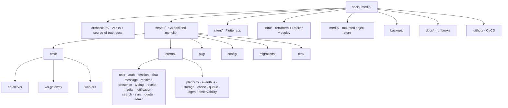
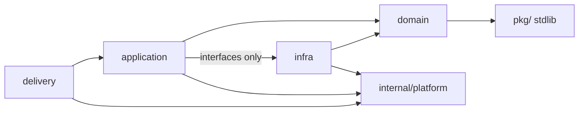
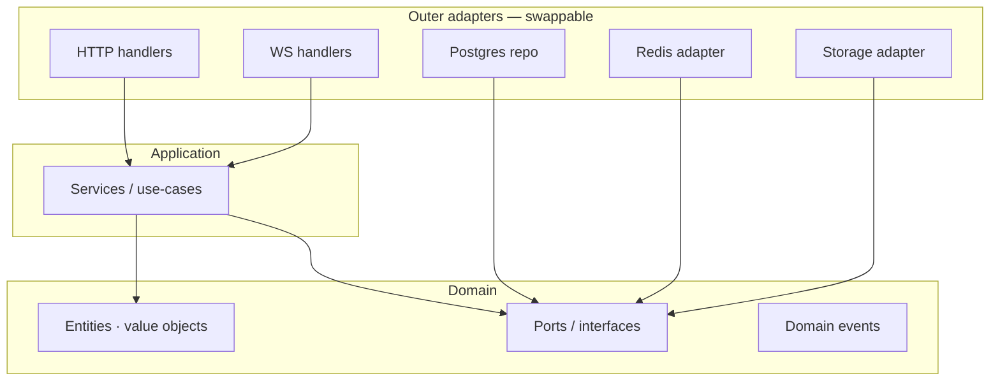
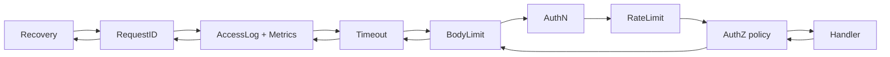
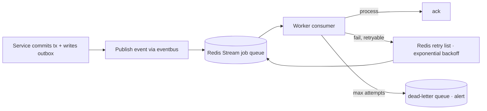
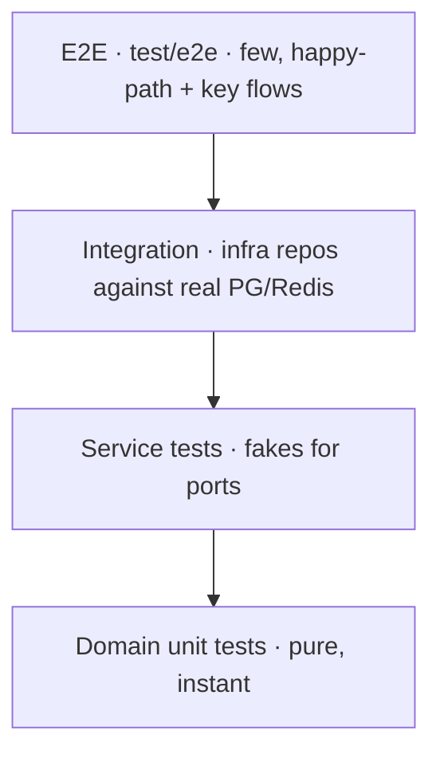
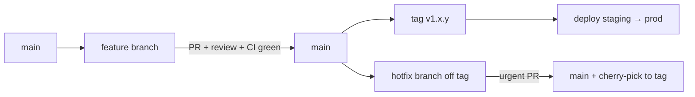
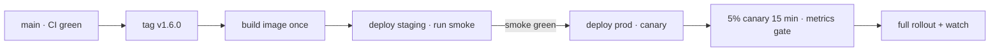

# Messaging Platform — Backend Engineering Guide

| | |
|---|---|
| **Document** | Backend Engineering Handbook v1.0 |
| **Audience** | Every backend engineer and every AI coding agent working on the platform |
| **Status** | **Official engineering standard.** Follow it exactly. |
| **Source of Truth (in order)** | Finalized UI/UX → `ARCHITECTURE.md` → `DATABASE.md` → `API.md` → **this guide** |
| **Stack (fixed)** | Go · PostgreSQL · Redis · WebSockets · Docker · Terraform |
| **Design target** | Hundreds of millions of users |

> This is a *practice handbook*, not a second architecture document. It restates no decisions from `ARCHITECTURE.md` / `DATABASE.md` / `API.md`; instead it tells every engineer **how to build inside those decisions** and **why**. When a rule here seems to conflict with a source-of-truth document, the source document wins — and that conflict should be raised as a PR to this guide, not silently resolved in code.

---

## Table of Contents

1. [Engineering Philosophy](#1-engineering-philosophy)
2. [Project Structure](#2-project-structure)
3. [Package Organization](#3-package-organization)
4. [Domain-Driven Design](#4-domain-driven-design)
5. [Clean Architecture & Dependency Rules](#5-clean-architecture--dependency-rules)
6. [Repository Pattern](#6-repository-pattern)
7. [Service Layer](#7-service-layer)
8. [Handler Layer](#8-handler-layer)
9. [Middleware](#9-middleware)
10. [Dependency Injection](#10-dependency-injection)
11. [Configuration Management](#11-configuration-management)
12. [Environment Management](#12-environment-management)
13. [Logging Architecture](#13-logging-architecture)
14. [Error Handling Strategy](#14-error-handling-strategy)
15. [Validation Strategy](#15-validation-strategy)
16. [Authentication Middleware](#16-authentication-middleware)
17. [Authorization Middleware](#17-authorization-middleware)
18. [WebSocket Architecture](#18-websocket-architecture)
19. [Background Worker Architecture](#19-background-worker-architecture)
20. [Scheduler Architecture](#20-scheduler-architecture)
21. [File Storage Abstraction](#21-file-storage-abstraction)
22. [Cache Abstraction](#22-cache-abstraction)
23. [Transaction Management](#23-transaction-management)
24. [Concurrency Guidelines](#24-concurrency-guidelines)
25. [Context Propagation](#25-context-propagation)
26. [Retry Strategy](#26-retry-strategy)
27. [Timeout Strategy](#27-timeout-strategy)
28. [Rate Limiting](#28-rate-limiting)
29. [Idempotency](#29-idempotency)
30. [Security Guidelines](#30-security-guidelines)
31. [Secrets Management](#31-secrets-management)
32. [Testing Strategy](#32-testing-strategy)
33. [Unit Tests](#33-unit-tests)
34. [Integration Tests](#34-integration-tests)
35. [Mocking Strategy](#35-mocking-strategy)
36. [Code Style & Tooling](#36-code-style--tooling)
37. [Naming Conventions](#37-naming-conventions)
38. [Git Branching Strategy](#38-git-branching-strategy)
39. [Pull Request Standards](#39-pull-request-standards)
40. [Documentation Standards](#40-documentation-standards)
41. [Versioning Strategy](#41-versioning-strategy)
42. [Release Strategy](#42-release-strategy)
43. [Performance Optimization Guidelines](#43-performance-optimization-guidelines)
44. [Scalability Guidelines](#44-scalability-guidelines)
45. [Future Migration: Modular Monolith → Microservices](#45-future-migration-modular-monolith--microservices)
46. [Appendix A — Checklist for Every PR](#appendix-a--checklist-for-every-pr)
47. [Appendix B — Glossary](#appendix-b--glossary)

---

## 1. Engineering Philosophy

Six rules drive every decision in this guide. If you only remember one section, remember this one.

1. **The modular monolith is deliberate, not temporary.** `ARCHITECTURE.md` §4/§37 chose it so that one team can ship the whole product fast while the seams for later extraction already exist. Never blur a module boundary "because it's one process" — the boundary *is* the future service split (§45).
2. **Domain logic is the only thing that matters; everything else is an adapter.** PostgreSQL, Redis, the HTTP router, the WebSocket library, Docker, Terraform — all are swappable adapters behind interfaces. Code that imports `pgx` or `go-redis` directly inside a domain service is an architecture violation on review.
3. **Boring is a feature.** Choose the least-surprising library, the most standard layout, the most conventional pattern. Novelty tax is paid by every future engineer. If two options are equal, choose the one the ecosystem uses more.
4. **Everything must be observable.** Every request, every job, every WS event has a trace. If you cannot answer "what is the p95 of sending a message right now" from a dashboard, the feature is not done.
5. **Errors are values, not exceptions — and never leak.** Errors must be wrapped with context at each boundary, classified, and sanitized before crossing a trust boundary (§14). The client sees a stable `code` (`API.md` Appendix A); the operator sees a stack.
6. **Scale is an engineering discipline, not a bolt-on.** Performance, cache hygiene, batching, and connection reuse are designed *in*, from the first commit, because retrofitting at 100M users is rewriting.

**Decision-making default:** When in doubt, do the simple thing that matches `ARCHITECTURE.md`/`DATABASE.md`/`API.md`, then write the ADR explaining why. Complex solutions require a written, reviewed justification.

---

## 2. Project Structure

The repository layout is fixed by `ARCHITECTURE.md` §8. Reproduce it exactly; the structure *is* the architecture.



### 2.1 Top-level rules

- **`cmd/` contains only thin entrypoints.** Each `main.go` does exactly three things: load config, wire dependencies, start. Any business logic in `cmd/` fails review. See §10.
- **`internal/` is the entire product.** Code here cannot be imported from outside the module (Go's `internal` rule is our *compiler-enforced* module boundary). Never import across domain packages except through exported service interfaces or the event bus (§3, §5).
- **`pkg/` is for *truly* generic helpers** that could be published independently (slices, time, math, simple validators). It must be dependency-free. When unsure whether something belongs in `pkg/`, put it in `internal/platform/` — promoting later is trivial, demoting is not.
- **`config/` and `migrations/` are never imported by business code.** Configuration is loaded once at startup and injected (§11); migrations are applied by tooling, not by the app.

### 2.2 Why this structure

The layout encodes three guarantees at the filesystem level:
1. **Compile-time boundary enforcement** — `internal/` makes accidental external exports impossible.
2. **One-process mental model** — everything is reachable, so cross-domain calls are cheap *and* auditable.
3. **Clear future seams** — `services/` (per `ARCHITECTURE.md` §7) is reserved but empty in v1; each `internal/<domain>` is already a package that could become a module with minimal motion (§45).

---
## 3. Package Organization

### 3.1 Package-per-domain, with internal layering

Each domain package (`internal/user`, `internal/message`, …) is organized with four sub-packages mirroring the dependency rule (§5). This is the **mandatory** convention for every domain:

```
internal/message/
├── delivery/                # HTTP handlers + WS event handlers (adapters)
│   ├── http/
│   │   ├── handlers.go
│   │   └── handlers_test.go
│   └── ws/
│       └── events.go
├── application/             # services / use-cases (orchestration)
│   ├── send.go
│   ├── send_test.go
│   └── service.go           # exported service interface
├── domain/                  # entities, value objects, domain events, ports
│   ├── message.go
│   ├── message_test.go      # domain tests (pure, fastest)
│   └── ports.go             # repository interfaces, service interfaces
└── infra/
    ├── postgres/
    │   ├── message_repo.go
    │   └── message_repo_test.go
    └── redis/
        └── sequence.go
```

### 3.2 Naming and boundaries inside a domain

- **`delivery/`** — owns HTTP semantics (routing, decoding, encoding, status codes, pagination cursors). Imports `application` and `domain`. Never touches `infra`.
- **`application/`** — owns use-cases: transaction orchestration, port calls, domain-event publication. Imports `domain`. **May import `infra` only via interfaces from `domain`.** This is the layer that would become a standalone service.
- **`domain/`** — pure business rules. **Imports nothing from the rest of the repo** (at most generic `pkg/` and stdlib). Defines all ports (interfaces). No I/O, no `database/sql`, no `net/http`.
- **`infra/`** — implements ports. May import `domain` (for types) and the concrete driver libraries (`pgx`, `go-redis`). One sub-package per technology. **Other domains may never import `infra`.**

### 3.3 Cross-domain communication

Two and only two mechanisms, chosen by consistency requirement (`ARCHITECTURE.md` §9.3):

| Mechanism | When | How |
|---|---|---|
| **Direct service call** | Strong consistency, same transaction | `internal/message/application` calls `internal/chat/application`'s *exported service interface* |
| **Event bus** | Eventual consistency, cross-module fan-out | Publish `MessageCreated` → `eventbus` → subscribers (search, notification, sync, realtime) |

Rules:
- A domain imports another domain **only through its exported `application.Service` interface** — never through `delivery`, never through `infra`. The compile-time `internal/` rule prevents outside-import of a domain's internals *only if we never export those internals*; keep `delivery/` and `infra/` unexported by convention and enforce in review.
- **No network calls between packages inside the monolith** (`ARCHITECTURE.md` §7.2). In-process function calls only. A network layer inside one process adds latency and failure modes with zero benefit.
- Cross-domain, non-transactional side effects go through the **event bus**, never as direct calls that must "also update" another module's tables. This is what keeps `sync_cursors`/`change_log` writes atomic with their business transaction (§23).

### 3.4 `internal/platform/` packages

These are shared technical infrastructure. **Domains depend on platform; platform depends on nothing.** Review rule: a `platform/` package importing a domain package is rejected.

| Package | Responsibility | Used by |
|---|---|---|
| `eventbus` | In-process pub/sub bridged to Redis pub/sub; typed envelope; per-partition ordering; DLQ | all domains |
| `storage` | Object storage abstraction + FS adapter (and future S3/R2 adapter, `ARCHITECTURE.md` §19) | media |
| `cache` | Cache-aside helpers, key conventions, invalidation protocol | chat, user, session, presence |
| `queue` | Job enqueue/dequeue over Redis Streams; retries; DLQ | media (thumbnails), notification, search |
| `idgen` | Snowflake-style sortable IDs | all domains (via infra repos) |
| `observability` | slog config, OpenTelemetry tracing, metrics | all domains |

### 3.5 Dependency direction summary



Every arrow points "inward" toward pure domain. The one exception is `platform`, which is a *leaf* that everyone may depend on and nothing may depend from.

---

## 4. Domain-Driven Design

### 4.1 The bounded contexts are fixed

The bounded contexts, aggregates, and their owned events are already defined in `ARCHITECTURE.md` §9.1 (User, Auth/Session, Chat, Message, Receipt, Typing, Presence, Media, Notification, Search, Quota). **An engineer cannot invent new bounded contexts or move an aggregate to another context without an ADR.**

### 4.2 How we practice DDD (pragmatically)

- **Ubiquitous language in code.** The codebase vocabulary must match the product vocabulary and the DB schema: a `conversation` is a `Conversation`, `sequence` is `Sequence`, a read watermark is `last_read_seq` (`DATABASE.md` §5.2). Do not rename domain concepts to techy names ("chat_row", "msg_tbl").
- **Aggregates are transaction boundaries.** One aggregate = one consistency unit. `Message` (with its `sequence`) and `Conversation` (with membership + settings) are separate aggregates precisely because they are committed separately (`ARCHITECTURE.md` §9.3). Don't reach across an aggregate boundary and mutate two aggregates in a way that breaks their invariants.
- **Domain events are first-class types** in `domain/events.go`, not ad-hoc structs. They carry the aggregate ID, a version/seq where applicable, and the `global_seq` from the outbox when published. Consumers subscribe by type.
- **Value objects** for things with no identity: `Sequence`, `ConversationRole` (owner/admin/member), `PrivacyTier`, `MessageStatus` (queued/sent/delivered/read). This kills a whole class of bugs (comparing roles as strings, arithmetic on sequences).
- **Repositories are per-aggregate.** One aggregate → one repository interface. A "monster repository" with every query is an anti-pattern.

### 4.3 What we deliberately do NOT do

- No **CQRS with separate read models** in v1 — read paths are cache-aside + indexed queries (`ARCHITECTURE.md` §9.2), not materialized projections. (Search's FTS index is the one true projection, and it is a consumer-owned event listener.)
- No **event sourcing** — PG is the source of truth; events are notifications, not the store.
- No **saga/orchestration** — the monolith needs none; transactions are local (§23). Sagas only appear in the §45 migration.

---

## 5. Clean Architecture & Dependency Rules

### 5.1 The dependency rule, stated exactly

**Source-code dependencies must point inward only.** The `domain` layer knows nothing about `application`, `delivery`, or `infra`. `application` knows `domain` and the ports `domain` defines. `delivery`/`infra` are outer adapters.



### 5.2 Enforcement in practice (not dogma)

- Interfaces are **defined where the dependency is consumed** (in `domain/ports.go`), not where it is implemented (Go idiom: "accept interfaces, return structs").
- A service struct holds **small interfaces**, not the whole repo: `type MessageSender interface{ NextSequence(ctx) (int64, error); Insert(ctx, *Message) error }`. Small interfaces make mocks trivial and prevent god-interfaces.
- **No `init()` wiring, no globals for dependencies** — everything arrives via constructor injection (§10). This is what makes the whole architecture testable.
- **`context.Context` is the first parameter** of every function that does I/O (§25).
- **Lint enforces the direction.** `go-cyclo`, `go-callvis` diagrams in CI, and the package-import rules in §3 are the automated guards. Manual review backs them up.

### 5.3 What "clean" buys us here

- **The hot path (message send) is testable without a database** — fake `MessageSender`/`SequenceSource` make the use-case a pure unit test (§33).
- **Swapping Postgres for something else is not a product decision anymore** — repos behind ports make the storage choice reversible (we use PG today; nothing in `application`/`domain` knows).
- **The future microservice split is a repackaging, not a rewrite** — an `application` package already has no framework coupling, so extracting it into a service is mostly creating a new `cmd/` (§45).

---
## 6. Repository Pattern

### 6.1 Definition and purpose

A repository is the **single owner of data access for one aggregate**, behind an interface. The purpose is dependency inversion: `application` uses the repository interface; `infra/postgres` implements it. The service never sees SQL, cursors, or connection pools. This is why we can unit-test the entire send-message use-case without a database.

### 6.2 Rules

- **One repository per aggregate.** `MessageRepository`, `ConversationRepository`, `MembershipRepository`, `MediaRepository` (not `FooBarRepository` that does everything).
- **Repository methods are verbs on aggregates**, not SQL shapes: `NextSequence`, `Insert`, `GetBySeq`, `ListMessagesBefore`, `UpsertLastRead`. No method named `Exec` or `Query` that exposes SQL through the interface.
- **Repositories return domain types.** A repo method returns `domain.Message`, not a row struct. Mapping DB rows → domain types happens inside `infra/postgres` only.
- **Transactions are not part of a repository method signature** — see §23. A repository receives a transaction executor (or the repo is transaction-aware via a unit-of-work), never opens its own transactions for a use-case that spans multiple aggregates.
- **Errors come back classified** (§14): the repo maps `pgx.ErrNoRows` → `domain.ErrNotFound`, unique-violation → `domain.ErrAlreadyExists`, etc. **Never leak `pgx` errors upward.**
- **Caching lives *above* the repository, not inside it.** `application` calls a cache-aside wrapper (or the service itself does); the repo is the dumb, correct persistence layer. Exception: a repository may use Redis *as an accelerator* (e.g., the per-conversation sequence counter) when the source of truth is Redis-`conversation_sequences`-backed per `ARCHITECTURE.md` §6.5 — but that decision is documented per-repo.

### 6.3 Example shape (conceptual, no code)

```
MessageRepository interface:
  NextSequence(ctx) (Sequence, error)          # Redis counter, persisted to PG
  Insert(ctx, *Message) error                  # INSERT within caller's transaction
  InsertBatch(ctx, []*Message) error           # used by sync/backfill paths
  GetByID(ctx, id) (*Message, error)
  GetBySeq(ctx, conversationID, seq) (*Message, error)
  ListBefore(ctx, conversationID, beforeSeq, limit) ([]*Message, error)   # keyset
  UpdateContent(ctx, id, content, editedAt) error
  Tombstone(ctx, id, mode) error               # delete-for-all → type=deleted
```

### 6.4 Why "dumb repositories" matter

A repository that implements business rules (e.g., "a message can only be edited within 24h") silently duplicates domain logic, and then two implementations drift. Rule: **if a rule can be stated in `domain`, it belongs in `domain`**; the repository persists results and throws classified errors.

---

## 7. Service Layer

### 7.1 Definition and purpose

The `application` service is the **use-case orchestrator**: it receives commands from a handler, loads domain state via repository ports, applies domain logic, persists within a transaction, and publishes domain events. It is the only layer that knows the *sequence* of steps; `domain` knows the *rules*.

### 7.2 Service naming and shape

- One exported interface per domain (`message.Service`, `chat.Service`), implemented by the concrete service in the same package. Cross-domain callers use only this interface (§3.3).
- Method names are use-cases, not CRUD: `SendMessage`, `MarkRead`, `AddMember`, `RegisterUser`. Avoid `Save`/`Get`/`Update` with a flag soup.
- **Each service method is small** (≤ ~60 lines). If it grows, it is composed of private helpers or split into multiple use-cases. Large service methods are the #1 code-review reject in this codebase.
- Services are **stateless** except for their injected dependencies (all interfaces). No mutable package state, no caching fields, no `sync.Once`-wired singletons inside a service. Statelessness is what lets `api-server` and `workers` share the same service instances safely (§19).

### 7.3 The canonical service method (message send)

Every write-path service method follows this shape:

1. **Validate the command** (via the domain or a validator — §15) *before* any I/O.
2. **Enforce idempotency** (§29) — check `client_msg_id`/`Idempotency-Key` first; short-circuit if a prior result exists.
3. **Load aggregate(s)** through ports.
4. **Run domain logic** (pure functions/`domain` methods — e.g., apply the state machine queued→sent→delivered→read; compute the edit window).
5. **Persist in one transaction** — including the `change_log`/outbox row so WS fan-out and sync are atomic with the write (§23).
6. **Publish domain events** *after* commit (realtime fan-out, notification, search, sync).
7. **Return a domain result** to the handler (never a transport object).

### 7.4 Cross-cutting service responsibilities

- **Authorization re-check inside the service.** The handler authorizes the *principal* (authN/authZ middleware, §16–17); the service authorizes the *operation* (e.g., "is this user an `admin` in this conversation?") because it owns the state. This is defense-in-depth, not duplication.
- **Rate limiting and quota** are consulted by services that create resources (`quota` module for uploads; message-send burst caps). The middleware enforces per-request tiers; the service enforces *business* caps (conversation creation, message burst, upload bytes — `API.md` Appendix B).
- **Observability in, not around.** Services log their domain decisions (not request logs — middleware does that) and create child spans for expensive steps (§13).

---

## 8. Handler Layer

### 8.1 Definition and purpose

Handlers translate **transport** to **application**: decode/validate the request, extract identity from context, call the service, map domain results and errors to the API contract (`API.md` §2.4–2.5). They contain **zero business rules**.

### 8.2 Handler rules

- **Handlers are thin** (≤ ~40 lines). If a handler grows, the excess is a validation concern (§15) or an untested service behavior that should move down.
- **Decoding is strict** and bounded: `http.MaxBytesReader` (upload + message size limits from `API.md`), `json.Decoder` with `DisallowUnknownFields` for strictness where the API promises it, decode into a typed request struct, then validate (§15).
- **Never touch `infra` from a handler** and never import another domain's service from a handler — the handler calls *its own* domain's service.
- **Errors are returned, not written inline.** Handlers return `error`; a single error-handling middleware renders the problem+json envelope (`API.md` §2.5). Handlers must not `w.WriteHeader` then return an error (double-write bug).
- **Status codes and headers come from the contract, not intuition.** Use the code map in `API.md` Appendix C. A new endpoint must define its full status set in `API.md` before implementation.

### 8.3 Handler organization

- Route registration lives in `delivery/http/router.go` per domain; the app assembles domains into one router at startup.
- **One handler struct per resource** (conversation handlers, message handlers, media handlers), each taking its domain service via constructor injection.
- **Handlers are stateless** beyond their injected service — identical rule to services.

### 8.4 WS handlers

- WS event handlers live in `delivery/ws` and follow the same shape: decode frame → validate → call service → the service publishes → the realtime module dispatches. The WS handler does not write to sockets itself except acks (§18).
- WS handlers share the *same* service instances as HTTP handlers — one code path for `POST /messages` and `message.send` (`API.md` §17.4), guaranteeing identical semantics and idempotency.

---

## 9. Middleware

### 9.1 Definition and purpose

Middleware wraps HTTP handlers with cross-cutting concerns that apply to *every* request: request id, access logging, authN, authZ, rate limiting, recovery, response headers, latency timing. Middleware is the composition root for per-request behavior.

### 9.2 Canonical order (must be preserved)



Rationale: recovery outermost (catches everything), request-ID next (present in all logs), logging/metrics next (sees everything), then a bounded timeout, then body limits *before* authN (don't parse giant bodies on unauthenticated paths), authN before rate-limit (rate limit by identity), authZ last (needs identity).

### 9.3 Middleware rules

- **Each middleware is one responsibility.** A middleware that both rate-limits *and* sets security headers is two middlewares.
- **Middleware communicates with handlers via `context`**, never via mutable request fields or global state: authN puts `domain.Principal` into the context (§16).
- **Middleware must not swallow handler errors.** The error handler (§14) is where errors become responses.
- **Order is enforced by a test.** A test asserts the middleware chain order, so nobody silently reorders it and breaks timeout/body-limit semantics.
- **Write middleware in `internal/platform/`** when generic (request-id, recovery, logging); write it in the domain when it needs domain knowledge (authN calls the auth service).
- **All middleware must be safe to reuse** across `api-server` and `ws-gateway` (the WS handshake runs the same authN chain — `ARCHITECTURE.md` §14.1).

---

## 10. Dependency Injection

### 10.1 Principle

Dependencies are **provided, never created, by their consumers**. Services, handlers, and workers receive everything through constructors. This is the single most important testability enabler in the codebase.

### 10.2 Rules

- **Constructor injection only.** `NewMessageService(sender MessageSender, sequence SequenceSource, outbox Outbox) *MessageService`. No service-locator, no `get(container)`, no global accessors.
- **`main` is the composition root** (`cmd/api-server/main.go`, `cmd/ws-gateway/main.go`, `cmd/workers/main.go`). All wiring lives there, or in a dedicated `internal/app/wire.go` if it grows. **No `init()` wiring anywhere.**
- **Prefer manual wiring** for the first ~30–50 dependencies: it is greppable, debuggable, and has no magic. **Introduce a DI container (e.g., `wire` or `fx`) only when manual wiring becomes a maintenance cost** — the decision goes in an ADR. For this monolith's size, manual composition in `cmd/` + a `wire.go` is the documented default.
- **Interfaces at the seams, concrete types elsewhere.** Constructors take small interfaces (§5.2); return concrete types from `New...` constructors.
- **Lifecycle management:** any dependency with a `Close()` (db pools, Redis, storage) is created, passed, and closed *by the composition root*. Use a `shutdown()` sequence in `main` for graceful drain (§42).

---

## 11. Configuration Management

### 11.1 Principle

Configuration is **typed, validated, and injected at startup**. Business code never reads env vars or config files directly.

### 11.2 Rules

- **One `Config` struct per process**, assembled in `config/` from environment variables (12-factor), with defaults for local dev. Every field is validated at startup: unknown enum values, empty required values, invalid durations fail fast with a clear error — a misconfigured server must *not* start.
- **Environment variables are the only source** (plus secrets from the vault, §31). No config files in the repo, no `.env` committed, no config baked into the image.
- **Namespacing:** env vars are prefixed by app + module, e.g. `APP_HTTP_PORT`, `APP_PG_DSN`, `APP_REDIS_ADDR`, `APP_JWT_JWKS_URL`. A single `APP_ENV=dev|staging|prod` selects the environment bundle (§12).
- **Never pass config structs through the call stack.** Load once, inject the concrete fields the consumer needs (e.g., `timeout` into the HTTP server, `max_size` into a handler). Handlers/services take *values*, not the whole config.
- **Sensitive config is never logged**; DSNs are logged with password redacted (the config package's `String()` redacts by field).
- **Hot-reload** is out of scope for config; changes roll via deploy (§42). Feature *flags* are the one live-tunable thing and they live in the admin feature-flag store (§15 of `API.md`), not config.

---

## 12. Environment Management

### 12.1 Environments

Four environments, promoted in order. Nothing bypasses the order without a release exception.

| Environment | Purpose | Data | Config source |
|---|---|---|---|
| `local` | per-dev on Docker Compose (`infra/docker/docker-compose.yml`) | synthetic | `.env.local` (gitignored), defaults |
| `staging` | CI + QA, pre-release verification | synthetic + seed | ECS/env file, vault staging |
| `prod` | production | real | vault prod, immutable env |

### 12.2 Rules

- **Parity:** staging must run the same Docker image tag that is promoted to prod (`infra/docker` images built once, promoted). Environment drift is a deployment bug.
- **No secrets in any environment variable file that is committed.** `.env.*` files are gitignored; only `.env.example` (with placeholder values) is committed.
- **The environment is selected by `APP_ENV`, never by build tags or `//go:build` divergence.** Code paths must not differ per environment; *configuration* differs.
- **Provisioning is code:** staging and prod infrastructure come from Terraform (`infra/terraform/`), applied via CI with state locked (§44).
- **Smoke tests run in each environment's CI** (§34): a health probe plus one end-to-end send/receive flow confirms the promotion is sound.

---
## 13. Logging Architecture

### 13.1 Principle

Logging is **structured, leveled, centralized, and correlation-based** — and it is designed for machines (search, alerts, dashboards) before humans. We use the standard library `log/slog` (Go 1.21+), which keeps the platform dependency-light and idiomatic.

### 13.2 Rules

- **Use `log/slog` everywhere; a single `observability` package configures it once** (JSON handler in non-local, human-readable in local). Handlers/services receive a `*slog.Logger` (with a package-level `slog.Default()` fallback only in `main`).
- **Structured key-value pairs only.** `slog.Info("message sent", "conversation_id", id, "sequence", seq)`. Never string-concatenate log lines; `fmt.Sprintf` inside a log is rejected on review (log-injection risk + unparseable output).
- **Levels:** `debug` (verbose, never in prod by default), `info` (notable lifecycle: user registered, message sent, session revoked), `warn` (degradation, retries exceeded, rate-limit hits), `error` (failures needing action). **Do not log at `error` and also return the error** — log *or* propagate, never both (duplicate noise). The middleware logs the request once with outcome; the service logs domain decisions.
- **Correlation IDs.** A `request_id` is minted by the first middleware and threaded through the `context` (§25) into every log line of that request, into the `X-Request-Id` response header (`API.md` §2.3), and into the OpenTelemetry `trace_id`. Every log line must be joinable to its request/job/WS-frame.
- **Never log secrets or PII beyond necessity.** Redact: tokens, refresh tokens, OTPs, passwords, DSNs, device push tokens, raw message content *by default*. A telemetry redaction helper is mandatory for every log call site that touches request bodies. "Assume logs will be leaked" is the operating assumption (`ARCHITECTURE.md` §30).
- **Channels:** access logs (per request: path, status, duration, user), domain logs (business events), worker logs (job id, attempts), WS logs (conn id, frames, resumes), audit logs (auth/session/admin actions — written to a dedicated, immutable audit sink, `ARCHITECTURE.md` §30.4).
- **No third-party logging SDK in `domain/`.** Domain code logs only via the injected `*slog.Logger`; zero platform-specific API.

### 13.3 Shipping

Logs go to stdout (JSON), collected by the runtime (Docker logging driver / fluent-bit) into the centralized store (e.g., Loki/ElasticSearch) and SIEM/audit archive. No logging daemon inside the container; no log file paths inside the app.

---

## 14. Error Handling Strategy

### 14.1 Principle

Errors in Go are **values**. We classify them at the boundary where they originate, wrap them with context as they cross layers, and sanitize them before they cross a trust boundary. This mirrors `API.md` §2.5 exactly.

### 14.2 Taxonomy (matches `API.md` Appendix A)

Define a small set of **sentinel errors** in each domain plus typed errors for structured cases:

- **Sentinel errors** (`domain.ErrNotFound`, `ErrNotMember`, `ErrBlocked`, `ErrForbidden`, `ErrDuplicate`) — for conditions callers branch on. Use `errors.Is`.
- **Typed errors** (`ValidationError{Field, Reason}`, `QuotaExceededError{Used, Limit}`, `IdempotencyReplayError{...}`) — carry structured fields. Use `errors.As`.
- **Unexpected errors** — wrap with `fmt.Errorf("send message %q: %w", id, err)` and let the generic 500 mapping handle them.

### 14.3 Rules

- **Wrap with context at every layer boundary, `%w` to preserve the chain.** Wrap at repository→service and service→handler; *don't* wrap inside trivial plumbing (per research: wrap when crossing abstraction boundaries, return directly when just passing through).
- **Map DB errors to domain errors at the repository** (`pgx.ErrNoRows` → `domain.ErrNotFound`). **Never** leak `pgx`/`redis` errors or raw SQL text to handlers or logs' user-facing messages.
- **Never return `err.Error()` to the client.** The handler layer maps domain errors to the problem+json contract: `{ code, title, status, detail, request_id, errors[] }`. A single `ErrHandler` middleware does this mapping centrally (§9) — handlers just return the error.
- **`errors.Is`/`errors.As` over `==`/type-assert** at every call site — the chain must be traversable.
- **Errors that are *expected* control flow** (not-found, duplicate, conflict) are not `error`-level logs — they are normal business outcomes returned to the client (4xx). `error`-level logging is for *unexpected* failures and 5xx.
- **Recovery:** a `Recover` middleware converts panics to 500s with a stack logged and a `PANIC` alert; domain code never recovers on its own (libraries return errors; only the process boundary recovers).
- **Do not panic for business conditions.** Panics are programmer bugs only. `panic` in a library or handler is rejected on review.
- **Every error must be handled or explicitly propagated** — never ignored with `_ =`. Ignoring a `Close()` error is fine *only* if documented with a reason comment.

---

## 15. Validation Strategy

### 15.1 Principle

Validation is **defense-in-depth, layered, and cheap at the edge**. The earlier a bad request dies, the less work downstream.

### 15.2 Layers

1. **Transport validation** (handler): request struct decoding, required fields, size limits, format checks (E.164 phone, email, RFC3339 time) — mirrors `API.md` per-endpoint validation rules. Uses one small validation library (e.g., `go-playground/validator`) for struct tags *or* hand-rolled per-command validators; pick per team and be consistent within a domain.
2. **Domain validation** (domain): business invariants — "only `owner` can remove `admin`", "edit window is 24h", "direct conversation has exactly one counterpart". These live in `domain`, never in the handler.
3. **Data-layer constraints** (DB): unique indexes, check constraints, FKs (`DATABASE.md`) — the last line of defense, converted to classified errors (§14).

### 15.3 Rules

- **Validate before I/O** in services (§7.3 step 1). A malformed command must never reach a repository.
- **Field-level errors are structured** — `ValidationError{Field, Reason}` maps to the `errors[]` array in the contract (`API.md` §2.5). Human-readable `detail` in the user's locale via `Accept-Language`.
- **Validation error codes are stable** (`VALIDATION_ERROR`, `USERNAME_TAKEN`, `IDENTIFIER_TAKEN`, `UPLOAD_INTEGRITY` — `API.md` Appendix A). Clients switch on `code`, never on prose.
- **Shared validators live in `pkg/`** (phone normalization, email, username rules); domain-specific validators live with the domain.
- **Server-side is authoritative.** Client-side validation (Flutter) is UX; server-side is truth. Never trust `client_msg_id`, sizes, or MIME types from the client — re-derive or verify (media sha256/size at upload-complete, `API.md` §9.3).

---

## 16. Authentication Middleware

### 16.1 Principle

AuthN is **one trust boundary enforced at the gateway**, shared by HTTP and WS. It authenticates *who you are*; authZ (§17) decides *what you may do*.

### 16.2 Rules (per `ARCHITECTURE.md` §10–§12 and `API.md` §2.3)

- **Bearer access token only** in the `Authorization` header. No cookies for the public API (CSRF eliminated by design). Refresh tokens travel only via `X-Refresh-Token` on the refresh endpoint.
- The middleware, in order:
  1. Parse `Authorization: Bearer <jwt>`.
  2. Verify signature against the **JWKS** (cached, `API.md` §4.9), plus issuer/audience/`exp`/`jti`.
  3. Check the **Redis blacklist** for the `jti` (revocation during token TTL, `ARCHITECTURE.md` §10.2).
  4. Load the session binding (`sessionId → userId, deviceId`) from the hot cache (Redis), verifying the session is still `Active` (§16.3 below).
  5. Put `domain.Principal{UserID, SessionID, DeviceID, Scopes, JTI}` into the `context`.
- **The WS handshake uses the same chain** (`ARCHITECTURE.md` §14.1): token validated *before* the connection upgrades. Tokens are validated once per connection, not per frame (performance + simplicity); frames don't re-auth.
- **`GET /v1/auth/jwks` and unauthenticated endpoints** (otp/send, register, login, refresh) are explicitly excluded from the middleware via route allow-list — nothing else.
- **No authN logic in handlers.** Handlers read `Principal` from `context`. This keeps the chain single-sourced.

### 16.3 Session-validity check

Token signature valid is not enough — the *session* must be live. The middleware verifies session state (active vs revoked/suspended/expired) through the session registry (`ARCHITECTURE.md` §11). On `SessionRevoked`/`ACCOUNT_SUSPENDED`, respond with the mapped code (`API.md` Appendix A). This is the mechanism that makes "sign out everywhere" take effect within the access-token TTL.

---

## 17. Authorization Middleware

### 17.1 Principle

AuthZ is **resource-based and evaluated at the resource boundary**, not only at authN (`ARCHITECTURE.md` §12.1). The middleware enforces *coarse* scopes cheaply; the service enforces *fine-grained* resource rules with fresh state.

### 17.2 Two layers

1. **Middleware (coarse):** map `Principal.Scopes` and HTTP method + path pattern to a coarse policy — e.g., `/v1/admin/*` requires the `admin` scope; `/v1/conversations/{id}/*` requires an authenticated member lookup that is cheap via the membership cache. This keeps *obviously* unauthorized traffic off the services.
2. **Service (fine):** the service re-checks against authoritative state — "is `userID` an active `member` of `conversationID` right now" (membership cache refreshed on membership events), "is this user `owner`/`admin`" for role-gated actions (`API.md` §7.4/§7.7), "is the media requester a member of the sharing conversation" (`API.md` §9.5), block-list checks (`API.md` §6.7).

### 17.3 Rules

- **Never trust a client-supplied role or membership.** Everything derives from server state.
- **Deny by default.** The middleware's default for an unmatched route is `403 FORBIDDEN`, not allow.
- **Opaque 404s for privacy:** blocked users and deleted accounts return `USER_NOT_FOUND` (404) rather than a 403 that confirms existence (`API.md` §5.3, Appendix A).
- **Authorization failures are audited** (authZ is a security event, `ARCHITECTURE.md` §30.4) but *not* logged with PII beyond the principal + resource.
- **Idempotency of authorization:** authZ decisions may be cached (membership, roles) but must be invalidated on membership/block/settings events — the cache invalidation protocol in §22.2 applies.

---
## 18. WebSocket Architecture

### 18.1 Principle

The WS gateway is a **stateless dispatch tier**, not a state store. Connections are a transport; the durable truth is PG + the `change_log` outbox; cross-instance fan-out is Redis pub/sub (`ARCHITECTURE.md` §13, §14). The gateway must handle 100k+ concurrent connections per instance and horizontal scale with zero code changes.

### 18.2 Reference architecture (as designed in ARCHITECTURE.md, engineered here)

```mermaid
flowchart LR
    CLI[Flutter clients] -->|WSS| LB[Load balancer · sticky hint]
    LB --> G1[ws-gateway instance]
    LB --> G2[ws-gateway instance]
    G1 --> REG1[connection registry in-memory]
    G2 --> REG2[connection registry in-memory]
    G1 <-->|publish/subscribe| REDIS[(Redis pub/sub backplane)]
    G2 <-->|publish/subscribe| REDIS
    REDIS --> OUTBOX[(PG change_log outbox)]   <!-- committed events feed pub/sub -->
    G1 --> SES[(session registry · PG + Redis hot)]
```

### 18.3 Engineering rules

- **One read pump + one write pump per connection.** A `Hub` owns per-connection `send` channels (bounded buffered, e.g., 256–1024 frames). Reads are handled in a per-conn goroutine; writes are serialized through the channel so concurrent writers can never interleave frames on a socket. This is the canonical, production-proven hub pattern.
- **Backpressure, never unbounded memory:** the `send` channel is bounded; a slow consumer is either dropped with a `4510 Slow Consumer` close + resume handoff, or flushed to a per-connection Redis buffer for resume replay (§16.6 of `API.md`). **A full channel must never block the fan-out loop** — one slow client cannot stall an entire conversation.
- **Subscribe/Unsubscribe model:** the gateway keeps a per-instance `conversationID → set(connID)` map; Redis pub/sub is *not* subscribed per conversation on each instance; instead, the gateway subscribes to the user's personal topic and uses the local registry to filter. Follow `ARCHITECTURE.md` §6.6: "talks to no module directly (decoupled)".
- **Heartbeat:** server-initiated ping/pong with deadline enforcement (25s ping, drop after 2 missed → ~60s). This is what reclaims dead connections. Config per `API.md` §16.7.
- **Resume protocol:** the client sends its last processed `seq`+`global_seq`; the gateway replays the gap from its per-connection replay buffer (bounded, TTL ~30s) and the `sync` module reconciles beyond that (`API.md` §16.6, §12). Gateway buffers must be sized by `(max frame rate) × (buffer TTL)`.
- **Sticky routing is a hint, not a requirement** (per research: minimize re-handshakes), but correctness must never depend on stickiness — resume covers arbitrary reconnects.
- **Frame-level throttling** mirrors `API.md` §16.8 (typing ≤1/2s, presence ≤1/s, receipt.read ≤1/500ms). Implemented as per-connection token buckets in the WS handler path, before the service call.
- **Close codes** follow `API.md` §18.23 verbatim (4401 auth, 4403 session revoked, 4501 abuse, 1012 restart). Never improvise close codes.
- **Metrics:** connections, frames in/out, reconnect rate, resume success rate, replay buffer depth, slow-consumer drops. These feed capacity planning (§44).

### 18.4 Session ↔ connection binding

The gateway writes `connID → (sessionID, userID)` to Redis on accept and deletes on close. Revocation flows (`session.revoked`, admin kill-switch) publish on a `sessions:revoke:{sessionID}` channel that the gateway subscribes to, closing the matching connection with `4403`. This binding is the same mechanism presence uses for last-seen (§6.7).

---

## 19. Background Worker Architecture

### 19.1 Principle

**Long-running, non-request-critical work never runs in a request handler.** Workers consume jobs from Redis Streams (`internal/platform/queue`, `ARCHITECTURE.md` §25), share the same services as the API, and are independently scalable.

### 19.2 The job lifecycle



### 19.3 Rules

- **Job catalog is fixed by `ARCHITECTURE.md` §25.2** (media thumbnails, push delivery, notification fan-out, search indexing, receipt persistence coalescing, retention/cleanup, outbox relay). New job types go through the same process as new endpoints (docs + ADR if architectural).
- **Consumers are idempotent.** Jobs are at-least-once (crash between process and ack ⇒ re-delivery). Every job body carries a deterministic job id; handlers dedupe on it (§29).
- **`FOR UPDATE SKIP LOCKED`-style leasing:** when the stream is backed by PG (outbox relay), concurrent consumers claim distinct rows — safe multi-instance processing without lock contention (per research on the outbox relay).
- **Process a bounded batch, then ack.** No infinite loops inside one consumer; batches are bounded (e.g., 100 media thumbnail jobs or 5s of work) so workers stay responsive to shutdown.
- **Retries with exponential backoff + jitter** (base 1s, cap 5min), per-job attempt counters, and a **DLQ with alerting** after max attempts (default 5). DLQ entries are not silently dropped — they page the owning team (§26).
- **Priority:** jobs declare a priority tier (e.g., media-thumbnail `low`, push `high`); the queue supports per-priority streams (`ARCHITECTURE.md` §25.3).
- **Workers scale horizontally** — `cmd/workers` is a separate deployable that runs the same service instances as `api-server`, so a worker's code path is identical to a request path (no drift). Scale by job-type concurrency, not by adding threads that fight over the same PG connection pool — **use one PG pool with a sensible `MaxConns`, not N pools**.

### 19.4 Concurrency inside a worker

- Each worker consumes from its configured job stream(s) with a bounded concurrency (worker pool of goroutines). 
- **Never spawn unbounded goroutines per job.** A semaphore bounds in-flight jobs per worker (§24).
- Every job runs with its **own `context` carrying a job-scoped timeout and trace** (§25–§27).

---

## 20. Scheduler Architecture

### 20.1 Principle

Schedulers handle **periodic / cron-like** work that doesn't come from a user request: retention cleanup, media GC, presence expiry reconciliation, token/session pruning, metrics snapshots. They are a special kind of worker — same queue infra, time-triggered instead of event-triggered.

### 20.2 Rules

- **One scheduler = one loop per job type**, running inside `cmd/workers` (a `scheduler` subcommand or a dedicated process mode). Schedule via `time.Ticker`/`time.AfterFunc` or a lightweight cron library; the queue library's `queue.EnqueueAfter` covers delayed one-shots (e.g., 30-day deletion scheduling, edit-window expiry).
- **Distributed safety:** when multiple worker replicas run, a scheduled job must run **once cluster-wide**. Use Redis distributed locks (`SET lock:<job> NX EX ttl`) or PG advisory locks around each scheduled tick, with a leader-election fallback for critical jobs. Two replicas running retention simultaneously is a data-safety bug.
- **Every scheduled run is logged and metered** (`scheduled_job`, job name, duration, rows processed, outcome). Silent scheduler death is a classic outage — alert on "no run for > 2× interval".
- **Schedules are config, not code surprises:** intervals/limits live in `config` (env), and the job catalog table in `ARCHITECTURE.md` §25.2 records each schedule's interval.
- **Overlap protection:** a scheduler tick that takes longer than its interval must not start the next tick (skip if previous still running, then alert).

---

## 21. File Storage Abstraction

### 21.1 Principle

Storage is an **interface with one production adapter today** (local filesystem, `ARCHITECTURE.md` §19) and a **documented S3/R2 adapter tomorrow** (§36). Nobody imports a filesystem or object-store SDK into domain/application code.

### 21.2 The interface contract (from ARCHITECTURE.md §19.2)

The storage package exposes object-style operations: `Put(ctx, objectKey, reader, size)`, `Get(ctx, objectKey) (io.ReadCloser, error)`, `Stat`, `Delete`, `SignURL`, `List`. Keys are **opaque and content-addressed** (`media_objects.storage_key`, `DATABASE.md` §5.7); nothing outside `infra/storage` constructs paths. The media directory layout (`ARCHITECTURE.md` §20) is implemented by the FS adapter only.

### 21.3 Rules

- **`media` module talks to the storage interface; never to the FS.** This is the guarantee that §36's cloud migration is a config + adapter swap, not a rewrite.
- **Signed URLs are issued by the storage adapter** but the *authorization* for issuing them (membership + block + not-quarantined, `API.md` §9.5) lives in the media service. Signing is a capability, authorization is a domain decision.
- **Uploads are staged** (`media/tmp`), verified (sha256/size) at `complete`, then promoted atomically to a `storage_key` (`API.md` §9.1–9.3). Never serve a half-uploaded object.
- **Retention/GC and thumbnails are worker jobs** (§19) that call the storage interface; the FS adapter plus workers must honor `ARCHITECTURE.md` §19.4 durability (writes fsynced, staged-then-rename).
- **Quotas are enforced before write** via the `quota` module (`API.md` §9.1, `ARCHITECTURE.md` §6.13) — the storage adapter itself never enforces quotas.

---

## 22. Cache Abstraction

### 22.1 Principle

Redis is our cache **and** a few critical state stores (sequences, presence, typing, session hot-view, idempotency). The abstraction is a `cache` package with **cache-aside helpers + a documented key convention**, used by services; direct `go-redis` calls are confined to `infra/` adapters.

### 22.2 Rules

- **Cache-aside with event-driven invalidation** (`ARCHITECTURE.md` §24.2). Pattern: read cache → miss → read repo → write cache (TTL) → serve; invalidate on the domain event that changes the entity. The event bus (§3.3) is the invalidation trigger.
- **Key convention is documented and stable:** `user:{id}:profile`, `conv:{id}:meta`, `conv:{id}:members`, `presence:{userID}`, `typing:{convID}`, `seq:{convID}`, `session:{id}:hot`, `idem:{userID}:{key}`. A key change is a cache-invalidation incident — versioned key prefixes (`v2:...`) for schema changes.
- **TTL is mandatory on every cached entry** (cache-aside with no TTL is a memory leak). Chosen TTLs are in the `cache` package constants with a review comment explaining why (hot profile 5m, membership 30s, conversation list 1m).
- **Never cache across trust boundaries.** AuthZ-sensitive data (membership, blocks) is cached with short TTL + *mandatory* invalidation on membership/block events; a cached "member" after a kick is a security bug.
- **Cache poisoning prevention:** never cache a 5xx result or an error; only cache successful responses.
- **Redis is not a database for business data.** It holds ephemeral/hot state, not the source of truth. The sequence counter is the deliberate exception (`ARCHITECTURE.md` §6.5) and is persisted to `conversation_sequences` (`DATABASE.md`) — never let Redis-only state grow into "the only copy".
- **Serialization:** values are JSON or compact binary; the cache package handles (de)serialization and error mapping (`redis.Nil` → cache miss → repo). Services never parse raw Redis replies.

---
## 23. Transaction Management

### 23.1 Principle

The monolith gets **local ACID transactions** — no distributed transactions, ever, in v1. Consistency across aggregates is achieved by combining (a) local transactions, (b) the outbox/change_log pattern, and (c) a small set of eventual-consistency rules that `ARCHITECTURE.md` §9.3 already lists.

### 23.2 What must be transactional (strong consistency)

These are committed in one PG transaction (`ARCHITECTURE.md` §9.3):
- message insert **+** per-conversation sequence bump **+** `change_log` outbox row (`ARCHITECTURE.md` §6.5, §10; `DATABASE.md` §5.3, §7)
- membership changes (add/remove/role) + conversation settings
- session creation / revocation + token-family rotation
- media metadata insert + storage promotion
- receipt watermark persistence (`GREATEST` merge)

**Invariant:** the `change_log` row *must* be written in the same transaction as its business data. This is the outbox pattern and the reason WS fan-out and per-device sync can be atomic with the write (research: outbox gives at-least-once + idempotent consumers; it never gives exactly-once — consumers dedupe).

### 23.3 Rules

- **Transactions are opened and committed by the *application* (service) layer**, never by a repository and never by a handler. The service decides the boundary because it owns the use-case. The repository accepts a transaction handle (a `Querier`/`TxRunner` abstraction) so multiple repository calls share one transaction.
- **Short transactions.** Each transaction does the minimum I/O. A message-send tx is a handful of statements. Long transactions hold locks and inflate the PG connection pool — they are the #1 scaling killer in messaging backends.
- **Idempotency checks live inside the transaction** (`client_msg_id` unique-check) so retries can't double-insert (§29).
- **Optimistic concurrency where relevant** (e.g., version columns on conversation settings, `GREATEST` on read watermarks) instead of pessimistic locking wherever the product semantics allow — `GREATEST` is already the documented read-receipt semantics (`DATABASE.md` §5.2, `API.md` §7.12).
- **`SELECT ... FOR UPDATE SKIP LOCKED`** for claim-style queue consumption (outbox relay, job claims) to allow parallel workers without head-of-line blocking.
- **Retry on serialization failures:** PG raises `40001` (serialization) and `40P01` (deadlock); the service retries the *whole* transaction with backoff (bounded, ≤3 attempts) before giving up. Never retry after a commit result is ambiguous without idempotency (§26, §29).
- **Never do external I/O inside a transaction** (no HTTP calls, no Redis publish that isn't a transaction-coordinated op). Publish events **after** commit (§7.3 step 6).
- **Isolation levels:** default `READ COMMITTED` for most; `REPEATABLE READ` only for sync/snapshot reads that need a consistent point-in-time view (`API.md` §12.1). Document any use of `SERIALIZABLE` with justification — it is almost never needed here.

### 23.4 Failure semantics

If a transaction fails after commit is *uncertain* (network drop), the caller cannot know whether it committed. The client's `Idempotency-Key` and the message's `client_msg_id` are the recovery mechanism: the client retries with the same key and the server replays/short-circuits (§29). Design every write API so this is safe.

---

## 24. Concurrency Guidelines

### 24.1 Principle

Go's concurrency is a tool, not a trophy. **Correctness and boundedness come first**; the codebase prefers explicit, reviewable concurrency over cleverness.

### 24.2 Rules

- **"Share memory by communicating" where it reads better, but prefer plain synchronization for simple shared state.** Don't force channels into every problem. A `sync.RWMutex` protecting a small in-memory registry is often the clearest answer.
- **Never touch a map from multiple goroutines without synchronization.** `sync.Map` for append-only/read-heavy registries; a mutex-guarded map for mutable registries. The connection registry (§18) is a canonical case.
- **Bound goroutine lifetime with `context`.** Every goroutine should be started with a context that can be cancelled by its owner, and every goroutine must exit when that context is cancelled (no leaked goroutines on shutdown). Use `errgroup.WithContext` to fan-out work and propagate the first error + cancel (§25).
- **Bound concurrency with a semaphore / worker pool.** Never `go func()` in a loop for unbounded items (requests, jobs, websocket frames). The WS write pump is the one place per-connection goroutines are by design (§18); everything else is pooled.
- **No global mutable state.** Package-level `var` that changes at runtime is a race waiting to happen (and a test-order bug). If you need it, make it a dependency (§10).
- **`sync.Once`/`singleflight`:** use `singleflight` to coalesce a thundering-herd cache miss (hot profile/sequence reads); use `sync.Once` only for idempotent initialization in `main` (never `init()`).
- **Goroutine + channel pairing:** each goroutine has an owner that starts it and ensures it stops (start/stop ownership). A goroutine you can't name an owner for is a leak.
- **Detect races in CI:** every test build runs `-race`. Data races are release blockers, not warnings.
- **Context: never start a goroutine that ignores its parent context.** All spawned goroutines take the derived context (with timeout/trace) and select on `ctx.Done()`.

---

## 25. Context Propagation

### 25.1 Principle

`context.Context` is the **transport for request-scoped state**: cancellation, deadlines, trace IDs, request IDs, and the authenticated `Principal`. It is the first parameter of every function that does I/O or crosses a layer boundary — this is enforced by convention and lint.

### 25.2 What goes in context (via typed accessors, not raw keys)

- **Cancel/deadline** — the request timeout from middleware (§27).
- **`request_id`** (from middleware) — propagated into every log line and every outbound call.
- **`domain.Principal`** (authN middleware) — `UserID, SessionID, DeviceID`.
- **Trace span** — via OpenTelemetry (the span IS the correlation).
- **Job metadata** — for workers, the job id/attempt/type.

### 25.3 Rules

- **Use typed, unexported context keys** with accessor functions (`ctxutil.UserID(ctx)`), never string keys (collision + typo bugs) and never exported keys.
- **Never store mutable state in context** after the initial write — context values are immutable-by-convention; changing a stored slice/map is a race.
- **Derive, don't mutate:** `context.WithTimeout`, `context.WithValue` return children; the parent is never modified.
- **Honor cancellation everywhere.** Every repository call, worker job, and WS write must check `ctx.Err()` and return promptly. Slow consumers, shutdown, and timeouts all flow through cancellation — a code path that ignores `ctx.Done()` blocks graceful shutdown and wastes capacity.
- **Do not pass `context.Background()` in request-scoped code.** In request/worker handlers the context is always derived from the incoming one. `context.Background()` appears only in `main`/process-level initialization.
- **No context in struct fields.** Context flows as a parameter. (Only exception: long-lived clients like pools that receive a per-call context.)

---

## 26. Retry Strategy

### 26.1 Principle

Retries are **selective, bounded, and always safe to replay.** The default is *don't retry*; retry only what is known to be transient, and never retry without idempotency for non-idempotent operations.

### 26.2 What is retryable

| Class | Retry? | Why |
|---|---|---|
| Network/connection refused, transient 5xx, timeout | yes (bounded, backoff+jitter) | transient infrastructure |
| `429` rate limit | yes, honoring `Retry-After` | protocol says so (`API.md` §2.8) |
| `409`/`422`/`4xx` business errors | **no** | client must fix the request |
| Serialization/deadlock `40001`/`40P01` | yes, whole-tx retry | known transient |
| Non-idempotent POST without key | **no** | replay could double-create |
| After commit-ambiguous | only with idempotency key | §23.4 |

### 26.3 Rules

- **Exponential backoff with jitter** (base 100ms–1s, factor 2, cap 30s, jitter ±20%). Fixed-interval retries cause retry storms that take down exactly the service you're retrying.
- **Bounded attempts** (default 3; 5 max for jobs with DLQ). A retry loop with no cap is a different kind of outage.
- **Retry budget per request:** total retry time must fit inside the request timeout (§27). No retry past the deadline.
- **Honor `Retry-After`** from rate-limit responses; a 429 retried immediately is a guaranteed second 429.
- **Centralize with a tiny retry helper** (`pkg/retry`) with `Attempts`, `Backoff`, `ShouldRetry(error)` — used by services for outbound calls and by workers for jobs. **Do not hand-roll `for { sleep; retry }` loops at every call site** — the variability makes failures unpredictable.
- **Workers:** retry policy is per-job-type and lives with the queue (backoff + DLQ, §19).
- **Idempotency is the retry enabler.** Every retryable write ships with its `Idempotency-Key`/`client_msg_id` so replays collapse (§29).

---

## 27. Timeout Strategy

### 27.1 Principle

**Every request, every job, and every outbound call has a deadline.** A request without a timeout is an unbounded goroutine and an unbounded DB connection.

### 27.2 Default budget (starting points; tune by measured p95)

- **HTTP request total:** 3s (default), configured per-route group. Admin/search heavier routes: 10s. Auth/login: 5s.
- **HTTP read/write timeouts** on the `http.Server` (read header + read + write) — these are mandatory, they prevent slowloris and hung connections.
- **Per-dependency call timeouts:** PG query 1s default (overridable per query), Redis 200ms, outbound HTTP 2s, storage write 30s.
- **WS frames:** no per-frame timeout, but read deadline (pong) per §18.3.
- **Worker jobs:** per-job timeout (media thumbnail 2m, push fan-out 30s, index 1m); job exceeding it is failed-and-retried (§19), never killed mid-flight without care (only cancel, don't corrupt).

### 27.3 Rules

- **Timeouts cascade downward:** parent deadline is always *less than or equal to* child deadlines (child `context.WithTimeout` can't exceed the parent, and must not be longer than remaining parent time). The sum of children must fit in the parent budget.
- **Use deadlines, not just timeouts, for distributed calls** (`context.WithDeadline` from the request deadline is the same mechanism).
- **Don't context-cancel mid-commit.** Once a DB commit is in-flight, respect `pgx`'s guidance: a cancelled context during commit can leave the outcome ambiguous. Where possible, rely on idempotency for reconciliation (§23.4).
- **Fast-fail is a feature:** if the dependency budget is exhausted, fail the request *now* with the mapped `504 GATEWAY_TIMEOUT`/`SERVICE_UNAVAILABLE` (retryable), rather than hanging.
- **Monitor timeout rate.** A rising timeout percentage is usually a DB-query regression or a leak, not "the system is slow" — alert on it (§29).

---

## 28. Rate Limiting

### 28.1 Principle

Rate limiting protects the platform from abuse and cost spikes. The **tiers and limits are already defined** (`API.md` Appendix B); engineering's job is correct, cheap, distributed enforcement.

### 28.2 Design (per ARCHITECTURE.md §26)

- **Token bucket** implemented with Redis (per-identity, per-tier keys), with the bucket state in Redis so all instances share one view. `INCR`+`EXPIRE` fixed-window for simple tiers; sorted-set sliding-window for the strictest (login/OTP); Lua script for atomic check-and-consume.
- **Identity selection:** authenticated → `userID:deviceID`; unauthenticated → IP (with hash to avoid unbounded key cardinality per proxy).
- **Unlimited tiers** (whitelisted health probes, internal) are explicit, not accidental.
- **Fail-open vs fail-closed:** if Redis is down, the limiter **fails open** for reads (availability) but **fails closed** for the strictest auth endpoints (login, OTP, register) to avoid credential-stuffing. This is a documented, deliberate trade-off.
- **Headers** set on every response: `X-RateLimit-Limit/Remaining/Reset`; `429` carries `Retry-After` (`API.md` §2.8).
- **WS:** per-connection token buckets (§18.3) for ephemeral events.

### 28.3 Rules

- **Middleware enforces transport tiers; services enforce business caps** (§7.4). The two are different buckets — a user can be under the HTTP tier yet over the "create 20 conversations/min" cap.
- **Never implement rate limiting in the app layer ad hoc** (random sleeps, counter maps). Use the `platform/ratelimit` package.
- **Test the limiter** with a fake clock and a tiny Redis; assert exact bucket refills (§33/§34).
- **Rate-limit decisions are metered** (limit hits by tier) so abuse trends are visible.

---

## 29. Idempotency

### 29.1 Principle

Idempotency is what makes **at-least-once safe** — retries, WS reconnects, job re-deliveries, and client backoffs can never create duplicates. The contract is defined in `API.md` §2.7 and §8.2; this section is the engineering implementation.

### 29.2 The two-layer guarantee

1. **HTTP layer — `Idempotency-Key` header** (Stripe-style): stored in Redis keyed `(userID, key)` → response. On replay, the stored response is returned instead of re-executing. **Validation failures are never cached**; caching begins only when execution starts. TTL 24h.
2. **DB layer — `client_msg_id`** on messages (`DATABASE.md` §5.3 partial unique index): even if the HTTP cache is lost (Redis flush, key TTL, cross-request retry), the DB unique constraint collapses the duplicate insert and the original message row is returned.

### 29.3 Rules

- **Every unsafe write must accept and use the key** (`API.md` §2.7). Handlers that forget to plumb the key are rejected.
- **Keys are client-generated UUIDs** (≤255 chars), hashed at rest (we never store raw keys).
- **The idempotency check runs inside the same transaction** as the write (§23.3) so concurrent duplicates serialize correctly (no TOCTOU between "check" and "insert").
- **Cache only after commit.** Store the response in the idempotency cache *after* the transaction commits; a crash between commit and cache leaves the key free, but the DB dedupe saves us.
- **Scope:** idempotency is per `(userID, key)` — two different users may use the same key value; two operations by the same user must use distinct keys.
- **Workers/events are idempotent too:** every outbox row and every job carries a deterministic ID; consumers dedupe on it (singleflight or a processed-key set with TTL), so the at-least-once guarantees compose (§19, §23).
- **Test idempotency explicitly:** retry a send with the same key after success → same message id returned, no second row; concurrent duplicate sends → one message (§34).

---

## 30. Security Guidelines

### 30.1 Principle

Security is **defense-in-depth, designed in** (`ARCHITECTURE.md` §30). Every engineer owns security of their surface; the threat model is documented and the controls are non-negotiable.

### 30.2 Rules (by area)

**Authentication & sessions**
- Access tokens are short-lived JWTs (Ed25519/RS256) with `userId, sessionId, deviceId, jti, scopes` (`ARCHITECTURE.md` §10.2). Refresh tokens are opaque, stored hashed, rotated with reuse detection (theft → revoke all). Never log tokens.
- Enforce session-validity at the gateway (§16.3) — valid signature ≠ live session.
- Rate-limit auth endpoints strictly; login lockout after N failures (`API.md` §4.3).

**Input & injection**
- Parameterized SQL only — **no string-concatenated SQL anywhere** (pgx placeholders). JSON output is escaped by the encoder; never `fmt.Sprintf` user input into HTML or logs.
- Strict decoding + validation (§15); server-side authoritative.
- Path/host/query injection awareness: validate IDs (snowflake parse), never trust `%s` in file paths (media keys are opaque, §21).

**Data protection**
- PII minimized and encrypted at rest where required (credentials, refresh-token hashes); secrets never in code/logs (§31).
- Signed short-TTL media URLs with per-requester identity + serve-time re-check of membership/block/quarantine (`API.md` §9.5). Never a public static path.
- Log redaction is mandatory (§13.2).

**Realtime**
- WS handshake authenticates before upgrade; connection bound to session; revocation closes sockets with `4403` (§18.4).
- Frame validation: size limits, schema validation, throttling. No `eval`, no unsafe deserialization.

**Admin & ops**
- Admin API is a separate auth realm (scope + 2FA + IP allowlist + audit, `API.md` §15.0).
- No secrets in Terraform state; remote state backend encrypted + locked (§31, §44).

**Dependencies**
- `go mod` + dependabot (`ARCHITECTURE.md` §.github); zero-trust supply chain: pin versions, review new deps, `govulncheck` in CI.

### 30.3 The review lens

Every PR is reviewed with: *can an attacker reach this without auth?* / *can a user reach data they don't own?* / *can this be abused to exhaust resources (rate limit bypass, unbounded size)?* / *does this leak PII or secrets in errors/logs?* / *is this audited if it's auth/admin/session-related?* These five questions are the security checklist in Appendix A.

---

## 31. Secrets Management

### 31.1 Principle

**No secrets in code, config, images, or logs.** Secrets live in a managed vault; the app reads them at startup through a documented interface.

### 31.2 Rules

- **Source:** a dedicated secrets vault (e.g., Vault/cloud secret manager). The `config` package loads secret-backed values from the vault by name at startup (DB passwords, JWT signing keys, storage credentials, push provider keys, admin keys).
- **Never** commit `.env`, `.env.local`, key files, or DSNs. `.env.example` has placeholders only. A repo scan (gitleaks) in CI blocks secret commits — this is a merge-blocking check.
- **Rotation:** secrets are rotated by policy (JWT signing keys and DB passwords periodically; refresh-token and push keys on compromise). Rotation is a rehearsed runbook, not an incident (§42).
- **Immutable build, mutable secrets:** the Docker image contains zero secrets; they're injected at runtime via the vault/secret manager. This is why the image is safely promotable across environments (§12).
- **Least privilege:** per-service, per-environment credentials; the app connects to PG as an application role that can only do what the app needs (no `CREATE TABLE` in prod via the app role; migrations run with a separate migration role).
- **Access to the vault is itself controlled and audited** (break-glass, on-call access, audit log) (`ARCHITECTURE.md` §30.3).
- **In-transit/in-rest:** TLS everywhere; at-rest encryption for PG, Redis, storage, and backups is enabled in Terraform, not as an afterthought.

---
## 32. Testing Strategy

### 32.1 Principle

Testing is a **layered pyramid that mirrors the architecture**: fast domain unit tests at the bottom, service tests with fakes, handler/integration tests with a real DB, and a thin e2e layer. The goal is confidence proportional to cost: the hot paths (send, read, receipts, sync) have full coverage at every layer; cosmetics do not.

### 32.2 The pyramid



| Layer | Scope | Test double | Runtime |
|---|---|---|---|
| Unit (domain) | entities, value objects, state machine, invariants | none (pure) | ms |
| Service | use-case orchestration, tx boundaries, event publication | fakes for ports + fake outbox/clock | ms |
| Integration | repos, SQL, migrations, Redis adapters | real PG/Redis (testcontainers) | s |
| Handler/HTTP | routing, decode/validate, error mapping, status codes | service fakes + httptest | ms–s |
| E2E | send→receive over real WS, sync convergence | full stack | min |

### 32.3 Rules

- **Test names describe behavior, not code.** `TestSendMessageDedupesOnClientMsgID`, `TestReadReceiptIsMonotonic`, `TestEditFailsAfterWindow`. Table-driven tests are the default for cases.
- **Every test file sits next to its package** (`message_test.go` in `internal/message/`), per `ARCHITECTURE.md` §7 convention. Cross-module tests live in `test/`.
- **Run with `-race` always** (CI too). Data races fail the build.
- **No network in unit tests.** Domain/service tests never touch PG/Redis/the network — that's what fakes and the layered pyramid are for.
- **Real DB for integration:** `testcontainers`-style ephemeral PG/Redis (or the compose test profile) matching prod schema via `migrations/`. Never assert SQL behavior against a mock.
- **Coverage targets:** ≥ 80% on `domain/` and `application/`; ≥ 70% overall for the hot-path modules (message, chat, receipt, sync, realtime dispatch). Coverage is a floor, not a goal — test *behavior*.
- **Deterministic time:** inject a clock (`pkg/clock`) wherever time is business logic (edit windows, TTLs, mute-until, retention). `time.Now()` is not directly testable.
- **Fake instead of mock where possible** (§35). Prefer real in-memory fakes for ports; mock only behavior you need to verify.
- **CI gates:** unit+integration tests, `-race`, coverage thresholds, `govulncheck`, gitleaks, lints (§36), build of all binaries, Docker build, and the smoke tests per environment (§34). Any gate failing blocks merge (§39).
- **Chaos-lite:** the integration suite includes forced error injection at ports (repo returns `ErrNotFound`, outbox publish fails) to prove services degrade correctly. Full chaos engineering is post-v1.

---

## 33. Unit Tests

### 33.1 What they cover

- **Domain:** state machine transitions (queued→sent→delivered→read), edit/delete windows, role permissions, unread arithmetic (`last_message_seq − last_read_seq`), value-object construction.
- **Service:** happy path; each error branch; idempotent replay; event publication order; transaction rollback when an inner step fails; authorization re-checks.
- **Helpers:** validation, cursor encode/decode, key building.

### 33.2 Rules

- **Table-driven for multi-case logic** (`t.Run` per case), `t.Parallel()` when safe (pure tests). Never `t.Parallel()` on tests sharing state.
- **One assertion per behavior** where possible (a table case checks one outcome). Avoid the mega-test that asserts ten things and fails obscurely.
- **Subtests are the default decomposition** — a failure points at the exact case.
- **Use `require`/`assert` consistently** (testify) — pick one style per package and keep it; `require` for fatal preconditions, `assert` for checks that should continue.
- **No sleep-based synchronization in unit tests.** If you need to wait, inject an event/chan or use `Eventually`-style helpers. Sleeps make tests flaky and slow.
- **Cover error paths aggressively** — the error branch is where production incidents hide. Aim for every `if err != nil` to be tested either directly or via its effect.

---

## 34. Integration Tests

### 34.1 What they cover

- **Repositories against real PG:** the SQL in `DATABASE.md` must be exercised — keyset pagination (`ListBefore`), the partial unique `client_msg_id` index, `GREATEST` watermark merge, `change_log`/outbox atomic insert, `FOR UPDATE SKIP LOCKED` claim behavior.
- **Redis adapters:** sequence counter + persistence, idempotency cache semantics, presence/typing TTLs, distributed rate-limit bucket.
- **Migrations:** `migrations/` apply cleanly to a fresh DB and upgrade correctly (seed v1 → run vN).
- **Full HTTP contract:** run the app with real dependencies (httptest server + real PG/Redis), exercise endpoints and assert exact status codes + problem+json bodies against `API.md`.
- **WS integration:** connect, hello/resume, subscribe, receive `message.created`, resume replay after forced disconnect.

### 34.2 Rules

- **Ephemeral dependencies only:** testcontainers (or the compose test profile) spin up isolated PG/Redis per run; the suite never touches dev/staging/prod data.
- **Seed fixtures via migrations + typed builders**, not raw SQL strings scattered in tests.
- **Schema parity:** CI integration runs the *same* migrations the app runs; a repo test that passes locally but fails with prod-shaped data is a bug in the test.
- **Tags/ordering:** integration tests are tagged (e.g., `//go:build integration` or a `-tags` profile) so the default `go test ./...` stays fast; CI runs both. Never let slow integration tests pollute the fast unit loop.
- **E2E (thin):** one flow per critical path — register→login→snapshot→send→receive→read-receipt, upload→media-ready→download, offline resume. These are the "does the whole thing still work" gate on every release.

---

## 35. Mocking Strategy

### 35.1 Principle

**Prefer fakes over mocks; mock only when the behavior must be verified.** A fake is a real in-memory implementation of a port; a mock is a recording stub that asserts call expectations. Fakes survive refactors; mocks break on every signature change and encode implementation details.

### 35.2 The decision table

| Situation | Tool |
|---|---|
| Port with a real, simple in-memory behavior (repo, outbox, clock) | **fake** (hand-written, ~10–30 lines) |
| Verifying a specific sequence of calls or exact args | **mock** (generated) |
| A port that is also the real implementation in prod (e.g., storage) | fake for tests; the real adapter is integration-tested |
| Third-party client (push provider, CDN) | interface + fake; the provider SDK is e2e/record-replay tested |

### 35.3 Rules

- **Generate mocks, don't hand-write them** (e.g., `go:generate` with `mockery` or `gomock` from the domain port interfaces). Hand-written mocks drift.
- **Mocks implement the small interfaces from `domain/ports.go`** — never mock a service and never mock a whole repo.
- **Assert on behavior, not on incidental calls.** Prefer fake + assert on the resulting state (the outbox has one event; the message is tombstoned) over `EXPECT(insert)` call-count assertions.
- **No mock of `database/sql` or `pgx`.** Real-DB integration tests cover persistence (§34); mocking the SQL layer only proves your mock is right.
- **Every port gets a fake in its `infra` package's `_test` or a shared `testutil`** so service tests are trivial to write — low friction is the point.
- **Shared fakes live in `internal/platform/testing` or per-domain `testutil`**, imported only from `_test.go` files.

---

## 36. Code Style & Tooling

### 36.1 Principle

Style is **automated, uniform, and boring.** The toolchain decides; humans review for meaning, not formatting.

### 36.2 Tooling (enforced in CI; local via `make`)

- `gofmt` / `go fmt` — mandatory formatting (or `gofumpt` for stricter hygiene; pick one, set in `Makefile`).
- `go vet` — mandatory.
- `golangci-lint` — the linter bundle (errcheck, govet, staticcheck, gosec, revive, ineffassign, bodyclose, copyloopvar, `whitespace`, etc.). A central `.golangci.yml` at the repo root; a new linter is a team decision, not a per-file flag.
- **Import discipline:** a single import-group convention (stdlib → third-party → internal) enforced by `goimports`/`gci`. No unused imports — compile-time enforced.
- **`go mod tidy` cleanliness** checked in CI (`go mod tidy` produces no diff).
- **Makefile/taskfile** with canonical targets: `make lint`, `make test`, `make test-integration`, `make build`, `make migrate`, `make compose-up`, `make generate`.
- **No generated code committed without its source.** `go:generate` directives + committed generated mocks (or generate in CI and diff-check).
- **`govulncheck`** in CI (dependency vulnerabilities fail the build).

### 36.3 Writing conventions

- **Comments explain *why*, not *what*.** Code that needs a "what" comment should be rewritten to be obvious. Unexported identifiers need no doc comment; exported ones follow the "starts with the name" rule.
- **No dead code.** Unused functions/fields/params are removed; if intentionally kept, add a comment. `unused`/`deadcode` linters enforce.
- **Small functions.** Prefer many small functions over one long one (§7.2, §8.2). Cyclomatic complexity over ~15 (gocyclo) is flagged.
- **Error messages are lowercase, no trailing period** (Go convention) and wrapped with context at boundaries (§14).
- **Idiomatic Go > clever Go:** use stdlib types, avoid generic overuse, avoid `reflect`/`unsafe`, keep error handling explicit.
- **No TODO/FIXME without a linked issue.** CI greps for unlinked TODOs (optional but recommended) or reviewers enforce it.

---

## 37. Naming Conventions

### 37.1 Package names

- Lowercase, single word, short: `message`, `chat`, `media`, `auth`, `cache`, `queue`. No underscores in package names.
- Package name ≠ folder path necessarily, but here they match (per-domain layout, §3).
- Avoid stutter: a package named `message` with a type `Message` is fine (Go idiom `message.Message`); the *other* names must not repeat: `message.Sender` not `message.MessageSender`.

### 37.2 Types, functions, methods

- **Exported = capitalized, concise, descriptive** (`SendMessage`, `MessageSender`, `ConversationRole`). Unexported = lowercase (`sendUseCase`, `msgRepo`).
- **Acronyms in caps** (`ID`, `URL`, `HTTP`, `OTP`, `API`) — `UserID`, `JWT`; never `UserId`, `ApiUrl`.
- **Receiver names are short and consistent** (`s` for service, `r` for repo, `h` for handler, `m` for message) — one or two letters, uniform across files in a package.
- **Interfaces:** name by capability, not by type (`Sender`, `SequenceSource`, `Outbox`, `Clock`); suffix `-er` when the capability is an action. Avoid `IUserService` (Go doesn't do that).
- **Files:** `snake_case.go`, grouped by concern: `send.go`, `receipts.go`, `service.go`, `ports.go`, `message_test.go`.
- **Constants** in caps snake (`ErrNotFound`, `StatusSent`) or camel for domain values per package convention — be consistent inside a package.

### 37.3 Domain vocabulary

Names must match the product/DB vocabulary (§4.2): `Conversation`, `Message`, `Sequence`, `MemberRole`, `ReadWatermark`/`last_read_seq`, `global_seq`, `client_msg_id`. A divergence between a Go field and the DB column or API JSON name is a defect, not a style preference.

---

## 38. Git Branching Strategy

### 38.1 Model

**Trunk-based development with short-lived feature branches and a protected trunk (`main`).** No long-running release branches, no `develop` staging branch. This maximizes CI signal and matches single-deployable monolith reality.



### 38.2 Rules

- **Branches are short-lived (< ~2 days, < ~400 lines).** Long branches are decomposition failures: split the work.
- **Branch naming:** `feature/<ticket>-short-description` (e.g., `feature/MSG-142-read-receipts`), `fix/<ticket>-desc`, `chore/`, `release/v1.x.y` (rare, for coordinated cut), `hotfix/<ticket>-desc` (off the release tag).
- **`main` is protected:** force-push forbidden, direct push forbidden, PR + 1 approval + all CI gates green required (§39).
- **Feature flags gate risky work:** a merge to `main` must not be a release commitment; incomplete features ride a flag (§42).
- **Commit discipline:** small, atomic, well-formed commits (imperative subject ≤ 72 chars, body explains *why*). Squash-merge PRs into `main` to keep history clean (one commit per PR).
- **Semantic commits optional but recommended:** `feat:`, `fix:`, `refactor:`, `test:`, `docs:`, `chore:`, `perf:`, `ci:`. Consistency over dogma.
- **Never commit secrets, vendor blobs, or local config** — `.gitignore` + gitleaks guard (§31).

---

## 39. Pull Request Standards

### 39.1 Definition of done

A PR is mergeable when **all** are true:

1. **Scope:** one logical change, described in the PR body with *why* (ticket link, context, risk).
2. **Tests:** unit tests for all new/affected behavior; integration tests where a repo/contract is touched; no skipped tests without a ticket.
3. **CI green:** lint, vet, `-race` tests, coverage, vuln scan, secret scan, build, migration check — all pass.
4. **Docs:** `API.md` updated for any endpoint change; `DATABASE.md` for schema; ADR for architecture decisions. **Docs update is part of the PR, not a follow-up.**
5. **Review:** ≥ 1 approved review from a domain owner (2 for `internal/message`, `internal/realtime`, `internal/auth`, `internal/platform`). Reviewer owns the security lens (§30.3).
6. **No merge debt:** no commented-out code, no debug prints, no `TODO` without issue, no lint-suppressions without comment.

### 39.2 Review rules

- **Review for meaning, not formatting** (tooling owns formatting, §36).
- **Approve or request changes — no drive-by "LGTM" without reading.** The reviewer is accountable for what merges.
- **Small PRs get fast, deep reviews; big PRs get pushed back.** If a PR needs more than ~30 min to review, it's too big; split it.
- **Review checklist (Appendix A)** is the default review scaffold: security, correctness, concurrency, error handling, observability, performance, docs.

### 39.3 AI-agent expectations

AI coding agents follow this same contract: no direct pushes to `main`, PRs with tests + docs, CI green, small diff, no silent scope changes. A checklist PR body is the expected template.

---

## 40. Documentation Standards

### 40.1 What lives where

| Doc | Location | Owned by | Updates |
|---|---|---|---|
| Product/UX | finalized UI/UX | product | on feature |
| System architecture | `ARCHITECTURE.md` | architects | on architecture change (PR + ADR) |
| Database | `DATABASE.md` | DB owners | on schema change (same PR as migration) |
| API | `API.md` | API owners | on endpoint change (same PR) |
| **Engineering guide (this)** | `ENGINEERING.md` | platform leads | on practice change (PR) |
| Decisions | `architecture/decisions/ADRs` | proposer | new ADR per architectural decision |
| Runbooks | `docs/runbooks/` | on-call | on incident |
| Migrations | `migrations/` + schema doc | DB owners | with the code |

### 40.2 Rules

- **Code documents itself; docs document decisions.** Comments explain *why*; `README.md` per directory is rare (the structure §2 explains itself). Deep knowledge lives in the source-of-truth docs and ADRs.
- **A change that touches schema or API *must* update the respective doc in the same PR** (§39.1). "Doc will follow" is rejected.
- **ADRs are lightweight:** a short decision record (context, decision, consequences) for anything that changes the architecture, module boundaries, or cross-cutting behavior — including the ones in this guide you choose to override.
- **ADRs are small, clear, and complete — no implementation code.**
- **Keep docs current or delete them.** Stale docs are worse than no docs. CI can flag `last_updated` drift on the big source-of-truth files.
- **Diagrams in docs use Mermaid** (consistent with the source docs), generated/managed in the markdown, not as images.

---

## 41. Versioning Strategy

### 41.1 What we version

- **The monolith is one deployable** with a single **semantic version** (`vX.Y.Z`, from Git tags): `X` major (breaking public/API contract or architecture), `Y` minor (new features, additive), `Z` patch (fixes, security).
- **The API surface version is `/v1`** and evolves *additively* within v1; breaking API changes require `/v2` (per `API.md` §2.1). The release version and the API version are independent numbers — do not confuse them.
- **Schema migrations** are ordered integer scripts (`0001_...sql`) with no renumbering ever; the migration version is not the release version.
- **The Flutter client** versions separately (`API.md`-independent) but the server records supported `client_version` per session (`user_sessions`, `DATABASE.md`) for feature negotiation.

### 41.2 Rules

- **SemVer discipline is enforced by PR review + release tooling.** A breaking change must bump `X` and be negotiated (API version bump + migration window) — it cannot ride a patch.
- **`CHANGELOG` (or release notes) is generated from merged PRs** at each tag; feature-flag rollout notes included.
- **Version tags are immutable.** A release is `main` at a tag; hotfixes produce a *new* tag, never an amended one.
- **Client/server compatibility:** the server stays backward-compatible with the oldest still-supported client (per negotiated `client_version`), giving the app a release-rollout window.

---

## 42. Release Strategy

### 42.1 Pipeline (one path, gated)



### 42.2 Rules

- **One build artifact, promoted** (staging and prod run the same image tag — §12.2). Nothing is rebuilt at promotion.
- **Blue/green or rolling** with the same image; health probes (`/healthz`, `/readyz` — liveness vs readiness, including PG/Redis/backplane reachability) gate traffic.
- **Canary by default:** new images go to a small canary slice; the auto-rollback gate is *metric-based* (p95 latency, error rate, WS connect failures, outbox lag). An unhealthy canary rolls back automatically, no pager required.
- **Graceful shutdown:** on `SIGTERM`, the process stops accepting new work, drains in-flight requests/WS frames (with a deadline, e.g., 30s), closes WS with `1012` (`API.md` §18.23) so clients reconnect elsewhere, then exits non-zero if drain fails. This is non-negotiable and exercised by the shutdown test.
- **Migrations run before app rollout** (migrate-forward, rollback via forward-fix or safe rollback migrations — a dedicated migration runbook). Schema changes are additive-first to stay backward compatible with the running image (§41).
- **Feature flags decouple deploy from release** — a risky feature ships dark and is enabled via the flag store (`API.md` §15.7), so a bad flag flip is a config revert, not a rollback.
- **Release day = dashboard day.** The release notes carry the dashboards/alerts to watch; on-call is briefed before any prod deploy.
- **Revert vs roll-forward:** prefer forward-fix for application bugs (fast) and true rollback for schema/flag disasters; the decision is in the runbook.

---

## 43. Performance Optimization Guidelines

### 43.1 Principle

Performance targets come from `ARCHITECTURE.md` §32: message send/receive p95 < 300ms under normal load, media URL issuance < 100ms, conversation list < 150ms. **Optimize the hot path first, measure, then optimize again.**

### 43.2 The hot path hierarchy (optimize in this order)

1. **Message send** — the #1 transaction: sequence from Redis, one PG tx (message + change_log), event publish.
2. **Conversation list** — cache-aside Redis, keyset pagination, unread derived not stored (§7.1 `API.md`).
3. **WS fan-out** — Redis pub/sub, per-conn write pumps, backpressure (§18).
4. **Sync delta** — change_log seek by `global_seq`, batched reads (§12 `API.md`).
5. **Media** — streaming chunked upload, async thumbnails, signed URL issuance (§9 `API.md`).

### 43.3 Rules (engineering techniques)

- **Batch, don't loop:** N+1 queries are forbidden; use `WHERE id = ANY(...)`, `INSERT ... VALUES (...), (...)`; group fan-out by connection. Reviewers hunt N+1s aggressively.
- **Keyset pagination everywhere** (never `OFFSET`): `DATABASE.md` §14.1; this is a hard rule for every list endpoint (`API.md` §2.6).
- **Connection pooling:** one shared `pgxpool` with sane `MaxConns` (tune by CPU not by wish), `StatementCache` on, prepared statements for hot queries; Redis pooled; outbound HTTP via a shared client with transport reuse.
- **Caching discipline:** cache hot reads; invalidate by event (§22); never cache unread counts (derived) or authZ-adjacent state without TTL+invalidation.
- **Avoid the obvious anti-patterns** (`ARCHITECTURE.md` §32.3): heavy per-request `reflect`, unbounded JSON, string building in loops, per-request DB reconnects.
- **JSON is the contract:** reuse encoders, avoid reflection-heavy libs on the hot path, set `Content-Type`/`Accept` right, use `jsoniter` only after profiling proves `encoding/json` is the bottleneck (it usually isn't).
- **Profiling is a first-class tool:** `pprof` endpoints are enabled in staging and local, gated in prod via admin; flame graphs on every perf ticket. **No blind micro-optimization** — profile first, then change, then re-profile.
- **Latency budgets are enforced in CI-style load tests:** a release that regresses send p95 beyond budget fails the perf gate (load test in staging with representative data size).

---

## 44. Scalability Guidelines

### 44.1 Principle

Design for **horizontal scale of stateless components and managed state**, matching `ARCHITECTURE.md` §31: stateless API/WS instances behind the LB; PG/Redis as the state tier; workers independent.

### 44.2 The scaling levers (in order)

1. **API/WS instances** — stateless, scale out (the composition root holds no in-process state that must be shared). WS uses the Redis backplane so any instance serves any reconnect (§18).
2. **Workers** — scale by job-type concurrency (§19).
3. **Redis** — the hot view (sequences, presence, idempotency, rate limits). Scale to Redis Cluster when single-node saturates; keys are designed to shard (per-user/per-conv) so cluster is a config change, not a redesign.
4. **PG** — the real ceiling. Plan: read replicas for search/history/analytics reads; partition `messages` by conversation-created-month or `change_log` by time when tables grow (the seams are already in `DATABASE.md`); connection limits sized carefully.
5. **Search index** — the first projection to split off into its own store when PG FTS saturates (`ARCHITECTURE.md` §23, §37).

### 44.3 Rules

- **Capacity math in, not after:** a connection budget (conns × mem/conn), a request budget (QPS × p95 × instances), a Redis bandwidth budget, a PG connection/IOPS budget are each estimated before a feature ships. The WS gateway memory model (per-conn buffers) is the reference example.
- **Auto-scale on the right metric:** HTTP/WS instances scale on CPU + connection count; workers on queue depth; the LB scales first (cloud LB + instance group). Autoscaling policy is Terraform + config, tested in a load rehearsal.
- **Shard only when needed, and design for it now:** keys and schema already shard-friendly (`DATABASE.md`), but sharding is a *later* decision with its own ADR — premature sharding is complexity.
- **Multi-region is post-v1** (disaster recovery per `ARCHITECTURE.md` §35 first). The code must not assume a single region (timeouts, retries, idempotency, signed URLs are region-agnostic already).
- **Fail-over rehearsal:** the team rehearses PG failover, Redis failover, and a full region-loss runbook quarterly — scaling without failover practice is just organized hope.
- **No unsharded global hotkeys:** never design a Redis key or PG row that every user touches (global counters, global "latest" lists). If a global hot point appears, it is a design bug to fix, not a cache to add.

---

## 45. Future Migration: Modular Monolith → Microservices

### 45.1 Principle

The monolith is a **deliberate staging ground**. §3–§7 already drew the seams; when `ARCHITECTURE.md` §37.1 triggers are met (team growth, independent scaling needs, release-cadence conflicts), extraction is **repackaging, not rewrite**. The engineering discipline that makes this true is documented here so engineers keep the seams sharp.

### 45.2 Extraction contract (what must be true before any split)

1. **The module's `application` layer has zero framework coupling** (no `net/http`, no `pgx` in signatures — only ports). If a service method imports a driver, the module is not extractable; fix that first.
2. **The module publishes events and owns its tables.** It already owns its aggregates' events (`ARCHITECTURE.md` §9.1) and its schema portion (`DATABASE.md` schema-per-context). Cross-module *writes* to another context's tables must be eliminated *before* the split (event-driven instead).
3. **The `change_log`/outbox already carries the module's events** — the event bus is already the integration contract, so splitting "just" moves the subscriber across a network boundary.
4. **Transactional boundaries fit a single module.** If a use-case spans modules in one PG transaction, that use-case is a *coupled* aggregate and must either stay together or be redesigned with a saga before splitting (§23).

### 45.3 Suggested order (from ARCHITECTURE.md §37.3) and what it implies for engineering today

| Split | Today's implication |
|---|---|
| 1. `search` indexer | Keep `search` a pure event consumer; never write search from a request path |
| 2. `notification`/push | Keep notification consuming events only; never block a send on a push |
| 3. `media` (own storage + workers) | Storage already behind the interface (§21); media already async |
| 4. `realtime` gateway | Already stateless + Redis backplane (§18); extractable without data movement |
| 5. `sync` | Already reads via `change_log` (`DATABASE.md` §7); split is a new entrypoint |
| 6. `user`/`auth` | The hardest (auth is cross-cutting); needs the token-issuer seam to become a real service boundary |

### 45.4 Enabling patterns to keep alive today

- **Events over RPC for cross-module fan-out** (§3.3) — a direct call today is a saga + timeout tomorrow. Prefer the event bus unless the consistency requirement is strong.
- **No shared in-process hidden state** — a package-level `map` used by two modules becomes a distributed-state problem on split. Such state must live in Redis/PG *before* the split.
- **Contracts frozen by `API.md`** — a change to a domain service signature is a "public API" change for that module's future consumers; treat it with the same review weight as a REST contract change.
- **Migration mechanics** (from research): extract module into its own `cmd/` + image; keep the same PG database initially (monolith DB + split services = easier than split DB first); use the event bus to backfill the new service's read models; cut traffic by feature flag; only then split the schema. Run the module in *both* monolith and service form during the transition (dual-write with event idempotency).
- **Never extract for fashion.** Each split is justified by a written trigger met (team velocity, independent scaling, independent deployability), with an ADR recording the trigger, the seams used, and the rollback plan.

---

## Appendix A — Checklist for Every PR

**Correctness & design**
- [ ] Matches `ARCHITECTURE.md` / `DATABASE.md` / `API.md` (or ADR raised first)
- [ ] Layers respected: no handler→infra, no domain→framework, no cross-domain infra imports (§3, §5)
- [ ] Business rules in `domain`, orchestration in `application`, transport in `delivery`
- [ ] No N+1; keyset pagination; batching where hot (§43)

**Robustness**
- [ ] Timeouts + deadlines set at every boundary (§27); context propagated, `Background()` only in `main` (§25)
- [ ] Errors wrapped with context, classified, sanitized at trust boundary (§14); no raw driver errors leak
- [ ] Retry policy explicit, bounded, jittered, idempotent (§26); idempotency keys plumbed on unsafe writes (§29)
- [ ] Concurrency bounded; no unbounded goroutines; `-race` clean (§24)

**Observability & security**
- [ ] Logs structured, correlation IDs threaded, no PII/secrets in logs (§13); gitleaks clean (§31)
- [ ] AuthN/AuthZ enforced; authorization re-checked in service for resource rules (§16–17)
- [ ] Rate limiting tier correct for the endpoint/action (§28)
- [ ] Metrics for the new path (latency, counts, errors) added (§29 of ARCHITECTURE.md)

**Testing & docs**
- [ ] Unit tests (incl. error paths) for all behavior (§33)
- [ ] Integration test for any SQL/Redis contract (§34)
- [ ] `API.md`/`DATABASE.md` updated in the same PR when they change (§40)
- [ ] CI green: lint, vet, `-race`, coverage, vuln scan, build (§36)

---

## Appendix B — Glossary

- **Aggregate** — a cluster of domain objects treated as one unit (transaction boundary). `ARCHITECTURE.md` §9.1.
- **Boundary** — the seam where a layer/domain meets another; where wrapping, mapping, and sanitizing happen.
- **Bounded context** — a DDD subdomain with its own model and vocabulary (User, Chat, Message, …). Fixed set in `ARCHITECTURE.md` §9.1.
- **Composition root** — the place where dependencies are assembled (the `main()` of each binary).
- **Outbox / `change_log`** — table written in the same transaction as business data; a relay publishes its rows to the event bus (`DATABASE.md` §7, §10).
- **Port / adapter** — port = interface defined in `domain`; adapter = implementation in `infra` (hexagonal terms).
- **Principal** — authenticated identity (`UserID`, `SessionID`, `DeviceID`, scopes) put into context by authN middleware.
- **Sequence / `global_seq`** — per-conversation message order key / global change-log order key. `DATABASE.md` §5.3, §7.
- **Watermark** — the `last_read_seq` / `last_delivered_seq` receipt cursor per member.
- **At-least-once** — delivery semantics of the outbox/event bus/WS; consumers must be idempotent. Never "exactly once" without extra machinery.

---

*End of Backend Engineering Guide. This is the official engineering standard for all backend work and for AI coding agents. When it conflicts with the source-of-truth documents, the source documents win and the conflict is raised as a PR.*
