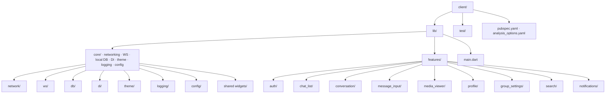
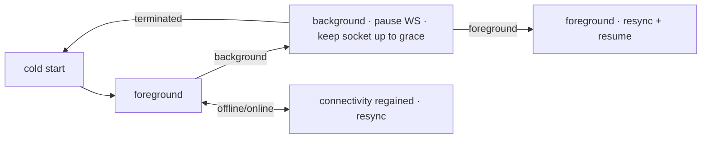
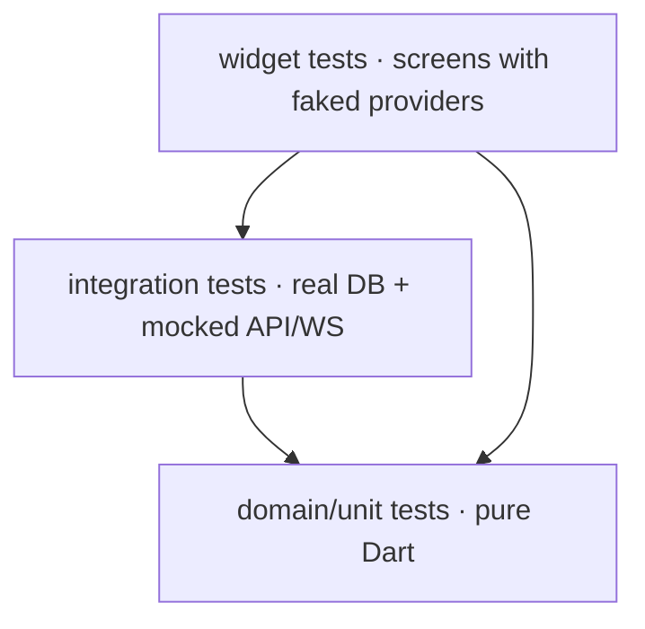
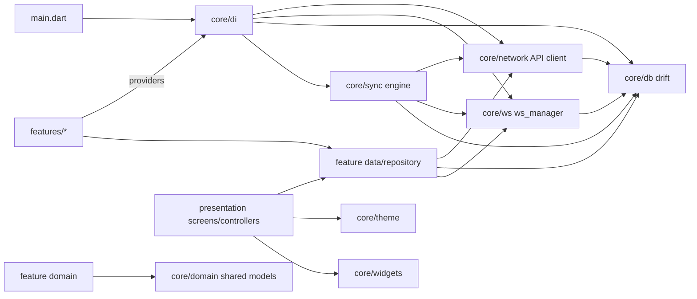

# Messaging Platform — Flutter Engineering Guide

| | |
|---|---|
| **Document** | Flutter Engineering Handbook v1.0 |
| **Audience** | Every Flutter engineer and every AI coding agent working on the client |
| **Status** | **Official engineering standard.** Follow it exactly. |
| **Source of Truth (in order)** | Finalized UI/UX → `ARCHITECTURE.md` → `DATABASE.md` → `API.md` → `ENGINEERING.md` → **this guide** |
| **Stack (fixed)** | Flutter (latest stable) · Dart · Material 3 |
| **Client design target** | Global messaging app: offline-first, realtime, hundreds of millions of devices |

> This guide tells the client team **how to build** inside the finalized UI/UX and API contract. It restates no product or API decisions. Where it references `API.md` sections, the API contract is authoritative. **No Flutter/Dart code is generated in this document** — it is a practice handbook, not an implementation.

---

## Table of Contents

1. [Engineering Philosophy](#1-engineering-philosophy)
2. [Project Folder Structure](#2-project-folder-structure)
3. [Feature-First Architecture](#3-feature-first-architecture)
4. [State Management](#4-state-management)
5. [Dependency Injection](#5-dependency-injection)
6. [Navigation Architecture](#6-navigation-architecture)
7. [API Layer](#7-api-layer)
8. [WebSocket Client Architecture](#8-websocket-client-architecture)
9. [Local Database & Caching Strategy](#9-local-database--caching-strategy)
10. [Offline-First Strategy](#10-offline-first-strategy)
11. [Repository Pattern](#11-repository-pattern)
12. [Error Handling](#12-error-handling)
13. [Logging](#13-logging)
14. [Theme Organization](#14-theme-organization)
15. [Reusable Widgets](#15-reusable-widgets)
16. [Environment Configuration](#16-environment-configuration)
17. [Push Notification Integration](#17-push-notification-integration)
18. [Media Picker Architecture](#18-media-picker-architecture)
19. [Background Tasks](#19-background-tasks)
20. [App Lifecycle Handling](#20-app-lifecycle-handling)
21. [Performance Optimization](#21-performance-optimization)
22. [Testing Strategy](#22-testing-strategy)
23. [Security Best Practices](#23-security-best-practices)
24. [Code Style & Naming Conventions](#24-code-style--naming-conventions)
25. [Appendix A — Dependency Map](#appendix-a--dependency-map)
26. [Appendix B — Checklist for Every Client PR](#appendix-b--checklist-for-every-client-pr)

---

## 1. Engineering Philosophy

Six principles guide every Flutter decision in this codebase.

1. **The local device is a first-class citizen, not a cache.** This is an offline-first messaging product (`ARCHITECTURE.md` §33, `API.md` §12). The local database is the *source of truth for the UI*; the server is the source of truth for *durability*. The UI renders from local state always, and syncs in the background.
2. **Feature-first, not layer-first.** Files are grouped by feature (chat list, conversation, auth) so a feature is self-contained and a team can own it end-to-end. Layers (data/domain/presentation) exist *inside* each feature (`ARCHITECTURE.md` §8 already dictates the feature folders).
3. **One reactive data graph.** Every screen is a pure function of state coming from one state-management system, fed by repositories that merge local DB streams + WS + API. No "setState pyramids", no imperative plumbing between screens.
4. **Everything is testable by default.** Business logic lives outside widgets (controllers/notifiers), data access lives behind repositories, and the database is injectable. A widget test that needs the real network or real filesystem is a smell.
5. **Material 3 as shipped, not customized.** The finalized UI/UX is Material 3; the theme layer (token → component → screen) mirrors the design tokens exactly, so the app stays visually consistent and the design system can evolve without touching widgets.
6. **Measure before optimizing.** Performance rules (list building, image decoding, widget granularity) are followed by discipline, but profiling (`flutter run --profile`, DevTools) decides where effort goes. Premature optimization is rejected like it is on the backend.

---

## 2. Project Folder Structure

The structure is dictated by `ARCHITECTURE.md` §8. Reproduce it exactly:



### 2.1 Top-level rules

- **`core/`** — infrastructure shared by all features: networking (API client), WS client, local DB, DI graph, theme, logging, environment config, and generic reusable widgets. **`core/` never imports `features/`.** This is the one hard dependency rule of the client.
- **`features/`** — one folder per finalized UI surface (`auth`, `chat_list`, `conversation`, `message_input`, `media_viewer`, `profile`, `group_settings`, `search`, `notifications`). A feature may import `core/` and other features *via shared domain interfaces only* — never reach into another feature's widgets/state.
- **`main.dart`** — the composition root: `runZonedGuarded` bootstrap, DI container init, theme, router, `WidgetsFlutterBinding.ensureInitialized()`. Thin by design.

### 2.2 Why feature-first

Feature-first flips the cost curve: adding a feature touches one folder; removing one deletes one folder; a code review of a feature reads one story end-to-end. Layer-first (all `screens/`, all `models/` at the root) collapses into a dependency maze the moment the app passes ~20 screens — and a messaging app has many screens sharing live state. The features are already defined by the finalized UI; the folder structure just mirrors them.

---

## 3. Feature-First Architecture

### 3.1 The three layers inside every feature

Each feature folder contains (in increasing dependency order):

```
features/conversation/
├── data/                     # talks to the outside world + local DB
│   ├── conversation_api.dart        # REST calls (thin)
│   ├── conversation_repository.dart # merges API + DB + WS (§11)
│   └── conversation_dao.dart        # local DB table access
├── domain/                   # pure Dart models + contracts (no Flutter imports)
│   ├── conversation.dart
│   ├── message.dart
│   └── conversation_repository.dart  # abstract contract
└── presentation/             # UI + state
    ├── screens/              # conversation_screen.dart
    ├── widgets/              # message_bubble.dart, day_separator.dart
    └── controllers/          # conversation_controller.dart (§4)
```

Rules:
- **`domain/` is pure Dart** — no `package:flutter`, no network, no DB. It can be unit-tested on a Dart VM in milliseconds.
- **`data/` imports `domain/`** and implements its contracts. Never the reverse.
- **`presentation/`** holds state and widgets; it consumes `domain` contracts through providers, never the raw DAO or API client directly.

### 3.2 When to add `domain/`

The `domain/` layer is added **only when a feature has logic that isn't trivial CRUD** — merge rules, unread math, message-status mapping, conversation ordering. For the chat list and conversation feature this is certainly true (offline merge + ordering); for a simple settings screen it may not be. Rule: **extract logic into `domain/` when it's reused across screens or when it's non-trivial; don't add a ceremony layer to a form.** This matches the researched industry consensus for 2026 Flutter: MVVM + feature-first + domain only when it earns its keep.

### 3.3 Feature boundaries

- A feature's state/controller is private to the feature. Cross-feature data flows **through the repository layer or through `core/` services** (e.g., the conversation feature updates the chat list's unread state via the shared repository, not by calling `ChatListController`).
- Shared domain models (e.g., `Message`) live in `core/domain/` when used by ≥ 2 features, or in the owning feature and are re-exported. Default: **models used by multiple features live in `core/domain/`**.

---

## 4. State Management

### 4.1 Recommendation: Riverpod (flutter_riverpod)

Riverpod is the mandated state-management solution. Reasons (researched and confirmed against this codebase's needs):

- **Async-first ergonomics.** `AsyncValue` (data/loading/error) maps 1:1 onto the app's reality: every screen renders `AsyncValue`, every repository returns `Stream`/`Future`. This removes a whole class of hand-rolled loading/error booleans.
- **Compile-time-safe DI without `BuildContext`.** Providers replace `BuildContext`-based lookups, so state can be read from controllers, services, and background isolates — which this app requires (WS messages arrive outside widgets).
- **Fine-grained rebuilds and testability.** Provider scoping + `select` keep rebuilds narrow; a ProviderContainer tests logic with zero widget tree.
- **Deterministic lifecycle.** `ref.watch`/`ref.listen` and auto-dispose give explicit, predictable state lifetimes — essential when dozens of live sockets and streams are in play.

### 4.2 Patterns to use

- **`Notifier`/`AsyncNotifier` for feature state** (`@riverpod` codegen via `riverpod_annotation` is the default — less boilerplate, generated `ref`-aware classes).
- **`StreamProvider` for live data** fed by repository streams (DB → repository → provider). Screens watch the provider; new rows from WS just appear.
- **`FutureProvider` for one-shot loads** (profile fetch).
- **`Provider` for pure dependencies** (API client, WS manager, config).
- **`select` on large state objects** so widgets rebuild only on the slice they read (e.g., a message bubble watches only `status`, not the whole conversation state).
- **Controllers keep side effects out of widgets:** a controller holds the feature's commands (`sendMessage()`, `markRead()`) and updates state; widgets only dispatch.

### 4.3 Anti-patterns

- No `setState`-driven app state outside local widget state (text field cursor, dialogs).
- No `InheritedWidget`/`provider` for new code; no manual `ChangeNotifier` chains.
- No provider that reaches into another feature's providers (cross-feature through repositories only, §3.3).
- No `StreamController` for data that already flows through Riverpod — Riverpod *is* the stream layer.

---

## 5. Dependency Injection

### 5.1 Recommendation

**Riverpod providers are the DI container.** There is no separate `get_it`/`injectable` container. Because Riverpod providers are the container, DI and state are one system (no two-source-of-truth problem).

### 5.2 Rules

- Every external service (API client, WS manager, DB, logger, config, push service) is exposed as a top-level provider in `core/di/`. Consumers take providers via `ref`, never construct dependencies inline.
- **Override at test time:** `ProviderContainer(overrides: [...])` substitutes fakes — the same mechanism prod uses, so tests exercise the real graph with swapped leaves. This is the biggest testability win on the client.
- **Lifetime matters:** `ref.read`/`ref.watch` decide whether a provider is per-widget or app-scoped. App-scoped singletons (API client, DB) live in `ProviderContainer` at `main`; per-feature state is auto-disposed (`autoDispose` or scope) so screens don't leak live WS subscriptions when popped.
- **No static service locators, no `GlobalKey`-based hacks.** Everything flows through the container.
- **The WS manager and sync engine are singletons** injected into repositories (see §8, §11) — they are shared, but their *subscriptions* are per-feature and lifecycle-managed.

---

## 6. Navigation Architecture

### 6.1 Recommendation: go_router

- **Declarative routing** with a route table in `core/router`, matching the finalized navigation flows (auth → chat list → conversation → media viewer; search, notifications, profile, group settings).
- **Deep links are a first-class requirement** (`API.md` §19.8: `socialmedia://chat/{id}?seq=...`); go_router's path-based routes + `onGenerateRoute` handle both app-internal navigation and OS deep links from one table.

### 6.2 Rules

- **One router, one `RouterConfig`, in `core/router`.** Screens navigate by `context.push`/`context.go` with typed route *names*, never by constructing `MaterialPageRoute` ad hoc in widgets.
- **Auth guard:** a `redirect` on the router watches the auth provider: unauthenticated → `/login`; expired token + failed refresh → login; suspended account → error screen. Guards live in `core/router`, not in every screen.
- **Pass minimal data between routes.** Prefer passing IDs + letting the destination read its own state from providers over passing whole objects. This keeps routes decoupled and makes deep-link navigation identical to in-app navigation (both only have IDs).
- **Nested navigation per tab/stack** where the UI needs it (bottom tabs inside chat area) via `StatefulShellRoute`.
- **Dialogs/sheets are not routes by default** unless they need deep-linkable state (e.g., media viewer). Keep ephemeral UI local.

---

## 7. API Layer

### 7.1 Recommendation

A single `core/network/api_client.dart` over **Dio** (interceptors, typed errors, progress for uploads) or the pure `http` package with a thin wrapper. Choose Dio if upload progress + interceptors earn their weight; choose `http` if the team prefers fewer deps. **The decision is documented in an ADR and locked** — the important part is the *shape*, not the package.

### 7.2 The contract (from `API.md`)

The API layer is a faithful implementation of `API.md`:

- Base URL + `/v1` per environment (§16), `Authorization: Bearer`, `X-Device-Id`, `Idempotency-Key` on unsafe writes, `X-Request-Id` correlation (`API.md` §2.3).
- **Typed request/response models** mirroring the API JSON (snowflake IDs as **strings** — `API.md` §2.2 — never `int`).
- **Pagination helper** for the envelope `{data, pagination}` (`API.md` §2.4) returning typed pages + the next cursor.
- **Central error mapping** to the RFC 9457 envelope (`API.md` §2.5): every API exception carries `code`, `status`, `detail`, `errors[]`, `retryable`. The client *never* parses raw Dio/http errors — one interceptor maps them once.
- **Auth interceptor:** attaches the access token; on `401 TOKEN_EXPIRED` performs a single-flight refresh (`API.md` §4.4), replays the original request once, and on refresh failure signs out + redirects to login.
- **Retry policy** mirrors `API.md` §2.8/`Retry-After`: retry only `retryable` codes with exponential backoff + jitter, honor `429` `Retry-After`, and never auto-retry 4xx business errors.

### 7.3 Rules

- One API method per endpoint, named by action (`sendMessage`, `getMessagesBefore`), grouped by resource into `core/network/<resource>_api.dart` or per-feature `data/`.
- **Uploads** use the two-phase flow (`API.md` §9.1–9.3) with progress callbacks; the media feature owns the flow, the API client owns the bytes.
- No API call from a widget — always through repository → controller (`API.md` is consumed by `data/` only).
- **Timeouts:** connect/receive timeouts from `API.md` §16.7–27 budgets; a hanging request is worse than a failed one.
- Every API call carries a `request_id` for server-side correlation with logs.

---

## 8. WebSocket Client Architecture

### 8.1 Recommendation

A single `core/ws/ws_manager.dart` that owns the socket lifecycle, exposed as one injectable singleton. It implements `API.md` §16–§18 exactly:

- **States:** `disconnected → connecting → open → resuming → closed`, driven by the socket stream + a status `Notifier`/`AsyncNotifier` (UI shows connection state in the chat-list banner, per finalized UI).
- **Envelope:** frames are typed (`{v, id, type, seq, at, data}`), parsed centrally into strongly-typed event objects (`MessageCreated`, `ReceiptRead`, `PresenceChanged`, …) matching `API.md` §18 — one parser, one event type per S2C event.
- **Auth handshake:** `hello` with access token + device/session ids after HTTP auth succeeds (`API.md` §17.1). On `TOKEN_EXPIRED`, refresh then reconnect.
- **Heartbeat:** client `ping` every 25s, auto-reconnect with exponential backoff (1s→60s, jitter) on missed pong (`API.md` §16.7).
- **Resume:** on reconnect, send `resume { last_seq, last_global_seq }` (`API.md` §16.6); on `resume_rejected`, fall back to `sync/delta` (§10).

### 8.2 Rules

- **WS events go to repositories, not widgets.** The WS manager dispatches parsed events to a lightweight in-process event bus; repositories (conversation, message, presence) subscribe and update their local DB / cache. The UI updates reactively from the DB stream. This is what keeps the app correct offline and online with one code path.
- **Outgoing WS frames** (typing, presence, receipt acks) are fire-and-forget with ack tracking (`API.md` §17); **durable writes go through REST** (`API.md` §17.4 note) — the WS convenience path calls the same repository method, which prefers REST with `Idempotency-Key`. Never "send message" over WS as the *only* path.
- **Ack bookkeeping:** track the last processed `seq` and last acked `global_seq` in the sync layer (§10); this is what makes resume cheap.
- **Reconnect is the responsibility of `ws_manager`, not features.** Features observe connection state and act (re-sync), they never own reconnection.
- **Backpressure:** inbound frames are processed sequentially on a single logical queue (don't let a WS burst spawn unbounded futures); outbound ephemeral frames are throttled per `API.md` §16.8.
- **Memory:** a conversation screen's WS subscription is disposed when the screen closes; the socket itself stays (global) but per-conversation channels are unsubscribed (`API.md` §17.3).

---

## 9. Local Database & Caching Strategy

### 9.1 Recommendation

**Drift** (SQLite, reactive streams) as the offline database. Reasons: type-safe tables + generated DAO API, reactive `Stream` query results that feed Riverpod `StreamProvider` directly (the "local DB as source of truth" loop), ACID transactions for the sync queue, and native SQLite for hundreds of thousands of messages (superior to pure KV stores like Hive for relational, ordered message data — the researched consensus for sync-heavy apps).

Complementary:
- **Hive/`shared_preferences`** only for tiny app-level preferences (theme, last-route, onboarding flag).
- **flutter_secure_storage** for tokens/secrets (§23).

### 9.2 The schema mirrors the server

The local schema is a **subset projection of `DATABASE.md`** tables needed offline: `conversations`, `messages`, `members`, `contacts`, `presence`, `sync_state` (global_seq cursor), `outbox` (pending writes). IDs remain strings (server snowflakes). Messages key on `(conversation_id, sequence)` like the server (`DATABASE.md` §5.3) so ordering and dedup are identical.

### 9.3 Rules

- **The UI reads the DB, never the network.** Every screen's provider watches a DB-backed repository stream. Network fetches only populate the DB.
- **WAL mode, `foreign_keys` on** (crash-safe, concurrent reads).
- **Migrations are versioned** (`schemaVersion` bump + `MigrationStrategy`), matching `API.md`/`DATABASE.md` additive evolution. Schema changes are never destructive on upgrade.
- **Every query on the hot path is indexed** (conversation list by `last_message_seq`, messages by `(conversation_id, sequence)`).
- **Retention:** prune old message bodies per `API.md` §13 storage settings (auto-download/cache limits), and keep sync cursors small.

---

## 10. Offline-First Strategy

### 10.1 Principle

**Write locally, sync later; read locally, always.** The device is authoritative for *display*; the server is authoritative for *durability* (`ARCHITECTURE.md` §33, `API.md` §12).

### 10.2 Write path

1. User sends → the repository **writes to the local DB and appends to a durable `outbox` queue in the same transaction** (message content + `client_msg_id` + `Idempotency-Key`).
2. UI renders the message as `queued` instantly (optimistic).
3. A sync engine drains the outbox over REST (`API.md` §8.2) using the same `client_msg_id` — **retries are idempotent by construction** (`API.md` §2.7, §8.2).
4. On success, the row is updated with the server's `id`/`sequence`/`status`. On failure, it stays queued with backoff (visible "not sent" affordance per UI).

### 10.3 Read path (delta sync)

1. On start/resume: `GET /v1/sync/snapshot` on first install; then `GET /v1/sync/delta?cursor=<global_seq>` loop until `has_more=false` (`API.md` §12). Apply rows to the local DB transactionally; ack cursor (`POST /v1/sync/cursor`).
2. Live: WS events (`message.created`, `receipt.read`, …) are applied to the DB through the same write path — so **online and offline convergence share one code path** and duplicates dedupe on `(conversation_id, sequence)`/`id`.
3. Conflict policy: server wins for messages (sequences are authoritative); local UI state (typing, drafts) is local-only. `client_msg_id` makes client retries idempotent — the researched "crash-safe mobile data engine" model.

### 10.4 Rules

- **One sync engine** (`core/sync/`) owning the cursor, outbox drain, and delta loop; triggered by: WS reconnect, connectivity regained, foreground, and periodic background task (§19). No per-feature ad-hoc sync.
- **Sync is batched and bounded** (e.g., ≤500 rows/delta, ≤50 outbox ops/run) to stay battery- and CPU-friendly.
- **A global connectivity listener** (`connectivity_plus`) toggles the "offline" banner and pauses/resumes the engine — never start a sync when offline.
- **Queue telemetry:** outbox depth, oldest pending age, sync success rate, conflict count — surfaced in the debug drawer and to analytics (§13).

---

## 11. Repository Pattern

### 11.1 Principle

**A repository is the single interface a feature's state uses for data** — it hides whether data came from REST, WS, or the local DB, and it is the *only* place that combines them. This is the seam that makes the client testable and the offline story coherent.

### 11.2 Shape

Each feature's `data/` has a repository implementing a `domain/` contract:

```
ConversationRepository (contract)
  watchConversations() → Stream<List<Conversation>>   // from local DB
  sendMessage(...)                                     // outbox + REST
  markRead(conversationId, seq)                        // local + REST
  applyIncomingEvent(MessageCreated)                   // invoked by WS bus
```

Implementation details:
- **Reads are DB streams** (`drift` watch) — the UI reacts to local truth.
- **Writes go to DB + outbox first** (§10.2); the sync engine pushes outward.
- **The repository subscribes to the WS event bus** and folds events into the DB (dedup on `id`/`sequence`).

### 11.3 Rules

- Widgets/controllers **never** call the API client or the DAO directly; they call the repository. Enforced by convention + code review.
- Repositories are injected via providers (`core/di`), overridden in tests with in-memory fakes.
- A repository may coordinate multiple data sources, but **it never contains business rules that belong in `domain/`** (merge rules, ordering, status mapping live in domain models).
- Keep repository methods narrow (verbs) so mocks/fakes stay tiny.

---

## 12. Error Handling

### 12.1 Principle

Errors are **typed, mapped once, and surfaced at the right layer.** The UI never sees raw exceptions from Dio or the DB.

### 12.2 Rules

- **One canonical exception hierarchy** in `core/errors`:
  - `ApiException` — mapped from the RFC 9457 envelope (`code`, `status`, `detail`, `errors`, `retryable`) by the API interceptor.
  - `NetworkException` — connectivity/timeout; `retryable`.
  - `AuthException` — token issues (drives the auth guard + refresh).
  - `LocalStoreException` — DB/disk failures (degrade, don't crash).
  - `DomainException` — business rules surfaced from domain logic.
- **Map at the boundary:** API interceptor → `ApiException`; sync engine → typed sync errors; repository → feature-level results.
- **Controllers expose error state through `AsyncValue.error`** (Riverpod) — screens render an error widget with retry; they never `catch` and stringify.
- **Retry is centralized:** the API client auto-retries retryable errors with backoff + `Retry-After`; sync retries its queue; UI retry buttons just re-dispatch the same repository command (idempotent by `Idempotency-Key`/`client_msg_id`).
- **Never show a raw exception string to a user** — map to a localized message keyed by `code` (`API.md` Appendix A codes), with the `request_id` embedded in the report.
- **Failures are logged with context** (§13) and reported to crash analytics with the typed error, not swallowed.
- **Last-resort `runZonedGuarded`** in `main` catches unhandled async errors → log + report + safe fallback screen (never a silent hang).

---

## 13. Logging

### 13.1 Principle

The client logs **structured, leveled, privacy-aware, and local-first** (device logs are small; analytics + crash reporting are the cloud sinks).

### 13.2 Rules

- **A `core/logging` facade** (`Logger`) wrapping `dart:developer`/`package:logger` — a thin typed API (`.info`, `.warn`, `.error`, `.debug`) with tag/context, so the backing implementation can be swapped.
- **Levels:** debug (verbose, local only), info (lifecycle: session start, sync tick, WS reconnect), warn (retries, degraded sync), error (failures with context).
- **Context is keyed, not interpolated:** `logger.error('sync failed', error: e, extra: {cursor, attempt})`. No `print()` in shipped code (lint forbids).
- **Correlate with the backend:** log the same `request_id` the API client sends (`API.md` §2.3) so a client issue maps to server logs.
- **Privacy:** never log message *content*, tokens, OTPs, or PII. Log IDs, sizes, states, durations. A redaction helper is mandatory at every log site that touches request bodies.
- **Sinks:** in debug — console; in prod — local ring buffer + on-demand export for support, plus `Sentry`/analytics for errors/events. Never dump the whole DB to logs.

---

## 14. Theme Organization

### 14.1 Principle

Material 3 is the design system. The app separates **tokens → theme → widgets** so design changes touch one file, not a hundred.

### 14.2 Three layers

1. **Design tokens** (`core/theme/tokens.dart`): the raw values — color palette (light/dark), typography scale, spacing, radii, motion durations, elevation. These mirror the finalized UI/UX spec exactly (M3 seed colors, dynamic color where enabled).
2. **`ThemeData` construction** (`core/theme/app_theme.dart`): `ThemeData(colorScheme: ..., textTheme: ..., componentThemes: ...)` built *from tokens* via a `buildTheme(Brightness)` function. **No magic colors in widgets** — only `Theme.of(context)` / tokens.
3. **App widgets**: consume the theme. Reusable styled widgets (`CoreButton`, `CoreTextField`, `AppBar`) use theme defaults; feature screens compose them.

### 14.3 Rules

- **M3 is shipped as-is** (`useMaterial3: true`); the finalized UI defines the seed colors. Custom theming beyond tokens is rejected unless the UI demands it.
- **Dark mode** is a first-class token set, toggled from settings (`API.md` §5.2 `theme`) and applied at `MaterialApp` root — never per-screen.
- **Text styles** come from `textTheme`, never ad-hoc `TextStyle` literals in screens.
- **Dynamic color (Material You)** is optional and off by default to keep brand identity; if enabled, tokens must fall back for custom surfaces.
- **Localization-ready:** all user-facing strings use the l10n mechanism (`flutter_localizations` + ARB), never string literals in widgets. RTL is a requirement (the product supports Arabic).

---

## 15. Reusable Widgets

### 15.1 Principle

Shared widgets live in `core/widgets/` (truly generic: `CoreAvatar`, `CoreListItem`, `CoreErrorState`, `CoreLoadingState`, `CoreBanner`, `CoreBottomSheet`) and `shared/` at feature level (feature-composing). **A widget is promoted to `core/widgets` only when 2+ features use it** — premature abstraction is churn.

### 15.2 Rules

- **Widgets are dumb:** they take data + callbacks, never own providers or business logic. State lives in controllers (§4).
- **Screens are composition, not logic.** A screen builds layout from `core`/shared widgets + feature widgets; a screen over ~200 lines is a review flag (split widgets).
- **Every `core` widget has a widget test** with golden-less assertions (semantics + behavior) where practical (§22).
- **Custom painting/animations are isolated** in their own widgets with clear repaint bounds.
- **No deep widget trees for hot lists** — use list builders (§21).

---

## 16. Environment Configuration

### 16.1 Principle

**Build-time environments via `--dart-define`, no runtime switches.** The app is built once per environment; configuration is injected, never hardcoded.

### 16.2 Rules

- **`AppConfig`** built at startup from `String.fromEnvironment`:
  - `API_BASE_URL` (per `API.md` §2.1), `WS_URL`, `SENTRY_DSN`, `PUSH_*` project ids, feature-flag defaults.
  - Read once in `main`, exposed via a `Provider<AppConfig>`; nothing reads `--dart-define` again.
- **Environments:** `dev` (localhost / staging endpoints), `staging`, `prod`. Each has a documented build command (`flutter build apk --dart-define=ENV=prod ...`).
- **No secrets in `--dart-define` for prod credentials.** Public config only (base URLs, API keys that are public like map keys); secrets live server-side or in secure storage (§23).
- **Version coupling:** the client sends `app_version` and reads `client_version`-negotiated features per `API.md` §2.3 / `ENGINEERING.md` §41; the client and server releases are coordinated via the version table.
- **Local dev points at Docker Compose backend** (`infra/docker/docker-compose.yml`), not at staging — parity rule (§12 backend guide analog).

---

## 17. Push Notification Integration

### 17.1 Principle

Push is **a delivery accelerator for offline/backgrounded state, never the source of truth.** Foreground updates come from WS; push wakes the app, then the sync engine converges with `sync/delta` (`API.md` §12, §14.5).

### 17.2 Rules

- **Provider:** FCM (Android + iOS via FCM/APNs token bridge) per `ARCHITECTURE.md` §16 / `API.md` §14.4. The provider is behind a thin `PushService` interface so a second provider can be added.
- **Token lifecycle:** register/refresh the token with the server on login and on token rotation (`PUT /v1/devices/{device_id}/push_token`, `API.md` §14.4); **delete on logout/uninstall** (`API.md` §13.3). Never leak the token into logs.
- **Payload handling:** a silent/data push (conversation_id, message_id, seq) triggers the sync engine; a user-visible push (title/body/preview) respects the finalized `preview_text` privacy setting (`API.md` §13.2, §14.5) — **when preview_text is off, send no content in the payload**, only "New message".
- **Tap handling:** tap → deep-link into `socialmedia://chat/{id}?seq=...` via the router (§6); the conversation screen loads the targeted page (`API.md` §19.8).
- **Foreground:** push received while app is foregrounded is suppressed by the OS setting or handled in-app as a tray item — the app must not double-render a message that WS already delivered (dedup on `id`/`seq`).
- **Permissions:** request permission lazily at first value moment, never at first launch (finalized UX: quiet until user acts).
- **Badges/coalescing:** per-conversation notification coalescing follows `API.md` §14.6; the app badge mirrors server unread counts via sync, not per-push increments.

---

## 18. Media Picker Architecture

### 18.1 Principle

**Pick → stage → upload → attach**, with the server's two-phase upload contract (`API.md` §9.1–9.3) as the boundary. Media is handled as files with metadata, never as base64 in memory.

### 18.2 Rules

- **Picker:** `image_picker`/`file_picker` (or a camera plugin) behind a `MediaPickerService` interface (testable, swappable). Selection returns files + metadata (name, mime, size, width/height/duration as applicable).
- **Client-side validation** mirrors server rules (`API.md` §9.1): size, kind, MIME; but **server-side is authoritative** (`UPLOAD_INTEGRITY` on sha mismatch, `API.md` §9.3).
- **Upload flow:** `POST /media/uploads` (client computes `sha256`, `size`, chunk size) → `PUT` chunks with `Content-Range` (resumable, progress callback) → `POST /complete` → message attach.
- **Offline uploads:** an attachment in the send box is staged locally; when offline, the message + media are queued and uploaded by the sync engine in order (media complete before message send). The `Idempotency-Key`/`client_msg_id` make retries safe.
- **Media rendering:** messages render the local file optimistically; on `media.ready` WS event (`API.md` §18.17) swap to the signed URL. Never cache signed URLs long-term — re-fetch via `GET /v1/media/{id}` when a URL 403s (`API.md` §9.5).
- **Thumbnails** are generated client-side for the picker/grid and replaced by server thumbnails when ready; the media viewer loads full-res on demand only.
- **Memory discipline:** stream bytes (never `readAsBytes` on large files), release file handles, honor the app's storage/cache quota (`API.md` §13).

---

## 19. Background Tasks

### 19.1 Principle

**Background work is minimal, scheduled, and OS-constrained.** The device OS is the scheduler; the app never self-launches unbounded background loops.

### 19.2 What runs in the background

1. **Outbox drain + delta sync** when network is available (`API.md` §12) — the sync engine's job.
2. **Push-triggered sync** on silent push (primary online mechanism — prefer this over polling).
3. **Periodic fallback sync** (conservative cadence, e.g., 15–30 min) for devices that missed pushes.

### 19.3 Rules

- **Use `workmanager`** (Android `WorkManager` / iOS `BGTaskScheduler`) for periodic + one-off background jobs; register a top-level `@pragma('vm:entry-point')` dispatcher that runs the sync engine in an isolate and exits cleanly. Respect `existingWorkPolicy.keep`/`replace`, network constraints, and battery conditions (`API.md`-aware, per the researched 2026 model).
- **Bounded batches** (≤ ~50 ops/run) to avoid ANR/watchdog kills; a job that needs more than one batch re-queues itself.
- **Event-driven first, periodic second:** foreground, connectivity regain, WS reconnect, and silent push are the primary sync triggers; the periodic job is the safety net. This follows Flutter's own offline-first guidance and minimizes battery cost.
- **Never do UI work from a background isolate** — background sync writes to the DB only; the UI reacts when foregrounded.
- **Idempotency everywhere:** background retries reuse the same `Idempotency-Key`/`client_msg_id`, so OS-killed-and-restarted jobs are safe (§10).
- **Telemetry:** background job outcomes (success/fail, counts, latency) are logged; silent failure of background sync for >24h is surfaced to the user ("content may be out of date").

---

## 20. App Lifecycle Handling

### 20.1 Principle

The app is a **state machine driven by OS lifecycle + connectivity**, and it must converge correctly at every transition. Lifecycle is owned in `main` / `core/app_lifecycle`, not scattered in features.

### 20.2 The transitions



### 20.3 Rules

- **`WidgetsBindingObserver` at app root** observes `AppLifecycleState`:
  - **inactive/paused:** flush pending receipts (`receipt.read`), mark presence offline (`API.md` §17.11), suspend typing, allow WS to close if the OS throttles it.
  - **resumed:** reconnect/resume WS (`API.md` §16.6), re-run delta sync, re-announce presence, refresh push token if rotated.
- **Connectivity listener** (`connectivity_plus`) gates the sync engine and shows the offline banner (§10.4).
- **State persistence:** chat drafts, scroll position, and the router's last location persist across backgrounding so the resumed app restores UX (use a small prefs store, not the DB).
- **Do not block lifecycle transitions with network calls** — enqueue work to the sync engine and return.
- **Grace periods:** backgrounded WS is kept only while the OS allows; never fight the OS with keep-alives. The resume protocol (`API.md` §16.6) makes a closed socket harmless.
- **Test lifecycle explicitly** (integration/widget tests drive simulated lifecycle transitions) — this is where realtime apps most commonly break.

---

## 21. Performance Optimization

### 21.1 Principle

Performance targets follow the backend budgets (`ARCHITECTURE.md` §32): chat list opens from local DB in < 100ms, message send renders optimistically in < 50ms, WS→screen latency < 300ms p95. **Profile before optimizing; the rules below are the default discipline.**

### 21.2 Rules

**Building**
- **`ListView.builder`/`SliverList` for anything longer than ~20 items** — never `Column` of messages. Message lists are virtualized.
- **`const` constructors everywhere a widget can be const** (lint enforced) — this is the highest-ROI perf habit in Flutter.
- **Widget granularity:** split rebuild scopes so a message-status change rebuilds one bubble, not the whole list (§4 `select`).
- **`RepaintBoundary`** around heavy/custom-painted widgets (avatar stacks, animated stickers); avoid it in simple lists (each boundary costs memory).

**Data**
- **Local DB is the UI's data source** (§9) — no async gaps on scroll; the DB stream emits row-level updates, not full-list rebuilds.
- **Paging from DB with keyset semantics** (`(conversation_id, sequence)`) matching `API.md` §2.6 — no loading "all messages".
- **Image handling:** `cached_network_image` with proper cache dimensions; decode at display size (`cacheWidth`/`cacheHeight`) not full-resolution; never decode a 12MP photo to show a 96px thumbnail. Images are the #1 memory killer on low-end devices.

**Runtime**
- **Avoid `print`/`debugPrint` in prod paths; avoid hot allocations in `build`.**
- **Isolate heavy work** (JSON of large sync pages, image encode) off the UI isolate; keep the UI thread for frames only.
- **Profile with DevTools (`flutter run --profile`)** on a mid-range device; flame graphs decide where to invest. Frame jank > 16ms on scroll is a bug, not a feature.
- **Reduce app size:** tree-shake icons, review asset sizes, use `--split-debug-info`, target bundle compression. Startup time is a product metric.

---

## 22. Testing Strategy

### 22.1 The pyramid (mirrors the backend guide)



| Layer | Scope | Doubles | Runtime |
|---|---|---|---|
| **Unit** (`domain/`) | models, merge rules, unread math, status mapping, cursor logic | none (pure) | ms |
| **Controller/unit** | controllers with a `ProviderContainer` + overridden repositories | in-memory fakes | ms |
| **Widget** | screens: render, interactions, error states, navigation | faked providers, no network | s |
| **Integration** | repository (Drift in-memory + mocked API/WS), sync engine, deep-link router | mocked HTTP/WS, real in-memory DB | min |
| **Golden/e2e** | critical flows (login→list→conversation→send→receipt), a few goldens | full app, `integration_test` | min |

### 22.2 Rules

- **Test behavior, not implementation:** assert rendered states, controller outputs, repository merges — not internal calls.
- **Riverpod makes controller tests trivial:** build a `ProviderContainer` with overrides, call commands, assert `AsyncValue` states (§5.2).
- **Drift supports in-memory DBs** for repository tests — no SQLite file mocks.
- **Mocked HTTP/WS via a fake `ApiClient`/fake `WsManager`**; never hit the network in widget tests. `http`'s `MockClient` or a fake repository are the tools.
- **Lifecycle/offline tests are mandatory:** simulate offline write → reconnect → dedupe; resume after forced disconnect; a WS gap covered by delta sync (§8, §10). This is the app's core reliability claim.
- **Widget tests for every `core` widget + every screen's happy + error + empty states** (per finalized UI: empty states matter).
- **Coverage targets:** ≥ 70% across `domain/`+`data/`, ≥ 60% overall. Coverage is a floor; the reliability paths (sync, receipts, WS resume) demand higher.
- **Deterministic time:** inject a `Clock` into anything time-sensitive (mute-until, edit windows, presence expiry).
- **CI runs** `flutter analyze` (zero issues), `dart format --set-exit-if-changed`, unit + widget tests, and the integration suite on at least one Android + iOS emulator; `-d` release build smoke.

---

## 23. Security Best Practices

### 23.1 Principle

The client holds the user's keys to the platform — tokens, media, and local copies of messages. It is a **trust boundary** with the same seriousness as the server (`ARCHITECTURE.md` §30).

### 23.2 Rules

**Tokens & secrets**
- Access + refresh tokens live in **`flutter_secure_storage`** (Keychain/Keystore-backed), never in `shared_preferences`, never in memory copies longer than needed, never in logs.
- Refresh tokens are used only on the refresh endpoint (`API.md` §4.4); the access token lives only for its TTL. On logout/logout-all/session-revoked (`API.md` §4.5–4.8, §18.19) purge all tokens + local session state.
- **Root/JB detection** is best-effort (informational, not blocking) — report on jailbroken devices; never store secrets outside secure storage regardless.

**Transport & integrity**
- TLS only, certificate pinning for the API/WS hosts in prod builds (via `http`/Dio pinning or platform config); disable pinning in debug builds only.
- Never accept a downgrade to HTTP. Validate the WS URL scheme (`wss://`).

**Local data at rest**
- The SQLite DB contains message content — **encrypt it with SQLCipher** (`sqlcipher_flutter_libs` + Drift), key stored in secure storage. This is a privacy requirement for a messaging product (`DATABASE.md` PII posture).
- Media files on disk are stored in the app sandbox; sensitive media at rest is handled by the OS file protection level; avoid downloading sensitive content to shared/public storage.
- Purge local data on account deactivation/delete (`API.md` §5.5) and honor retention settings (`API.md` §13).

**Code & supply chain**
- **No secrets in source or `--dart-define` for prod** (§16); no hardcoded keys/endpoints in the app binary.
- **Pin dependency versions** (`pubspec.lock` committed), run `dart pub outdated` + `osv-scanner` in CI, review new dependencies (the app is high-value attack surface).
- Sanitize any URL/deep-link input before opening (no arbitrary scheme handling); validate message render paths (no HTML injection surfaces in Flutter, but keep rich-text rendering confined to trusted formats).

**Realtime**
- WS handshake authenticates with the access token (`API.md` §16.1); the socket must be torn down on `session.revoked` (`API.md` §18.19) and the user returned to login.
- Verify `hello_ack` identity matches the logged-in user before trusting inbound events.

---

## 24. Code Style & Naming Conventions

### 24.1 Tooling (enforced in CI)

- **`dart format`** as the formatter (config in `analysis_options.yaml`) — CI fails on unformatted code.
- **`flutter analyze`** with the core + recommended lint sets (`flutter_lints` + selected `package:lints`), zero issues required. Custom rules (avoid `print`, prefer `const`, require typed parameters) are in the repo lint config.
- **`dart fix`** runs on every file before commit.

### 24.2 Naming conventions (Dart official style, enforced by lints)

- **Files:** `snake_case.dart` (one primary class per file, file named after it: `conversation_screen.dart`).
- **Classes/enums:** `UpperCamelCase` (`ConversationScreen`, `MessageStatus`).
- **Variables/functions/methods:** `lowerCamelCase` (`sendMessage`, `lastReadSeq`).
- **Constants:** `lowerCamelCase` for local (`const kAppName` for library-level), `SCREAMING_SNAKE` only in platform interop; prefer `const` over `final` where possible.
- **Private:** `_leadingUnderscore`.
- **Types in JSON models:** fields mirror `API.md` JSON exactly (`last_read_seq` → `lastReadSeq` via `@JsonKey`), so model↔API mapping is mechanical.
- **Acronyms in types are capped** (`WSClient`, `APIError`, `OTPController`); Dart disfavors `ApiError`.

### 24.3 Code conventions

- **Screens are `StatelessWidget`/`ConsumerWidget`; controllers own state** (§4). A `StatefulWidget` needs a stated reason (focus, controllers, animation).
- **`BuildContext` is not a data holder** — `use_build_context_synchronously` lint; capture providers via `ref`/DI, not `context` after `await`.
- **Prefer `final` everywhere; avoid `var` in signatures.**
- **Avoid `dynamic`/`Object` where types exist**; model everything.
- **`//` comments explain why, not what**; doc comments (`///`) on public API of `core/` and `domain/`.
- **No `print`**, no debug leftovers; errors go through the logger (§13) or the error handler (§12).

---

## Appendix A — Dependency Map



**Invariant:** arrows point from features → core; core never depends on features. Within a feature: presentation → repository → API/DB/WS; domain is pure and depends on nothing but Dart.

---

## Appendix B — Checklist for Every Client PR

**Architecture & layering**
- [ ] Feature-first structure honored; no `core/` → `features/` import
- [ ] No widget calls the API client/DAO directly (repository only)
- [ ] Business logic in `domain/` or controllers — not in widgets
- [ ] State via Riverpod (no stray `setState` app state, no new `get_it`)

**Correctness & reliability**
- [ ] Offline write path: local DB + outbox + idempotent retry (`client_msg_id`) for every new write
- [ ] WS events folded into the DB through the repository; dedup by `id`/`seq`
- [ ] Resume/reconnect honored; `session.revoked` tears the socket down
- [ ] Lifecycle handled at root (flush receipts on background, resync on resume)
- [ ] Error handling: typed exceptions, `AsyncValue.error`, no raw strings to users, `request_id` reported

**Performance & polish**
- [ ] Lists are virtualized; images decoded at display size; `const` constructors used
- [ ] `flutter analyze` clean; `dart format` clean; no `print`
- [ ] Tests: unit for domain/controllers, widget for screens (happy/error/empty), integration for sync paths
- [ ] Localized strings via l10n; theme tokens used (no magic colors); dark mode respected

**Security & privacy**
- [ ] No secrets in code/config; tokens only in secure storage; no logging of content/PII
- [ ] TLS + pinning in prod builds; wss:// enforced; DB encrypted (SQLCipher)
- [ ] Push payloads respect `preview_text` privacy; tokens registered/cleared per `API.md` §14.4

---

*End of Flutter Engineering Guide. Official standard for all client work and for AI coding agents. Source-of-truth documents win on conflict; raise conflicts as a PR.*
