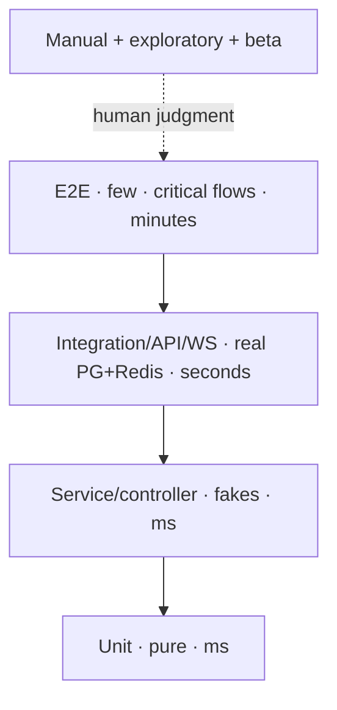
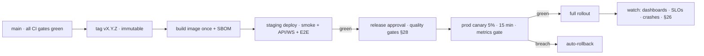

# Messaging Platform — QA, Testing & Release Engineering Handbook

| | |
|---|---|
| **Document** | QA, Testing & Release Engineering Handbook v1.0 |
| **Audience** | All engineers (backend, Flutter, DevOps/SRE), QA/SDET, release managers, on-call |
| **Status** | **Official quality and release standard.** Follow it exactly. |
| **Source of Truth** | `ENGINEERING.md` §32–§35, §41–§42 · `FLUTTER.md` §20–§22 · `ARCHITECTURE.md` §29, §32 · `DEVOPS.md` → this handbook. Do not redesign. |
| **Stack (fixed)** | Go · Flutter · PostgreSQL · Redis · Docker · Terraform · Cloudflare |
| **Launch** | India first (single region) → global scale later |
| **Scope** | Backend, Flutter app, and the release pipeline. No code. |

> This handbook is *quality and release operations*. It restates no product or architecture decisions; it tells every engineer, QA engineer, and release manager **how to prove the platform works, how to gate it, and how to ship it** — consistent with the source-of-truth documents. Practices are benchmarked against how Google, Meta (WhatsApp/Instagram/Messenger), Microsoft, and modern real-time messaging teams (Telegram, WhatsApp) run quality at scale.

---

## Table of Contents

1. [Testing Philosophy](#1-testing-philosophy)
2. [Quality Strategy & the Test Pyramid](#2-quality-strategy--the-test-pyramid)
3. [Test Environments, Data & Tooling](#3-test-environments-data--tooling)
4. [Unit Testing Strategy](#4-unit-testing-strategy)
5. [Integration Testing](#5-integration-testing)
6. [API Testing](#6-api-testing)
7. [WebSocket Testing](#7-websocket-testing)
8. [Database Testing](#8-database-testing)
9. [UI Testing](#9-ui-testing)
10. [End-to-End Testing](#10-end-to-end-testing)
11. [Performance Testing](#11-performance-testing)
12. [Load Testing](#12-load-testing)
13. [Stress Testing](#13-stress-testing)
14. [Security Testing](#14-security-testing)
15. [Accessibility Testing](#15-accessibility-testing)
16. [Device Compatibility Testing](#16-device-compatibility-testing)
17. [Network Condition Testing](#17-network-condition-testing)
18. [Offline Testing](#18-offline-testing)
19. [Regression Testing](#19-regression-testing)
20. [Beta Testing](#20-beta-testing)
21. [Bug Severity & Priority Classification](#21-bug-severity--priority-classification)
22. [Flaky Test Management](#22-flaky-test-management)
23. [Release Process](#23-release-process)
24. [Versioning Strategy](#24-versioning-strategy)
25. [Rollback Strategy](#25-rollback-strategy)
26. [Monitoring After Deployment](#26-monitoring-after-deployment)
27. [Crash Reporting](#27-crash-reporting)
28. [Quality Gates Before Production](#28-quality-gates-before-production)
29. [Production Readiness Checklist](#29-production-readiness-checklist)
30. [Appendix A — Test Artifacts](#appendix-a--test-artifacts)
31. [Appendix B — Toolchain & Ownership Matrix](#appendix-b--toolchain--ownership-matrix)
32. [Appendix C — Industry Practices Cheat Sheet](#appendix-c--industry-practices-cheat-sheet)

---

## 1. Testing Philosophy

**Quality is a property of the delivery system, not a phase.** The organizations that ship messaging apps used by billions — Google, Meta, Microsoft, Telegram, WhatsApp — did not get there by testing more at the end. They got there by making quality a gate *inside* the pipeline, so defects are found at the cheapest possible point and by the layer that is designed to catch them.

The platform's philosophy, in five commitments:

- **Shift-left, fast feedback.** The fastest test is the one that runs before the code reaches a human. Unit tests run on every push; integration and API tests on every PR; the whole pyramid before merge. A defect found in CI costs minutes; a defect found by a user costs a release. `ENGINEERING.md` §32.2 defines the layered pyramid this handbook operationalizes.
- **Confidence proportional to cost.** Google's test-sizes discipline (small/fast/isolated at the bottom, hermetic/slow at the top) is the model: most tests are small and run in milliseconds; few are large and run in minutes. We spend test budget on the **hot paths** — send, read, receipts, sync, realtime dispatch — not on cosmetics (`ENGINEERING.md` §32.1).
- **Behavior, not implementation.** Tests assert what the system *does* (states, contracts, outcomes), never how it does it internally. This is why the guides mandate fakes over mocks (`ENGINEERING.md` §35) and behavior-named tests.
- **The client is half the product.** A messaging platform lives and dies on its app. The Flutter client has its own pyramid (`FLUTTER.md` §22), and offline/sync/reconnect reliability — the product's core claim — is *mandatorily* tested, not optionally.
- **Release is a process, not a moment.** The release pipeline is a gated path (`ENGINEERING.md` §42, `DEVOPS.md` §8) with automatic rollback, and every release is a *release + watch* operation: dashboards, SLOs, and crash telemetry are part of the release, not afterthoughts.

**Why each commitment exists:** every one of these maps to a known failure mode — E2E-heavy suites that break constantly (test pyramid exists to prevent it), tests that pass but prove nothing (behavior-over-implementation), a perfect backend that loses the app market (client-first testing), and a release that goes well until it goes catastrophically (canary + auto-rollback + watch). Quality engineering is the discipline that turns these failure modes into found-and-fixed-before-users.

---

## 2. Quality Strategy & the Test Pyramid

The strategy is a **70 / 20 / 10 pyramid** (roughly 70% fast isolated tests, 20% integration/contract tests, 10% E2E and manual exploration), with the mobile side tilting toward a thicker integration layer because so much mobile value sits at the seam between app code and platform APIs — permissions, push, backgrounding, storage (`FLUTTER.md` §22.1). This mirrors what Google and Meta document publicly and what the backend guide already prescribes (`ENGINEERING.md` §32).

**Layer contracts (from `ENGINEERING.md` §32.2 and `FLUTTER.md` §22.1):**

| Layer | Scope | Doubles | Runtime | Owner |
|---|---|---|---|---|
| Unit (backend) | domain entities, state machines, invariants | none | ms | feature engineer |
| Unit (Flutter) | models, merge rules, unread math, cursor logic | none | ms | feature engineer |
| Service / controller | use-case orchestration, tx boundaries, events | fakes for ports | ms | feature engineer |
| Widget | screens, states, navigation | faked providers | s | feature engineer |
| Integration | repos against real PG/Redis, SQL, migrations | real PG/Redis (ephemeral) | s | feature + SDET |
| API / WS | full HTTP contract, realtime protocol | real stack in compose | s | SDET |
| E2E | send→receive, sync convergence, upload→download | full stack | min | SDET |
| Manual + beta | UX, real devices, real networks | humans | — | QA |

**Rules of the strategy:**

- **Coverage targets are floors, not goals** (`ENGINEERING.md` §32.3, `FLUTTER.md` §22.2): backend ≥ 80% on `domain/`+`application/`, ≥ 70% overall on hot-path modules; Flutter ≥ 70% on `domain/`+`data/`, ≥ 60% overall. Coverage below the floor blocks merge; coverage above it does not excuse missing behavior.
- **The pyramid is enforced in CI order** (§28): unit → integration → API/WS → E2E. A release cannot reach a higher layer with a failing lower layer.
- **The hot paths get full-depth coverage**: `send`, `read`, `receipts`, `sync`, `realtime dispatch` are tested at every layer; peripheral features get the layer appropriate to their risk.
- **Human testing is a layer, not a gap**: exploratory, usability, and accessibility checks are scheduled and owned — automation covers what is cheap and repeatable; humans cover what is judgment (`DEVOPS.md` §8 keeps them in the cadence).
- **No single gate owns quality**: the chain is CI → review → staging smoke → canary metrics → staged app rollout → crash monitoring. If a defect survives one gate, the next gate is designed to catch it.

**Why the pyramid exists:** the classic failure of QA programs is an inverted pyramid — dozens of flaky, slow E2E tests that nobody trusts and hundreds of shallow unit tests that assert nothing. The 70/20/10 discipline forces the expensive layers to stay thin and the cheap layers to be broad, so feedback stays fast (the currency of modern delivery) and confidence stays real.

---

## 3. Test Environments, Data & Tooling

### 3.1 Environments

| Env | Purpose | Data | Deploys | Rules |
|---|---|---|---|---|
| `dev` | local iteration | per-engineer ephemeral | compose stack (`DEVOPS.md` §3) | never shared state |
| `test/CI` | automated suites | ephemeral per-run (testcontainers / in-memory) | per-PR images | never touches other envs |
| `staging` | integration, smoke, E2E, load (pre-prod) | synthetic + anonymized fixtures, same schema | every tagged build | mirrors prod topology; **not** for perf-only surprises |
| `prod` | real users | real | canary → full | monitored (this handbook §26–§27) |
| `beta` | real users, opted-in | real | staged store rollout (§20) | crash-gated |

- **Promotion is strict** (`ENGINEERING.md` §12, `DEVOPS.md` §8): one image tag built once, promoted dev→test→staging→prod. A build that was never smoke-tested in staging cannot reach prod — this is a hard gate, not a guideline.
- **Staging runs the same migrations** as prod (`ENGINEERING.md` §34.2): schema parity is a prerequisite for believing any staging result.
- **Isolation:** integration/API/WS suites spin up ephemeral PG/Redis per run; the suite never reads or writes dev/staging/prod data (`ENGINEERING.md` §34.2). Tests sharing accounts is the #1 cause of order-dependent flake.

### 3.2 Test data strategy

- **Fixtures come from migrations + typed builders**, not scattered raw-SQL strings (`ENGINEERING.md` §34.2). A seed-fixture catalog (Appendix A) names the canonical scenarios: empty account, 1-on-1, group with roles, blocked contact, muted conversation, media-heavy conversation, huge conversation for paging.
- **Per-test isolation:** unique users, conversations, and `device_id`s per test run; no test depends on another test's state (order-independent).
- **Deterministic time:** a clock is injected (`pkg/clock` in Go, a `Clock` in Dart) wherever time is business logic — edit windows, TTLs, mute-until, retention (`ENGINEERING.md` §32.3, `FLUTTER.md` §22.2). Tests never wait on real time.
- **Anonymized prod-shaped data** for load tests: distribution of conversation sizes, message sizes, and fan-out shapes derived from analytics — synthetic load that isn't shaped like reality proves nothing (§12).

### 3.3 Tooling (fixed)

- **Backend:** Go testing + testify; `-race` always; testcontainers for PG/Redis; `httptest` for handler tests; `k6` for load/WS; `govulncheck` + gitleaks + linters in CI (`ENGINEERING.md` §32.3, §36).
- **Flutter:** `flutter test` (unit/widget), Drift in-memory DB, faked `ApiClient`/`WsManager`, `integration_test` + emulator matrix for E2E, DevTools/`--profile` for perf, `osv-scanner` in CI (`FLUTTER.md` §22, §23).
- **Release/CI:** GitHub Actions per `DEVOPS.md` §8; the full matrix (Appendix B) runs on every PR, merge, tag, and release.

**Why this section exists:** environment drift is the silent killer of test trust. If staging is not prod-shaped, every green result is a false positive; if tests touch shared state, results are non-deterministic; if tooling is per-person, nobody can reproduce anything. Environments, data, and tooling are *infrastructure of trust*.

---

## 4. Unit Testing Strategy

Unit tests are the base of the pyramid — fast, isolated, and numerous. They catch logic errors in milliseconds, before they reach any other layer.

**Backend (`ENGINEERING.md` §33):**

- **What they cover:** domain state machines (queued→sent→delivered→read), edit/delete windows, role permissions, unread arithmetic, value-object construction; service happy paths, each error branch, idempotent replay, event publication order, transaction rollback, authorization re-checks; helpers (validation, cursor encode/decode, keys).
- **Rules:** table-driven tests for multi-case logic with `t.Run` per case; `t.Parallel()` only on pure, state-free tests; one assertion per behavior; subtests as the default decomposition; `require` for fatal preconditions, `assert` for continuable checks; **no sleep-based synchronization** (use injected chans/events or `Eventually` helpers); **error branches are covered aggressively** — "every `if err != nil` is tested either directly or via its effect."
- **No network, ever.** Domain/service tests never touch PG, Redis, or the network (`ENGINEERING.md` §32.3). That is what fakes and the higher layers are for.

**Flutter (`FLUTTER.md` §22.1):**

- **What they cover:** models, merge rules, unread math, status mapping, cursor logic; controllers via a `ProviderContainer` with overridden repositories, asserting `AsyncValue` states.
- **Rules:** behavior-named, no implementation assertions; Drift in-memory DB for repository tests (no file mocks); deterministic `Clock` injection for anything time-sensitive.

**Why unit tests exist:** they are the cheapest place to find the most common bugs — logic errors — and they make refactoring safe. Teams that skip them pay the same bugs later at 10–100× the cost (integration debugging, prod incidents). The unit layer is where the "shift-left" commitment is actually won.

---

## 5. Integration Testing

Integration tests prove that the seams work: application code against *real* dependencies. This is the layer where SQL, Redis semantics, and migrations are actually exercised (`ENGINEERING.md` §34).

- **What they cover (backend):** every repository against real PG — keyset pagination (`ListBefore`), the partial-unique `client_msg_id` index, the `GREATEST` watermark merge, `change_log`/outbox atomic insert, `FOR UPDATE SKIP LOCKED` claims; Redis adapters — sequence persistence, idempotency cache semantics, presence/typing TTLs, distributed rate-limit buckets; migrations — clean apply on a fresh DB and upgrade from seed v1 to vN; full HTTP contract via `httptest` + real PG/Redis, asserting exact status codes and problem+json bodies against `API.md`.
- **Ephemeral dependencies only:** testcontainers (or the compose test profile) spin up isolated PG/Redis per run (`ENGINEERING.md` §34.2). The suite never touches shared data.
- **Tags keep the loop fast:** integration tests are build-tagged (e.g., `//go:build integration`) so default `go test ./...` stays millisecond-fast; CI runs both (§28).
- **Chaos-lite is mandatory:** the suite includes forced error injection at ports — repo returns `ErrNotFound`, outbox publish fails — to prove services degrade correctly (`ENGINEERING.md` §32.3). Full chaos engineering is post-v1.
- **Flutter integration:** repository against Drift in-memory, the sync engine against a mocked API/WS, and the deep-link router; lifecycle and offline tests live here (`FLUTTER.md` §22.1).

**Why integration tests exist:** unit tests prove a function is right; integration tests prove the *combination* of function + real dependency is right. The vast majority of backend bugs in messaging systems live in exactly these seams — SQL that doesn't do what the code assumes, Redis TTL semantics, migration order. Mocking the SQL layer only proves the mock is right (`ENGINEERING.md` §35.3); testing against real PG is the only way to believe a query.

---

## 6. API Testing

The REST surface (`/v1`) is the transactional authority of the platform; API testing is contract testing against that authority (`API.md` §2–§5, `ENGINEERING.md` §34.1).

- **Scope of the API contract:** status codes, the problem+json error envelope (`code` is the only field clients switch on), response envelope and pagination cursors, idempotency behavior (`Idempotency-Key` replay returns the stored response; validation failures are never cached), rate-limit headers (`X-RateLimit-*`), and the auth header contract (`Authorization`, `X-Refresh-Token`, `X-Device-Id`) — all asserted exactly as `API.md` defines.
- **Auth flows first:** register → OTP → login → refresh → logout → logout-all → session list/revoke, plus the error matrix (`OTP_INVALID`, `REFRESH_TOKEN_REUSE`, `SESSION_REVOKED`, `ACCOUNT_SUSPENDED`, `RATE_LIMITED`) (`API.md` §4, Appendix A).
- **Every domain** gets API coverage: users, contacts/blocks, conversations, messages (incl. edit/delete windows and dedupe via `client_msg_id`), media (upload/download via signed URLs), receipts, search, sync, settings, notifications, admin (`API.md` §5–§15).
- **Negative tests are first-class:** wrong types, wrong lengths, missing headers, unknown IDs, blocked-target opacity (`404` for blocked users), oversized payloads, invalid cursors.
- **Pagination contract:** cursor semantics, `limit` clamping (1–100), `Link` headers, `has_more` — tested at boundary values (0, 1, 100, exactly-page-sized, >100).
- **Versioning awareness:** additive-only changes within `/v1`; a test suite pin per API version so `/v2` (a breaking change, `API.md` §2.1) is a separate suite, never a mutation of the v1 suite.
- **Run cadence:** every PR (fast contract subset) + full suite on staging before any release + in the E2E job against a fully deployed staging build.

**Why API tests exist:** the API is the contract the entire client is built against — a mismatch between documented and actual behavior is a user-visible bug in every app version. Contract tests turn `API.md` into an executable check, so "the docs say" is a testable claim, and they protect the backward-compatibility guarantee the release model depends on (§24).

---

## 7. WebSocket Testing

The realtime surface (`wss://`) is where messaging feels instant or broken (`API.md` §16–§18, `ARCHITECTURE.md` §13). WebSocket testing is **stateful** — connections, not requests — and must be tested at functional and load levels.

**Functional WS tests (integration layer, `ENGINEERING.md` §34.1):**

- **Handshake & auth:** connect with a valid access token; connect without/with-expired/with-revoked token → rejected before upgrade (`ARCHITECTURE.md` §10.4); `sec-websocket-protocol: chat.v1` negotiation.
- **Core lifecycle:** `hello`/`hello_ack` identity match; subscribe to conversations the user belongs to; *denial* (audited) on subscribing to a conversation the user is not a member of; receive `message.created`; `receipt.read` publish; presence/typing frames with their throttles (`API.md` §16–§18, Appendix B).
- **Resume is the crown jewel** (`API.md` §16.6): forced disconnect → reconnect → resume replay delivers the gap without duplicates or loss. This is tested with a real connection teardown, not a fake.
- **Revocation:** a revoked session force-closes the socket (`session.revoked`); client returns to login (`FLUTTER.md` §23.2). Server-initiated close codes (`1012`) on shutdown (`ENGINEERING.md` §42.2).
- **Frame throttling:** typing/presence/read budgets per `API.md` Appendix B are enforced under sustained burst.
- **Flutter side:** WS gap covered by delta sync; resume after forced disconnect; offline queue flush on reconnect (`FLUTTER.md` §22.2).

**Load/soak WS tests (§12–§13):** model the four real dimensions — **connection count, connection lifetime, message rate, and fan-out shape** — not a synthetic message storm. Measure publish→deliver p95/p99, connect/disconnect/reconnect rates, buffer saturation, and infra pressure; the first things to break are auth/session services during reconnect storms and pub/sub during fan-out spikes.

**Why WS tests exist:** realtime bugs — missed messages, duplicate deliveries, socket leaks, resume gaps — are the highest-impact defects a messaging product can ship, and they only reproduce when real connections are established and torn down. A socket that "works in the demo" but leaks under churn is a launch-week incident; the WS suite is the guard that makes that impossible to discover too late.

---

## 8. Database Testing

The database layer is where the platform's correctness lives — ordering, dedupe, atomicity, and authorization safety nets (`DATABASE.md`, `ENGINEERING.md` §34.1).

- **Repository tests against real PG** (never a SQL mock): keyset pagination ordering and no-dupe/no-skip semantics; the partial-unique `client_msg_id` index enforcing exactly-once intent; the `GREATEST` watermark merge; `change_log` + outbox atomic insert; `FOR UPDATE SKIP LOCKED` claim behavior under concurrency.
- **Concurrency tests:** two workers claim the same job → exactly one wins; two sends with the same `client_msg_id` → one row; sequence counters are monotonic per conversation under parallel sends; receipt updates are monotonic.
- **Migration tests:** `migrations/` apply cleanly to a fresh DB and upgrade correctly from seed v1 → vN; destructive/moving migrations are rehearsed against prod-shaped data in staging before release.
- **RLS safety-net tests** (`ARCHITECTURE.md` §12.2, §30): even a direct SQL attempt to read another user's rows fails under the RLS policy — tested, because it is the last line of defense.
- **Redis adapter tests:** sequence persistence + recovery (realtime/queue Redis), idempotency cache TTL + replay, rate-limit bucket distribution, pub/sub fan-out ordering.
- **Retention/purge tests:** the hard-purge worker removes rows within the retention+grace window and no sooner; media cleanup purges staged/orphan/expired objects (`DEVOPS.md` §19, `DATABASE.md` §18).

**Why DB tests exist:** in a messaging platform, the database is the *contract* of the product — "my message arrived once, in order, and stayed." Bugs in SQL, indexes, or migration order are invisible in unit tests, catastrophic in prod, and effectively unrecoverable once released widely. Testing the real SQL against a real database, with real schema, is the only layer that can catch them before users do.

---

## 9. UI Testing

UI testing proves what the user sees and touches. Flutter's layer is **widget tests** (fast, faked providers) with a thin slice of goldens and integration-driven UI checks (`FLUTTER.md` §22).

- **Widget tests for every `core` widget and every screen's happy, error, and empty states** — per the finalized UI, empty states matter (`FLUTTER.md` §22.2).
- **Behavior over pixels:** assert rendered states, controller outputs, and navigation — not internal calls.
- **A few goldens** for the highest-value screens (login, conversation list, message bubble) to catch unintended layout/design regressions; goldens are reviewed like code, and are intentionally few (they are the flakiest UI artifact).
- **Lifecycle-driven UI tests** are mandatory: background→foreground resync, offline banner, optimistic-send states, pending-queue indicators (`FLUTTER.md` §20).
- **Interruption testing** (manual + automated where possible): incoming call/push during send, app backgrounding mid-upload, memory-pressure events — the app must converge, not wedge.
- **Navigation & deep links:** router tests for every route and every handled deep-link, including malformed links (sanitized per `FLUTTER.md` §23.2).
- **RTL/localization:** the app is localized (Arabic RTL is in the API conventions, `API.md` §2.3) — UI tests run for LTR and RTL layouts where text direction changes behavior.

**Why UI tests exist:** unit and API tests prove the machinery; UI tests prove the *experience*. The most common mobile failures — wrong state shown, empty states unhandled, lifecycle races, buttons that do nothing — are only catchable where the widget tree meets the user's finger. But the layer stays thin on purpose: exhaustive pixel testing is slow and flaky, which is exactly why the pyramid's top is small and human review supplements it.

---

## 10. End-to-End Testing

E2E tests are the "does the whole thing still work" gate — few, thin, and run against a fully deployed stack (`ENGINEERING.md` §34.1, `DEVOPS.md` §8).

- **The critical flows** (one test each, no more):
  - register → login → snapshot → send → receive → read-receipt
  - upload → media-ready → download (signed URL round trip)
  - offline send → reconnect → dedupe/reconcile (sync convergence)
  - WS resume after forced disconnect with no gap/no dupe
  - logout-all → all sessions revoked → re-login
- **Where they run:** against the deployed staging build with real PG/Redis (compose or staging topology), and as the release gate before promotion. They are **not** run against mocks — that would defeat the point.
- **Flutter E2E:** `integration_test` on at least one Android + one iOS emulator for the critical flows, plus the device-matrix E2E on release candidates (§16).
- **Flake discipline:** E2E is the flakiest layer, so it is smallest; a flaky E2E is fixed or quarantined within the sprint (§22) — a broken E2E gate that people learn to ignore is worse than no gate.

**Why E2E exists:** every other layer proves a slice; E2E proves the *integration of all slices* — client, API, WS, DB, media, and sync — the way a user experiences it. Telegram and WhatsApp ship on thin, reliable E2E slices over deep unit layers; the few E2E flows are the ones whose failure would be catastrophic, and they run before any release, every release.

---

---

## 11. Performance Testing

Performance is a product feature for a realtime messenger — Meta's own published research shows engagement drops measurably with every 100 ms of added latency, and in realtime chat the effect is amplified. Performance testing turns `ARCHITECTURE.md` §32 budgets into an executable gate.

**The budgets to prove (P95, from `ARCHITECTURE.md` §32.1 / `ENGINEERING.md` §43):**

| Operation | Budget (P95) |
|---|---|
| Message send ack | < 200 ms |
| Send → delivered (online peer) | < 1 s |
| Typing indicator | < 150 ms |
| Presence update | < 250 ms |
| Conversation list load | < 300 ms |
| Media thumbnail display | < 500 ms (cached) |
| Search query | < 300 ms |

**Client budgets (`FLUTTER.md` §21.1):** chat list from local DB < 100 ms, optimistic send render < 50 ms, WS→screen < 300 ms p95, frame jank > 16 ms on scroll is a bug.

- **Test methodology:** profile first (Go `pprof`, Flutter DevTools `--profile` on a mid-range device), then optimize, then re-measure (`ENGINEERING.md` §43). Flame graphs decide where to invest; nobody optimizes blind.
- **Client perf suite:** startup time, chat-list open from DB, message send optimistic render, scroll jank on a large conversation, memory under image-heavy scroll (`cached_network_image` decode at display size), battery-relevant network efficiency. Benchmarks run on the device matrix (§16).
- **Instrumented budgets in CI:** performance *budget tests* (hard thresholds) run on the merge path for the hottest paths; trend benchmarks (no hard gate) run nightly to catch slow degradation.
- **Regression protection:** the performance suite runs on release candidates and against every migration that touches hot tables — a missing index that only shows up at p99 is found before users.

**Why performance testing exists:** performance defects are silent until they aren't — they ship invisibly and degrade trust over weeks. In a realtime product, latency *is* the experience. Budgets make "fast" an objective, verifiable contract rather than a feeling.

---

## 12. Load Testing

Load testing proves the platform handles **expected** peak load while meeting the budgets above (`DEVOPS.md` §24 requires a passed load test against SLO budgets as a production gate).

- **Shape the load like reality.** Synthetic load that isn't shaped like production proves nothing. Derive from analytics: conversation-size distribution, message-rate distribution, group fan-out shapes (a 200-member group is not 200 one-to-ones), media upload/download mix, reconnect storms after network events. Research across realtime engineering consistently finds that *representative* workloads catch the failures that flat message-storms miss.
- **The four WS workload dimensions** (§7): connection count, connection lifetime (minutes-to-days, not seconds), message rate, and fan-out shape — modeled simultaneously.
- **Tooling: `k6`** (Go-compatible stack, first-class WS + HTTP, CI-friendly, scriptable). Tests are code, committed, and reviewed like any code.
- **Scenarios:**
  - **Normal day:** the expected steady-state concurrency at expected message rates.
  - **Peak:** the highest projected concurrency (e.g., evening IST peak, festivals, news events) at target latency.
  - **Push-triggered spike:** the open-app surge after a notification burst — connect rate, not just concurrency, is the stress.
  - **Reconnect storm:** mass disconnection (region flake) followed by reconnect — proves auth/session services and WS gateways absorb the thundering herd.
- **What load tests must measure:** send ack p95, send→delivered p95, WS connect success rate, error rate, and the SLO metrics (`ARCHITECTURE.md` §29.1); plus infra pressure — PG connections, Redis memory, per-connection memory, queue depth.
- **Load-test environment:** staging with prod-shaped schema/data and realistic infra sizing; results feed the capacity math, not optimism (`DEVOPS.md` §23). A load test that uses staging-but-tinier infra measures the tinier infra, not the product.
- **Cadence:** before every capacity milestone, before launch, and quarterly (or after any infra/DB change that touches capacity) — `DEVOPS.md` §26.

**Why load testing exists:** the most expensive failure in messaging is scale discovery by users — the app dies on the night it finally gets attention. Load testing answers "how many concurrent users, at what latency, and what breaks first" *before* traffic grows, so capacity decisions are math, not hope. WhatsApp and Telegram both treat this as non-negotiable before major launches.

---

## 13. Stress Testing

Stress testing finds the **breaking point** — how far past peak the platform goes, and how it fails when it does (`ARCHITECTURE.md` §26, §31 are the scaling paths this validates).

- **What it proves:** the max sustainable concurrency, the shape of degradation (graceful latency growth vs. cliff), and the *failure mode* — does the system shed load, backpressure, and recover, or do instances fall over and take connections with them?
- **Techniques:**
  - **Ramp to failure:** increase load past peak until SLOs breach; record the ceiling and the order of breaking (usually: auth during reconnect storms, pub/sub during fan-out spikes, PG connection exhaustion).
  - **Soak (endurance):** sustained near-peak load for hours to surface memory leaks, goroutine/socket leaks, queue backlog growth, and WAL growth — the bugs that need time to manifest.
  - **Burst:** sudden double-load for minutes (viral moment) — tests autoscaling and queue absorption, not just steady capacity.
- **Failure-mode assertions:** when the system is over capacity it must **degrade safely** — rate-limit/backpressure rather than crash; the LB sheds; on-call gets the SLO-burn and saturation alerts (`ARCHITECTURE.md` §29.3). A stress test that crashes the DB but "at least we know" has failed its purpose; the test must also prove recovery (load drops → system returns to SLO compliance).
- **Chaos-lite complements stress:** forced dependency failures (PG down, Redis down) prove fail-open/fail-safe behavior (`ENGINEERING.md` §32.3) — resilience under *partial* failure is a sibling of resilience under *excess* load.

**Why stress testing exists:** knowing the ceiling is a capacity-planning input; knowing the *failure mode* is a safety property. A platform that fails hard (all-or-nothing) is dangerous — one traffic spike becomes a total outage. A platform that fails soft (throttle, queue, recover) turns the same spike into a slow day. Stress testing is the only way to know which one you built before users find out.

---

## 14. Security Testing

Security testing proves the controls in the Security Handbook (`SECURITY.md`) and `ARCHITECTURE.md` §30 actually hold. It is layered like everything else.

- **In CI (every PR/merge):** `govulncheck`, dependency scanning (`osv-scanner` for Flutter), gitleaks secret scan, `trivy` image scan, IaC scan (`tfsec`/`checkov`) — all merge-blockers (`ENGINEERING.md` §32.3, `DEVOPS.md` §22).
- **AuthN/authZ test suite:** the authorization matrix as executable tests — user A cannot read B's conversation through the API, the WS subscribe path, or a crafted signed URL; RLS blocks direct row access (`ARCHITECTURE.md` §12.2). These are regression-tested like any feature because authz regressions are silent and catastrophic.
- **Token/session tests:** refresh reuse → `410` → global revocation; `jti` blacklist on logout; short TTL expiry; `none` algorithm rejected; tampered JWTs rejected at the gateway (`SECURITY.md` §6–§7, `API.md` §4.4).
- **Injection & XSS tests:** parameterized-query verification, malicious payloads through every string field, deep-link sanitization, rich-text confined to trusted formats (`ARCHITECTURE.md` §30.1, `FLUTTER.md` §23.2).
- **Media security tests:** signed-URL expiry and membership re-check at serve time; upload type/size/count limits; quarantine path for flagged content (`API.md` §9, `DEVOPS.md` §19).
- **Rate-limit tests:** every tier in `API.md` Appendix B is verified enforced (headers present, `429` + `Retry-After`, lockout after 5 fails).
- **External assurance** (operational cadence, `DEVOPS.md` §22): quarterly external penetration test, annual red team, remediation tracked to closure. Internal scans find the daily issues; external assessors find what internal familiarity hides.

**Why security testing exists:** security failures in a messaging product are not bugs — they are trust-ending events (account takeover, leaked private chats). Because the platform cannot "roll back" a leak of user trust, security controls are tested as rigorously as any product feature, on every release, and independently on a cadence.

---

## 15. Accessibility Testing

Accessibility is a quality bar and a legal one — WCAG 2.2 (AA) is the reference, and India's Rights of Persons with Disabilities Act plus global app-store requirements make it an obligation, not a nicety.

- **Semantics:** every interactive element has a label and a role; screen readers announce state changes (message sent, typing, offline). Flutter `Semantics` widgets are the mechanism (`FLUTTER.md` patterns).
- **Screen-reader tests:** TalkBack (Android) and VoiceOver (iOS) walkthroughs of the critical flows on the device matrix — login, conversation list, message send, media view.
- **Contrast & text scaling:** WCAG AA contrast ratios (4.5:1 body, 3:1 large) verified against the design system; the app must remain usable at 200% text scaling without clipped content.
- **Touch targets:** ≥ 48 dp for interactive elements (industry standard) — checked in widget/golden tests where feasible.
- **Focus order & keyboard** (for any web/desktop surface): logical tab order, visible focus.
- **Automation + human:** static/automated checks (contrast, labels) run in CI; full screen-reader usability is a manual checklist item on the release path — automation catches the mechanical, humans catch the experiential.

**Why accessibility testing exists:** accessible design is quality by definition — a feature no screen-reader user can reach is a broken feature for them — and it is cheap to build in and expensive to retrofit. It also correlates with better contrast, focus, and touch design that benefits every user.

---

## 16. Device Compatibility Testing

India-first launch means an **extreme device matrix** — low-cost Android handsets with old OS versions dominate, alongside iOS. Compatibility testing is a release gate, not a sample (`FLUTTER.md` §22).

- **Device strategy (hybrid, 2026 best practice):**
  - **Emulators in CI** for unit/widget/integration and the fast UI path (cheap, parallel).
  - **A small reference pool of real devices** for nightly E2E — current flagship (Pixel + iPhone), one mid-tier Android, one older Android with an older OS, one older iPhone. Real devices catch what emulators cannot: OEM quirks, thermal, memory pressure, network radios.
  - **A cloud real-device farm** (Firebase Test Lab / BrowserStack class) for the release-candidate matrix run — wide OS/device coverage without owning hardware (`DEVOPS.md` §24 lists this in the Flutter release gate).
- **Matrix is analytics-driven:** the top N devices/OS by actual usage analytics, not the newest lineup. Testing the devices users *actually have* is the point of compatibility testing.
- **What the matrix covers:** OS versions (two-to-three-year range), screen sizes/aspect ratios (incl. small screens and RTL), memory tiers (2 GB devices are the floor in the Indian market), notch/status-bar behavior, OEM background-app-killing behavior (critical for push/realtime), and app-store-invisible differences (WebView, storage).
- **OS-behavior tests:** the background/foreground lifecycle across OEM skins, push delivery reliability, WS survival under battery optimization — the device-specific failures that silently kill realtime for a whole device segment.

**Why device testing exists:** a feature that works on the Pixel 9 but breaks on the 2 GB budget handset is, for millions of Indian users, simply broken. Compatibility testing converts "works on my machine" into "works on the market," and the reference pool + cloud matrix is the only way to get that coverage at sustainable cost.

---

## 17. Network Condition Testing

Messaging is used on every network quality on Earth — the platform's offline-first design exists *because* of this. Network condition testing proves the app behaves correctly across the spectrum (`FLUTTER.md` §20, `API.md` §12 sync).

- **The spectrum:** high-bandwidth low-latency (Wi-Fi), 4G/5G stable, 3G/2G slow (high latency, low throughput), unstable (packet loss, jitter, dropouts), and offline (next section).
- **Techniques:** emulator/simulator network conditioning (latency, bandwidth, loss rate); a real-device pass on constrained and unstable networks; Chrome DevTools-class throttling for any web surface.
- **Assertions per condition:**
  - Messages send optimistically and reconcile (the client renders locally, then confirms via server — `ARCHITECTURE.md` §32.2 local-first).
  - The offline banner appears; pending ops queue; WS degrades to sync mode gracefully (realtime/queue Redis policy, `DEVOPS.md` §14) — *availability preserved, latency degraded, no data loss*.
  - On regain: delta sync converges, dedupe holds (no duplicates from the reconnect replay, `API.md` §16.6).
  - Media upload/download continues/resumes correctly (chunked, with the `upload_slots`/`upload_bytes` budgets honored).
  - Reconnect storms on a flaky network don't exhaust client or server resources (backoff logic).
- **Slow-network testing is not optional**: a client that assumes low latency is a client that fails exactly where the platform's launch market has the most users.

**Why network testing exists:** "it works on Wi-Fi in the office" is the classic realtime-app failure story. The product's own design claims — offline-first, optimistic UI, sync convergence — are only true if proven under the network conditions where those claims matter most. This testing validates the platform's core reliability claim end to end.

---

## 18. Offline Testing

Offline is not an edge case for this platform; it is a designed mode (`ARCHITECTURE.md` §13, `FLUTTER.md` §8, §20, `API.md` §12). Offline testing verifies the entire offline contract.

- **The offline contract to prove:**
  - Writes while offline are queued with a persistent offline queue and **exactly-once intent** (`client_msg_id` dedupe at the DB layer — no duplicates on sync).
  - Reads while offline come from the local DB (local-first) — chat list and history are available with no server.
  - Reconnect triggers resume/re-sync; the server gap is replayed without loss or duplication.
  - Media behaves: pending uploads complete on reconnect; downloads that were interrupted resume; offline-created content is marked pending in the UI.
  - Presence/typing are truthfully withheld while offline; receipts buffer and flush.
  - Account/session actions still enforced: a revoked session doesn't resurrect on reconnect.
- **Automated tests:** the integration suite simulates offline write → reconnect → dedupe, and forced-disconnect resume (`FLUTTER.md` §22.2 calls these *mandatory*). These are the platform's core reliability claims — they get the deepest automated coverage, not the least.
- **Manual/lab tests:** airplane-mode walkthroughs of the full lifecycle on real devices (send → toggle airplane mode → read → toggle back → verify convergence, ordering, and dedupe).
- **Edge cases:** offline during a send (partial write), offline during media upload, offline across an app restart, offline across a session expiry.

**Why offline testing exists:** the entire architecture bets on offline-first (`ARCHITECTURE.md` §13) — the payoff is a product that works on Indian rail networks and flaky mobile data. That bet is only worth anything if the offline machinery (queue, dedupe, resume, reconcile) is proven. An offline mode that drops a message when it finally syncs is worse than no offline mode, because the user believed the message was sent.

---

## 19. Regression Testing

Regression testing is the backstop: the guarantee that what worked still works. In a fast-shipping platform it must be *continuous*, not a release-time ritual.

- **Automated regression = the pyramid in CI.** The unit, integration, API, WS, and E2E suites *are* the regression suite; every PR runs it (§28). A "regression test" that only runs before release is a release ritual, not a regression net.
- **Test selection (risk-based):** on any change, run the full fast layers + the targeted deeper layers for the touched domain (a messaging change runs message API + WS suites; a storage change runs media suites). Full-suite runs on merges and release candidates.
- **Cross-cutting regressions** every release: auth flows, sync convergence, WS resume, offline queue, rate limits — the platform-critical paths that every feature touches.
- **Regression from user reports:** every prod bug produces a regression test *in the same fix PR* (`ENGINEERING.md` §39) — "a bug fixed without a regression test is a bug expected to return." The test is written before or with the fix, and it fails on the old code (proven, not assumed).
- **Visual regression:** a few goldens for high-value screens (login, list, bubble) catch unintended UI changes; reviewed, few, and stable by design.

**Why regression testing exists:** in a monolith with additive `/v1` API evolution (`ENGINEERING.md` §41), the risk that any change breaks something else is constant. Meta's and Google's CI models treat the automated suite as the primary safety mechanism precisely because the human review net cannot scale to the change velocity. Regression testing is what makes "ship small, ship often" safe.

---

## 20. Beta Testing

Beta testing is the human layer between staging and the world — real users, real devices, real networks, real judgment (`DEVOPS.md` §27 defines the release pipeline this feeds).

- **Channels:**
  - **Closed beta** (invite-only): feature validation with engaged users before broad exposure; the place for raw features and the *riskiest* changes.
  - **Open beta** (Play Console / TestFlight): a wider net for compatibility, localization, and crash hunting across the device matrix; gated on the closed beta being clean.
- **Platform mechanics:** Play Console Internal → Closed → Open tracks; App Store Connect TestFlight. Rollouts are **staged** (10% → 25% → 100% class) and **crash-gated** — a version whose crash rate or sync-health regresses is halted before widening (`DEVOPS.md` §27).
- **What beta proves that nothing else can:** real-device + real-network + real-usage combinations no lab can synthesize; OEM quirks at scale; battery/thermal behavior in daily use; localization in the wild (India-first means testing with Indian networks, devices, and usage patterns — the beta population reflects the actual market).
- **Feedback loops:** in-app feedback + crash/analytics cohorts per version; a beta regression is triaged by the same severity rules as prod (§21) because a beta user is already a user.
- **Discipline:** beta is a gate in the release path, not a marketing exercise — a feature that fails closed-beta doesn't ship to open beta; a version that fails open beta doesn't go 100%.

**Why beta testing exists:** no lab, emulator matrix, or device farm reproduces how millions of people actually use a messaging app — background-killing OEMs, crowded 3G, 40 open apps on a 2 GB phone. Beta is the cheapest way to find those failures while the population is still small and controlled, which is exactly why WhatsApp- and Telegram-class products run staged betas at every significant release.

---

## 21. Bug Severity & Priority Classification

Clear classification is what turns "there are bugs" into "here is what blocks the release." Severity is a property of the defect; priority is a scheduling decision — the classic industry model, applied to a realtime messaging platform.

**Severity (impact on the user/system):**

| Severity | Definition | Examples in this platform |
|---|---|---|
| **S1 Critical** | Data loss, security breach, total outage, or the product's core claim broken for all users | message sent but never delivered/received; duplicate/missing messages after sync; account takeover or auth bypass; WS resume loses the gap; full API/W S outage |
| **S2 High** | Core feature broken for many users or a workaround-less degradation | login fails on a device class; push not delivered; media won't upload; receipt not reflected; crash on a hot screen for a large cohort |
| **S3 Medium** | Feature degraded or broken for some users, with a workaround | sync slower than budget; typing indicator wrong; search misses results; localized string breaks an RTL screen |
| **S4 Low** | Cosmetic or negligible-impact | visual glitch, off-brand copy, rare edge case, unused-state polish |

**Priority (business decision: what gets fixed when):**

| Priority | Meaning | Response |
|---|---|---|
| **P1** | Blocks release; fix before ship | immediate; incident process if in prod |
| **P2** | Fix in the current release window | scheduled in the current sprint/release |
| **P3** | Fix when convenient (next release) | backlog, assigned |
| **P4** | Fix if ever; track | backlog, re-triaged |

**Rules:**

- **S1/P1 in production = incident.** It follows the incident response path (`SECURITY.md` §26, `DEVOPS.md` §12), not the bug queue. A prod S1 takes the same on-call response as an outage regardless of label.
- **Triaged by the person closest to the impact**, reviewed in weekly bug triage: severity (QA/engineering), priority (product/engineering lead). Never assign priority without severity; never let a fix ride a patch release without a severity basis (§24).
- **Every prod bug maps to a regression test** (§19) regardless of severity — the class of the fix matters more than the size.
- **Data loss and security are always S1** — a single affected user is still S1 if the effect is loss of private data, because the *trust* impact is total.
- **Trending is the management metric**: defect arrival rate, S1/S2 count per release, fix-velocity, and reopening rate feed the post-release review (§26) and tell you whether the pyramid is working.

**Why this taxonomy exists:** without it, every bug is urgent and nothing ships. The severity×priority matrix gives the release gate an objective floor ("no P1, no un-triaged P2 in the release"), lets on-call route by class, and makes "is this release ready" a checklist answer rather than a debate.

---

## 22. Flaky Test Management

A flaky test — one that passes and fails without code change — is the fastest way to destroy test trust, and lost test trust is the beginning of every bad release. This is taken as seriously as feature work (`ENGINEERING.md` §39, §33.2's no-sleep rule).

- **Definition:** a test that fails on CI with no relevant code change. If it fails twice without a code change, it is a flake until proven otherwise — and it is owned, not shrugged at.
- **Rules:**
  - **Flakes are bugs with owners.** A flaky test is quarantined (marked `@skip`-equivalent with a tracking ticket) within the sprint, or fixed — never left to redden CI randomly.
  - **Never explain away with reruns.** A "rerun until green" habit hides the root cause and tells the team the gate doesn't mean anything. Rerun for *diagnosis*, fix the cause.
  - **Root-cause families** (and the guard for each): time/clock dependence → inject a clock (§3); shared state → per-test isolation (§3); network dependence → fakes, never real network in unit/widget layers; ordering dependence → order-independent tests; environment drift → ephemeral dependencies + schema parity (§3, §5); timing/`sleep` → events/`Eventually`, never sleeps (`ENGINEERING.md` §33.2).
  - **Flake telemetry:** flake rate per suite is tracked like a coverage metric; a suite above threshold is fixed or de-gated. The E2E layer is the most flake-prone, which is why it is smallest (§10) — a thin, reliable E2E slice beats a broad, broken one.
- **The contract:** a green CI means the code is good, not the test is lucky. Every engineer and every AI agent holds that standard (`ENGINEERING.md` §39).

**Why flake management exists:** Google's and Meta's engineering cultures treat flaky tests as an emergency-class engineering debt because a flaky gate is eventually ignored, and an ignored gate ships defects. Flake management is the discipline that keeps the quality gates honest — without it, §28's gates are theater.

---

## 23. Release Process

The release process is the gated path defined in `ENGINEERING.md` §42 and operationalized in `DEVOPS.md` §8 — this section is the QA/quality view of the same path.

- **Quality gates are run, not assumed:** the staging step runs smoke + API/WS contract + the thin E2E slice; the approval step verifies §28; the canary step is metric-gated and auto-rolls-back on breach (p95, error rate, WS connect failures, outbox lag — `ENGINEERING.md` §42.2) with no pager required.
- **Release = release + watch:** "Release day = dashboard day" (`ENGINEERING.md` §42.2) — release notes carry the dashboards and alerts to watch, on-call is briefed before any prod deploy, and the release owner watches SLO burn and crash telemetry through the watch window (§26).
- **Migrations before app:** additive-first schema migrations run before the app rollout; a migration failure has its own runbook; roll-forward preferred for app bugs, true rollback for schema/flag disasters (`ENGINEERING.md` §42.2, `DEVOPS.md` §8).
- **Feature flags decouple deploy from release** (`API.md` §15.7): risky features ship dark and are enabled via the flag store; a bad flag flip is a config revert, not a rollback — this makes "release" less scary and quality gates more meaningful (the code is already in prod, invisible).
- **Flutter releases ride a separate cadence** (`DEVOPS.md` §27): CI builds and signs per environment; Fastlane drives Play/App Store staged tracks (Internal → Closed → Open, or 10% → 25% → 100%); each stage is crash-and-sync gated before widening; store approval lead-time is planned for, not discovered.
- **Emergencies:** hotfixes are new tags off `main` through the *same* pipeline — a hotfix that skips staging or canary is the exception that becomes the rule; the pipeline stays the only path.
- **Release review:** post-release review within the week — defect arrival, SLO hits, crash trends, rollback causes — feeds the next release's gates (§26).

**Why this process exists:** it makes releases boring and repeatable. Every step exists because a step-less release has, at some point, failed — and the canary + auto-rollback + watch trinity specifically converts "hope the deploy goes well" into "the deploy is proven in a small population before it touches everyone."

---

## 24. Versioning Strategy

Versioning is the compatibility contract between releases and between the server and the app (`ENGINEERING.md` §41, `API.md` §2.1).

- **SemVer for the backend** (`vX.Y.Z`, from immutable Git tags): `X` major for breaking the public/API contract or architecture, `Y` minor for additive features, `Z` patch for fixes/security. Tags are immutable; hotfixes are new tags, never amended ones (`ENGINEERING.md` §41.2).
- **API version `/v1` is independent** of the release version: it evolves additively within v1; breaking changes require `/v2` with a migration window (`API.md` §2.1). Never confuse release version and API version.
- **Migrations** are ordered integer scripts (`0001_...`) with no renumbering; migration version ≠ release version.
- **Flutter versions separately** (`app_version`/`client_version`), and the server records supported `client_version` per session for feature negotiation (`ENGINEERING.md` §41.1, `API.md` §2.3).
- **Backward compatibility is the release model's foundation:** the server stays compatible with the oldest still-shipped client, which gives the app a rollout window — the app can ship before or after the backend feature it needs. The version matrix (server versions × supported client versions) is a tested artifact: CI runs the API contract suite against the oldest supported client version on each server release.
- **Changelog is generated from merged PRs** at each tag, feature-flag rollout notes included; breaking changes must bump `X` and be negotiated — they cannot ride a patch (`ENGINEERING.md` §41.2).

**Why versioning exists:** without a hard compatibility contract, a server change silently breaks old clients at scale (the worst kind of messaging outage — partial, invisible, and blamed on the user's phone). Explicit, tested versioning turns "which clients can talk to which servers" into a checkable matrix instead of a support mystery.

---

## 25. Rollback Strategy

Rollback is the safety brake. The design goal is to need it rarely and to make it instant when it happens (`ENGINEERING.md` §42.2, `DEVOPS.md` §14).

- **The hierarchy:**
  1. **Feature flag revert** — fastest, least risky: a bad flag flip is a config revert, no deploy (`API.md` §15.7).
  2. **Roll-forward fix** — preferred for application bugs: ship the fix through the normal pipeline, faster than a true rollback because no code reversion analysis is needed.
  3. **True rollback** — for schema/flag disasters or where forward-fix would take too long: deploy the previous image tag (immutable tags make this exact), with the documented migration consequences.
- **The migration constraint:** because migrations run before the app and are additive-first, a code rollback never has to *reverse* a migration for ordinary fixes; only destructive-migration disasters trigger the migration-failure runbook (`DEVOPS.md` §14, §20). The decision "revert vs roll-forward" lives in the runbook, not in the heat of the moment.
- **Canary is the pre-rollback:** the 5% canary + metric gate (§23) means most bad releases never reach full rollout — the "rollback" happens automatically at 5% of users, not at 100%.
- **For the app:** a bad store release is halted via the staged rollout (stop widening, `DEVOPS.md` §27); an emergency hotfix rides the normal pipeline; code-signing security is never bypassed for speed.
- **Rollback is rehearsed, not hoped:** the rollback drill (forced-bad-release → canary breach → auto-rollback) is a documented pre-launch exercise (`DEVOPS.md` §24 requires it) and part of the quarterly DR cadence.

**Why rollback strategy exists:** every messaging outage is a race between the fix and the users' experience of the breakage. A practiced, hierarchical rollback — flag revert first, forward-fix second, image rollback third — minimizes both time-to-restore and blast radius, and converting "hope the deploy goes well" into "auto-rollback at 5%" is the single biggest reliability win in the release design.

---

## 26. Monitoring After Deployment

A release is not done when it deploys; it is done when the post-release watch window closes cleanly (`ARCHITECTURE.md` §29, `ENGINEERING.md` §42.2, `DEVOPS.md` §12).

- **The SLOs are the release's contract** (`ARCHITECTURE.md` §29.1): message send P95, send→delivered P95, WS connect success rate, notification delivery success, API availability. A release that brews SLO burn is a release in trouble, and burn-rate alerts page (§26 of `DEVOPS.md`).
- **What to watch after every deploy (by pillar):** API (QPS, p95/p99, 5xx/4xx, error spikes), WS (connections, connect rate, resume success, disconnect reasons), pipeline (send→persist, send→delivered, receipt lag, sequence drift), data (PG connections, slow queries, replication lag, WAL; Redis memory/evictions/stream lag), media (upload throughput, thumbnail latency, storage %), workers (queue depth, DLQ growth), push (provider errors, delivery attempts) — the release notes name the specific dashboards for the specific release (`ARCHITECTURE.md` §29.2–§29.3, `DEVOPS.md` Appendix A).
- **Watch window:** canary window (15 min) plus a watch window of hours after full rollout; SLO burn and error-spike alerts stay armed through it. A change in the wrong direction is investigated *during* the window, not after the incident.
- **The release comparison:** compare post-deploy metrics to the pre-deploy baseline from the load/soak tests (§12) — a migration that adds 40 ms to p95 is caught by comparison, not by intuition.
- **App-side watch:** version-cohort crash rate, startup time, WS reconnect success, sync success rate, offline-queue depth per app version (`DEVOPS.md` §27) — the client is a monitored surface.
- **Post-release review:** defect arrival (by severity §21), SLO breaches, rollback causes, and flake rate feed the next release's gates and the monthly SLO review.

**Why post-deployment monitoring exists:** most defects in messaging are *operational* — they don't manifest in tests but in the interaction of load, schema, and traffic. The window right after a release is the highest-signal observation period, and it is the only time you can compare a change against a known baseline. Monitoring isn't what happens after the release; it is the last phase of the release.

---

## 27. Crash Reporting

Crash reporting is the shift-right layer of the test pyramid — it covers the device matrix no lab can (`DEVOPS.md` §27, `FLUTTER.md` §13).

- **Tooling:** crash/error reporting (e.g., Sentry, or platform-native Crashlytics/App Center class) on the Flutter app with session sampling; server-side errors come from the structured logs + error-rate dashboards (`ARCHITECTURE.md` §29).
- **What's captured:** fatal crashes and ANRs (Android), startup crashes (the most user-hostile), and per-version/per-cohort aggregates; stack traces with obfuscation symbolication (`--split-debug-info` maps minified to readable, `FLUTTER.md` §21.2).
- **The gates:** crash rate is a **release gate** — a version whose crash rate spikes above threshold (or sync-health regresses) is halted at its staged-rollout stage and never widened (`DEVOPS.md` §27). This is the mechanism that makes store staged rollouts safe.
- **Cohort view:** crash rate per app version, per platform, per OS, per device class — a crash on the budget-Android segment is invisible in the aggregate but fatal for that segment; cohort views find it.
- **The loop back into QA:** every crash cluster produces a repro ticket, a fix, and — for systemic issues — a regression test (§19). A crash that ships twice is a process failure.
- **Privacy hygiene:** crash reports strip PII and message content (`FLUTTER.md` §13, `SECURITY.md` §22); never log message content in any telemetry.

**Why crash reporting exists:** no pre-release device matrix can cover the field (real OEMs, real background behavior, real memory pressure). Crash telemetry is the *only* complete device matrix, and it arrives the moment users arrive. When the crash gate is wired into staged rollout, the cost of a bad release is bounded to a small cohort automatically — which is why every major mobile-first company treats crash rate as a first-class release gate.

---

## 28. Quality Gates Before Production

Quality gates are the executable definition of "ready." They are ordered, cumulative, and enforced by the pipeline — a later gate never runs with an earlier gate red (`DEVOPS.md` §8, `ENGINEERING.md` §32.3, §42).

**Gate 1 — PR/merge (fast, every change):**
- Backend: `go vet`, linters, unit + integration (`-race`), coverage floors, `govulncheck`, gitleaks, `trivy`, build + Docker build.
- Flutter: `flutter analyze` (zero issues), `dart format --set-exit-if-changed`, unit + widget tests, smoke build.
- A failing gate blocks merge. No exceptions; AI-generated code ships through the same gates (`ENGINEERING.md` §39).

**Gate 2 — Staging (every tagged build):**
- Smoke suite (health + one send/receive flow + WS connect).
- Full API/WS contract suites, DB/migration suite, and the thin E2E slice against the deployed staging build with real deps.
- Performance smoke on hot paths (budget tests).

**Gate 3 — Release approval:**
- §28 Gate 1 + 2 green on the exact tag; §29 checklist reviewed; dashboards/alerts named; on-call briefed; no un-triaged P1/P2 (§21).

**Gate 4 — Canary (prod):**
- 5% canary, 15 min, metric-gated (p95, error rate, WS connect failures, outbox lag); auto-rollback on breach — no pager required.

**Gate 5 — Watch:**
- Post-release SLO/crash monitoring through the watch window (§26); a breach in the window triggers the incident path, not a shrug.

**For the app:** the same shape at app scale — CI → staging → release candidate matrix (device cloud) → store staged rollout → crash-gated widening (§16, §20, §27).

**Why gates exist:** a gate is a promise the system makes about risk at a specific point, and the ordering is deliberate — cheap gates catch the most, expensive gates catch the rest, and the canary is the final filter that catches what reality does to code. Without gates, "ready" is an argument; with gates, it is a checklist.

---

## 29. Production Readiness Checklist

The launch and every subsequent release answer the same question: is this ready for real users? (Operational counterpart: `DEVOPS.md` §24.)

**Quality & testing**
- [ ] Gate 1–3 green on the exact release tag; coverage floors met; no flaky-test debt above threshold (§22)
- [ ] API/WS contract suites green against staging with real PG/Redis; authz matrix tested (§14)
- [ ] Thin E2E slice (send→receive, upload→download, offline resume, WS resume) green on the deployed build
- [ ] Offline contract tested (queue, dedupe, reconcile) (§18); network-condition pass done (§17)
- [ ] Device-matrix E2E green on the reference pool + release-candidate cloud run (§16)
- [ ] Load test passed against SLO budgets; soak passed; stress ceiling + failure mode recorded (§12–§13)
- [ ] Security suite green (authz, tokens, signed URLs, rate limits, injection) (§14)
- [ ] Accessibility checks passed (labels, contrast, touch targets, screen-reader walkthrough) (§15)
- [ ] Performance budget tests green; client benchmarks within budgets (§11)

**Release engineering**
- [ ] Version tagged immutable; changelog generated; version matrix (server × supported clients) tested (§24)
- [ ] Migrations applied staging→prod additive-first; migration + rollback runbook current (§25)
- [ ] Canary + auto-rollback verified with a forced-bad-release drill; rollback hierarchy rehearsed (§25)
- [ ] Feature flags for risky features configured dark, ready to flip (config revert path proven) (§23)

**Observability & response**
- [ ] SLO dashboards + burn alerts live; release dashboards named in release notes; on-call briefed (§26)
- [ ] Crash reporting + analytics sampling live; cohort view armed; staged-rollout crash gate verified (§27)
- [ ] Backup + restore drill executed and recorded; DR runbooks current (`DEVOPS.md` §14, §24)
- [ ] Support path ready: severity taxonomy communicated; on-call has runbook access (§21)

**Beta & rollout**
- [ ] Beta plan for the release set (closed→open→staged) and feedback loop staffed (§20)
- [ ] App store staged rollout configured (Play tracks / TestFlight) with crash gates (§20, §27)

**Why the checklist exists:** it compresses every section of this handbook into a launch-time gate — the mechanical translation of "is the platform ready" into items that can be checked, signed, and held. It is reviewed at release approval and again post-release (§26), and it is the document that prevents the classic launch failure: everything worked until it met the world.

---

## Appendix A — Test Artifacts

**Test plan skeleton** (for features and releases; owned by QA, reviewed by engineering):
`Feature/scope → risk & severity assessment (§21) → test layers mapped (unit/integration/API/WS/E2E) → data fixtures needed (§3) → environment & devices (§3, §16) → performance/security/offline concerns → release gates touched (§28) → exit criteria (no P1, no untriaged P2)`

**Test report skeleton** (post-release):
`Result by gate (§28) → defects found by layer + severity → flake rate (§22) → SLO performance vs baseline (§26) → crash trend by cohort (§27) → actions for next release`

**Seed-fixture catalog** (named, canonical): empty account · 1-on-1 · group with owner/admin/member · blocked contact · muted conversation · media-heavy conversation · very large conversation (paging) · conversation with deleted messages · RTL conversation · offline-queued account.

**Version matrix artifact:** server versions × oldest-supported client versions, with the API-contract suite result per cell (§24).

## Appendix B — Toolchain & Ownership Matrix

| Activity | Tool | Owner | Cadence |
|---|---|---|---|
| Backend unit/integration | Go testing + testify + testcontainers | feature engineer | every PR / every commit |
| Flutter unit/widget/integration | `flutter test`, Drift in-memory, fakes | feature engineer | every PR |
| API/WS contract | `httptest` + real deps; k6 WS scenarios | SDET | every PR subset, full on staging |
| E2E | `integration_test` + deployed staging | SDET | every tagged build |
| Load/stress/soak | k6 | SDET + backend | pre-capacity, quarterly, post-DB-change |
| Performance budgets | Go pprof, Flutter DevTools/`--profile` | engineer + SDET | CI budgets + nightly trends |
| Security scans | govulncheck, osv-scanner, trivy, gitleaks, tfsec/checkov | security/DevOps | every PR + quarterly external pen test |
| Device matrix | reference pool + cloud farm (Test Lab/BrowserStack class) | QA | nightly + release candidates |
| Crash telemetry | crash reporting (Sentry class) + analytics | QA + SRE | continuous; gate on release |
| Release orchestration | GitHub Actions + Fastlane + store consoles | release manager | per tag/release |
| Bug tracking/triage | issue tracker + weekly triage | QA + product/eng lead | weekly |

## Appendix C — Industry Practices Cheat Sheet

| Practice in this handbook | Proven in industry | Why it transfers |
|---|---|---|
| Test pyramid 70/20/10; thin E2E | Google test sizes; Meta CI | fast feedback + trust that gates are honest |
| Shift-left; tests as merge gate | Google's CI model; GitHub's merge gates | find defects at the cheapest layer |
| Fakes over mocks | Google/Meta testing culture | behavior assertions survive refactors |
| Offline/sync/reconnect as mandatory tests | WhatsApp/Telegram reliability core | the product's core claim is the top test priority |
| Canary + metric auto-rollback | Meta, Google, Microsoft deploy practice | catch reality before it reaches everyone |
| Staged app rollout crash-gated | WhatsApp/Instagram store rollouts | bounded blast radius for app releases |
| Version cohort crash gates | Mobile-first companies (Meta, Snap) | the device field is a test matrix too |
| Load shaped like reality (WS dimensions) | Realtime engineering practice | synthetic loads prove nothing |
| Flaky-test ownership | Google/Meta engineering culture | an ignored gate ships defects |
| Severity × priority taxonomy | Standard industry practice | objective release floors + routing |
| Accessibility as a gate | WCAG 2.2 / disability-rights law | quality and legal obligation together |
| Post-release watch window | SRE practice (SLO burn alerting) | the highest-signal observation period |

---

*End of QA, Testing & Release Engineering Handbook. The quality and release standard for the platform — backend, Flutter app, and pipeline alike. Source-of-truth documents win on conflict; raise conflicts as a PR.*
