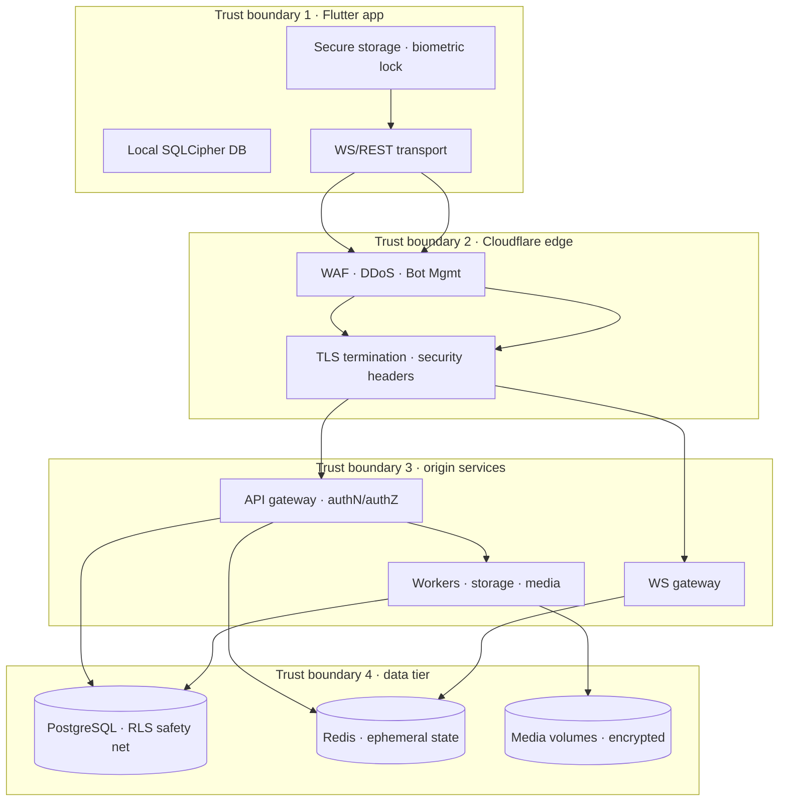

# Messaging Platform — Security & Cryptography Handbook

| | |
|---|---|
| **Document** | Security & Cryptography Handbook v1.0 |
| **Audience** | All engineers (backend, Flutter, DevOps/SRE), security reviewers, on-call |
| **Status** | **Official security standard.** Follow it exactly. |
| **Source of Truth** | `ARCHITECTURE.md` §10–§12, §30 → this handbook. Do not redesign. |
| **Stack (fixed)** | Go · Flutter · PostgreSQL · Redis · Docker · Terraform · Cloudflare |
| **Launch** | India first (single region) → global scale later |
| **Scope** | Application, transport, data, and client security. No code. |

> This handbook is the *operating* security model. It restates no product decisions; it tells every engineer and every AI agent **how to keep the platform safe** — authentication, authorization, tokens, encryption, privacy, and response — consistent with the source-of-truth documents. Where this handbook and a source-of-truth document ever appear to conflict, the source-of-truth document wins and the conflict is raised as a PR.

---

## Table of Contents

1. [Threat Model & Trust Boundaries](#1-threat-model--trust-boundaries)
2. [Security Principles](#2-security-principles)
3. [Authentication Security](#3-authentication-security)
4. [Password Security](#4-password-security)
5. [Session Security](#5-session-security)
6. [Access Token (JWT) Strategy](#6-access-token-jwt-strategy)
7. [Refresh Token Security](#7-refresh-token-security)
8. [Device Trust & Client Security](#8-device-trust--client-security)
9. [Authorization](#9-authorization)
10. [API Security](#10-api-security)
11. [WebSocket Security](#11-websocket-security)
12. [CSRF, XSS, Injection & SSRF](#12-csrf-xss-injection--ssrf)
13. [File Upload & Media Security](#13-file-upload--media-security)
14. [Malware & Content Scanning](#14-malware--content-scanning)
15. [Rate Limiting & Throttling](#15-rate-limiting--throttling)
16. [Abuse & Spam Prevention](#16-abuse--spam-prevention)
17. [Bot Detection & Human Verification](#17-bot-detection--human-verification)
18. [Encryption Strategy](#18-encryption-strategy)
19. [Data at Rest & in Transit](#19-data-at-rest--in-transit)
20. [Key Management](#20-key-management)
21. [Secrets Management](#21-secrets-management)
22. [Secure Logging & Security Monitoring](#22-secure-logging--security-monitoring)
23. [Security Headers & Transport Policy](#23-security-headers--transport-policy)
24. [Audit Logs](#24-audit-logs)
25. [Privacy & Data Protection](#25-privacy--data-protection)
26. [Incident Response](#26-incident-response)
27. [Vulnerability Management & Supply Chain](#27-vulnerability-management--supply-chain)
28. [Secure Development Lifecycle](#28-secure-development-lifecycle)
29. [Compliance Roadmap](#29-compliance-roadmap)
30. [Appendix A — Threat Model Register](#appendix-a--threat-model-register)
31. [Appendix B — Security Checklist](#appendix-b--security-checklist)
32. [Appendix C — Security Runbook Index](#appendix-c--security-runbook-index)

---

## 1. Threat Model & Trust Boundaries

The platform treats security as **layered and independent**: no single layer is trusted to be sufficient, and a breach of one layer must not hand an attacker the next one. This follows `ARCHITECTURE.md` §30.1 and §30.2.

**Trust boundaries and what the platform *does not* trust:**

- **The client is a trust boundary, not a trusted device.** The server treats every request as hostile until proven otherwise: tokens are validated, authorization is re-checked at the resource, signed URLs are re-checked at serve time.
- **The network is untrusted.** Everything travels over TLS 1.2+/1.3 (`wss://` and `https://` only). No downgrade to HTTP, ever.
- **The edge is a control point, not an authenticity oracle.** Cloudflare filters known abuse and DDoS, but application-level authorization is enforced at the origin regardless.
- **Any device is potentially compromised.** Device-integrity signals (Play Integrity / App Attestation, §8) are *inputs* to risk scoring, never a pass to skip authorization.
- **The database and volumes are assumed readable by an attacker who reaches the data tier.** Encryption at rest, least-privilege roles, and RLS are the last line of defense, not the first.

**Primary threat classes** (full register in Appendix A): account takeover, token theft/replay, unauthorized access to chats and media, leaked media URLs, injection (SQL/NoSQL), XSS in rendering, SSRF via media URLs, spam/abuse, credential stuffing, DDoS, supply-chain compromise, insider admin abuse, and mass data exfiltration (backup/privacy).

---

## 2. Security Principles

Every control in this handbook derives from a small set of principles (`ARCHITECTURE.md` §8, §30):

- **Secure by default.** Secure config is the *only* config. Insecure modes exist only for local development and are impossible in staging/prod.
- **Least privilege.** Every identity (user, role, service, CI step) gets the minimum rights for its function — distinct DB roles for API, workers, migrations, and media (`ARCHITECTURE.md` §30.3); no write access where read access suffices.
- **Defense in depth.** Five layers — client, edge, transport, application, data (`ARCHITECTURE.md` §30.2). Controls repeat across layers; a bypass at one layer is contained by the next.
- **Fail closed.** On any uncertainty about a principal's permission, deny. Authz denial is audited and alerted, never silently allowed.
- **Assume breach.** Secrets rotate on schedule, not on incident; "logs leak" is the operating assumption (no secrets/PII in logs); backups are encrypted as if public.
- **Minimize and isolate secrets.** Token lifetimes are as short as architecture allows; encryption keys live separately from data; per-service, per-environment credentials.
- **Audit everything that matters.** Authentication, authorization denials, session lifecycle, admin and moderation actions, media deletion, and data export are permanently auditable (`ARCHITECTURE.md` §30.4).

---

## 3. Authentication Security

The platform supports **password, OTP, and passkey (WebAuthn)** sign-in, plus optional Google/Apple OAuth linking to a primary identity (`ARCHITECTURE.md` §10.1). Authentication is the entry gate for everything else, so its failure modes are treated as incidents.

**Design rules:**

- **Passkeys are the preferred credential.** WebAuthn challenges are single-use with a short TTL in Redis; the credential public key is stored per user (`API.md` §4.10). Passkeys resist phishing and credential replay by construction — they are the posture for the future, not a toy.
- **OTP is a convenience fallback and a risk surface.** Never echo the code; store it **hashed** with a TTL (300 s) in Redis (`ARCHITECTURE.md` §10.1); throttle per identifier (30 s cooldown, max 5/hour, `API.md` §4.2). OTP delivery (SMS/email) is out of the platform's control — that is why OTP alone must not be the long-term strong-auth story.
- **Passwords are only as strong as the user makes them**, so the platform enforces policy (§4), locks out after repeated failure, and encourages passkeys at the product level.
- **Registration abuse is an authentication threat.** `POST /auth/register` and `POST /auth/otp/send` sit on the strictest unauthenticated rate tier, keyed per IP + device (`API.md` Appendix B), and are fronted by Turnstile (§17). Duplicate identifiers are rejected (`409 IDENTIFIER_TAKEN`).
- **Login throttling is non-negotiable.** Failed attempts are throttled with lockout backoff — **5 consecutive failures → 5-minute lockout** (`API.md` §4.3, `423 LOCKED`). This makes credential stuffing and password spraying economically pointless at the origin even when edge filters are bypassed.
- **Constant-time comparison** for credentials. Never leak *which part* of a credential was wrong via timing or error wording.
- **Every authentication event is audited** (`auth.register`, `auth.otp_sent`, `auth.login`, `auth.token_refresh`, `auth.logout_all`, `API.md` §4).
- **Account-suspension is first-class**: `ACCOUNT_SUSPENDED` returns cleanly; suspended users cannot authenticate through any method, and their sessions are revoked.

**Rate the risk, act on it:** the platform uses device trust (§8) and anomaly signals (new device, new geography, token-family reuse) to *escalate* authentication — step-up verification (OTP/passkey re-confirmation) before sensitive actions rather than a hard blanket block. The sensitive-action re-confirmation token (`API.md` §5.7) is an example of this pattern.

---

## 4. Password Security

Passwords are stored and handled as the highest-value user secret after the session keys.

- **Hash with a memory-hard KDF** (bcrypt with appropriate cost, or Argon2id) — never SHA-family, never unsalted, never reversible. Each user's credential is hashed with a unique salt.
- **Minimum policy of 8 characters** at registration (`API.md` §4.1); do not require rotation on a timer (it pushes users to weaker passwords), but *do* force re-authentication and prompt for change on security events.
- **Do not block common passwords at the product level with brute force** — that is the job of hashing + lockout (§3). Block only the obvious (matches identifier, < 8 chars).
- **Password changes invalidate old sessions**: a password change suspends all other sessions and leaves the current one active (`ARCHITECTURE.md` §11.2). This is a security event, and it is audited.
- **Never log, transmit in plaintext, or store raw passwords anywhere.** `password` fields exist only in request bodies over TLS; the backend receives them solely to hash and compare.
- **Passkey and OTP paths must not weaken the password's protections**: every credential path shares the same session and token machinery (§5–§7), so the weakest credential type defines the floor — hence throttling applies to *all* methods, not just password.

---

## 5. Session Security

Sessions are the durable link between a user and their devices. The session registry is the source of truth for "who is logged in where" (`ARCHITECTURE.md` §11.1): PG holds the authoritative record; Redis holds the hot subset for gateways and presence.

**Session registry hygiene:**

- Every session records the validated device identifier, platform, app version, push token, last-active time, IP/geo (for security review), and token-family version.
- **Device identity comes from the validated client**, and the *caller can only ever revoke their own sessions* — the session identity comes from the token, never from a request body field (`API.md` §4.5, §4.8).

**Lifecycle rules (`ARCHITECTURE.md` §11.2):**

| Transition | Trigger | Action |
|---|---|---|
| Active → Active | token refresh | rotate token family |
| Active → Revoked | sign-out / admin / theft | revoke row, blacklist `jti`, close WS, clear push token, notify devices |
| Active → Expired | sliding idle timeout | require re-auth |
| Active → Suspended | security incident / password change | suspend others, keep current |
| Suspended → Revoked | re-auth or cleanup | purge |

**Revocation is immediate and thorough:**

- **Single sign-out** revokes the session row, blacklists the access-token `jti` in Redis for the rest of its TTL, closes the bound WS connection (Redis pub/sub `sessions:revoke:{sessionId}`, `ARCHITECTURE.md` §11.3), clears the push token, and publishes `SessionRevoked` so *other* devices see it.
- **Sign-out everywhere** bumps a **global token version** so every outstanding access token fails validation at the gateways, revokes all sessions, closes all WS connections, and clears push tokens (`API.md` §4.6).
- **Admin kill-switch** reuses the same session↔connection binding to cut a user or device instantly.
- Sessions are **device-reviewed**: `GET /auth/sessions` and per-session `DELETE` give users (and support, via admin) the device-management surface that turns theft detection into recovery.

**Risk signals:** new-device logins, unfamiliar IP/geo, and token-family reuse all escalate (step-up) or revoke. The session registry is where anomalous sign-ins become visible, so it feeds both the security monitoring (§22) and the audit log (§24).

---

## 6. Access Token (JWT) Strategy

Access tokens are **short-lived JWTs** carrying the identity and authorization context for each API/WS call (`ARCHITECTURE.md` §10.2).

- **Algorithm:** Ed25519 (primary) or RS256. Keys are exposed read-only via `GET /auth/jwks` (`API.md` §4.9) and cached by verifiers with standard cache-control.
- **Claims:** `userId`, `sessionId`, `deviceId`, scopes, issuer, audience, and `jti` (unique token id for revocation blacklisting). Nothing sensitive beyond identity — no secrets, no PII beyond the user id.
- **TTL:** 15–30 minutes (the API default is 15 minutes, `expires_in: 900`). Short TTL keeps revocation tractable: the WS gateway validates once per connection, not per frame, so short-lived tokens stay cheap.
- **Validation at every gateway, without exception:** signature (JWKS), issuer, audience, expiry, `jti` not blacklisted, and the session's global token version still current. A token that fails any check is denied as `401`.
- **Verification strategy is strict** (research-confirmed OWASP 2026 guidance): pin the allowed algorithm set, reject the `none` algorithm outright, validate all required claims, and treat any JWT library "alg confusion" risk as a release blocker.
- **Revocation by blacklist:** the `jti` is added to a Redis blacklist on sign-out for the remainder of the TTL (`ARCHITECTURE.md` §10.2). Because TTLs are short, the blacklist stays small.
- **Rotation discipline:** signing keys are rotated on a schedule with a **JWKS multi-key scheme — add the new key first, retire the old key only after the maximum token TTL has passed.** A live key-rotation rehearsal is part of the operating rhythm.

**Why JWT at all, and why these bounds:** JWTs let any gateway verify identity without a database hit per request (scalable, `ARCHITECTURE.md` §26). The trade-off — a stolen token is a valid credential — is bounded by the short TTL, the blacklist, the device binding, and the reuse detection on the refresh side. Longer-lived tokens are the failure mode this strategy exists to avoid.

---

## 7. Refresh Token Security

Refresh tokens exist so the short-lived access token can be renewed **without re-authenticating**, for up to the session lifetime (`ARCHITECTURE.md` §10.2, `API.md` §4.4).

- **Opaque and high-entropy**: random, not a JWT, never parsed, never in the body — carried only in the `X-Refresh-Token` header and never logged.
- **Stored only as a hash** in PG alongside the session. The plaintext exists on the client and in the refresh request only.
- **Rotation on every use**: each refresh issues a *new* refresh token and invalidates the old one. A refresh token is single-use.
- **Reuse detection is the theft alarm**: if a rotated-out token is presented again (`410`), the platform assumes theft — **all sessions for the user are revoked** and the device is forced to re-login (`API.md` §4.4). This is the single most important control against long-lived session theft.
- **TTL 30–90 days**, extended by a sliding window on active use; idle sessions expire (session lifecycle, §5).
- **Refresh is the only place refresh tokens are used.** The client keeps the access token only for its TTL and contacts refresh exclusively for renewal (`FLUTTER.md` §23.2).
- **Freshness without friction**: refresh also reconnects the WS session and re-establishes the session↔connection binding — a dropped socket re-authenticates via the still-valid session rather than a full login.

**Failure taxonomy (all `401`/`410`, machine-readable, `API.md` Appendix A):** invalid/expired/revoked refresh token → `REFRESH_TOKEN_INVALID`; reuse of a rotated family → `REFRESH_TOKEN_REUSE` → global revocation.

---

## 8. Device Trust & Client Security

The Flutter app holds the user's tokens, media, and local message copies — it is a **trust boundary with the same seriousness as the server** (`FLUTTER.md` §23.1).

- **Tokens live in `flutter_secure_storage`** (Keychain/Keystore-backed), never in `shared_preferences`, never held in memory longer than needed, never in logs (`FLUTTER.md` §23.2). On logout/logout-all/session-revoked, all tokens and local session state are purged.
- **Local database is encrypted with SQLCipher** (Drift + `sqlcipher_flutter_libs`), key in secure storage. The SQLite DB contains message content — unencrypted local data would make a stolen device a data breach.
- **Transport integrity on-device**: TLS only, `wss://` enforced, no HTTP downgrade, certificate pinning for API/WS hosts in **prod builds only** — and pinning is opt-in/config-driven with a rotation mechanism so a pinned-cert expiry is never an outage (`FLUTTER.md` §23, `DEVOPS.md` §17).
- **Device integrity is a signal, not a gate**: root/JB detection is informational (report, don't block); **Play Integrity (Android) and App Attestation (iOS)** attestation results feed the device-trust signal used for risk scoring and step-up (§3) and for hardening against tampered clients.
- **Code-signing is sacred**: release artifacts are signed in CI with vault-held keystores/profiles; keystores never touch a laptop; store tamper protections enabled (`DEVOPS.md` §22, §27).
- **The client verifies the server, too**: the WS `hello_ack` must match the logged-in user before inbound events are trusted, and the socket is torn down on `session.revoked` with the user returned to login (`FLUTTER.md` §23.2).

**Trust model:** the platform does not trust the client's *honesty* (authorization is re-checked server-side) — but it *does* invest in the client's *integrity*, because a clean client is what keeps tokens and local data safe. These are complementary, not either/or.

---

## 9. Authorization

Authorization is **resource-based and evaluated at the resource module boundary**, not just at authentication (`ARCHITECTURE.md` §12).

- **Conversation access**: read/write requires active membership, checked via the membership cache and refreshed on membership events. Group roles: Owner > Admin > Member; destructive actions require Owner (`ARCHITECTURE.md` §12.1).
- **Message permissions**: edit/delete-for-all requires message ownership or admin capability; delete-for-self is always allowed.
- **Media permissions**: download requires membership in the originating conversation *at serve time* — signed URLs embed the requester's identity and expiry, and the handler re-checks membership before streaming (`ARCHITECTURE.md` §12.1, §19). A leaked URL is useless after expiry or membership removal.
- **Presence privacy**: last-seen visibility follows per-user privacy tiers (everyone → contacts → nobody).
- **Search scoping**: search is always scoped to the caller's conversations — never global (`API.md` §2.10).
- **Enforcement chain** (`ARCHITECTURE.md` §12.2): AuthN (token valid? session active?) → AuthZ (resource checks: membership, role, ownership) → business logic. **Every step is mandatory**; an authN success alone never authorizes anything.
- **PostgreSQL RLS is the safety net** for the most sensitive aggregates (`ARCHITECTURE.md` §12.2, §30.2 L5): even a bug in application authz should not expose another user's rows at the data layer.
- **Least-privilege database roles** (§2, `ARCHITECTURE.md` §30.3): API, workers, migrations, and media are distinct roles; the media role has no write access to user tables.
- **Deny by default and audit the denial**: an authz denial is an audited, alerted event — a spike in denials is an attack signal (§22), not noise.
- **Admin plane is separate and harder**: distinct SSO, mTLS at the network layer, IP allowlist, API Shield at the edge, and every admin action audited (`ARCHITECTURE.md` §30.3, `DEVOPS.md` §18).

---

## 10. API Security

The REST surface (`/v1`) is transactional and authoritative; it is also the most-exposed attack surface, so it enforces security mechanically.

- **Header hygiene**: `Authorization: Bearer <access_token>` on all authenticated endpoints; `X-Refresh-Token` on refresh only; `X-Device-Id` bound to the session's registered device; `X-Request-Id` threaded for correlation and incident forensics (`API.md` §2.3).
- **Strict input validation at the boundary**: types, lengths, charsets, identifier normalization (E.164 / lowercase email), reserved-word checks. Validation happens before any business logic, with stable machine-readable errors (`API.md` §2.5, `ENGINEERING.md` §15).
- **Idempotency as an anti-abuse control**: unsafe writes require `Idempotency-Key`, stored hashed with the response for 24 h — replay-safe and dedupe-safe; `client_msg_id` adds a durable DB-layer guard for message send (`API.md` §2.7).
- **Signed URLs for media**, never public URLs (§13).
- **Rate limiting at the API** as the first origin-side tripwire (§15), on top of the Cloudflare edge.
- **Error catalog is safe by design**: opaque responses for blocked targets (`404` for blocked users' resources), no stack traces, no internal identifiers leaked, `code` is the only contract (`API.md` §2.5, Appendix A).
- **Backward-compatible auth change = version bump**: breaking changes to the auth scheme require `/v2` with a migration window (`API.md` §2.1). Security fixes never wait for a version bump — they ship under the same mechanics as hotfixes.
- **Header injection and smuggling are covered at the reverse proxy** (header hygiene, `CF-*`/`X-Forwarded-*` sanitization) per `DEVOPS.md` §16.

---

## 11. WebSocket Security

The realtime surface carries presence, typing, and fan-out — ephemeral, but it is authenticated and authorized exactly as hard as REST.

- **Auth before upgrade**: the WS handshake authenticates with the access token (`API.md` §16.1); the token is validated **before** the connection is upgraded (`ARCHITECTURE.md` §10.4). Protocol version is negotiated via `sec-websocket-protocol: chat.v1` (`API.md` §2.1, §16).
- **One-time validation, continuous authority**: the gateway validates the token once per connection; session revocation force-closes the connection via the `sessions:revoke:{sessionId}` pub/sub binding (§5). A revoked session cannot hold an open socket.
- **Per-frame throttling**: WS frames are throttled separately from HTTP — typing, presence, and read-receipt frames have their own tight budgets (`API.md` §2.8, Appendix B) to stop frame flooding and event spam.
- **Subscription authorization**: a client may only subscribe to conversations it is an active member of; the realtime subscribe path enforces membership like the REST path does (§9). Subscribing to a conversation you are not in is an authz denial and is audited.
- **Origin checks at the edge and proxy**: WS proxying is explicitly enabled with proxied DNS records; origin is locked to Cloudflare (or Tunnel) so the socket never bypasses the edge (`DEVOPS.md` §16, §18).
- **Transport**: `wss://` only, same TLS policy as REST, pinning in prod builds (§8).
- **Client-side verification**: the client confirms `hello_ack` identity matches the logged-in user before trusting inbound events; the socket is torn down on `session.revoked` (`FLUTTER.md` §23.2).

---

## 12. CSRF, XSS, Injection & SSRF

These are the classic web/app attack families; each has a decisive control in this architecture.

**CSRF**
- Access tokens are carried in the `Authorization` header, **never cookies** — classic CSRF is eliminated by construction (`ARCHITECTURE.md` §10.4).
- Any cookie-based flow (the admin console) enforces `SameSite` + Origin checks + CSRF tokens. There is no cookie session model on the user API to exploit.

**XSS**
- The client is Flutter — HTML is never injected; all server text is treated as data (`ARCHITECTURE.md` §30.1). Rich-text rendering is confined to trusted formats; deep-link/URL input is sanitized before opening, and arbitrary scheme handling is prohibited (`FLUTTER.md` §23.2).
- Defense-in-depth: restrictive `Content-Security-Policy` for any web surfaces, `nosniff`, and strict transport headers (§23) in case a web surface ever appears.

**SQL/NoSQL injection**
- Parameterized queries everywhere; no string-built SQL, ever (`ARCHITECTURE.md` §30.1). Object keys are validated against a strict charset; identifiers are normalized before use.
- RLS (§9) means even a crafted query is bounded to the caller's rows where the safety net applies.
- `go vet`-adjacent static analysis, mandatory code review, and the PR checklist (`ENGINEERING.md` Appendix A) make raw-SQL-by-hand a review blocker.

**SSRF**
- The storage adapter resolves **only configured endpoints** — no arbitrary URL fetching from user input (`ARCHITECTURE.md` §30.1). URL fields are validated at the boundary; media download goes through the storage abstraction, not a pass-through proxy.
- The reverse proxy and edge restrict outbound egress at the network layer (defense in depth).

**General injection posture:** input validation at the boundary (§10) plus context-aware encoding/serialization at every sink; treat every external string as data until proven safe.

---

## 13. File Upload & Media Security

Media is user-controlled binary data stored on the platform — a distinct risk class (abuse, malware, storage exhaustion, exfiltration).

- **Upload pipeline**: quotas (concurrent slots + byte budgets, `API.md` Appendix B), content-type validation, size caps, and quarantine for anything that fails checks (`ARCHITECTURE.md` §30.3, `DEVOPS.md` §19).
- **Signed URLs, always**: media is served only via short-lived signed URLs embedding `mediaId`, expiry, and a per-user signature (server secret). The handler verifies the signature **and re-checks membership** at serve time (`ARCHITECTURE.md` §19). No public or guessable media URLs exist.
- **Download via redirect**: `302` to the signed CDN URL keeps the origin storage key private (`API.md` Appendix C).
- **Retention is enforced, not aspirational**: media records carry state and retention dates; cleanup workers purge staged files, deleted objects, orphans, and expired retention (`ARCHITECTURE.md` §19, `DATABASE.md` retention). This bounds both storage cost and exposure.
- **Storage abstraction**: backup/restore and the future S3/R2 migration go through the `storage` interface — the security properties (signing, quarantine, membership checks) are independent of the backend (`ARCHITECTURE.md` §19, §36).
- **Thumbnailing/variants** are generated server-side; variant URLs follow the same signing rules as originals.
- **Media volume encryption at rest** (§19) and encrypted backups (§19 of `DEVOPS.md`): a leaked disk is not leaked messages.

---

## 14. Malware & Content Scanning

User uploads can carry malware and prohibited content; scanning is part of the upload path, not a post-hoc nicety.

- **Scan at ingest**: uploads are scanned before they become shareable — content that fails is quarantined (`tmp/quarantine`) and never issued a shareable signed URL.
- **Variant handling**: originals and generated thumbnails are both covered by the quarantine decision; a quarantined object does not escape into variants.
- **Backed by the moderation system**: quarantine, takedown queues, content reports, and user-suspend flows are audited admin surfaces (`ARCHITECTURE.md` §30.3) — scanning results feed them.
- **Operational posture**: scan failures and backlog are monitored (a scanner that silently stops is a data-integrity incident, not a no-op); scanner definitions update on the patching cadence (§27); scan results are logged without scanning the *message content* (privacy, §25).
- **Retention of quarantine**: quarantined media is backed up separately and purged per policy (`DEVOPS.md` §19) — it is never mixed with clean content.

---

## 15. Rate Limiting & Throttling

Rate limiting is the origin-side tripwire under the Cloudflare edge (WAF/bot/edge rate limits, `DEVOPS.md` §18). It protects the service itself and makes abuse and enumeration attacks uneconomic.

- **Identity-based with fallback**: authenticated requests limit per `user_id` + `device_id`; unauthenticated endpoints fall back to IP. Token-bucket, enforced at the Go gateway (`API.md` §2.8, `ARCHITECTURE.md` §26).
- **Tiers are fixed** (`API.md` Appendix B) — including: `auth_anon` (OTP/register, per IP+device), `login` (per identifier, lockout after 5 fails), `standard` (per user+device), `search`, `upload_slots`/`upload_bytes`, `contacts_sync`, `snapshot`, `create_caps` (anti-spam), WS frame budgets (typing/presence/read), and `admin`.
- **Mechanically enforced**: every response carries `X-RateLimit-Limit/-Remaining/-Reset`; `429` returns `Retry-After` and `RATE_LIMITED` (`API.md` §2.8). Clients (and retry libraries) must respect `Retry-After`.
- **Tier drift is a security review trigger**: raising a limit weakens an anti-abuse control — it goes through the same review as the feature that needs it.
- **Two layers, one policy**: edge (Cloudflare) and origin (gateway) rate limits are configured to the same spirit but with different granularity — the edge blocks floods cheaply, the origin enforces per-identity economics that only the app can know. Both must exist; the origin never assumes the edge ran.

---

---

## 16. Abuse & Spam Prevention

Spam and abuse are a platform-integrity threat: they degrade trust, feed scams, and invite regulation. The platform layers product, origin, and edge controls.

- **Identity-anchored limits**: `create_caps` (conversation/message creation per minute), `contacts_sync` (1 per 24 h), `snapshot` (10 per 24 h per device), `search` — these make mass creation and enumeration expensive per user (`API.md` Appendix B).
- **Per-conversation limits** on message rate and size bound group spam and flood attacks; WS frame budgets stop typing/presence flooding (§11, §15).
- **Block/report flows are product features** (`API.md` §6): blocking, reporting, and content takedown queues feed moderation (§14). Abuse signals (reports, blocks) are telemetry for abuse detection, not just user actions.
- **Fresh-account scrutiny**: new accounts operate under stricter creation/quota caps until they establish history (signals: verified credential, device trust, age). This is the classic spam-launch-pad defense.
- **Suspension with audit**: user-suspend flows are admin actions, audited, and reversible with an incident trail (`ARCHITECTURE.md` §30.3).
- **Abuse telemetry feeds the security dashboard**: block/report volume, fresh-account creation, suspension rate — sudden changes are alerts (§22).

---

## 17. Bot Detection & Human Verification

Bot traffic is filtered at the edge before it costs origin resources, and verified at sign-up where human identity matters (`DEVOPS.md` §18).

- **Cloudflare Bot Management**: score-based (not binary), with challenge/block on credential-stuffing and scraping patterns; feeds the WAF ruleset.
- **Turnstile** for the sign-up/OTP flow — a managed human-verification challenge without privacy-hostile CAPTCHAs; its scores also feed bot management.
- **Edge rate limiting** for auth and search paths as the coarse layer; origin per-identity tiers (§15) as the fine layer.
- **Device-integrity signals** (§8) add a non-web source of bot/automation evidence on mobile.
- **Design principle**: bot detection *reduces* abuse cost and *adds friction to* automation; it never replaces server-side authorization or per-identity limits. A bot that passes every filter still meets per-user caps and full authz.

---

## 18. Encryption Strategy

Encryption is applied at every layer where data is outside the immediate trust boundary. The strategy is **use the right primitive for the right boundary**, not a single universal encryption.

**Layers (`ARCHITECTURE.md` §30.2):**

1. **In transit**: TLS 1.2+/1.3 between client↔edge, edge↔origin (Full/Strict), and service↔service; `wss://` for WebSocket; HSTS. (§19, §23)
2. **At rest**: encrypted volumes (LUKS/managed), PostgreSQL encryption at rest, encrypted backups. (§19)
3. **Local client data**: SQLCipher-encrypted SQLite with key in secure storage (§8).
4. **Secrets & keys**: vault-held, encrypted in state, never in source/images/logs (§20, §21).

**End-to-end encryption (E2EE) is a deliberately scoped decision.** The source-of-truth architecture does not mandate E2EE for all content (server-side search, moderation, retention, and product flows require server access to message content per `ARCHITECTURE.md`). The security standard therefore is:

- **Transparent security posture**: the platform is *not* E2EE-by-default; users are told exactly what is encrypted and what the service can see. This is both a product and a compliance obligation (privacy, §25).
- **Protect what can be protected**: credentials, tokens, media keys where applicable, backups, and local data are strongly encrypted; message *content in transit and at rest* is protected by transport TLS + volume encryption.
- **If E2EE is introduced later** (a product decision, not a security requirement of v1), it must be a scoped feature with its own key-handling design (device key hierarchy, rotation, recovery) and an updated threat model — never a bolt-on that weakens moderation or recovery guarantees.

**Crypto hygiene rules:**

- Use **well-audited standard libraries** (Go standard `crypto`, libsodium-equivalent primitives) — never hand-rolled crypto, never custom protocols.
- **Authenticated encryption** (AEAD) where symmetric encryption is used — encryption without integrity is a vulnerability.
- Hash passwords with a memory-hard KDF (§4); hash refresh tokens and OTPs with a strong one-way hash (§3, §7).
- Randomness from a CSPRNG for all token, salt, and challenge generation.

---

## 19. Data at Rest & in Transit

- **In transit**: TLS 1.2+ (prefer 1.3) at edge and origin; Cloudflare Full (Strict) so origin presents a real CA cert; HSTS with `includeSubDomains`; `wss://` for WS (§23, `DEVOPS.md` §17). Client and server both refuse plaintext.
- **At rest**:
  - **Volumes** are encrypted (LUKS on self-managed hosts, managed-disk encryption in cloud) — `ARCHITECTURE.md` §30.1.
  - **PostgreSQL** encryption at rest is enabled; client connections use TLS; `pg_hba` restricted to the app network (`DEVOPS.md` §22).
  - **Redis** is not publicly exposed; `requirepass` + ACLs, bound to the internal network; TLS where supported (`DEVOPS.md` §22).
  - **Backups are encrypted** (separate keys, §20) and stored off-machine; a leaked backup must not be readable plaintext (`DEVOPS.md` §13).
  - **Client local data** (§8): SQLCipher for the message DB; media at OS file-protection level; never to shared/public storage.
- **Key separation**: backup-encryption keys, data-encryption keys, and signing keys are distinct, with distinct rotation (§20). Compromising one does not compromise the others.

---

## 20. Key Management

Keys are the crown jewels: a leaked signing key forges tokens, a leaked data key reads backups.

- **Signing keys** (Ed25519/RS256 for access tokens, §6): held in the vault; rotated on the JWKS multi-key scheme (add-new-before-retire, retire after max token TTL); rotation is a rehearsed runbook (§21, `DEVOPS.md` Appendix B).
- **Data-encryption keys** (volume/DB/backup): managed per platform (KMS or equivalent); backups use keys **separate** from data keys; per-key access is audited.
- **Media signing secret**: the secret used for signed media URLs (§13); distinct from access-token signing; rotated with a grace window for already-issued URLs (short expiry makes this cheap).
- **Client-side keys**: the SQLCipher DB key and secure-storage content live in OS secure enclaves (Keychain/Keystore) — the platform never transmits or stores these server-side (`FLUTTER.md` §23).
- **Push keys** (FCM/APNs) and Cloudflare API tokens are secrets (§21) with their own rotation and tested breakage path in the release pipeline (`DEVOPS.md` §27).
- **Rule of three**: no key lives in one place, no key is shared across purposes, no key survives rotation unredeemed. Key lifecycle (generate → distribute → use → rotate → destroy) is documented per key class in the vault, and every class has a rehearsed rotation runbook.

---

## 21. Secrets Management

Secrets are managed operationally as much as they are cryptographically (`DEVOPS.md` §7, `ENGINEERING.md` §31).

- **Single source of truth**: a managed vault (HashiCorp Vault or the cloud secret manager) holds DB passwords, signing keys, refresh-token hash pepper, push provider keys, Cloudflare tokens, backup keys.
- **Never in**: source, Docker images, `.env`, Terraform state, CI logs, or application logs. A gitleaks scan is a CI merge-blocker (`DEVOPS.md` §7).
- **Runtime injection**: secrets are read at startup through the config layer; images are secret-free and therefore safely promotable.
- **Least privilege**: per-service, per-environment credentials; distinct DB roles (§9); the migration role is never shared with the app role.
- **Rotation is rehearsed, not an incident**: DB passwords, signing keys, push keys, and vault access all have rotation runbooks; drills are scheduled (§26).
- **Access is audited**: vault access is logged; break-glass access is time-boxed and flagged.
- **Flutter-specific rule**: no secrets in source or `--dart-define` for prod; keystores live in the vault and are used by CI only (`FLUTTER.md` §23.2, `DEVOPS.md` §22).

---

## 22. Secure Logging & Security Monitoring

Security events are observability, and observability is a security control.

**Logging (with §24 audit separation):**

- Structured JSON, `log/slog`, shipped to Loki; correlated by `request_id`/`trace_id` (`DEVOPS.md` §11).
- **Log hygiene is a security rule**: no secrets, no PII beyond need, no raw tokens/OTPs — redaction is mandatory. "Assume logs leak" (`DEVOPS.md` §11).
- Message **content** is never logged — on the server (domain logs carry ids, not bodies) or on the client (local logs never contain message content, `FLUTTER.md` §13).

**Security monitoring (dashboards + alerts beyond product SLOs):**

- **AuthN/AuthZ analytics**: login success/failure rate, OTP request volume, refresh reuse detections, authz-denial spikes, new-device/new-geography logins.
- **Abuse signals**: block/report volume, fresh-account creation, suspension rate, spam-trigger rate (§16).
- **Data-layer risk**: unusual read patterns, query volume on sensitive tables, RLS-denial volume, media download/export spikes.
- **Edge telemetry**: Cloudflare Analytics/Logpush feed Loki/SIEM for edge-level visibility (`DEVOPS.md` §18); WAF block rate, bot-challenge rate.
- **Alert posture**: distinct from product alerting — a `sessions:revoke` storm or `410`-reuse burst is a *page*, not a dashboard curiosity. Every security alert has a runbook (Appendix C).

**What the platform watches for** (the "assume breach" dashboard): unexpected token-family reuse, login volume from a new region, unusually large export/snapshot activity, authz-denial spikes, media-deletion storms, and admin-action volume.

---

## 23. Security Headers & Transport Policy

Transport policy is enforced mechanically at the edge and the app, and documented so every surface stays compliant.

- **TLS**: minimum TLS 1.2, prefer 1.3; obsolete protocols/ciphers disabled at edge and origin (`DEVOPS.md` §17).
- **HSTS**: `Strict-Transport-Security`, `includeSubDomains`, applied at the edge; the API is HTTPS-only by contract (`API.md` §2.1).
- **App**: `wss://` enforced, no HTTP fallback, pinning in prod builds (§8).
- **Web surfaces (admin console, any future web)**: `Content-Security-Policy` (restrictive), `X-Content-Type-Options: nosniff`, `Referrer-Policy`, `X-Frame-Options`/`frame-ancestors`, `SameSite=Strict`/`Lax` for any cookies — administered at the edge and reverse proxy so they cannot be forgotten per-route.
- **Header hygiene at the proxy**: sanitize `X-Forwarded-*`/`CF-*` so clients cannot spoof origin-derived identity (`DEVOPS.md` §16).
- **Certificates**: automated lifecycle (Cloudflare/ACME), expiry alerts are pages, pinning rotation rehearsed (`DEVOPS.md` §17).

---

## 24. Audit Logs

The audit trail is the security record of record: what happened, who did it, when, from where, and what it touched (`ARCHITECTURE.md` §30.4).

**What is audited (mandatory):** authentication events (`auth.register`, `auth.otp_sent`, `auth.login`, `auth.token_refresh`), session lifecycle (create/revoke/suspend/expire, `logout_all`), authorization **denials**, admin and moderation actions (suspension, takedown, quota/ban changes), media deletions, and data exports.

**Mechanical guarantees:**

- **Append-only** and write-once; a dedicated sink with its own retention and access control, separate from operational logs (`DEVOPS.md` §11).
- **Tamper-evident**: the append-only store is rotationally hash-chained (each entry commits to the previous) so silent modification is detectable.
- **Searchable and correlated** by `user_id`, `session_id`, `request_id`, `IP`; feeds security monitoring (§22) and incident response (§26).
- **Access-controlled**: only the audit service and designated security roles read it; break-glass reads are themselves audited.
- **Retention** per compliance policy (longer than operational logs; aligned with §25/§29).

**Boundary:** audit logs record *events and identities*, not message content — the privacy guarantee (§25) holds inside the audit store too.

---

## 25. Privacy & Data Protection

Privacy is a security property here: mishandled personal data is both a compliance breach and a trust incident. The platform is designed for India-first launch under the **DPDP Act** posture, and the same discipline generalizes to GDPR later (§29).

- **Data minimization**: the service collects what the product needs — identity, credentials, device/session metadata, conversation metadata, media, and usage for operations. Nothing else. PII is separated from auth material (`DATABASE.md` §4.3: auth columns isolated from profile data so profile reads can never leak credentials).
- **Transparency**: users are told what data the platform holds, why, and how long (privacy policy is a product surface, reviewed at release). The encryption posture — what the service can and cannot see — is stated honestly (§18).
- **Consent and notice**: consent flows for the data that needs it (e.g., contacts sync, push); withdrawal is honored and operationalized (a denied permission degrades that feature, nothing more).
- **Data rights are product features**: access, correction, export, and erasure map to product APIs and jobs — soft-delete + hard-purge worker for GDPR/DPDP-style erase (`DATABASE.md` §18), data export flows, account lifecycle states.
- **Retention is bounded and enforced**: `DATABASE.md` retention policy drives purge workers; media retention dates drive cleanup (§13). Retention is a scheduled job with defined RPO/RTO (`DATABASE.md` §9), and backup retention is aligned with compliance, not habit.
- **PII in logs is minimized** (§22); audit logs hold events and ids, not content (§24).
- **Privacy is reviewed, not assumed**: the pre-release checklist (Appendix B) includes a privacy pass (what's collected, who can see it, how long, how to export/erase).

---

## 26. Incident Response

Incidents are rehearsed, owned, and learned from. The security incident response reuses the platform's ops machinery (`DEVOPS.md` §12, §14) with security-specific runbooks (Appendix C).

**Skeleton of every security incident:**

1. **Detect** — via security monitoring (§22), edge telemetry, audit anomalies, or external report. Every detection path leads to an alert with an owner and runbook.
2. **Triage & classify** — severity (critical/high/medium/low) by blast radius: data exposure, account takeover, platform integrity, availability. Page the owner at critical/high.
3. **Contain** — the platform's kill switches exist for this: suspend user/device sessions (§5), admin kill-switch, revoke refresh-token families, blacklist `jti`s, quarantine media, block IPs/keys at the edge. Contain before investigate where the blast radius is user data.
4. **Investigate** — audit logs (§24) and correlated traces give the timeline; signed media URLs bound the media exposure; token/refresh reuse pinpoints session compromise.
5. **Remediate & recover** — rotate affected secrets/keys (§20, §21), rebuild from clean state where integrity is suspect, restore from encrypted backups where needed (`DEVOPS.md` §14).
6. **Verify** — confirm the vector is closed and the exposure is bounded; re-run the detection that fired to prove silence.
7. **Post-mortem** — blameless review, follow-ups tracked to completion, runbooks updated by the incident (`DEVOPS.md` §26).

**Rules that are not optional:**

- **Contain first** for account/data incidents; understand the blast radius before publishing details.
- **Disclosure follows policy**: affected users are notified per policy and law (DPDP/GDPR breach-notification timelines, §29); external disclosure is coordinated, never ad-hoc.
- **Every security incident updates the threat model** (Appendix A) and the runbooks — a new failure mode that survives is a process failure.
- **Security incidents are drilled**: at least one tabletop security scenario per quarter (e.g., "token family stolen at scale", "media quarantine breach").

---

## 27. Vulnerability Management & Supply Chain

The platform's security posture decays if the underlying stack rots. Vulnerability management is a cadence, not a project.

- **Application**: `govulncheck` in CI; dependency scanning on PRs and merges; **osv-scanner** for the Flutter/Dart dependency tree (`FLUTTER.md` §23.2); pinned versions (`go.sum`, `pubspec.lock` committed) so updates are diff-able.
- **Images & hosts**: Trivy image scans in CI, SBOM per image (`DEVOPS.md` §5); OS/base-image patching on a weekly cadence and immediately for active CVEs in the runtime stack (`DEVOPS.md` §26).
- **Infrastructure as code**: IaC scanning (tfsec/checkov), secret scanning (gitleaks) — all CI merge-blockers (`DEVOPS.md` §22).
- **External assurance**: quarterly external penetration test; annual red team; remediation reviews tracked to completion (`DEVOPS.md` §22, §26).
- **Vulnerability response SLA**: critical → fix within 7 days (sooner for actively exploited); high → 30 days; medium/low → next scheduled release. Every fix ships through the normal pipeline with tests.
- **Supply-chain discipline**: minimal base images (distroless), minimal dependency footprint, dependabot for dependency updates, review of new dependencies (the client app is high-value attack surface — a malicious dependency is a client compromise).

---

## 28. Secure Development Lifecycle

Security is a gate in the delivery pipeline, not a review after it. This standard is binding on humans and AI agents alike (`ENGINEERING.md` §39, Appendix A).

- **Every PR**: security-sensitive changes (authn, authz, sessions, tokens, media, admin, storage, crypto) get a mandatory security-aware review; CI runs lint, tests, vuln scan, secret scan, image scan (`ENGINEERING.md` Appendix A, `DEVOPS.md` §8).
- **Threat modeling at design time**: any feature touching a trust boundary (§1) includes a mini threat-model in its design doc — what could go wrong, and which control answers it.
- **Secure defaults in code**: validation at the boundary, no string-built SQL, no secrets in code, no logging of PII/content, deny-by-default authz.
- **Client rules** (`FLUTTER.md` §23): tokens only in secure storage, SQLCipher for local data, pinning in prod only, sanitized deep links, no secrets in source/`--dart-define`.
- **Operational rules** (`DEVOPS.md` §22): immutable servers, no ad-hoc prod changes, everything through Terraform + CI with plan review.
- **The checklists are the gate**: Appendix B (release), `ENGINEERING.md` Appendix A (PR), `DEVOPS.md` §24 (production) are *preconditions*, not suggestions.
- **AI agents are held to the same bar**: generated code ships only with the same tests, docs, CI gates, and security review — the SDLC does not distinguish authors.

---

## 29. Compliance Roadmap

Compliance is sequenced by business reality: **India launch first**, then expansion. This is a posture roadmap, not legal advice — counsel reviews at each step.

**Phase 1 — India launch (now):**

- **DPDP Act posture**: data-principal rights (notice, consent, access, correction, erasure), data-fiduciary obligations, breach notification, and lawful processing — operationalized through §25 (privacy) and §26 (incident disclosure). Registration/DPO appointment assessed before GA.
- **IT Rules (intermediary guidelines)**: content moderation, grievance redressal (a reported user channel), and monthly compliance reporting — mapped onto the existing report/takedown/suspend flows (§14, §16) and the admin audit surface (§24).
- **DPDP-aligned retention** for backups and audit logs; erasure honored end-to-end (including backups via retention alignment, not post-hoc scrubbing).

**Phase 2 — Expansion:**

- **GDPR** for EU users: the §25 controls already implement most of it (data minimization, export, erasure, consent); gap items are DPA, EU representative, and lawful-basis documentation.
- **SOC 2 (Type II)** as a trust signal for enterprise/B2B: the audit trail (§24), least privilege (§9), change management (`DEVOPS.md` §26), and incident response (§26) are the control families it will attest.

**Standing rules:**

- **Documented evidence**: each control above maps to a source (this handbook, `DEVOPS.md`, source-of-truth docs) so attestation is a lookup, not a scramble.
- **Retention and audit logs** are sized to the *most demanding* jurisdiction the platform actually serves (§24).
- **Privacy and compliance reviews are part of release**: the Appendix B checklist includes the privacy pass and the compliance-relevant documentation for the feature being shipped.
- **Regulatory changes are tracked quarterly** in the operating rhythm (§30) — DPDP rules and IT Rules evolve; the roadmap is re-validated at each cadence.

---

## Appendix A — Threat Model Register

| # | Threat | Likelihood | Impact | Primary controls |
|---|---|---|---|---|
| 1 | Credential stuffing / spraying | High | High | login lockout (5 fails → 5 min), per-identifier tiers, edge bot mgmt, Turnstile |
| 2 | Account takeover via stolen session | Medium | Critical | short access TTL, refresh rotation + reuse detection (410 → global revoke), device review, anomaly step-up |
| 3 | Token theft / replay | Medium | Critical | bearer-in-header (no CSRF surface), `jti` blacklist, session↔connection binding, pinning in prod |
| 4 | Forged access tokens | Low | Critical | Ed25519/RS256 + JWKS, strict alg policy, no `none`, key rotation |
| 5 | Unauthorized chat/media access | Medium | High | membership authz at API + realtime + signed URLs + RLS safety net |
| 6 | Leaked media URL reuse | Medium | Medium | short-lived, per-requester signatures, membership re-check at serve time |
| 7 | SQL/NoSQL injection | Medium | High | parameterized queries only, no string-built SQL, strict charset validation |
| 8 | XSS in rendering | Low | Medium | Flutter-native rendering, HTML never injected, CSP for web surfaces |
| 9 | SSRF via media URLs | Low | High | storage adapter resolves only configured endpoints, URL validation |
| 10 | Malware uploads | Medium | Medium | scan-at-ingest, quarantine, no shareable URL for flagged content |
| 11 | Spam / mass account creation | High | Medium | create_caps, contacts_sync/snapshot caps, fresh-account scrutiny, block/report |
| 12 | Bot traffic / scraping | High | Low | Cloudflare bot mgmt + Turnstile + edge rate limits |
| 13 | DDoS | High | Medium | Cloudflare WAF/DDoS, origin locked to edge, edge rate limits |
| 14 | Data at rest exposure (disk/backup theft) | Low | Critical | volume encryption, PG at-rest encryption, encrypted backups, key separation |
| 15 | Secret / key leak | Low | Critical | vault single source, no secrets in repo/images/logs, rotation rehearsed |
| 16 | Supply-chain (dependency/image) compromise | Medium | High | pinned deps, SBOM, Trivy, govulncheck, osv-scanner, dependabot |
| 17 | Insider admin abuse | Low | High | admin SSO + mTLS + IP allowlist, least-privilege roles, all admin actions audited |
| 18 | Mass data exfiltration (export/backup) | Low | Critical | export auditing, retention enforcement, encrypted backups, monitoring anomalies |

## Appendix B — Security Checklist

Pre-release gate (every launch and every significant feature; all must pass):

**Authentication & sessions**
- [ ] Login lockout + per-identifier rate tiers active; OTP hashed with TTL; no OTP in logs/responses
- [ ] Refresh rotation + reuse detection wired; reuse → global revoke rehearsed
- [ ] `jti` blacklist on sign-out; global token version bump on logout-all
- [ ] Session↔WS binding: revocation closes sockets; device review surface works
- [ ] JWKS multi-key rotation rehearsed; no `none` algorithm reachable

**Authorization**
- [ ] Resource-level authz (membership/role/ownership) at API + realtime subscribe
- [ ] Signed media URLs with per-requester signature + membership re-check at serve time
- [ ] RLS safety net applied to sensitive aggregates; distinct least-privilege DB roles
- [ ] Authz denials audited + alerted

**Transport & data**
- [ ] TLS 1.2+/1.3, HSTS, `wss://` enforced; pinning in prod builds only, with rotation path
- [ ] Volume/PG/backup encryption at rest; backup keys separate; restore drill recorded
- [ ] SQLCipher on client DB; tokens in secure storage only

**App & infra**
- [ ] Rate tiers per `API.md` Appendix B; `429` + `Retry-After` honored; WS frame budgets active
- [ ] Upload scanning + quarantine path; signed URLs only; retention/cleanup jobs scheduled
- [ ] Turnstile on sign-up/OTP; bot mgmt + WAF block (not log) mode; edge rate limits
- [ ] Image/dep/IaC/secret scans green in CI; SBOM attached; patching cadence current

**Privacy & compliance**
- [ ] Privacy pass done: what's collected, who sees it, how long, export + erase work end-to-end
- [ ] Audit log covers all mandated events; append-only + access-controlled; retention set
- [ ] Breach-notification path (internal + external) documented and owned

## Appendix C — Security Runbook Index

Each is a document in `docs/runbooks/` with detection, severity, owner, steps, verification:

1. Suspected account takeover (revoke, rotate, notify)
2. Refresh-token reuse storm (global revocation, containment)
3. Access-token signing-key rotation (JWKS add-before-retire)
4. Media quarantine / malware breach (contain, rescan, restore)
5. PII / data-exposure incident (bounded, disclose per policy)
6. Admin console compromise (kill-switch, rotate admin creds, audit review)
7. Edge bypass / origin DDoS (route back, rate-limit, report)
8. Secret or key leak (rotate all affected, revoke CI credentials, scan git history)
9. Backup restore (encrypted restore + verification)
10. Vulnerability-report intake (SLA, fix, ship, disclose)
11. Phishing / impersonation campaign response
12. Compliance / regulator inquiry (evidence pack from audit + docs)

---

*End of Security & Cryptography Handbook. The security standard for the platform — backend, Flutter app, and infrastructure alike. Source-of-truth documents win on conflict; raise conflicts as a PR.*
